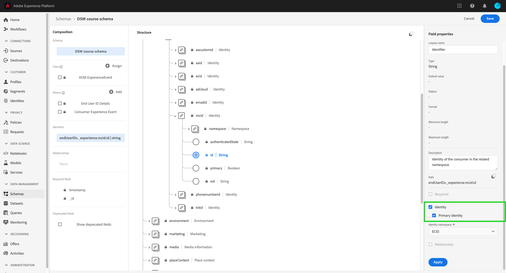

# Preparare i dati da utilizzare in [!DNL Intelligent Services]

Per consentire a [!DNL Intelligent Services] di scoprire informazioni provenienti dai dati degli eventi di marketing, i dati devono essere arricchiti e mantenuti in modo semantico in una struttura standard. [!DNL Intelligent Services] sfrutta gli schemi  [!DNL Experience Data Model] (XDM) per ottenere questo risultato. In particolare, tutti i set di dati utilizzati in [!DNL Intelligent Services] devono essere conformi allo schema XDM di Consumer ExperienceEvent (CEE).

Questo documento fornisce indicazioni generali sulla mappatura dei dati degli eventi di marketing da più canali a questo schema, delineando informazioni su campi importanti all&#39;interno dello schema per aiutarti a determinare come mappare efficacemente i dati alla struttura.

## Riepilogo del flusso di lavoro

Il processo di preparazione varia a seconda che i dati siano memorizzati in Adobe Experience Platform o esternamente. In questa sezione vengono riepilogati i passaggi necessari, in base a entrambi gli scenari.

### Preparazione dei dati esterni

Se i dati sono memorizzati al di fuori di [!DNL Experience Platform], segui i passaggi seguenti:

1. Contattare Adobe Consulting Services per richiedere le credenziali di accesso per un contenitore di archiviazione BLOB di Azure dedicato.
1. Utilizzando le credenziali di accesso, carica i dati nel contenitore BLOB.
1. Lavora con Adobe Consulting Services per mappare i tuoi dati sullo [schema ExperienceEvent del consumatore](#cee-schema) e acquisirli in [!DNL Intelligent Services].

### [!DNL Experience Platform] preparazione dei dati

Se i dati sono già memorizzati in [!DNL Platform], segui i passaggi seguenti:

1. Rivedi la struttura dello [schema di Consumer ExperienceEvent](#cee-schema) e determina se i tuoi dati possono essere mappati ai relativi campi.
1. Contatta Adobe Consulting Services per facilitare la mappatura dei dati sullo schema e l’acquisizione in [!DNL Intelligent Services] oppure [segui i passaggi descritti in questa guida](#mapping) se desideri mappare i dati da solo.

## Informazioni sullo schema CEE {#cee-schema}

Lo schema Consumer ExperienceEvent descrive il comportamento di un individuo in relazione agli eventi di marketing digitale (web o mobile) nonché alle attività di e-commerce online o offline. L’utilizzo di questo schema è necessario per [!DNL Intelligent Services] a causa dei relativi campi (colonne) semanticamente ben definiti, evitando nomi sconosciuti che renderebbero i dati meno chiari.

Lo schema CEE, come tutti gli schemi ExperienceEvent XDM, acquisisce lo stato del sistema basato su serie temporali quando si verifica un evento (o un set di eventi), incluso il punto nel tempo e l&#39;identità dell&#39;oggetto coinvolto. Gli eventi di esperienza sono registrazioni di fatti di ciò che è accaduto, e quindi sono immutabili e rappresentano ciò che è accaduto senza aggregazione o interpretazione.

[!DNL Intelligent Services] utilizza diversi campi chiave all’interno di questo schema per generare informazioni dai dati degli eventi di marketing, che possono essere trovati a livello principale ed espansi per mostrare i relativi sottocampi richiesti.


Come tutti gli schemi XDM, il mixin CEE è estensibile. In altre parole, è possibile aggiungere altri campi al mixin CEE e diverse varianti possono essere incluse in più schemi, se necessario.

Un esempio completo del mixin è disponibile nell&#39; [archivio XDM pubblico](https://github.com/adobe/xdm/blob/797cf4930d5a80799a095256302675b1362c9a15/docs/reference/context/experienceevent-consumer.schema.md). Inoltre, è possibile visualizzare e copiare il seguente [file JSON](https://github.com/AdobeDocs/experience-platform.en/blob/master/help/intelligent-services/assets/CEE_XDM_sample_rows.json) per un esempio di come i dati possono essere strutturati in modo da rispettare lo schema CEE. Per determinare come mappare i dati personalizzati sullo schema, fai riferimento a entrambi gli esempi mentre apprendi i campi chiave descritti nella sezione seguente.

## Campi chiave

Ci sono diversi campi chiave all&#39;interno del mixin CEE che devono essere utilizzati affinché [!DNL Intelligent Services] generi informazioni utili. Questa sezione descrive il caso d’uso e i dati previsti per questi campi e fornisce collegamenti alla documentazione di riferimento per ulteriori esempi.

### Campi obbligatori

Sebbene sia vivamente consigliato l’utilizzo di tutti i campi chiave, esistono due campi **obbligatori** per il funzionamento di [!DNL Intelligent Services]:

* [Un campo di identità principale](#identity)
* [xdm:timestamp](#timestamp)
* [xdm:channel](#channel)  (obbligatorio solo per Attribution AI)

#### Identità principale {#identity}

Uno dei campi dello schema deve essere impostato come campo di identità principale, che consente a [!DNL Intelligent Services] di collegare ogni istanza di dati relativi a serie temporali a una singola persona.

È necessario determinare il campo migliore da utilizzare come identità principale in base all’origine e alla natura dei dati. Un campo di identità deve includere un **namespace di identità** che indica il tipo di dati di identità che il campo prevede come valore. Alcuni valori di spazio dei nomi validi includono:

* &quot;e-mail&quot;
* &quot;telefono&quot;
* &quot;mcid&quot; (per Adobe Audience Manager ID)
* &quot;aaid&quot; (per Adobe Analytics ID)

Se non sei sicuro di quale campo utilizzare come identità principale, contatta Adobe Consulting Services per determinare la soluzione migliore. Se non è impostata un&#39;identità primaria, l&#39;applicazione Intelligent Service utilizza il seguente comportamento predefinito:

| Predefinito | Attribution AI | Customer AI |
| --- | --- | --- |
| Colonna identità | `endUserIDs._experience.aaid.id` | `endUserIDs._experience.mcid.id` |
| Namespace | AAID | ECID |

Per impostare un&#39;identità primaria, passa allo schema dalla scheda **[!UICONTROL Schemas]** e seleziona il collegamento ipertestuale del nome dello schema per aprire **[!DNL Schema Editor]**.


Quindi, accedi al campo che desideri utilizzare come identità principale e selezionalo. Viene visualizzato il menu **[!UICONTROL Field properties]** per tale campo.


Nel menu **[!UICONTROL Field properties]**, scorri verso il basso fino a trovare la casella di controllo **[!UICONTROL Identity]**. Dopo aver selezionato la casella, viene visualizzata l&#39;opzione per impostare l&#39;identità selezionata come **[!UICONTROL Primary identity]**. Seleziona anche questa casella.



Successivamente, devi fornire un **[!UICONTROL Identity namespace]** dall’elenco dei namespace predefiniti nel menu a discesa. In questo esempio, lo spazio dei nomi ECID viene selezionato in quanto viene utilizzato un Adobe Audience Manager ID `mcid.id`. Seleziona **[!UICONTROL Apply]** per confermare gli aggiornamenti, quindi seleziona **[!UICONTROL Save]** nell’angolo in alto a destra per salvare le modifiche allo schema.


#### xdm:timestamp {#timestamp}

Questo campo rappresenta il datetime in cui si è verificato l&#39;evento. Questo valore deve essere fornito come stringa, secondo lo standard ISO 8601.

#### xdm:channel {#channel}

>[!NOTE]
>
>Questo campo è obbligatorio solo quando si utilizza Attribution AI.

Questo campo rappresenta il canale di marketing correlato all’ExperienceEvent. Il campo include informazioni sul tipo di canale, il tipo di supporto e il tipo di posizione.


**Esempio di schema**

```json
{
  "@id": "https://ns.adobe.com/xdm/channels/facebook-feed",
  "@type": "https://ns.adobe.com/xdm/channel-types/social",
  "xdm:mediaType": "earned",
  "xdm:mediaAction": "clicks"
}
```

Per informazioni complete su ciascuno dei campi secondari richiesti per `xdm:channel`, fai riferimento alla specifica [schema del canale esperienza](https://github.com/adobe/xdm/blob/797cf4930d5a80799a095256302675b1362c9a15/docs/reference/channels/channel.schema.md) . Per alcuni esempi di mappature, vedi la tabella [sotto](#example-channels).

#### Esempio di mappature dei canali {#example-channels}

Nella tabella seguente sono riportati alcuni esempi di canali di marketing mappati allo schema `xdm:channel` :

| Channel | `@type` | `mediaType` | `mediaAction` |
| --- | --- | --- | --- |
| Ricerca pagata | https:/<span>/ns.adobe.com/xdm/channel-types/search | pagato | click |
| Social - Marketing | https:/<span>/ns.adobe.com/xdm/channel-types/social | guadagnato | click |
| Visualizzazione | https:/<span>/ns.adobe.com/xdm/channel-types/display | pagato | click |
| E-mail | https:/<span>/ns.adobe.com/xdm/channel-types/email | pagato | click |
| Referrer interno | https:/<span>/ns.adobe.com/xdm/channel-types/direct | di proprietà | click |
| Visualizza visualizzazione passante | https:/<span>/ns.adobe.com/xdm/channel-types/display | pagato | impression |
| Reindirizzamento del codice QR | https:/<span>/ns.adobe.com/xdm/channel-types/direct | di proprietà | click |
| Dispositivi mobili | https:/<span>/ns.adobe.com/xdm/channel-types/mobile | di proprietà | click |

### Campi consigliati

Il resto dei campi chiave è descritto in questa sezione. Anche se questi campi non sono necessariamente necessari per il funzionamento di [!DNL Intelligent Services], si consiglia vivamente di utilizzarne il maggior numero possibile per ottenere informazioni più approfondite.

#### xdm:productListItems

Questo campo è un array di articoli che rappresentano i prodotti selezionati da un cliente, inclusi SKU del prodotto, nome, prezzo e quantità.


**Esempio di schema**

```json
[
  {
    "xdm:SKU": "1002352692",
    "xdm:name": "24-Watt 8-Light Chrome Integrated LED Bath Light",
    "xdm:currencyCode": "USD",
    "xdm:quantity": 1,
    "xdm:priceTotal": 159.45
  },
  {
    "xdm:SKU": "3398033623",
    "xdm:name": "16ft RGB LED Strips",
    "xdm:currencyCode": "USD",
    "xdm:quantity": 1,
    "xdm:priceTotal": 79.99
  }
]
```

Per informazioni complete su ciascuno dei campi secondari richiesti per `xdm:productListItems`, fai riferimento alla specifica [schema dei dettagli di e-commerce](https://github.com/adobe/xdm/blob/797cf4930d5a80799a095256302675b1362c9a15/docs/reference/context/experienceevent-commerce.schema.md) .

#### xdm:commerce

Questo campo contiene informazioni specifiche sull&#39;ExperienceEvent per l&#39;e-commerce, tra cui il numero dell&#39;ordine di acquisto e le informazioni sul pagamento.


**Esempio di schema**

```json
{
    "xdm:order": {
      "xdm:purchaseID": "a8g784hjq1mnp3",
      "xdm:purchaseOrderNumber": "123456",
      "xdm:payments": [
        {
          "xdm:transactionID": "transactid-a111",
          "xdm:paymentAmount": 59,
          "xdm:paymentType": "credit_card",
          "xdm:currencyCode": "USD"
        },
        {
          "xdm:transactionId": "transactid-a222",
          "xdm:paymentAmount": 100,
          "xdm:paymentType": "gift_card",
          "xdm:currencyCode": "USD"
        }
      ],
      "xdm:currencyCode": "USD",
      "xdm:priceTotal": 159
    },
    "xdm:purchases": {
      "xdm:value": 1
    }
  }
```

Per informazioni complete su ciascuno dei campi secondari richiesti per `xdm:commerce`, fai riferimento alla specifica [schema dei dettagli di e-commerce](https://github.com/adobe/xdm/blob/797cf4930d5a80799a095256302675b1362c9a15/docs/reference/context/experienceevent-commerce.schema.md) .

#### xdm:web

Questo campo rappresenta i dettagli web relativi all’ExperienceEvent, ad esempio l’interazione, i dettagli della pagina e il referente.


**Esempio di schema**

```json
{
  "xdm:webPageDetails": {
    "xdm:siteSection": "Shopping Cart",
    "xdm:server": "example.com",
    "xdm:name": "Purchase Confirmation",
    "xdm:URL": "https://www.example.com/orderConf",
    "xdm:errorPage": false,
    "xdm:homePage": false,
    "xdm:pageViews": {
      "xdm:value": 1
    }
  },
  "xdm:webReferrer": {
    "xdm:URL": "https://www.example.com/checkout",
    "xdm:referrerType": "internal"
  }
}
```

Per informazioni complete su ciascuno dei campi secondari richiesti per `xdm:productListItems`, fai riferimento alla specifica [Schema dei dettagli web ExperienceEvent](https://github.com/adobe/xdm/blob/797cf4930d5a80799a095256302675b1362c9a15/docs/reference/context/experienceevent-web.schema.md) .

#### xdm:marketing

Questo campo contiene informazioni relative alle attività di marketing attive con il punto di contatto.


**Esempio di schema**

```json
{
  "xdm:trackingCode": "marketingcampaign111",
  "xdm:campaignGroup": "50%_DISCOUNT",
  "xdm:campaignName": "50%_DISCOUNT_USA"
}
```

Per informazioni complete su ciascuno dei campi secondari richiesti per `xdm:productListItems`, fai riferimento alle specifiche [sechma di marketing](https://github.com/adobe/xdm/blob/797cf4930d5a80799a095256302675b1362c9a15/docs/reference/context/marketing.schema.md) .

## Mappatura e acquisizione dei dati {#mapping}

Una volta determinato se i dati degli eventi di marketing possono essere mappati sullo schema CEE, il passaggio successivo consiste nel determinare quali dati inserire in [!DNL Intelligent Services]. Tutti i dati storici utilizzati in [!DNL Intelligent Services] devono rientrare nell’intervallo di tempo minimo di quattro mesi di dati, più il numero di giorni previsti come periodo di lookback.

Dopo aver deciso l’intervallo di dati da inviare, contatta Adobe Consulting Services per facilitare la mappatura dei dati sullo schema e il loro inserimento nel servizio.

Se disponi di una sottoscrizione [!DNL Adobe Experience Platform] e desideri mappare e acquisire i dati da solo, segui i passaggi descritti nella sezione seguente.

### Utilizzo di Adobe Experience Platform

>[!NOTE]
>
>I passaggi seguenti richiedono un abbonamento ad Experience Platform. Se non hai accesso a Platform, passa alla sezione [passaggi successivi](#next-steps) .

Questa sezione delinea il flusso di lavoro per la mappatura e l’acquisizione dei dati in Experience Platform da utilizzare in [!DNL Intelligent Services], compresi i collegamenti alle esercitazioni per passaggi dettagliati.

#### Creare uno schema e un set di dati CEE

Quando sei pronto a preparare i dati per l’acquisizione, il primo passo è quello di creare un nuovo schema XDM che utilizzi il mixin CEE. Le seguenti esercitazioni illustrano il processo di creazione di un nuovo schema nell’interfaccia utente o nell’API:

* [Creare uno schema nell’interfaccia utente](../xdm/tutorials/create-schema-ui.md)
* [Creare uno schema nell’API](../xdm/tutorials/create-schema-api.md)

>[!IMPORTANT]
>
>Le esercitazioni di cui sopra seguono un flusso di lavoro generico per la creazione di uno schema. Quando scegli una classe per lo schema, devi utilizzare la classe ExperienceEvent **XDM**. Una volta selezionata questa classe, è possibile aggiungere il mixin CEE allo schema.

Dopo aver aggiunto il mixin CEE allo schema, puoi aggiungere altri mixin come richiesto per campi aggiuntivi all’interno dei tuoi dati.

Dopo aver creato e salvato lo schema, puoi creare un nuovo set di dati basato su tale schema. Le seguenti esercitazioni illustrano il processo di creazione di un nuovo set di dati nell’interfaccia utente o nell’API:

* [Crea un set di dati nell’interfaccia utente ](../catalog/datasets/user-guide.md#create)  (segui il flusso di lavoro per utilizzare uno schema esistente)
* [Creare un set di dati nell’API](../catalog/datasets/create.md)

Dopo la creazione del set di dati, puoi trovarlo nell’interfaccia utente di Platform nell’area di lavoro **[!UICONTROL Datasets]**.


#### Aggiungere campi di identità al set di dati

Se inserisci dati da [!DNL Adobe Audience Manager], [!DNL Adobe Analytics] o da un’altra origine esterna, puoi impostare un campo schema come campo di identità. Per impostare un campo di schema come campo di identità, visualizza la sezione relativa all’impostazione dei campi di identità nell’esercitazione [Interfaccia utente](../xdm/tutorials/create-schema-ui.md#identity-field) o nell’esercitazione [API](../xdm/tutorials/create-schema-api.md#define-an-identity-descriptor) per la creazione di uno schema.

Se acquisisci dati da un file CSV locale, puoi passare alla sezione successiva relativa alla [mappatura e acquisizione di dati](#ingest).

#### Mappare e acquisire dati {#ingest}

Dopo aver creato uno schema e un set di dati CEE, puoi iniziare a mappare le tabelle di dati sullo schema e a trasferirli in Platform. Per istruzioni su come eseguire questa operazione nell’interfaccia utente, consulta l’esercitazione su [mappatura di un file CSV su uno schema XDM](../ingestion/tutorials/map-a-csv-file.md) . Puoi usare il seguente [file JSON di esempio](https://github.com/AdobeDocs/experience-platform.en/blob/master/help/intelligent-services/assets/CEE_XDM_sample_rows.json) per testare il processo di acquisizione prima di usare i tuoi dati.

Una volta compilato un set di dati, lo stesso set di dati può essere utilizzato per acquisire file di dati aggiuntivi.

Se i dati sono memorizzati in un’applicazione di terze parti supportata, puoi anche scegliere di creare un [connettore di origine](../sources/home.md) per acquisire in tempo reale i dati degli eventi di marketing in [!DNL Platform].

## Passaggi successivi {#next-steps}

Questo documento fornisce indicazioni generali sulla preparazione dei dati da utilizzare in [!DNL Intelligent Services]. Se hai bisogno di consulenza aggiuntiva in base al tuo caso d’uso, contatta l’Assistenza Consultiva Adobe.

Dopo aver popolato correttamente un set di dati con i dati sulla customer experience, puoi utilizzare [!DNL Intelligent Services] per generare informazioni. Per iniziare, consulta i seguenti documenti:

* [Panoramica di Attribution AI](./attribution-ai/overview.md)
* [Panoramica di Customer AI](./customer-ai/overview.md)
