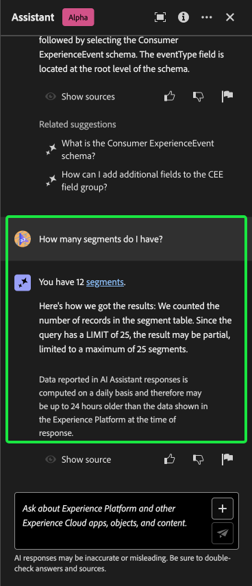

# Assistente AI per Adobe Experience Platform

>[!NOTE]
>
>L’Assistente AI per Adobe Experience Platform è attualmente in Alfa. La funzione e la documentazione sono soggette a modifiche.

L’Assistente IA per Adobe Experience Platform è una funzione dell’interfaccia utente che consente di navigare e comprendere i concetti di Experienci Platform e Real-time Customer Data Platform e le informazioni sull’utilizzo degli oggetti.

È possibile eseguire una query sull&#39;Assistente IA per informazioni quali:

* Linee guida su come eseguire attività relative a dati e tipi di pubblico.
* Stati e metriche degli oggetti dati esistenti nell’organizzazione.
* Esempi di casi d’uso e sfumature per comprendere meglio gli oggetti dati, inclusi attributi, set di dati, destinazioni, schemi, segmenti e origini.

Questo documento fornisce informazioni su come accedere e utilizzare l’Assistente AI per porre domande e ricevere risposte sui concetti di Experienci Platform e Real-Time CDP.

>[!BEGINSHADEBOX]

**Come funziona l’Assistente AI?**

L’Assistente AI risponde alle domande inviate eseguendo una query su un database e quindi traducendo i dati dal database in una risposta leggibile.

Questa rappresentazione interna dei dati sottostanti è nota anche come Knowledge Graph (Grafico della conoscenza), un web completo di concetti, dati e metadati per una determinata risposta.

Il Knowledge Graph è costituito da sottografi a cui viene fatto riferimento ogni volta che vengono inviate query:

* Dati sull’utilizzo del cliente.
* Dati sull’utilizzo dei clienti nei vari meta-store.
* Documentazione di Experience League.

Prima di eseguire una query sull’Assistente IA, è necessario considerare due classi di domande:

* **Domande sui concetti**: le domande sui concetti riguardano concetti Adobi relativi a dati o tipi di pubblico. Alcuni esempi di domande sui concetti includono:
   * Qual è la differenza tra segmentazione in batch e segmentazione in streaming?
   * Esistono modelli di dati di settore e come li utilizzo?
   * Per che cosa si usa meglio Real-Time CDP?
* **Domande sull’utilizzo**: le domande sull’utilizzo riguardano gli oggetti dati all’interno dell’organizzazione. Alcuni esempi di domande sull’utilizzo includono:
   * Quanti set di dati ho?
   * Quanti attributi dello schema non sono mai stati utilizzati?
   * Quali segmenti sono stati attivati?

>[!ENDSHADEBOX]

## Accedere all’Assistente AI, ad Experience Platform nell’interfaccia utente

Puoi accedere all’Assistente AI dalla navigazione dell’intestazione nell’interfaccia utente di Experienci Platform.

Seleziona la **[!UICONTROL Icona Assistente AI]** dall’intestazione per avviare il pannello dell’Assistente AI.

Da qui, puoi inserire la domanda nella casella di testo ed eseguire una query sull’Assistente AI per individuare i concetti relativi ai dati o ai tipi di pubblico. Puoi anche porre domande sugli oggetti dati per capire meglio come utilizzarli nel rispettivo caso d’uso.

### Caso d’uso di esempio: utilizza l’Assistente IA per accelerare il processo di creazione dello schema

>[!NOTE]
>
>Il flusso di lavoro di esempio seguente utilizza il processo di creazione dello schema ExperienceEvent per illustrare come utilizzare l’Assistente IA quando si utilizza l’interfaccia utente di Experienci Platform.

Considera un caso d’uso in cui stai creando una **Schema permuta dispositivo in evento**. Durante il processo di creazione dello schema ExperienceEvent, incappi nel `eventType` campo. A questo punto, puoi uscire dal flusso di lavoro e fare riferimento alla documentazione del [nozioni di base su una composizione di schema](../xdm/schema/composition.md), oppure puoi utilizzare l’Assistente AI per recuperare risposte immediate alle tue domande.

Per iniziare, inserisci la domanda nella casella di testo fornita. Nell’esempio seguente, all’Assistente AI viene fornita la domanda: &quot;**Qual è il campo eventType in uno schema Experience Event?**&quot;

L’Assistente AI esegue quindi una query sulla knowledge base e calcola una risposta. Dopo alcuni istanti, l’Assistente AI restituisce una risposta e i suggerimenti correlati che puoi utilizzare come prompt di follow-up.

Per saperne di più su un particolare argomento, fai una domanda di follow-up. Nell’esempio successivo, all’Assistente AI viene richiesto come utilizzare eventType nella segmentazione.

Puoi anche porre all’Assistente AI domande relative all’utilizzo dei tuoi dati. Quando si richiedono informazioni sull’utilizzo dei dati, è necessario trovarsi in una sandbox attiva affinché l’Assistente AI possa rispondere alla query.

Con ogni risposta, l’assistente AI ti offre un modo per convalidare la risposta visualizzandone l’origine. Vengono forniti collegamenti alla documentazione per le domande sui concetti, mentre le domande sull’utilizzo dei dati possono essere verificate con una query SQL che illustra come è stata calcolata la risposta.

>[!BEGINSHADEBOX]

**Richiesta del feedback**

Durante questa fase Alpha, sei invitato a fornire feedback sulle risposte ricevute dall’Assistente AI. Tutte le risposte e i feedback inviati vengono esaminati per continuare a migliorare l’esperienza di AI Assistant.

Per fornire un feedback, seleziona Miniature in alto o Miniature in basso dopo aver ricevuto una risposta dall’Assistente AI, quindi inserisci il tuo feedback nella casella di testo fornita. Quindi, seleziona **[!UICONTROL Invia feedback]** da inviare.

>[!ENDSHADEBOX]

>[!BEGINTABS]

>[!TAB Mostra sorgente]

Seleziona **[!UICONTROL Mostra origine]** per un elenco di collegamenti alla documentazione a cui l’Assistente AI fa riferimento per calcolare la risposta.

>[!TAB Miniature in alto]

Seleziona l’icona miniature in alto per fornire un feedback su ciò che è andato bene con la tua esperienza con l’Assistente AI.

>[!TAB Miniature in basso]

Seleziona l’icona miniature verso il basso per fornire feedback su cosa potrebbe essere migliorato in base alla tua esperienza con l’Assistente AI. Durante questo passaggio, puoi anche fornire commenti specifici relativi alla tua esperienza. Il feedback fornito nei commenti viene rivisto ogni giorno.

>[!TAB Contrassegno]

Seleziona l’icona del flag per fornire ulteriori rapporti sulla tua esperienza utilizzando l’Assistente AI.

>[!ENDTABS]

### Idee per iniziare

È inoltre possibile utilizzare i prompt predefiniti forniti dall&#39;Assistente AI per iniziare.

## Informazioni aggiuntive

Fai riferimento a questa sezione per ulteriori informazioni sull’Assistente IA, ad Experience Platform.

### Portata

L’Assistente AI può rispondere alle query in base alla documentazione e all’utilizzo dei dati.

#### Documentazione

Puoi porre domande sulla documentazione in base a Real-time Customer Data Platform e Audiences. Attualmente, l’indice della documentazione copre Adobe Experience Platform (Real-Time CDP e Audiences). L’indice viene aggiornato periodicamente.

Il modello di recupero della documentazione di è addestrato su Experienci Platform (Real-Time CDP e Audiences). Non è possibile rispondere a domande che esulano dall’ambito di Adobe Experience Platform, come ad esempio domande su altri prodotti Adobe come Adobe Target e la suite di Creative Cloud.

#### Utilizzo dati

Puoi anche porre all’Assistente AI domande sull’utilizzo dei dati nei seguenti domini:

* Attributi
* Set di dati
* Destinazioni
* Schemi
* Segmenti
* Origini

Per le query di dati di utilizzo, le risposte potrebbero non riflettere lo stato corrente dell’interfaccia utente. I dati che supportano queste domande vengono aggiornati ogni 12-24 ore. Potrebbe essere necessario formattare le domande come: &quot;Quando è stato il segmento con il titolo {TITLE} creato?&quot; invece di, &quot;Quando è stato il {TITLE} segmento creato?&quot;

Dovrai accedere a una sandbox per informazioni su dati specifici relativi a oggetti come schemi, set di dati, attributi, destinazioni e segmenti.

+++Seleziona per un elenco di domande sull’utilizzo dei dati supportate

Di seguito è riportato un elenco delle domande sull’utilizzo dei dati attualmente supportate, raggruppate per dominio.

>[!BEGINTABS]

>[!TAB Segmenti]

* Sono presenti segmenti duplicati?
* Mostra tutti i segmenti di streaming.
* Segmento con nome {SEGMENT_ID} valutato in Batch OR Stream?
* Quali segmenti sono duplicati?
* Quanti segmenti ci sono in totale?
* Esistono segmenti con gli stessi nomi ma ID diversi?
* Qual è la distribuzione dei metodi di valutazione (batch, edge, streaming) tra i segmenti?
* Visualizza un elenco dei segmenti modificati l’ultima volta nell’ultimo mese.
* Quali segmenti sono stati modificati nell’ultima settimana?
* Esistono segmenti che non sono stati modificati negli ultimi sei mesi?
* Elencare i segmenti creati nell’ultimo anno.
* Mostra i segmenti modificati per ultimi prima di oggi.
* Esistono pattern o tendenze nelle date di creazione dei segmenti nell’ultimo anno?
* È possibile identificare i segmenti che non sono stati modificati dalla loro creazione?
* Esistono segmenti che non sono stati modificati dalla loro creazione?
* Qual è la tendenza nella creazione dei segmenti nel tempo?
* Qual è la distribuzione delle date di creazione dei segmenti?
* Qual è la distribuzione delle date di modifica dei segmenti?
* Quali segmenti hanno più profili utente?
* Quali segmenti presentano il minor numero di profili utente?
* Elencare tutti i segmenti batch.
* Elenca tutti i segmenti edge.
* Quali segmenti sono attivati?
* Quali segmenti vengono inoltrati a Facebook?
* Il segmento denominato &quot;Clienti APAC&quot; è in batch o in streaming?
* Quanti profili ha il segmento Lavoro attivo?
* Alcuni dei miei segmenti hanno 0 profili?
* Quali set di dati influiscono sul segmento fedeltà bronzo?
* Quali definizioni di segmento utilizzano campi XDM che contengono &quot;gender&quot;?
* Quali campi XDM compilati si verificano nei segmenti di streaming?
* Quanti campi XDM sono presenti in tutte le definizioni di segmenti?
* Quali segmenti influiscono sul set di dati &quot;Utenti professionali&quot;?
* Quali segmenti vengono inoltrati all’API HTTP?
* Dei segmenti attivati, quali sono attivati per il maggior numero di tipi di destinazione?
* Qual è il conteggio totale dei segmenti attivati?
* Quanti segmenti vengono attivati?
* Quanti segmenti duplicati vengono attivati?
* Quanti segmenti vengono attivati per ogni destinazione?
* Quali segmenti sono attivati su 0, 1 o più destinazioni? Mostra la distribuzione.
* Quali segmenti vengono attivati per il maggior numero di destinazioni?
* Quali segmenti duplicati vengono attivati?
* Quali segmenti sono attivati in Adobe Target?
* In tutti i segmenti, quante volte viene utilizzato ciascun criterio di unione?

>[!TAB Schemi]

* Quanti schemi XDM sono definiti?
* Quali sono gli schemi creati più di recente?
* Quanti schemi per ogni classe XDM?
* Quale schema utilizza il set di dati &quot;Acquisizione segmento&quot;?
* Quali schemi non vengono utilizzati da alcun set di dati?

>[!TAB Destinazioni]

* Quante destinazioni sono presenti?
* Quali sono le destinazioni create più di recente?
* Quali destinazioni sono associate a ciascun segmento?

>[!TAB Origini]

* Quante origini sono state create?
* Quali sono le origini create più di recente?
* Quante origini sono disponibili, suddivise per categoria?
* È possibile creare una connessione sorgente da S3?
* Quali fonti hanno contribuito al set di dati Mutual365?

>[!TAB Set di dati]

* Quanti set di dati ci sono?
* Quali sono i set di dati creati più di recente?
* Quali set di dati sono abilitati per il profilo unificato?
* È impostato un TTL per il set di dati di acquisizione segmento?
* Qual è il TTL per il set di dati per utenti professionali?
* Quali set di dati utilizzano lo schema Utenti professionali?

>[!TAB Attributi]

* Quali campi XDM vengono popolati più comunemente in tutti i DataSet?
* Quali campi e attributi XDM vengono utilizzati più comunemente negli schemi?
* Quali campi e attributi XDM vengono utilizzati nello schema Utenti professionali?
* Elencare gli attributi utilizzati per questo segmento con ID {SEGMENT_ID}.
* Quanti campi XDM vengono utilizzati in 2+ segmenti?
* Quali campi vengono utilizzati più comunemente nei segmenti?
* Esistono campi utilizzati in un solo segmento?
* Quali attributi vengono utilizzati per il segmento fedeltà Bronzo?
* Quali attributi non vengono utilizzati in alcun segmento?
* Quali attributi vengono utilizzati più comunemente nei segmenti?

>[!ENDTABS]

+++

### Esperienza conversazionale

Quando esegui una query sull’Assistente AI, devi tenere presenti diverse sfumature relative all’esperienza di conversazione.

>[!NOTE]
>
>Queste limitazioni sono temporanee e vengono migliorate durante l&#39;intero corso dell&#39;Alfa.

>[!BEGINTABS]

>[!TAB Impossibile dedurre il contesto dalla discussione precedente]

L’Assistente IA al momento non può fare riferimento a discussioni precedenti come contesto per una determinata domanda. Per esempi, consulta la tabella seguente:

| Domanda ambigua | Cancella domanda | Nota |
| --- | --- | --- |
| <ul><li>Prima domanda: &quot;Cos’è un segmento?&quot;</li><li>Segui la domanda: &quot;Esistono diversi tipi di questi?&quot;</li></ul> | <ul><li>Prima domanda: &quot;Cos’è un segmento?&quot;</li><li>Domanda di follow-up: &quot;Esistono diversi tipi di **segmenti**?&quot;</li></ul> | L’Assistente AI non può dedurre il significato di &quot;loro&quot;. |
| <ul><li>Prima domanda: &quot;Cos’è un segmento?&quot;</li><li>Segui la domanda: &quot;Puoi elaborare di più?&quot;</li></ul> | <ul><li>Prima domanda: &quot;Cos’è un segmento?&quot;</li><li>Domanda di follow-up: &quot;Spiega cosa è approfondito un segmento&quot;</li></ul> | L’Assistente AI non può fare riferimento in modo intelligente alla documentazione basata su &quot;altro&quot;. |
| <ul><li>Prima domanda: &quot;Cos’è un segmento?&quot;</li><li>Segui la domanda: &quot;Me ne puoi fare un esempio?&quot;</li></ul> | <ul><li>Prima domanda: &quot;Cos’è un segmento?&quot;</li><li>Segui la domanda: &quot;Puoi farmi un esempio di segmento?&quot;</li></ul> | L’Assistente AI non può dedurre ciò di cui desideri un esempio. |
| <ul><li>Prima domanda: &quot;Cos’è un segmento batch?&quot;</li><li>Domanda di follow-up: &quot;Come si confronta con un segmento di streaming?&quot;</li></ul> | <ul><li>Prima domanda: &quot;Cos’è un segmento batch?&quot;</li><li>Domanda di follow-up: &quot;È possibile confrontare un segmento di streaming con un segmento batch?&quot;</li></ul> | L’Assistente AI non può dedurre a cosa si riferisca &quot;esso&quot; e quindi non può confrontare il segmento di streaming. |
| <ul><li>Prima domanda: &quot;Quanti segmenti ho?&quot;</li><li>Segui la domanda: &quot;Quanti di loro usano Facebook come destinazione?&quot;</li></ul> | <ul><li>Prima domanda: &quot;Quanti segmenti ho?&quot;</li><li>Domanda di follow-up: &quot;Quanti dei segmenti di cui dispongo utilizzano Facebook come destinazione?&quot;</li></ul> | L’Assistente AI non è in grado di dedurre a cosa si riferisca &quot;loro&quot;. |

{style="table-layout:auto"}

>[!TAB Impossibile dedurre il contesto da una pagina]

Quando chiedi all’Assistente AI informazioni su un particolare elemento della pagina dell’interfaccia utente di Experienci Platform su cui ti trovi, devi definire chiaramente l’elemento specifico all’interno della domanda.

| Domanda ambigua | Cancella domanda | Nota |
| --- | --- | --- |
| &quot;Cosa fa questo?&quot; | &quot;Che cosa fa {PAGE_NAME} vero? | L’Assistente AI non può dedurre a cosa si riferisca &quot;questo&quot;. È necessario fornire l&#39;elemento di pagina specifico su cui si sta eseguendo una query. |
| &quot;Perché non si risparmia?&quot; | &quot;Perché non posso salvare una nuova sandbox denominata {NAME}?&quot; | L’Assistente AI non può dedurre a cosa si riferisca &quot;it&quot; e non può sapere che si sono verificati problemi con un’entità. |

{style="table-layout:auto"}

Inoltre, l’assistente AI può rispondere solo a domande relative a messaggi di errore, dato che l’errore è documentato in un Experience League.

>[!TAB Ambiguità]

È necessario formulare le domande in modo chiaro e definirle all’interno di un prodotto, un’applicazione o un dominio, in quanto l’Assistente AI non è attualmente in grado di dissimulare le domande.

| Domanda ambigua | Cancella domanda | Nota |
| --- | --- | --- |
| &quot;Come si crea un filtro? | Come si crea un filtro in Profile Query Language? | È necessario specificare la feature per la quale si desidera applicare il filtro, in quanto il filtro è supportato da numerose feature di Experience Platform. |
| &quot;Come posso iniziare? | Come si inizia a utilizzare le destinazioni? | Devi fare chiarezza sugli obiettivi e sul caso d’uso, perché concetti eccessivamente ampi possono dare luogo a risposte generiche o inutilmente specifiche. |

{style="table-layout:auto"}

>[!ENDTABS]

### Piccolo talk limitato

Puoi partecipare a una piccola conversazione con l’Assistente AI, ma al momento questa capacità è limitata.

### Domande sulle funzionalità

L’Assistente AI può fornire un’impressione imprecisa di ciò che è in grado di fare. Potrebbe rispondere erroneamente ai seguenti tipi di domande:

| Domanda di esempio | Nota |
| --- | --- |
| &quot;Puoi rispondere a domande su {ENTITY}?&quot; | Se l’Assistente AI è in grado di trovare una singola pagina che fa riferimento a una determinata entità nel suo indice, risponderà sì. |
| &quot;Lo sai che **x** lingua?&quot; | L’Assistente per l’intelligenza artificiale attualmente supporta solo l’inglese, ma potrebbe rispondere &quot;sì&quot; a causa del fatto che il modello sottostante è in grado di supportarlo. |
| &quot;Puoi fare...?&quot; | L’Assistente AI può rispondere di sì, anche se non è possibile. |

### Suggerimenti

#### È possibile rispondere alle domande con un&#39;informazione errata

In alcuni casi, quando si pongono domande sui dati di utilizzo, si può ottenere una risposta in base alla documentazione. Ciò si verifica perché l’Assistente AI può instradare erroneamente la domanda all’origine delle informazioni errata. Per evitare questo problema:

* Riformulare la domanda per utilizzare un linguaggio più simile a quello SQL
* Chiamando in modo esplicito l&#39;origine delle informazioni da utilizzare.

Leggi la tabella seguente per alcuni esempi:

| Domanda errata | Buona domanda | Note |
| --- | --- | --- |
| Qual è il segmento più grande? | Qual è il segmento più grande? Utilizzo dei dati. | Indica esplicitamente all’Assistente IA che desideri che la risposta sia basata sui dati. |
| Qual è il segmento più grande? | Elencate il mio segmento più grande. | Esistono casi in cui una domanda &quot;cosa...&quot; può essere scambiata per una domanda basata su documentazione. L’utilizzo di un comando come &quot;list&quot; è un indicatore più forte del fatto che ti stai ponendo una domanda con i dati nel contesto. |
| Quanti set di dati ho? | Conta i miei set di dati. | La domanda originale funziona per i segmenti, ma potrebbe non funzionare con i set di dati. |
