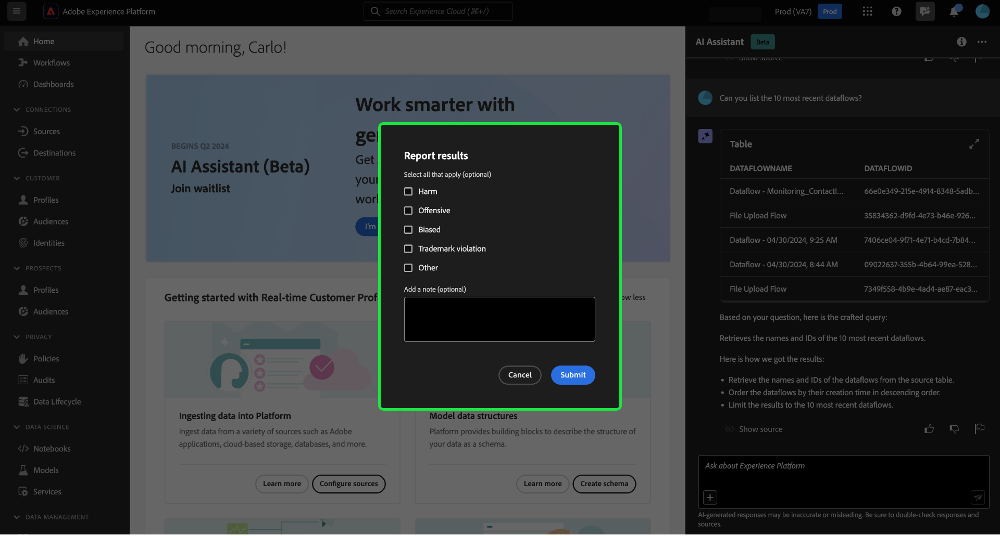

# Assistente per Adobe Experience Platform

>[!NOTE]
>
>L&#39;Assistente per Adobe Experience Platform è attualmente in fase di Alpha. La funzione e la documentazione sono soggette a modifiche.

L&#39;Assistente è una funzione dell&#39;interfaccia utente che consente di navigare e comprendere i concetti di Adobe Experience Platform e Real-time Customer Data Platform e le informazioni sull&#39;utilizzo degli oggetti.

È possibile eseguire una query sull&#39;Assistente per ottenere informazioni quali:

* Linee guida su come eseguire attività relative a dati e tipi di pubblico.
* Stati e metriche degli oggetti dati esistenti nell’organizzazione.
* Esempi di casi d’uso e sfumature per comprendere meglio gli oggetti dati, inclusi attributi, set di dati, destinazioni, schemi, segmenti e origini.

Leggi la guida di seguito per scoprire come utilizzare l’Assistente per navigare e comprendere i flussi di lavoro di Experienci Platform e Real-Time CDP.

>[!BEGINSHADEBOX]

**Come funziona Assistant?**

L&#39;Assistente risponde alle domande inviate eseguendo una query su un database e quindi traducendo i dati dal database in una risposta leggibile.

Questa rappresentazione interna dei dati sottostanti è nota anche come Knowledge Graph (Grafico della conoscenza), un web completo di concetti, dati e metadati per una determinata risposta.

Il Knowledge Graph è costituito da sottografi a cui viene fatto riferimento ogni volta che vengono inviate query:

* Dati sull’utilizzo del cliente.
* Dati sull’utilizzo dei clienti nei vari meta-store.
* Documentazione di Experience League.

Prima di eseguire una query dell&#39;Assistente, è necessario considerare due classi di domande:

* **Domande sui concetti**: le domande sui concetti riguardano concetti Adobi relativi a dati o tipi di pubblico. Alcuni esempi di domande sui concetti includono:
   * Qual è la differenza tra segmentazione in batch e segmentazione in streaming?
   * Esistono modelli di dati di settore e come li utilizzo?
   * Per che cosa si usa meglio Real-Time CDP?
* **Domande sull’utilizzo**: le domande sull’utilizzo riguardano gli oggetti dati all’interno dell’organizzazione. Alcuni esempi di domande sull’utilizzo includono:
   * Quanti set di dati ho?
   * Quanti attributi dello schema non sono mai stati utilizzati?
   * Quali segmenti sono stati attivati?

>[!ENDSHADEBOX]

## Accesso facilitato nell’interfaccia utente di Experienci Platform

Per avviare Assistente, selezionare **[!UICONTROL Icona Assistente]** dall’intestazione superiore dell’interfaccia utente di Experienci Platform.

Viene visualizzata l&#39;interfaccia dell&#39;Assistente, che fornisce immediatamente le informazioni per iniziare. Puoi utilizzare le opzioni fornite in [!UICONTROL Idee per iniziare] per rispondere a domande e comandi quali:

* [!UICONTROL Quali dei miei segmenti sono attivati?]
* [!UICONTROL Che cos’è uno schema?]
* [!UICONTROL Alcuni casi d’uso comuni per Real-Time CDP]

Per interagire con l&#39;Assistente, utilizzare la casella di input per digitare nelle query o nei comandi. È inoltre possibile utilizzare (**`+`**) per utilizzare la funzione di completamento automatico e l&#39;icona del segnalibro per accedere alle query e ai comandi con segnalibro.

## Esempio di utilizzo: utilizza l’Assistente per accelerare il processo di creazione dello schema

>[!NOTE]
>
>Il seguente flusso di lavoro è un esempio che utilizza il processo di creazione dello schema di evento esperienza per illustrare come utilizzare l’Assistente quando si utilizza l’interfaccia utente di Experienci Platform.

Considera un caso d’uso in cui stai creando una **Schema permuta dispositivo in evento**. Durante il processo di creazione dello schema dell’evento esperienza, ti imbatti nel `eventType` campo. &quot;A questo punto, puoi scegliere di uscire dal flusso di lavoro e fare riferimento a [nozioni di base su una composizione di schema](../xdm/schema/composition.md) oppure puoi utilizzare l’Assistente per recuperare le risposte alle tue domande e trovare risorse aggiuntive tramite i collegamenti alla documentazione consigliati dall’Assistente.&quot;

Per iniziare, immettere la domanda nella casella di testo fornita. Nell’esempio seguente, Assistant riceve la domanda: &quot;**Qual è il campo eventType in uno schema ExperienceEvent?**&quot;

L&#39;Assistente esegue quindi una query sulla knowledge base e calcola una risposta. Dopo alcuni istanti, l&#39;Assistente restituisce una risposta e suggerimenti correlati che è possibile utilizzare come prompt di follow-up.

Dopo aver ricevuto una risposta dall&#39;Assistente, è possibile scegliere tra diverse opzioni per decidere come procedere.

### Salvare la query {#save-your-query}

+++Selezionare questa opzione per visualizzare un esempio di come salvare una query

Per salvare la query, selezionare l&#39;icona del segnalibro accanto alla domanda.

Per accedere alle query salvate, seleziona l’icona del segnalibro sotto la casella di input, quindi seleziona la query da eseguire.

+++

### Visualizzare i dati nella sandbox {#view-data-in-your-sandbox}

+++Seleziona per visualizzare l’esempio

A seconda della query, l’Assistente fornisce informazioni aggiuntive relative ai dati nella sandbox. Per visualizzare il modo in cui la risposta alla query si applica alla sandbox, seleziona **[!UICONTROL Nella sandbox].**

Durante questo passaggio, l&#39;Assistente può fornire collegamenti diretti alle pagine dell&#39;interfaccia utente di determinati oggetti in questione. Nell&#39;esempio seguente, l&#39;Assistente fornisce collegamenti diretti al [!UICONTROL Schemi] e [!UICONTROL Segmenti] Pagine dell’interfaccia utente.

+++

### Verifica la risposta {#verify-the-response}

+++Seleziona per visualizzare un esempio di come visualizzare le sorgenti

Per visualizzare le citazioni e convalidare la risposta dell&#39;Assistente, selezionare **[!UICONTROL Mostra origini]**. L’Assistente fornisce collegamenti alla documentazione che ne conferma la risposta. È inoltre possibile utilizzare le query fornite dall&#39;Assistente in [!UICONTROL Suggerimenti correlati] per esplorare ulteriormente gli argomenti relativi alla query originale.

+++

### Utilizzo e visualizzazione dei dati {#data-usage-and-visualization}

+++Seleziona per visualizzare un esempio di domande sull’utilizzo dei dati e visualizzazione dei dati

È possibile richiedere informazioni sull&#39;utilizzo dei dati all&#39;Assistente. Per rispondere a una domanda sull’utilizzo dei dati relativa ai dati dell’organizzazione, è necessario trovarsi in una sandbox attiva.

Quando viene richiesta una domanda sull&#39;utilizzo dei dati, l&#39;Assistente fornisce anche una spiegazione di come ha calcolato la risposta. Nell’esempio seguente, l’Assistente illustra i passaggi necessari per visualizzare segmenti con più di 1000 profili e i rispettivi stati di attivazione.

Inoltre, l’Assistente esegue il rendering dei grafici per visualizzare i dati. È inoltre possibile fornire filtri e modifiche alle query e istruire l&#39;Assistente affinché esegua il rendering dei risultati in base ai filtri inclusi. Ad esempio, puoi richiedere all’Assistente di mostrare una tendenza dei segmenti di conteggio nell’ordine della data di creazione, rimuovere segmenti con profili totali pari a zero e utilizzare i nomi dei mesi invece dei numeri interi durante la visualizzazione dei dati.

+++

### Usa completamento automatico {#use-auto-complete}

+++Seleziona per visualizzare un esempio di completamento automatico

È possibile utilizzare la funzione di completamento automatico per ricevere un elenco di oggetti dati esistenti nella sandbox. Sono disponibili consigli di completamento automatico per i seguenti domini: segmenti, schemi, set di dati, origini e destinazioni.

È possibile utilizzare il completamento automatico includendo il simbolo più (**`+`**) nella query. In alternativa, è possibile selezionare il segno più (**`+`**) che si trova nella parte inferiore della casella di immissione testo. Viene visualizzata una finestra con un elenco degli oggetti dati consigliati dalla sandbox.

Quindi, selezionare l&#39;oggetto dati di cui si desidera eseguire la query per completare la domanda e inviare la domanda.

+++

### Usa multi-giro {#use-multi-turn}

+++Selezionare per visualizzare un esempio di tornitura multipla

È possibile utilizzare le funzionalità multi-turn di Assistant per avere una conversazione più naturale durante la tua esperienza. L&#39;assistente è in grado di rispondere alle domande di follow-up, fornite. tale contesto può essere dedotto da un’interazione precedente.

Nell’esempio seguente, a Assistant viene richiesto il numero totale di flussi di dati nell’organizzazione corrente.

Successivamente, l&#39;Assistente riceve un&#39;altra richiesta di completamento. Questa volta, l’Assistente risponde elencando i flussi di dati attualmente presenti nell’organizzazione.

+++

## Portata {#scope}

L’Assistente può rispondere a domande relative ai concetti di Real-Time CDP e Experienci Platform, nonché all’utilizzo di dati specifici per il tuo account utente. L’Assistente può anche dedurre il contesto in base alla pagina dell’interfaccia utente in cui ti trovi. È in grado di identificare:

* Account utente in uso.
* L’organizzazione a cui appartieni.
* Pagina visualizzata sullo schermo.
* La risorsa (inclusi tipo e ID) che stai visualizzando sullo schermo.
* Se si sta eseguendo un particolare Experience Platform o flusso di lavoro Real-Time CDP, l&#39;Assistente può dedurre l&#39;intento.

### Documentazione {#documentation}

Attualmente, l’indice della documentazione copre Adobe Experience Platform (Real-Time CDP e Audiences). L’indice viene aggiornato periodicamente.

Il modello di recupero della documentazione di è addestrato su Experienci Platform (Real-Time CDP e Audiences). Non è possibile rispondere a domande che esulano dall’ambito di Adobe Experience Platform, come ad esempio domande su altri prodotti Adobe come Adobe Target e la suite di Creative Cloud.

### Utilizzo dati {#data-usage}

Puoi anche porre domande sull’utilizzo dei dati da parte dell’Assistente nei seguenti domini:

* Attributi
* Set di dati
* Destinazioni _Al momento non è possibile rispondere ad alcune domande relative agli account e al flusso di dati._
* Schemi _Al momento non è possibile rispondere alle domande relative ai gruppi di campi._
* Segmenti
* Sorgenti _(Al momento non è possibile rispondere alle domande relative ai conti)._

Per le query di dati di utilizzo, le risposte potrebbero non riflettere lo stato corrente dell’interfaccia utente. I dati che supportano queste domande vengono aggiornati una volta ogni 24 ore. Ad esempio, le modifiche apportate dagli utenti in Real-Time CDP durante il giorno vengono sincronizzate con gli archivi dati di notte e quindi diventano disponibili per le domande degli utenti di mattina. Potrebbe essere necessario formattare le domande come: &quot;Quando è stato il segmento con il titolo {TITLE} creato?&quot; invece di, &quot;Quando è stato il {TITLE} segmento creato?&quot;

Dovrai accedere a una sandbox per informazioni su dati specifici relativi a oggetti come schemi, set di dati, attributi, destinazioni e segmenti.

### Esempi di domande sull’utilizzo dei dati {#example-data-usage-questions}

+++Seleziona per visualizzare un elenco di esempi di domande sull’utilizzo dei dati

| Tipo di domanda | Descrizione | Esempi |
| --- | --- | --- | 
| Derivazione dei dati | Tracciare l&#39;utilizzo di uno o più oggetti tra altri oggetti Experienci Platform | <ul><li>Quali set di dati utilizzano {SCHEMA_NAME} schema?</li><li>Quanti set di dati sono stati acquisiti utilizzando lo stesso schema?</li><li>Quali set di dati sono stati utilizzati nei segmenti attivati?</li><li>Elencare gli schemi con attributi utilizzati nei segmenti attivati.</li><li>Mostra i segmenti attivati in {DESTINATION_ACCOUNT_NAME} e avere più di 1000 profili.</li><li>Mostra gli attributi utilizzati nei segmenti attivati che sono stati modificati dopo gennaio 2023.</li><li>Quali set di dati vengono acquisiti tramite {SOURCE_NAME}?</li><li>Quali flussi di dati sono associati a {DATAFLOW_NAME}</li><li>Elencare gli schemi relativi ai segmenti attivati e creati nell’ultimo anno.</li></ul> |
| Distribuzione e aggregazioni | Domande basate su riepilogo sull&#39;utilizzo degli oggetti di Experience Platform | <ul><li>Qual è la percentuale di segmenti attivati?</li><li>Quanti campi vengono utilizzati nella segmentazione?</li><li>Quali segmenti vengono attivati nel maggior numero di destinazioni?</li><li>Elencare i segmenti duplicati.</li><li>Mostra i segmenti attivati in {DESTINATION_ACCOUNT_NAME} e li classifica in base alle dimensioni del profilo.</li><li>Qual è la percentuale dei segmenti che non sono stati attivati ma hanno più di 100 profili. Mostratemi i loro nomi.</li><li>Elenca i 3 connettori di origine che acquisiscono i dati nei miei set di dati.</li><li>Elencami i primi 5 attributi utilizzati nei segmenti attivati in base alla loro occorrenza.</li></ul> |
| Ricerca oggetto | Recuperare o accedere a un oggetto Experience Platform o alle relative proprietà. | <ul><li>A quali set di dati non è associato alcuno schema</li><li>Elencare gli attributi utilizzati per {SEGMENT_NAME}?</li><li>Dammi l’elenco degli schemi abilitati per il profilo ma non modificati dalla loro creazione.</li><li>Quali segmenti sono stati modificati nell’ultima settimana?</li><li>Elencami i segmenti che hanno le stesse definizioni di segmenti insieme alla relativa data di creazione.</li><li>Quali set di dati sono abilitati per il profilo e includono anche il numero di segmenti creati da ciascun set di dati.</li><li>Quali account di origine sono associati al set di dati XYZ?</li><li>Mostra la definizione del segmento e la data di modifica di {SEGMENT_NAME}.</li></ul> |

+++

## Fornire feedback {#feedback}

>[!BEGINSHADEBOX]

**Richiesta del feedback**

In questa fase di Alpha, si è invitati a fornire un feedback sulle risposte ricevute dall&#39;Assistente. Tutte le risposte e i feedback inviati vengono esaminati per continuare a migliorare l’esperienza dell’Assistente.

Per fornire un feedback, selezionare la casella di controllo Miniatura in alto o Miniatura in basso dopo aver ricevuto una risposta dall&#39;Assistente, quindi immettere il feedback nella casella di testo fornita. Quindi, seleziona **[!UICONTROL Invia feedback]** da inviare.

>[!ENDSHADEBOX]

+++Fornisci feedback

>[!BEGINTABS]

>[!TAB Miniature in alto]

Seleziona l’icona miniature in alto per fornire un feedback su ciò che è andato bene con la tua esperienza con l’Assistente.

>[!TAB Miniature in basso]

Seleziona l’icona miniature in basso per fornire feedback su cosa potrebbe essere migliorato in base alla tua esperienza con l’Assistente. Durante questo passaggio, puoi anche fornire commenti specifici relativi alla tua esperienza. Il feedback fornito nei commenti viene rivisto ogni giorno.

>[!TAB Contrassegno]

Seleziona l’icona del flag per fornire ulteriori rapporti sulla tua esperienza utilizzando l’Assistente.

>[!ENDTABS]

+++

## Informazioni aggiuntive {#additional-information}

Fare riferimento a questa sezione per ulteriori informazioni sull&#39;Assistente, ad Experience Platform.

### Avvertenze e limitazioni {#caveats-and-limitations}

La sezione seguente illustra le avvertenze e le limitazioni correnti da considerare quando si utilizza l’Assistente.
<!-- 
#### Conversational experience

You must consider several nuances regarding the conversational experience when querying the Assistant.

>[!NOTE]
>
>These limitations are temporary and are being improved upon throughout the course of the alpha.

>[!BEGINTABS]

>[!TAB Unable to infer context from prior discussion]

The Assistant currently cannot reference prior discussions as context for a given question. See the table below for examples:

| Ambiguous question | Clear question | Note |
| --- | --- | --- |
| <ul><li>First question: "What is a segment?"</li><li>Follow up question: "Are there different types of them?"</li></ul>| <ul><li>First question: "What is a segment?"</li><li>Follow up question: "Are there different types of **segments**?"</li></ul> | The Assistant cannot infer what "them" means. |
| <ul><li>First question: "What is a segment?"</li><li>Follow up question: "Can you elaborate more?"</li></ul> | <ul><li>First question: "What is a segment?"</li><li>Follow up question: "Explain what a segment is in depth"</li></ul> | The Assistant cannot intelligently reference documentation based on "more". |
| <ul><li>First question: "What is a segment?"</li><li>Follow up question: "Can you give me an example of one?"</li></ul> | <ul><li>First question: "What is a segment?"</li><li>Follow up question: "Can you give me an example of a segment?"</li></ul> | The Assistant cannot infer what you want an example of.|
| <ul><li>First question: "What is a batch segment?"</li><li>Follow up question: "How does it compare to a streaming segment?"</li></ul> | <ul><li>First question: "What is a batch segment?"</li><li>Follow up question: "Can you compare a streaming segment to a batch segment?"</li></ul> | The Assistant cannot infer what "it" is referring to and thus cannot compare the streaming segment. |
| <ul><li>First question: "How many segments do I have?"</li><li>Follow up question: "How many of them use Facebook as a destination?"</li></ul> | <ul><li>First question: "How many segments do I have?"</li><li>Follow up question: "How many of the segments that I have are using Facebook as a destination?"</li></ul> | The Assistant is cannot infer what "them" is referring to. |

{style="table-layout:auto"}

>[!TAB Unable to infer context from a page]

When asking the Assistant about a particular element of the Experience Platform UI page that you are on, you must clearly define the specific element within your question. 

| Ambiguous question | Clear question | Note |
| --- | --- | --- |
| "What does this do?" | "What does {PAGE_NAME} do? | The Assistant cannot infer what "this" is referring to. You must provide the specific page element that you are querying about. |
| "Why won't it save?" | "Why can't I save a new sandbox called {NAME}?" | The Assistant cannot infer what "it" is referring to and cannot know that you are having issues with an entity. |

{style="table-layout:auto"}

Furthermore, the Assistant can only answer questions regarding error messages, given that the error is documented in Experience League.

>[!TAB Ambiguity]

You must phrase your questions clearly and scope them within a product, application, or domain, as the Assistant currently cannot disambiguate questions.

| Ambiguous question | Clear question | Note |
| --- | --- | --- |
| "How do I create a filter? | How do I create a filter in Profile Query Language? | You must specify the feature that which you are filtering for because a variety of Experience Platform features support filtering. |
| "How do I get started? | How do I get started using destinations? | You must provide clarity on your goals and use case because overly broad concepts may result in generic or unnecessarily specific answers. |

{style="table-layout:auto"}

>[!ENDTABS] -->

#### Piccolo talk limitato

È possibile avviare una conversazione di breve durata con l&#39;Assistente, ma questa capacità è attualmente limitata.

#### Domande sulle funzionalità

L&#39;Assistente può dare un&#39;impressione imprecisa di ciò che può fare. Potrebbe rispondere erroneamente ai seguenti tipi di domande:

| Domanda di esempio | Nota |
| --- | --- |
| &quot;Puoi rispondere a domande su {ENTITY}?&quot; | Se l&#39;Assistente è in grado di trovare una singola pagina che fa riferimento a una determinata entità nel proprio indice, risponderà sì. |
| &quot;Lo sai che **x** lingua?&quot; | L&#39;Assistente attualmente supporta solo l&#39;inglese, ma potrebbe rispondere &quot;sì&quot; a causa del modello sottostante in grado di supportarlo. |
| &quot;Puoi fare...?&quot; | L&#39;Assistente può rispondere di sì, anche se non può. |

### Suggerimenti {#tips}

La sezione seguente illustra alcuni suggerimenti e soluzioni da prendere in considerazione quando si utilizza l&#39;Assistente.

#### È possibile rispondere alle domande con un&#39;informazione errata

In alcuni casi, quando si pongono domande sui dati di utilizzo, si può ottenere una risposta in base alla documentazione. Ciò si verifica perché l&#39;Assistente può instradare la domanda all&#39;origine delle informazioni errata. Per evitare questo problema:

* Riformulare la domanda per utilizzare un linguaggio più simile a quello SQL
* Chiamando in modo esplicito l&#39;origine delle informazioni da utilizzare.

Leggi la tabella seguente per alcuni esempi:

| Domanda errata | Buona domanda | Note |
| --- | --- | --- |
| Qual è il segmento più grande? | Qual è il segmento più grande? Utilizzo dei dati. | Comunicare in modo esplicito all&#39;Assistente che si desidera che la risposta sia basata sui dati. |
| Qual è il segmento più grande? | Elencate il mio segmento più grande. | Esistono casi in cui una domanda &quot;cosa...&quot; può essere scambiata per una domanda basata su documentazione. L’utilizzo di un comando come &quot;list&quot; è un indicatore più forte del fatto che ti stai ponendo una domanda con i dati nel contesto. |
| Quanti set di dati ho? | Conta i miei set di dati. | La domanda originale funziona per i segmenti, ma potrebbe non funzionare con i set di dati. |
