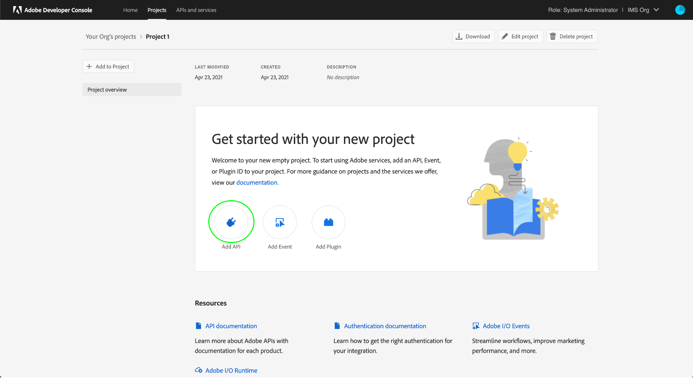
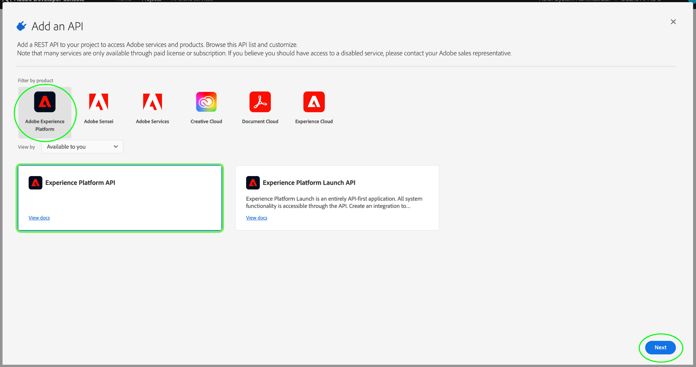
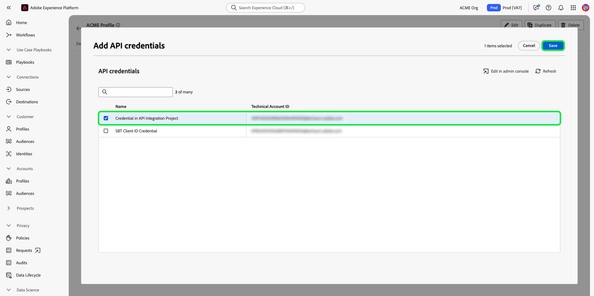

# Autenticazione e accesso alle API di Experience Platform

Questo documento spiega passo-passo come accedere a un account sviluppatore di Adobe Experience Platform per effettuare chiamate alle API di Experience Platform. Al termine di questa esercitazione, avrai generato o raccolto le seguenti credenziali, necessarie come intestazioni in tutte le chiamate API di Platform:

* `{ACCESS_TOKEN}`
* `{API_KEY}`
* `{ORG_ID}`

>[!TIP]
>
>Oltre alle tre credenziali di cui sopra, molte API di Platform richiedono anche una `{SANDBOX_NAME}` da fornire come intestazione. Consulta la [panoramica sulle sandbox](../sandboxes/home.md) per ulteriori informazioni sulle sandbox e [endpoint di gestione sandbox](/help/sandboxes/api/sandboxes.md#list) per informazioni sull’elenco delle sandbox disponibili per la tua organizzazione.

Per mantenere la sicurezza delle applicazioni e degli utenti, tutte le richieste alle API Experience Platform devono essere autenticate e autorizzate utilizzando standard come OAuth.

Questo tutorial illustra come raccogliere le credenziali necessarie per autenticare le chiamate API di Platform, come descritto nel diagramma di flusso seguente. È possibile raccogliere la maggior parte delle credenziali richieste nella configurazione iniziale una tantum. Il token di accesso, tuttavia, deve essere aggiornato ogni 24 ore.


## Prerequisiti {#prerequisites}

Per effettuare correttamente le chiamate alle API Experience Platform, è necessario disporre dei seguenti elementi:

* Organizzazione con accesso a Adobe Experience Platform.
* Un amministratore di Admin Console che può aggiungerti come sviluppatore e utente per un profilo di prodotto.

Per completare questa esercitazione è necessario disporre anche di un Adobe ID. Se non disponi di un’Adobe ID, puoi crearne una seguendo questi passaggi:

1. Vai a [Console Adobe Developer](https://console.adobe.io).
2. Seleziona **[!UICONTROL Crea un nuovo account]**.
3. Completa il processo di registrazione.

## Ottieni l’accesso di sviluppatori e utenti, ad Experience Platform {#gain-developer-user-access}

Prima di creare integrazioni su Adobe Developer Console, il tuo account deve disporre di autorizzazioni per sviluppatori e utenti per un profilo di prodotto di Experience Platform in Adobe Admin Console.

### Accesso per sviluppatori {#gain-developer-access}

Contatta un [!DNL Admin Console] per aggiungerti come sviluppatore a un profilo di prodotto di Experience Platform utilizzando [[!DNL Admin Console]](https://adminconsole.adobe.com/). Consulta la [!DNL Admin Console] documentazione per istruzioni specifiche su come [gestire l’accesso degli sviluppatori per i profili di prodotto](https://helpx.adobe.com/it/enterprise/admin-guide.html/enterprise/using/manage-developers.ug.html).

Una volta che ti è stato assegnato come sviluppatore, puoi iniziare a creare integrazioni in [Console Adobe Developer](https://www.adobe.com/go/devs_console_ui). Queste integrazioni sono una pipeline da app e servizi esterni alle API Adobe.

### Ottenere l’accesso utente {#gain-user-access}

Il tuo [!DNL Admin Console] l’amministratore deve anche aggiungerti come utente allo stesso profilo di prodotto. Consulta la guida su [gestione dei gruppi di utenti in [!DNL Admin Console]](https://helpx.adobe.com/enterprise/admin-guide.html/enterprise/using/user-groups.ug.html) per ulteriori informazioni.

## Generare una chiave API (ID client) e un ID organizzazione {#generate-credentials}

>[!NOTE]
>
>Se stai seguendo questo documento da [Guida all’API di Privacy Service](../privacy-service/api/getting-started.md), è ora possibile tornare a tale guida per generare le credenziali di accesso univoche per [!DNL Privacy Service].

Dopo aver ottenuto l’accesso a Platform da parte di sviluppatori e utenti tramite [!DNL Admin Console], il passaggio successivo consiste nel generare `{ORG_ID}` e `{API_KEY}` credenziali nella console Adobe Developer. Queste credenziali devono essere generate solo una volta e possono essere riutilizzate nelle chiamate API future di Platform.

### Aggiungere un Experience Platform a un progetto {#add-platform-to-project}

Vai a [Adobe Developer Console](https://www.adobe.com/go/devs_console_ui) e accedi con il tuo Adobe ID. Quindi, segui i passaggi descritti nel tutorial su [creazione di un progetto vuoto](https://developer.adobe.com/developer-console/docs/guides/projects/projects-empty/) nella documentazione della console Adobe Developer.

Dopo aver creato un nuovo progetto, seleziona **[!UICONTROL Aggiungi API]** il **[!UICONTROL Panoramica del progetto]** schermo.


Viene visualizzata la schermata **[!UICONTROL Add an API]** (Aggiungi un’API). Seleziona l’icona del prodotto per Adobe Experience Platform, quindi scegli **[!UICONTROL API EXPERIENCE PLATFORM]** prima di selezionare **[!UICONTROL Successivo]**.


>[!TIP]
>
>Seleziona la **[!UICONTROL Visualizza documenti]** per passare in una finestra del browser separata al [Documentazione di riferimento dell’API Experience Platform](https://developer.adobe.com/experience-platform-apis/).

### Seleziona il tipo di autenticazione server-to-server OAuth {#select-oauth-server-to-server}

Quindi, seleziona il tipo di autenticazione per generare token di accesso e accedere all’API Experience Platform.

>[!IMPORTANT]
>
>Seleziona la **[!UICONTROL OAuth Server-to-Server]** metodo as sarà l’unico metodo supportato per andare avanti. Il **[!UICONTROL Account di servizio (JWT)]** è obsoleto. Anche se le integrazioni che utilizzano il metodo di autenticazione JWT continueranno a funzionare fino al 1° gennaio 2025, Adobe consiglia vivamente di migrare le integrazioni esistenti al nuovo metodo server-to-server OAuth prima di tale data. Ulteriori informazioni nella sezione [!BADGE Obsoleto]{type=negative}[Generare un token web JSON (JWT)](#jwt).


### Selezionare i profili di prodotto per l’integrazione {#select-product-profiles}

Quindi, seleziona i profili di prodotto da applicare all’integrazione.
L’account di servizio della tua integrazione potrà accedere a funzioni granulari tramite i profili di prodotto selezionati qui.

Per accedere a determinate funzioni di Platform, è necessario disporre anche di un amministratore di sistema che ti conceda le autorizzazioni di controllo dell’accesso basate su attributi necessarie. Ulteriori informazioni nella sezione [Ottenere le autorizzazioni di controllo dell&#39;accesso basate su attributi necessarie](#get-abac-permissions).

>[!TIP]
>
Se prevedi di visualizzare un determinato profilo di prodotto qui, contatta l’amministratore di sistema. Gli amministratori di sistema possono visualizzare e gestire le credenziali API nella vista Autorizzazioni. Per ulteriori informazioni, consulta la sezione [Aggiungere sviluppatori al profilo di prodotto](#add-developers-to-product-profile).


Seleziona **[!UICONTROL Salva API configurata]** quando sei pronto.

Nell’esercitazione video seguente è disponibile anche una procedura dettagliata per configurare un’integrazione con l’API Experience Platform:

>[!VIDEO](https://video.tv.adobe.com/v/28832/?learn=on)

### Raccogli le credenziali {#gather-credentials}

Una volta aggiunta l’API al progetto, la **[!UICONTROL API EXPERIENCE PLATFORM]** Nella pagina del progetto vengono visualizzate le seguenti credenziali necessarie in tutte le chiamate alle API Experience Platform:


* `{API_KEY}` ([!UICONTROL ID client])
* `{ORG_ID}` ([!UICONTROL ID organizzazione])

<!--


<!--

In addition to the above credentials, you also need the generated **[!UICONTROL Client Secret]** for a future step. Select **[!UICONTROL Retrieve client secret]** to reveal the value, and then copy it for later use.


-->

## Generare un token di accesso {#generate-access-token}

Il passaggio successivo consiste nel generare un `{ACCESS_TOKEN}` credenziali da utilizzare nelle chiamate API di Platform. A differenza dei valori per `{API_KEY}` e `{ORG_ID}`, per continuare a utilizzare le API di Platform, è necessario generare un nuovo token ogni 24 ore. Seleziona **[!UICONTROL Genera token di accesso]**, come illustrato di seguito.


>[!TIP]
>
Puoi inoltre utilizzare un ambiente e una raccolta Postman per generare i token di accesso. Per ulteriori informazioni, consulta la sezione su [utilizzo di Postman per autenticare e testare le chiamate API](#use-postman).

## [!BADGE Obsoleto]{type=negative} genera un token web JSON (JWT) {#jwt}

>[!WARNING]
>
Il metodo JWT per generare i token di accesso è stato dichiarato obsoleto. Tutte le nuove integrazioni devono essere create utilizzando [Metodo di autenticazione server-to-server OAuth](#select-oauth-server-to-server). Adobe consiglia inoltre di migrare le integrazioni esistenti al metodo OAuth. Leggi la seguente documentazione importante:
> 
* [Guida alla migrazione per le applicazioni da JWT a OAuth](https://developer.adobe.com/developer-console/docs/guides/authentication/ServerToServerAuthentication/migration/)
* [Guida all’implementazione per applicazioni nuove e precedenti con OAuth](https://developer.adobe.com/developer-console/docs/guides/authentication/ServerToServerAuthentication/implementation/)
* [Vantaggi dell’utilizzo del metodo di credenziali server-to-server OAuth](https://developer.adobe.com/developer-console/docs/guides/authentication/ServerToServerAuthentication/migration/#why-oauth-server-to-server-credentials)

+++ Visualizza informazioni obsolete

Il passaggio successivo consiste nel generare un token web JSON (JWT) in base alle credenziali del tuo account. Questo valore viene utilizzato per generare il `{ACCESS_TOKEN}` credenziali da utilizzare nelle chiamate API di Platform, che devono essere rigenerate ogni 24 ore.

>[!IMPORTANT]
>
Ai fini di questa esercitazione, i passaggi seguenti descrivono come generare un JWT in Developer Console. Tuttavia, questo metodo di generazione dovrebbe essere utilizzato solo a fini di prova e valutazione.
>
Per un uso regolare, il JWT deve essere generato automaticamente. Per ulteriori informazioni su come generare JWT a livello di programmazione, consulta [guida all’autenticazione dell’account di servizio](https://www.adobe.io/developer-console/docs/guides/authentication/JWT/) su Adobe Developer.

Seleziona **[!UICONTROL Account di servizio (JWT)]** nel menu di navigazione a sinistra, seleziona quindi **[!UICONTROL Genera JWT]**.


Nella casella di testo fornita in **[!UICONTROL Generare un JWT personalizzato]**, incolla il contenuto della chiave privata generata in precedenza durante l’aggiunta dell’API Platform all’account del servizio. Quindi, seleziona **[!UICONTROL Genera token]**.


La pagina viene aggiornata per mostrare il JWT generato, insieme a un comando cURL di esempio che consente di generare un token di accesso. Ai fini del presente tutorial, seleziona **[!UICONTROL Copia]** accanto a **[!UICONTROL JWT generato]** per copiare il token negli Appunti.


**Generare un token di accesso**

Dopo aver generato un JWT, puoi utilizzarlo in una chiamata API per generare il tuo `{ACCESS_TOKEN}`. A differenza dei valori per `{API_KEY}` e `{ORG_ID}`, per continuare a utilizzare le API di Platform, è necessario generare un nuovo token ogni 24 ore.

**Richiesta**

La richiesta seguente genera un nuovo `{ACCESS_TOKEN}` in base alle credenziali fornite nel payload. Questo endpoint accetta solo i dati del modulo come payload, pertanto deve ricevere un `Content-Type` intestazione di `multipart/form-data`.

```shell
curl -X POST https://ims-na1.adobelogin.com/ims/exchange/jwt \
  -H 'Content-Type: multipart/form-data' \
  -F 'client_id={API_KEY}' \
  -F 'client_secret={SECRET}' \
  -F 'jwt_token={JWT}'
```

| Proprietà | Descrizione |
| --- | --- |
| `{API_KEY}` | Il `{API_KEY}` ([!UICONTROL ID client]) recuperate in un [passaggio precedente](#api-ims-secret). |
| `{SECRET}` | Il segreto client recuperato in un [passaggio precedente](#api-ims-secret). |
| `{JWT}` | Il JWT generato in un [passaggio precedente](#jwt). |

>[!NOTE]
>
Puoi utilizzare la stessa chiave API, lo stesso segreto client e lo stesso JWT per generare un nuovo token di accesso per ogni sessione. Questo consente di automatizzare la generazione dei token di accesso nelle applicazioni.

**Risposta**

```json
{
  "token_type": "bearer",
  "access_token": "{ACCESS_TOKEN}",
  "expires_in": 86399992
}
```

| Proprietà | Descrizione |
| --- | --- |
| `token_type` | Tipo di token restituito. Per i token di accesso questo valore è sempre `bearer`. |
| `access_token` | Il valore generato `{ACCESS_TOKEN}`. Questo valore è preceduto dalla parola `Bearer`, è richiesto in quanto `Authentication` intestazione per tutte le chiamate API di Platform. |
| `expires_in` | Il numero di millisecondi rimanenti fino alla scadenza del token di accesso. Quando questo valore raggiunge 0, è necessario generare un nuovo token di accesso per continuare a utilizzare le API di Platform. |

+++

## Verifica credenziali di accesso {#test-credentials}

Dopo aver raccolto tutte e tre le credenziali richieste (token di accesso, chiave API e ID organizzazione), puoi provare ad effettuare la seguente chiamata API. Questa chiamata elenca tutti gli standard [!DNL Experience Data Model] (XDM) classi disponibili per la tua organizzazione. Importare ed eseguire la chiamata in [Postman](#use-postman).

>[!BEGINSHADEBOX]

**Richiesta**

```SHELL
curl -X GET https://platform.adobe.io/data/foundation/schemaregistry/global/classes \
  -H 'Accept: application/vnd.adobe.xed-id+json' \
  -H 'Authorization: Bearer {{ACCESS_TOKEN}}' \
  -H 'x-api-key: {{API_KEY}}' \
  -H 'x-gw-ims-org-id: {{ORG_ID}}'
```

**Risposta**

Se la risposta è simile a quella mostrata di seguito, le credenziali sono valide e funzionanti. (La risposta è stata troncata per motivi di spazio).

```JSON
{
  "results": [
    {
        "title": "XDM ExperienceEvent",
        "$id": "https://ns.adobe.com/xdm/context/experienceevent",
        "meta:altId": "_xdm.context.experienceevent",
        "version": "1"
    },
    {
        "title": "XDM Individual Profile",
        "$id": "https://ns.adobe.com/xdm/context/profile",
        "meta:altId": "_xdm.context.profile",
        "version": "1"
    }
  ]
}
```

>[!ENDSHADEBOX]

>[!IMPORTANT]
>
Anche se la chiamata precedente è sufficiente per testare le credenziali di accesso, non sarà possibile accedere a diverse risorse o modificarle senza disporre delle autorizzazioni di controllo dell’accesso basate su attributi corrette. Per ulteriori informazioni, consulta [Ottenere le autorizzazioni di controllo dell&#39;accesso basate su attributi necessarie](#get-abac-permissions) sezione.

## Ottenere le autorizzazioni di controllo dell&#39;accesso basate su attributi necessarie {#get-abac-permissions}

Per accedere a o modificare diverse risorse all’interno di Experience Platform, è necessario disporre delle autorizzazioni di controllo di accesso appropriate. Gli amministratori di sistema possono concedere [autorizzazioni necessarie](/help/access-control/ui/permissions.md). Per ulteriori informazioni, consulta la sezione su [gestione delle credenziali API per un ruolo](/help/access-control/abac/ui/permissions.md#manage-api-credentials-for-role).

Informazioni dettagliate su come un amministratore di sistema può concedere le autorizzazioni necessarie per accedere alle risorse Platform tramite l’API sono disponibili anche nel tutorial video seguente:

>[!VIDEO](https://video.tv.adobe.com/v/28832/?learn=on&t=159)

## Utilizzare Postman per autenticare e testare le chiamate API {#use-postman}

[Postman](https://www.postman.com/) è uno strumento popolare che consente agli sviluppatori di esplorare e testare le API RESTful. Puoi utilizzare le raccolte e gli ambienti Postman di Experience Platform per velocizzare il lavoro con le API Experience Platform. Ulteriori informazioni su [utilizzo di Postman in Experience Platform](/help/landing/postman.md) e la guida introduttiva alle raccolte e agli ambienti.

Informazioni dettagliate sull’utilizzo di Postman con raccolte e ambienti di Experienci Platform sono disponibili anche nei tutorial video seguenti:

**Scaricare e importare un ambiente Postman da utilizzare con le API Experience Platform**

>[!VIDEO](https://video.tv.adobe.com/v/28832/?learn=on&t=106)

**Utilizzare una raccolta Postman per generare i token di accesso**

Scarica il file [Raccolta Postman del servizio Identity Management](https://github.com/adobe/experience-platform-postman-samples/tree/master/apis/ims) guarda il video seguente per scoprire come generare i token di accesso.

>[!VIDEO](https://video.tv.adobe.com/v/29698/?learn=on)

**Scarica raccolte Postman di API Experience Platform e interagisce con le API**

>[!VIDEO](https://video.tv.adobe.com/v/29704/?learn=on)

<!--
This [Medium post](https://medium.com/adobetech/using-postman-for-jwt-authentication-on-adobe-i-o-7573428ffe7f) describes how you can set up Postman to automatically perform JWT authentication and use it to consume Platform APIs.
-->

## Amministratori di sistema: concedere agli sviluppatori e al controllo dell’accesso API autorizzazioni Experience Platform {#grant-developer-and-api-access-control}

>[!NOTE]
>
Solo gli amministratori di sistema possono visualizzare e gestire le credenziali API in Autorizzazioni.

Prima di creare integrazioni su Adobe Developer Console, il tuo account deve disporre di autorizzazioni per sviluppatori e utenti per un profilo di prodotto di Experience Platform in Adobe Admin Console.

### Aggiungere sviluppatori al profilo di prodotto {#add-developers-to-product-profile}

Vai a [[!DNL Admin Console]](https://adminconsole.adobe.com/) e accedi con il tuo Adobe ID.

Seleziona **[!UICONTROL Prodotti]**, quindi seleziona **[!UICONTROL Adobe Experience Platform]** dall’elenco dei prodotti.


Dalla sezione **[!UICONTROL Profili di prodotto]** , seleziona **[!UICONTROL AEP-Default-All-Users]**. In alternativa, utilizza la barra di ricerca per cercare il profilo di prodotto inserendo il nome.


Seleziona la **[!UICONTROL Sviluppatori]** , quindi seleziona **[!UICONTROL Aggiungi sviluppatore]**.


Immetti il **[!UICONTROL E-mail o nome utente]**. Un valore valido [!UICONTROL E-mail o nome utente] visualizzerà i dettagli dello sviluppatore. Seleziona **[!UICONTROL Salva]**.


Lo sviluppatore è stato aggiunto correttamente e viene visualizzato nel [!UICONTROL Sviluppatori] scheda.


### Configurare un’API

Uno sviluppatore può aggiungere e configurare un’API all’interno di un progetto nella console Adobe Developer.

Seleziona il progetto, quindi seleziona **[!UICONTROL Aggiungi API]**.



In **[!UICONTROL Aggiungere un’API]** finestra di dialogo seleziona **[!UICONTROL Adobe Experience Platform]**, quindi seleziona **[!UICONTROL API EXPERIENCE PLATFORM]**.



In **[!UICONTROL Configurare API]** schermata, seleziona **[!UICONTROL AEP-Default-All-Users]**.

### Assegnare API a un ruolo

Un amministratore di sistema può assegnare le API ai ruoli nell’interfaccia utente di Experience Platform.

Seleziona **[!UICONTROL Autorizzazioni]** e il ruolo a cui desideri aggiungere l’API. Seleziona la **[!UICONTROL Credenziali API]** , quindi seleziona **[!UICONTROL Aggiungi credenziali API]**.


Seleziona l’API da aggiungere al ruolo, quindi seleziona **[!UICONTROL Salva]**.



Viene visualizzata di nuovo la [!UICONTROL Credenziali API] , in cui è elencata la nuova API aggiunta.


## Risorse aggiuntive {#additional-resources}

Per ulteriori informazioni introduttive sulle API di Experience Platform, consulta le risorse aggiuntive elencate di seguito

* [Autenticazione e accesso alle API di Experience Platform](https://experienceleague.adobe.com/docs/platform-learn/tutorials/platform-api-authentication.html?lang=it) pagina dei tutorial video
* [Raccolta Postman del servizio Identity Management](https://github.com/adobe/experience-platform-postman-samples/tree/master/apis/ims) per generare token di accesso
* [Raccolte Postman API di Experience Platform](https://github.com/adobe/experience-platform-postman-samples/tree/master/apis/experience-platform)

## Passaggi successivi {#next-steps}

Una volta letto questo documento, hai raccolto e verificato correttamente le credenziali di accesso per le API di Platform. Ora puoi seguire insieme agli esempi di chiamate API fornite in [documentazione](../landing/documentation/overview.md).

Oltre ai valori di autenticazione raccolti in questa esercitazione, molte API di Platform richiedono anche un `{SANDBOX_NAME}` da fornire come intestazione. Per ulteriori informazioni, consulta la [panoramica delle sandbox](../sandboxes/home.md).