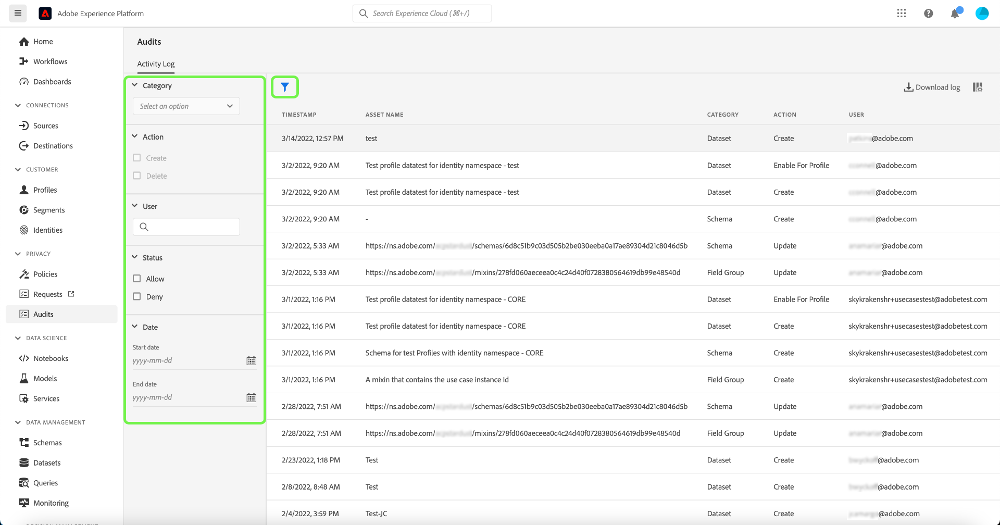

# Registri di controllo (beta)

>[!IMPORTANT]
>
>La funzione dei registri di controllo in Adobe Experience Platform è attualmente in versione beta e la tua organizzazione potrebbe non averne ancora accesso. La funzionalità descritta in questa documentazione è soggetta a modifiche.

Al fine di aumentare la trasparenza e la visibilità delle attività eseguite nel sistema, Adobe Experience Platform consente di controllare l’attività degli utenti per vari servizi e funzionalità sotto forma di &quot;registri di controllo&quot;. Questi registri formano un audit trail che può essere utile per risolvere i problemi su Platform e aiutare la tua azienda a rispettare efficacemente le politiche di gestione dei dati aziendali e i requisiti normativi.

In un senso semplice, un registro di controllo indica a **chi** ha eseguito l&#39;azione **cosa** e **quando**. Ogni azione registrata in un registro contiene metadati che indicano il tipo di azione, la data e l’ora, l’ID e-mail dell’utente che ha eseguito l’azione e gli attributi aggiuntivi relativi al tipo di azione.

Questo documento tratta i registri di controllo di Platform, incluso come visualizzarli e gestirli nell’interfaccia utente o nell’API.

## Tipi di eventi acquisiti dai registri di controllo {#category}

La tabella seguente indica le azioni sulle quali le risorse vengono registrate dai registri di controllo:

| Risorsa | Azioni |
| --- | --- |
| [Set di dati](../../../catalog/datasets/overview.md) | <ul><li>Creare</li><li>Aggiornamento</li><li>Elimina</li><li>Abilita per [Profilo cliente in tempo reale](../../../profile/home.md)</li></ul> |
| [Schema](../../../xdm/schema/composition.md) | <ul><li>Creare</li><li>Aggiornamento</li><li>Elimina</li></ul> |
| [Classe](../../../xdm/schema/composition.md#class) | <ul><li>Creare</li><li>Aggiornamento</li><li>Elimina</li></ul> |
| [Gruppo di campi](../../../xdm/schema/composition.md#field-group) | <ul><li>Creare</li><li>Aggiornamento</li><li>Elimina</li></ul> |
| [Tipo di dati](../../../xdm/schema/composition.md#data-type) | <ul><li>Creare</li><li>Aggiornamento</li><li>Elimina</li></ul> |
| [Sandbox](../../../sandboxes/home.md) | <ul><li>Creare</li><li>Aggiornamento</li><li>Ripristino</li><li>Elimina</li></ul> |
| [Destinazione](../../../destinations/home.md) | <ul><li>Attiva</li></ul> |

## Accesso ai registri di controllo

Quando la funzione è abilitata per l’organizzazione, i registri di controllo vengono raccolti automaticamente quando si verifica l’attività. Non è necessario abilitare manualmente la raccolta di registri.

Per visualizzare ed esportare i registri di controllo, devi disporre dell’autorizzazione di controllo accessi &quot;Visualizza registri di controllo&quot; (disponibile nella categoria &quot;Governance dei dati&quot;). Per informazioni su come gestire le autorizzazioni individuali per le funzionalità di Platform, consulta la [documentazione sul controllo degli accessi](../../../access-control/home.md).

## Gestione dei registri di controllo nell’interfaccia utente

Puoi visualizzare i registri di controllo per diverse funzioni di Experience Platform nell’area di lavoro **[!UICONTROL Audit]** nell’interfaccia utente di Platform. L&#39;area di lavoro mostra un elenco di registri registrati, ordinati per impostazione predefinita dalla più recente alla meno recente.

Il sistema visualizza solo i registri di controllo dell’ultimo anno. Tutti i registri che superano questo limite vengono rimossi automaticamente dal sistema.

Seleziona un evento dall’elenco per visualizzarne i dettagli nella barra a destra.

Seleziona l&#39;icona funnel () per visualizzare un elenco di controlli filtro per limitare i risultati.

Nell’interfaccia utente sono disponibili i seguenti filtri per gli eventi di controllo:

| Filtro | Descrizione |
| --- | --- |
| [!UICONTROL Categoria] | Utilizza il menu a discesa per filtrare i risultati visualizzati per [categoria](#category). |
| [!UICONTROL Azione] | Filtrare per azione. Attualmente è possibile filtrare solo le azioni [!UICONTROL Crea] e [!UICONTROL Elimina] . |
| [!UICONTROL Stato del controllo di accesso] | Filtrare in base al fatto che l&#39;azione sia stata consentita (completata) o negata a causa di autorizzazioni [controllo accessi](../../../access-control/home.md) insufficienti. |
| [!UICONTROL Data] | Seleziona una data di inizio e/o una data di fine per definire un intervallo di date in cui filtrare i risultati. |

Per rimuovere un filtro, seleziona la &quot;X&quot; sull&#39;icona della pillola relativa al filtro in questione oppure seleziona **[!UICONTROL Cancella tutto]** per rimuovere tutti i filtri.

<!-- (Planned for post-beta release)
### Export an audit log

Select **[!UICONTROL Download log]** to export an audit log.
-->

## Gestione dei registri di controllo nell’API

Tutte le azioni che puoi eseguire nell’interfaccia utente possono essere eseguite anche utilizzando le chiamate API. Per ulteriori informazioni, consulta il [documento di riferimento API](https://www.adobe.io/experience-platform-apis/references/audit-query/) .

## Gestione dei registri di controllo per Adobe Admin Console

Per informazioni su come gestire i registri di controllo per le attività in Adobe Admin Console, consulta il seguente [documento](https://helpx.adobe.com/enterprise/using/audit-logs.html).

## Passaggi successivi

Questa guida illustra come gestire i registri di controllo in Experience Platform. Per ulteriori informazioni su come monitorare le attività di Platform, consulta la documentazione su [Observability Insights](../../../observability/home.md) e [monitoraggio dell’inserimento dei dati](../../../ingestion/quality/monitor-data-ingestion.md).
