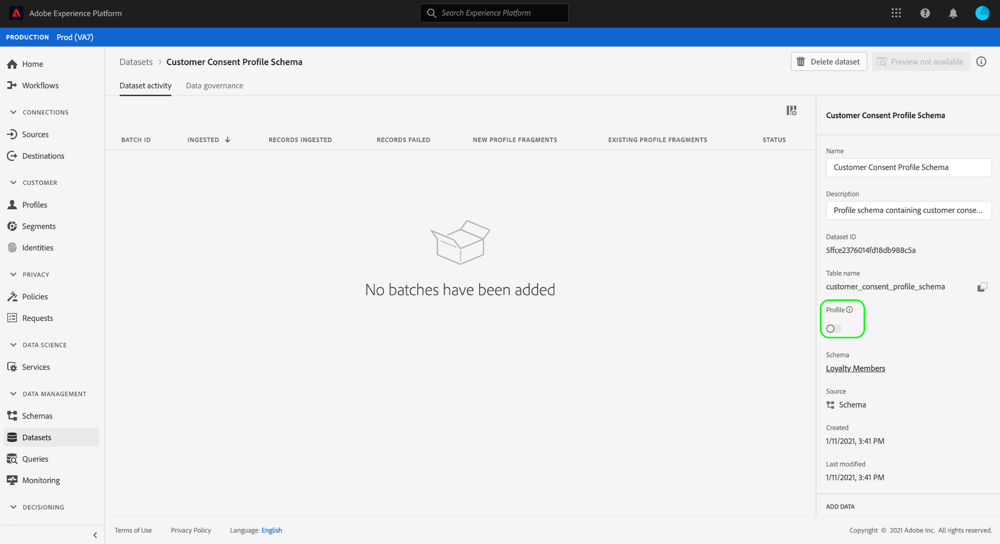

# Configurare un set di dati per acquisire dati su consenso e preferenze

Affinché Adobe Experience Platform possa elaborare i dati di consenso/preferenza del cliente, questi devono essere inviati a un set di dati il cui schema contiene campi relativi ai consensi e ad altre autorizzazioni. In particolare, questo set di dati deve essere basato su [!DNL XDM Individual Profile] e abilitato per l&#39;utilizzo in [!DNL Real-Time Customer Profile].

Questo documento descrive i passaggi per configurare un set di dati per elaborare i dati sul consenso in Experience Platform. Per una panoramica dell’intero flusso di lavoro per l’elaborazione dei dati di consenso/preferenza in Platform, consulta [panoramica sull’elaborazione del consenso](./overview.md).

>[!IMPORTANT]
>
>Gli esempi in questa guida utilizzano un set di campi standardizzati per rappresentare i valori del consenso del cliente, come definito da [[!UICONTROL Dettagli su consenso e preferenze] gruppo di campi schema](../../../../xdm/field-groups/profile/consents.md). La struttura di questi campi è volta a fornire un modello di dati efficiente per coprire molti casi d’uso comuni di raccolta del consenso.
>
>Tuttavia, puoi anche definire gruppi di campi personalizzati per rappresentare il consenso in base ai tuoi modelli di dati. Consulta il team legale per ottenere l’approvazione per un modello di dati sul consenso adatto alle tue esigenze aziendali, in base alle seguenti opzioni:
>
>* Il gruppo di campi del consenso standardizzato
>* Un gruppo di campi di consenso personalizzato creato dalla tua organizzazione
>* Una combinazione del gruppo di campi di consenso standardizzato e dei campi aggiuntivi forniti da un gruppo di campi di consenso personalizzato


## Prerequisiti

Questo tutorial richiede una buona conoscenza dei seguenti componenti di Adobe Experience Platform:

* [Experience Data Model (XDM)](../../../../xdm/home.md): il quadro standardizzato mediante il quale [!DNL Experience Platform] organizza i dati sull’esperienza del cliente.
   * [Nozioni di base sulla composizione dello schema](../../../../xdm/schema/composition.md): scopri gli elementi di base degli schemi XDM.
* [Profilo cliente in tempo reale](../../../../profile/home.md): consolida i dati dei clienti da origini diverse in una visualizzazione completa e unificata, offrendo al tempo stesso un conto fruibile e con marca temporale di ogni interazione con il cliente.

>[!IMPORTANT]
>
>Questa esercitazione presuppone che tu conosca [!DNL Profile] schema in Platform che desideri utilizzare per acquisire informazioni sugli attributi del cliente. Indipendentemente dal metodo utilizzato per raccogliere i dati sul consenso, questo schema deve essere [abilitato per Real-Time Customer Profile](../../../../xdm/ui/resources/schemas.md#profile). Inoltre, l’identità primaria dello schema non può essere un campo direttamente identificabile di cui non è consentito l’utilizzo in pubblicità basata su interessi, ad esempio un indirizzo e-mail. Se non sei sicuro di quali campi sono soggetti a restrizioni, rivolgiti al tuo consulente legale.

## [!UICONTROL Dettagli su consenso e preferenze] struttura del gruppo di campi {#structure}

Il [!UICONTROL Dettagli su consenso e preferenze] gruppo di campi fornisce campi di consenso standardizzati a uno schema. Attualmente, questo gruppo di campi è compatibile solo con schemi basati su [!DNL XDM Individual Profile] classe.

Il gruppo di campi fornisce un singolo campo di tipo oggetto, `consents`, le cui sottoproprietà acquisiscono un set di campi di consenso standardizzati. Il seguente codice JSON è un esempio del tipo di dati `consents` si aspetta di ottenere, al momento dell’acquisizione dei dati:

```json
{
  "consents": {
    "collect": {
      "val": "y",
    },
    "share": {
      "val": "y",
    },
    "personalize": {
      "content": {
        "val": "y"
      }
    },
    "marketing": {
      "preferred": "email",
      "any": {
        "val": "y"
      },
      "push": {
        "val": "n",
        "reason": "Too Frequent",
        "time": "2019-01-01T15:52:25+00:00"
      }
    },
    "idSpecific": {
      "email": {
        "jdoe@example.com": {
          "marketing": {
            "email": {
              "val": "n"
            }
          }
        }
      }
    }
  },
  "metadata": {
    "time": "2019-01-01T15:52:25+00:00"
  }
}
```

>[!NOTE]
>
>Per ulteriori informazioni sulla struttura e sul significato delle sottoproprietà in `consents`, consulta la panoramica sul [[!UICONTROL Dettagli su consenso e preferenze] gruppo di campi](../../../../xdm/field-groups/profile/consents.md).

## Aggiungi gruppi di campi obbligatori al tuo [!DNL Profile] schema {#add-field-group}

Per raccogliere i dati sul consenso utilizzando lo standard Adobe, è necessario disporre di uno schema abilitato per il profilo che contiene i due gruppi di campi seguenti:

* [!UICONTROL Dettagli su consenso e preferenze]
* [!UICONTROL IdentityMap] (richiesto se si utilizza Platform Web SDK o Mobile SDK per inviare segnali di consenso)

Nell’interfaccia utente di Platform, seleziona **[!UICONTROL Schemi]** nel menu di navigazione a sinistra, seleziona quindi **[!UICONTROL Sfoglia]** per visualizzare un elenco degli schemi esistenti. Da qui, seleziona il nome del [!DNL Profile]schema abilitato a cui desideri aggiungere campi di consenso. Le schermate in questa sezione utilizzano lo schema &quot;Membri fedeltà&quot; integrato in [tutorial sulla creazione di schemi](../../../../xdm/tutorials/create-schema-ui.md) come esempio.


>[!TIP]
>
>Puoi utilizzare le funzionalità di ricerca e filtro dell’area di lavoro per trovare più facilmente lo schema. Consulta la guida su [esplorazione delle risorse XDM](../../../../xdm/ui/explore.md) per ulteriori informazioni.

Il [!DNL Schema Editor] viene visualizzata, mostrando la struttura dello schema nell&#39;area di lavoro. Sul lato sinistro dell’area di lavoro, seleziona **[!UICONTROL Aggiungi]** sotto **[!UICONTROL Gruppi di campi]** sezione.


Il **[!UICONTROL Aggiungi gruppo di campi]** viene visualizzata. Da qui, seleziona **[!UICONTROL Dettagli su consenso e preferenze]** dall&#39;elenco. Facoltativamente, è possibile utilizzare la barra di ricerca per limitare i risultati in modo da individuare più facilmente il gruppo di campi.


Quindi, trova il **[!UICONTROL IdentityMap]** dall&#39;elenco e selezionarlo. Una volta elencati entrambi i gruppi di campi nella barra a destra, seleziona **[!UICONTROL Aggiungi gruppi di campi]**.


L’area di lavoro viene visualizzata nuovamente, mostrando che il `consents` e `identityMap` I campi sono stati aggiunti alla struttura dello schema. Se hai bisogno di campi di consenso e preferenze aggiuntivi non acquisiti dal gruppo di campi standard, consulta la sezione dell’appendice su [aggiunta di campi di consenso e preferenze personalizzati allo schema](#custom-consent). In caso contrario, seleziona **[!UICONTROL Salva]** per finalizzare le modifiche allo schema.


>[!IMPORTANT]
>
>Se stai creando un nuovo schema o modificando uno schema esistente non abilitato per Profilo, devi [abilita lo schema per il profilo](../../../../xdm/ui/resources/schemas.md#profile) prima del salvataggio.

Se lo schema modificato viene utilizzato da [!UICONTROL Set di dati profilo] specificato nel flusso di dati dell’SDK per web di Platform, tale set di dati includerà ora i nuovi campi di consenso. Ora puoi tornare al [guida all’elaborazione del consenso](./overview.md#merge-policies) per continuare la procedura di configurazione di Experience Platform per elaborare i dati sul consenso. Se non hai creato un set di dati per questo schema, segui i passaggi descritti nella sezione successiva.

## Creare un set di dati in base allo schema di consenso {#dataset}

Dopo aver creato uno schema con campi di consenso, devi creare un set di dati che alla fine acquisirà i dati di consenso dei clienti. Questo set di dati deve essere abilitato per [!DNL Real-Time Customer Profile].

Per iniziare, seleziona **[!UICONTROL Set di dati]** nel menu di navigazione a sinistra, seleziona quindi **[!UICONTROL Crea set di dati]** in alto a destra.


Nella pagina successiva, seleziona **[!UICONTROL Crea set di dati dallo schema]**.


Il **[!UICONTROL Crea set di dati dallo schema]** viene visualizzato il flusso di lavoro, a partire dal **[!UICONTROL Seleziona schema]** passaggio. Nell’elenco fornito, individua uno degli schemi di consenso creati in precedenza. Facoltativamente, puoi utilizzare la barra di ricerca per limitare i risultati e individuare più facilmente lo schema. Seleziona il pulsante di opzione accanto allo schema desiderato, quindi seleziona **[!UICONTROL Successivo]** per continuare.


Il **[!UICONTROL Configurare il set di dati]** viene visualizzato il passaggio. Fornisci un nome e una descrizione univoci e facilmente identificabili per il set di dati prima di selezionarlo **[!UICONTROL Fine]**.


Viene visualizzata la pagina dei dettagli per il set di dati appena creato. Se il set di dati si basa sullo schema della serie temporale, il processo è completo. Se il set di dati si basa sullo schema del record, il passaggio finale nel processo consiste nell’abilitare il set di dati per l’utilizzo in [!DNL Real-Time Customer Profile].

Nella barra a destra, seleziona la **[!UICONTROL Profilo]** attivare/disattivare.



Infine, seleziona **[!UICONTROL Abilita]** nel messaggio di conferma per abilitare lo schema per [!DNL Profile].


Il set di dati ora è salvato e abilitato per l’utilizzo in [!DNL Profile]. Se intendi utilizzare Platform Web SDK per inviare i dati del consenso al profilo, devi selezionare questo set di dati come [!UICONTROL Set di dati profilo] durante la configurazione [flusso di dati](../../../../edge/datastreams/overview.md).

## Passaggi successivi

Seguendo questa esercitazione, hai aggiunto campi di consenso a una [!DNL Profile]Schema abilitato, il cui set di dati verrà utilizzato per acquisire i dati del consenso utilizzando Platform Web SDK o per l’acquisizione diretta di XDM.

Ora puoi tornare al [panoramica sull’elaborazione del consenso](./overview.md#merge-policies) per continuare a configurare l’Experience Platform per elaborare i dati sul consenso.

## Appendice

La sezione seguente contiene informazioni aggiuntive sulla creazione di un set di dati per acquisire i dati di consenso e preferenze del cliente.

### Aggiungere campi di consenso e preferenze personalizzati allo schema {#custom-consent}

Se devi acquisire segnali di consenso aggiuntivi al di fuori di quelli rappresentati dallo standard [!UICONTROL Dettagli su consenso e preferenze] gruppo di campi, puoi utilizzare componenti XDM personalizzati per migliorare lo schema di consenso in base a specifiche esigenze aziendali. Questa sezione illustra i principi di base per personalizzare lo schema di consenso al fine di acquisire questi segnali in Profile.

>[!IMPORTANT]
>
>Platform Web SDK e Mobile SDK non supportano i campi personalizzati nei loro comandi di modifica del consenso. Attualmente l’unico modo per acquisire i campi di consenso personalizzati nel profilo è tramite [acquisizione batch](../../../../ingestion/batch-ingestion/overview.md) o un [connessione sorgente](../../../../sources/home.md).

Si consiglia vivamente di utilizzare [!UICONTROL Dettagli su consenso e preferenze] gruppo di campi come base per la struttura dei dati sul consenso e aggiungi ulteriori campi, in base alle esigenze, anziché tentare di creare l’intera struttura da zero.

Per aggiungere campi personalizzati alla struttura di un gruppo di campi standard, è innanzitutto necessario creare un gruppo di campi personalizzato. Dopo aver aggiunto [!UICONTROL Dettagli su consenso e preferenze] gruppo di campi allo schema, seleziona il **più (+)** icona in **[!UICONTROL Gruppi di campi]** e quindi selezionare **[!UICONTROL Crea nuovo gruppo di campi]**. Specificare un nome e una descrizione facoltativa per il gruppo di campi, quindi selezionare **[!UICONTROL Aggiungi gruppo di campi]**.


Il [!DNL Schema Editor] viene nuovamente visualizzato con il nuovo gruppo di campi personalizzato selezionato nella barra a sinistra. Nell&#39;area di lavoro vengono visualizzati i controlli che consentono di aggiungere campi personalizzati alla struttura dello schema. Per aggiungere un nuovo campo di consenso o preferenza, seleziona la **più (+)** accanto al simbolo `consents` oggetto.


Un nuovo campo viene visualizzato all&#39;interno del `consents` oggetto. Poiché stai aggiungendo un campo personalizzato a un oggetto XDM standard, il nuovo campo viene creato in un oggetto namespace all’ID tenant.


Nella barra a destra sotto **[!UICONTROL Proprietà campo]**, fornisci un nome e una descrizione per il campo. Quando si seleziona il campo **[!UICONTROL Tipo]**, devi utilizzare il tipo di dati standard appropriato per un campo di consenso o preferenza personalizzato:

* [[!UICONTROL Campo di consenso generico]](../../../../xdm/data-types/consent-field.md)
* [[!UICONTROL Campo preferenza di marketing generica]](../../../../xdm/data-types/marketing-field.md)
* [[!UICONTROL Campo preferenza di marketing generica con abbonamenti]](../../../../xdm/data-types/marketing-field-subscriptions.md)
* [[!UICONTROL Campo preferenza di personalizzazione generica]](../../../../xdm/data-types/personalization-field.md)

Al termine, seleziona **[!UICONTROL Applica]**.


Il campo di consenso o preferenza viene aggiunto alla struttura dello schema. Tieni presente che [!UICONTROL Percorso] nella barra a destra contiene `_tenantId` spazio dei nomi. Questo spazio dei nomi deve essere incluso ogni volta che si fa riferimento al percorso di questo campo nelle operazioni sui dati.


Segui i passaggi precedenti per continuare ad aggiungere i campi di consenso e preferenze necessari. Al termine, seleziona **[!UICONTROL Salva]** per confermare le modifiche.

Se non hai creato un set di dati per questo schema, continua con la sezione su [creazione di un set di dati](#dataset).
