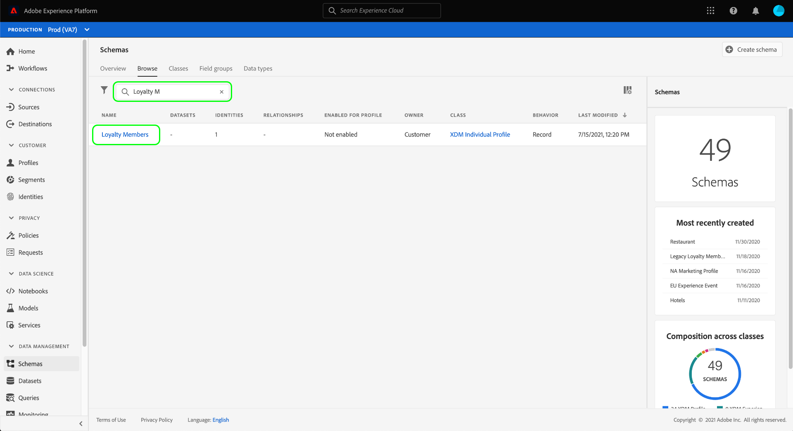

# Configurare un set di dati per acquisire dati su consenso e preferenze

Affinché Adobe Experience Platform possa elaborare i dati di consenso/preferenza del cliente, questi devono essere inviati a un set di dati il cui schema contiene campi relativi ai consensi e ad altre autorizzazioni. In particolare, questo set di dati deve essere basato sulla classe [!DNL XDM Individual Profile] e abilitato per l&#39;utilizzo in [!DNL Real-Time Customer Profile].

Questo documento descrive i passaggi per configurare un set di dati per elaborare i dati sul consenso in Experience Platform. Per una panoramica del flusso di lavoro completo per l&#39;elaborazione dei dati di consenso/preferenza in Platform, consulta la [panoramica sull&#39;elaborazione del consenso](./overview.md).

>[!IMPORTANT]
>
>Gli esempi in questa guida utilizzano un set di campi standardizzati per rappresentare i valori del consenso del cliente, come definito dal gruppo di campi dello schema [[!UICONTROL Dettagli sul consenso e sulle preferenze]](../../../../xdm/field-groups/profile/consents.md). La struttura di questi campi è volta a fornire un modello di dati efficiente per coprire molti casi d’uso comuni di raccolta del consenso.
>
>Tuttavia, puoi anche definire gruppi di campi personalizzati per rappresentare il consenso in base ai tuoi modelli di dati. Consulta il team legale per ottenere l’approvazione per un modello di dati sul consenso adatto alle tue esigenze aziendali, in base alle seguenti opzioni:
>
>* Il gruppo di campi del consenso standardizzato
>* Un gruppo di campi di consenso personalizzato creato dalla tua organizzazione
>* Una combinazione del gruppo di campi di consenso standardizzato e dei campi aggiuntivi forniti da un gruppo di campi di consenso personalizzato

## Prerequisiti

Questo tutorial richiede una buona conoscenza dei seguenti componenti di Adobe Experience Platform:

* [Experience Data Model (XDM)](../../../../xdm/home.md): framework standardizzato tramite il quale [!DNL Experience Platform] organizza i dati sull&#39;esperienza del cliente.
   * [Nozioni di base sulla composizione dello schema](../../../../xdm/schema/composition.md): scopri i blocchi predefiniti di base degli schemi XDM.
* [Profilo cliente in tempo reale](../../../../profile/home.md): consolida i dati dei clienti da origini diverse in una visualizzazione completa e unificata, offrendo al contempo un account utilizzabile e con marca temporale per ogni interazione con il cliente.

>[!IMPORTANT]
>
>Questo tutorial presuppone che tu conosca lo schema [!DNL Profile] in Platform che desideri utilizzare per acquisire le informazioni sugli attributi del cliente. Indipendentemente dal metodo utilizzato per raccogliere i dati sul consenso, questo schema deve essere [abilitato per Real-Time Customer Profile](../../../../xdm/ui/resources/schemas.md#profile). Inoltre, l’identità primaria dello schema non può essere un campo direttamente identificabile di cui non è consentito l’utilizzo in pubblicità basata su interessi, ad esempio un indirizzo e-mail. Se non sei sicuro di quali campi sono soggetti a restrizioni, rivolgiti al tuo consulente legale.

## [!UICONTROL Dettagli sul consenso e sulle preferenze] struttura del gruppo di campi {#structure}

Il gruppo di campi [!UICONTROL Dettagli consenso e preferenze] fornisce campi di consenso standardizzati a uno schema. Attualmente, questo gruppo di campi è compatibile solo con schemi basati sulla classe [!DNL XDM Individual Profile].

Il gruppo di campi fornisce un singolo campo di tipo oggetto, `consents`, le cui sottoproprietà acquisiscono un set di campi di consenso standardizzati. Il seguente codice JSON è un esempio del tipo di dati previsto da `consents` al momento dell&#39;acquisizione dei dati:

```json
{
  "consents": {
    "collect": {
      "val": "y",
    },
    "share": {
      "val": "y",
    },
    "personalize": {
      "content": {
        "val": "y"
      }
    },
    "marketing": {
      "preferred": "email",
      "any": {
        "val": "y"
      },
      "push": {
        "val": "n",
        "reason": "Too Frequent",
        "time": "2019-01-01T15:52:25+00:00"
      }
    },
    "idSpecific": {
      "email": {
        "jdoe@example.com": {
          "marketing": {
            "email": {
              "val": "n"
            }
          }
        }
      }
    }
  },
  "metadata": {
    "time": "2019-01-01T15:52:25+00:00"
  }
}
```

>[!NOTE]
>
>Per ulteriori informazioni sulla struttura e sul significato delle sottoproprietà in `consents`, vedere la panoramica sul gruppo di campi [[!UICONTROL Dettagli sul consenso e sulle preferenze]](../../../../xdm/field-groups/profile/consents.md).

## Aggiungi i gruppi di campi richiesti allo schema [!DNL Profile] {#add-field-group}

Per raccogliere i dati sul consenso utilizzando lo standard Adobe, è necessario disporre di uno schema abilitato per il profilo che contiene i due gruppi di campi seguenti:

* [[!UICONTROL Dettagli su consenso e preferenze]](../../../../xdm/field-groups/profile/consents.md)
* [[!UICONTROL IdentityMap]](../../../../xdm/field-groups/profile/identitymap.md) (richiesto se si utilizza Platform Web SDK o Mobile SDK per inviare segnali di consenso)

Nell&#39;interfaccia utente di Platform, seleziona **[!UICONTROL Schemi]** nell&#39;area di navigazione a sinistra, quindi seleziona la scheda **[!UICONTROL Sfoglia]** per visualizzare un elenco degli schemi esistenti. Da qui, seleziona il nome dello schema abilitato per [!DNL Profile] a cui desideri aggiungere i campi del consenso. Le schermate di questa sezione utilizzano lo schema &quot;Membri fedeltà&quot; creato nell&#39;esercitazione [sulla creazione dello schema](../../../../xdm/tutorials/create-schema-ui.md) come esempio.



>[!TIP]
>
>Puoi utilizzare le funzionalità di ricerca e filtro dell’area di lavoro per trovare più facilmente lo schema. Per ulteriori informazioni, consulta la guida sull&#39;[esplorazione delle risorse XDM](../../../../xdm/ui/explore.md).

Viene visualizzato [!DNL Schema Editor], che mostra la struttura dello schema nell&#39;area di lavoro. Sul lato sinistro dell&#39;area di lavoro, selezionare **[!UICONTROL Aggiungi]** nella sezione **[!UICONTROL Gruppi di campi]**.


Viene visualizzata la finestra di dialogo **[!UICONTROL Aggiungi gruppo di campi]**. Da qui, seleziona **[!UICONTROL Dettagli di consenso e preferenze]** dall&#39;elenco. Facoltativamente, è possibile utilizzare la barra di ricerca per limitare i risultati in modo da individuare più facilmente il gruppo di campi.


Individuare quindi il gruppo di campi **[!UICONTROL IdentityMap]** dall&#39;elenco e selezionarlo. Dopo aver elencato entrambi i gruppi di campi nella barra a destra, seleziona **[!UICONTROL Aggiungi gruppi di campi]**.


L&#39;area di lavoro viene nuovamente visualizzata, mostrando che i campi `consents` e `identityMap` sono stati aggiunti alla struttura dello schema. Se hai bisogno di campi di consenso e preferenze aggiuntivi non acquisiti dal gruppo di campi standard, consulta la sezione dell&#39;appendice sull&#39;[aggiunta di campi di consenso e preferenze personalizzati allo schema](#custom-consent). In caso contrario, selezionare **[!UICONTROL Salva]** per finalizzare le modifiche allo schema.


>[!IMPORTANT]
>
>Se si crea un nuovo schema o si modifica uno schema esistente non abilitato per il profilo, è necessario [abilitare lo schema per il profilo](../../../../xdm/ui/resources/schemas.md#profile) prima di salvare.

Se lo schema modificato è utilizzato dal [!UICONTROL set di dati profilo] specificato nel flusso di dati di Platform Web SDK, il set di dati includerà ora i nuovi campi di consenso. Ora puoi tornare alla [guida all&#39;elaborazione del consenso](./overview.md#merge-policies) per continuare la procedura di configurazione dell&#39;Experience Platform per l&#39;elaborazione dei dati sul consenso. Se non hai creato un set di dati per questo schema, segui i passaggi descritti nella sezione successiva.

## Creare un set di dati in base allo schema di consenso {#dataset}

Dopo aver creato uno schema con campi di consenso, devi creare un set di dati che alla fine acquisirà i dati di consenso dei clienti. Questo set di dati deve essere abilitato per [!DNL Real-Time Customer Profile].

Per iniziare, seleziona **[!UICONTROL Set di dati]** nell&#39;area di navigazione a sinistra, quindi seleziona **[!UICONTROL Crea set di dati]** nell&#39;angolo in alto a destra.


Nella pagina successiva, seleziona **[!UICONTROL Crea set di dati dallo schema]**.


Viene visualizzato il flusso di lavoro **[!UICONTROL Crea set di dati dallo schema]** a partire dal passaggio **[!UICONTROL Seleziona schema]**. Nell’elenco fornito, individua uno degli schemi di consenso creati in precedenza. Facoltativamente, puoi utilizzare la barra di ricerca per limitare i risultati e individuare più facilmente lo schema. Seleziona il pulsante di scelta accanto allo schema desiderato, quindi seleziona **[!UICONTROL Successivo]** per continuare.


Viene visualizzato il passaggio **[!UICONTROL Configura set di dati]**. Fornisci un nome e una descrizione univoci e facilmente identificabili per il set di dati prima di selezionare **[!UICONTROL Fine]**.


Viene visualizzata la pagina dei dettagli per il set di dati appena creato. Se il set di dati si basa sullo schema della serie temporale, il processo è completo. Se il set di dati è basato sullo schema del record, il passaggio finale nel processo consiste nell&#39;abilitare il set di dati per l&#39;utilizzo in [!DNL Real-Time Customer Profile].

Nella barra a destra, seleziona l&#39;opzione **[!UICONTROL Profilo]**.


Infine, selezionare **[!UICONTROL Abilita]** nel popover di conferma per abilitare lo schema per [!DNL Profile].


Il set di dati è ora salvato e abilitato per l&#39;utilizzo in [!DNL Profile]. Se intendi utilizzare Platform Web SDK per inviare i dati del consenso al profilo, seleziona questo set di dati come [!UICONTROL Set di dati profilo] durante la configurazione dello [stream di dati](../../../../datastreams/overview.md).

## Passaggi successivi

Seguendo questa esercitazione, hai aggiunto dei campi di consenso a uno schema abilitato per [!DNL Profile], il cui set di dati verrà utilizzato per acquisire i dati di consenso utilizzando Platform Web SDK o l&#39;acquisizione diretta di XDM.

Ora puoi tornare alla [panoramica sull&#39;elaborazione del consenso](./overview.md#merge-policies) per continuare a configurare l&#39;Experience Platform per l&#39;elaborazione dei dati sul consenso.

## Appendice

La sezione seguente contiene informazioni aggiuntive sulla creazione di un set di dati per acquisire i dati di consenso e preferenze del cliente.

### Aggiungere campi di consenso e preferenze personalizzati allo schema {#custom-consent}

Se devi acquisire segnali di consenso aggiuntivi al di fuori di quelli rappresentati dal gruppo di campi standard [!UICONTROL Dettagli consenso e preferenze], puoi utilizzare componenti XDM personalizzati per migliorare lo schema di consenso in base alle tue esigenze aziendali specifiche. Questa sezione illustra i principi di base per personalizzare lo schema di consenso al fine di acquisire questi segnali in Profile.

>[!IMPORTANT]
>
>Platform Web SDK e Mobile SDK non supportano i campi personalizzati nei loro comandi di modifica del consenso. Attualmente, l&#39;unico modo per acquisire i campi di consenso personalizzati nel profilo è tramite [acquisizione batch](../../../../ingestion/batch-ingestion/overview.md) o una [connessione sorgente](../../../../sources/home.md).

Ti consigliamo vivamente di utilizzare il gruppo di campi [!UICONTROL Dettagli consenso e preferenze] come base di riferimento per la struttura dei dati sul consenso e di aggiungere altri campi in base alle esigenze, anziché tentare di creare l&#39;intera struttura da zero.

Per aggiungere campi personalizzati alla struttura di un gruppo di campi standard, è innanzitutto necessario creare un gruppo di campi personalizzato. Dopo aver aggiunto il gruppo di campi [!UICONTROL Dettagli consenso e preferenze] allo schema, seleziona l&#39;icona **più (+)** nella sezione **[!UICONTROL Gruppi di campi]**, quindi seleziona **[!UICONTROL Crea nuovo gruppo di campi]**. Fornire un nome e una descrizione facoltativa per il gruppo di campi, quindi selezionare **[!UICONTROL Aggiungi gruppo di campi]**.


[!DNL Schema Editor] viene nuovamente visualizzato con il nuovo gruppo di campi personalizzato selezionato nella barra a sinistra. Nell&#39;area di lavoro vengono visualizzati i controlli che consentono di aggiungere campi personalizzati alla struttura dello schema. Per aggiungere un nuovo campo di consenso o preferenza, selezionare l&#39;icona **più (+)** accanto all&#39;oggetto `consents`.


Verrà visualizzato un nuovo campo all&#39;interno dell&#39;oggetto `consents`. Poiché stai aggiungendo un campo personalizzato a un oggetto XDM standard, il nuovo campo viene creato in un oggetto namespace all’ID tenant.


Nella barra a destra di **[!UICONTROL Proprietà campo]**, fornisci un nome e una descrizione per il campo. Quando selezioni il **[!UICONTROL Tipo]** del campo, devi utilizzare il tipo di dati standard appropriato per un campo di consenso o preferenza personalizzato:

* [[!UICONTROL Campo di consenso generico]](../../../../xdm/data-types/consent-field.md)
* [[!UICONTROL Campo preferenza marketing generico]](../../../../xdm/data-types/marketing-field.md)
* [[!UICONTROL Campo preferenza di marketing generico con abbonamenti]](../../../../xdm/data-types/marketing-field-subscriptions.md)
* [[!UICONTROL Campo preferenza Personalization generico]](../../../../xdm/data-types/personalization-field.md)

Al termine, selezionare **[!UICONTROL Applica]**.


Il campo di consenso o preferenza viene aggiunto alla struttura dello schema. Il [!UICONTROL Percorso] visualizzato nella barra a destra contiene lo spazio dei nomi `_tenantId`. Questo spazio dei nomi deve essere incluso ogni volta che si fa riferimento al percorso di questo campo nelle operazioni sui dati.


Segui i passaggi precedenti per continuare ad aggiungere i campi di consenso e preferenze necessari. Al termine, seleziona **[!UICONTROL Salva]** per confermare le modifiche.

Se non hai creato un set di dati per questo schema, continua con la sezione sulla [creazione di un set di dati](#dataset).
