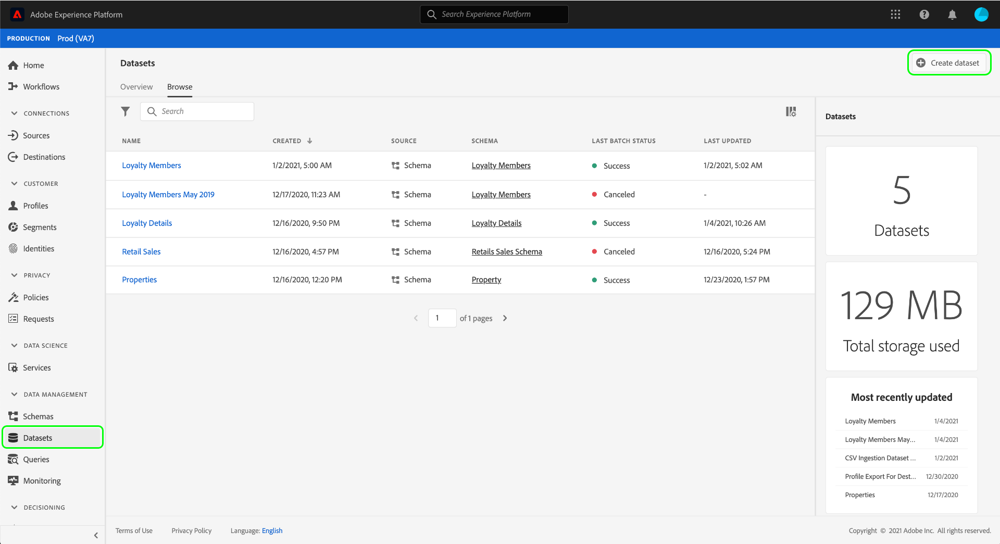

# Configurare un set di dati per acquisire dati di consenso e preferenza

Affinché Adobe Experience Platform possa elaborare i dati di consenso o preferenza dei clienti, questi devono essere inviati a un set di dati il cui schema contiene campi relativi ai consensi e ad altre autorizzazioni. In particolare, questo set di dati deve essere basato sulla classe [!DNL XDM Individual Profile] e deve essere abilitato per l&#39;utilizzo in [!DNL Real-time Customer Profile].

Questo documento fornisce passaggi per la configurazione di un set di dati per elaborare i dati di consenso in Experience Platform. Per una panoramica dell’intero flusso di lavoro per l’elaborazione dei dati di consenso/preferenza in Platform, consulta la [panoramica sull’elaborazione del consenso](./overview.md).

>[!IMPORTANT]
>
>Gli esempi in questa guida utilizzano un set standardizzato di campi per rappresentare i valori di consenso dei clienti, come definito dal tipo di dati [Consensi e preferenze XDM](../../../../xdm/data-types/consents.md). La struttura di questi campi è intesa a fornire un modello di dati efficiente che copra molti casi d’uso comuni per la raccolta del consenso.
>
>Tuttavia, puoi anche definire gruppi di campi personalizzati per rappresentare il consenso in base ai tuoi modelli di dati. Consulta il tuo team legale per ottenere l’approvazione per un modello di dati di consenso adatto alle tue esigenze aziendali, in base alle seguenti opzioni:
>
>* Gruppo di campi di consenso standardizzato
>* Un gruppo di campi di consenso personalizzato creato dalla tua organizzazione
>* Combinazione del gruppo di campi di consenso standardizzato e dei campi aggiuntivi forniti da un gruppo di campi di consenso personalizzato


## Prerequisiti

Questa esercitazione richiede una buona comprensione dei seguenti componenti di Adobe Experience Platform:

* [Experience Data Model (XDM)](../../../../xdm/home.md): Il framework standardizzato in base al quale  [!DNL Experience Platform] vengono organizzati i dati sulla customer experience.
   * [Nozioni di base sulla composizione](../../../../xdm/schema/composition.md) dello schema: Scopri i blocchi di base degli schemi XDM.
* [Profilo](../../../../profile/home.md) cliente in tempo reale: Consolida i dati dei clienti provenienti da fonti diverse in una visualizzazione completa e unificata, offrendo al tempo stesso un account utilizzabile e con marca temporale per ogni interazione con il cliente.

>[!IMPORTANT]
>
>Questa esercitazione presuppone che tu conosca lo schema [!DNL Profile] in Platform che desideri utilizzare per acquisire le informazioni sugli attributi del cliente. Indipendentemente dal metodo utilizzato per raccogliere i dati di consenso, questo schema deve essere [abilitato per Profilo cliente in tempo reale](../../../../xdm/ui/resources/schemas.md#profile). Inoltre, l&#39;identità principale dello schema non può essere un campo direttamente identificabile che non è consentito utilizzare nella pubblicità basata sugli interessi, ad esempio un indirizzo e-mail. Consulta il tuo consulente legale se non sei sicuro di quali campi siano soggetti a restrizioni.

## Struttura del gruppo di campi Consensi e Preferenze {#structure}

Il gruppo di campi [!UICONTROL Privacy/Personalization/Marketing Preferences (Consents)] (in seguito denominato &quot;gruppo di campi Consensi e Preferenze&quot;) fornisce campi di consenso standardizzati a uno schema. Attualmente, questo gruppo di campi è compatibile solo con schemi basati sulla classe [!DNL XDM Individual Profile] .

Il gruppo di campi fornisce un singolo campo di tipo oggetto, `consents`, le cui sottoproprietà acquisiscono un set di campi di consenso standardizzati. Il seguente JSON è un esempio del tipo di dati che `consents` prevede durante l’inserimento dei dati:

```json
{
  "consents": {
    "collect": {
      "val": "y",
    },
    "share": {
      "val": "y",
    },
    "personalize": {
      "content": {
        "val": "y"
      }
    },
    "marketing": {
      "preferred": "email",
      "any": {
        "val": "y"
      },
      "push": {
        "val": "n",
        "reason": "Too Frequent",
        "time": "2019-01-01T15:52:25+00:00"
      }
    },
    "idSpecific": {
      "email": {
        "jdoe@example.com": {
          "marketing": {
            "email": {
              "val": "n"
            }
          }
        }
      }
    }
  },
  "metadata": {
    "time": "2019-01-01T15:52:25+00:00"
  }
}
```

>[!NOTE]
>
>Per ulteriori informazioni sulla struttura e il significato delle sottoproprietà in `consents`, consulta la panoramica sul tipo di dati [Consensi e preferenze](../../../../xdm/data-types/consents.md).

## Aggiungi il gruppo di campi Consensi e Preferenze allo schema [!DNL Profile] {#add-field-group}

Nell’interfaccia utente di Platform, seleziona **[!UICONTROL Schemas]** nel menu di navigazione a sinistra, quindi seleziona la scheda **[!UICONTROL Browse]** per visualizzare un elenco degli schemi esistenti. Da qui, seleziona il nome dello schema abilitato [!DNL Profile] a cui desideri aggiungere i campi di consenso. Le schermate di questa sezione utilizzano lo schema &quot;Membri fedeltà&quot; generato nell&#39; [esercitazione sulla creazione dello schema](../../../../xdm/tutorials/create-schema-ui.md) come esempio.


>[!TIP]
>
>È possibile utilizzare le funzionalità di ricerca e filtro dell&#39;area di lavoro per semplificare lo schema. Per ulteriori informazioni, consulta la guida sull’ [esplorazione delle risorse XDM](../../../../xdm/ui/explore.md) .

Viene visualizzata la sezione [!DNL Schema Editor] che mostra la struttura dello schema nell’area di lavoro. Sul lato sinistro dell’area di lavoro, seleziona **[!UICONTROL Add]** nella sezione **[!UICONTROL Field groups]** .


Viene visualizzata la finestra di dialogo **[!UICONTROL Add field group]**. Da qui, seleziona **[!UICONTROL Privacy/Personalization/Marketing Preferences (Consents)]** dall’elenco. Facoltativamente, puoi utilizzare la barra di ricerca per limitare i risultati per individuare più facilmente il gruppo di campi. Una volta selezionato il gruppo di campi, selezionare **[!UICONTROL Add field group]**.


L&#39;area di lavoro viene visualizzata nuovamente, mostrando che l&#39;oggetto `consents` è stato aggiunto alla struttura dello schema. Se hai bisogno di campi di consenso e preferenza aggiuntivi non acquisiti dal gruppo di campi standard, consulta la sezione dell’appendice su [aggiunta di campi di consenso e preferenza personalizzati allo schema](#custom-consent). In caso contrario, selezionare **[!UICONTROL Save]** per finalizzare le modifiche allo schema.


Se lo schema modificato viene utilizzato dalla [!UICONTROL Profile Dataset] specificata nella configurazione Edge di Platform Web SDK, il set di dati includerà ora i nuovi campi di consenso. Ora puoi tornare alla [guida all&#39;elaborazione del consenso](./overview.md#merge-policies) per continuare il processo di configurazione di Experience Platform per l&#39;elaborazione dei dati di consenso.

Se non hai creato un set di dati per questo schema, segui i passaggi della sezione successiva.

## Creare un set di dati basato sullo schema di consenso {#dataset}

Dopo aver creato uno schema con i campi di consenso, devi creare un set di dati che in ultima analisi acquisirà i dati di consenso dei clienti. Questo set di dati deve essere abilitato per [!DNL Real-time Customer Profile].

Per iniziare, seleziona **[!UICONTROL Datasets]** nel menu di navigazione a sinistra, quindi seleziona **[!UICONTROL Create dataset]** nell’angolo in alto a destra.



Nella pagina successiva, seleziona **[!UICONTROL Create dataset from schema]**.


Viene visualizzato il flusso di lavoro **[!UICONTROL Create dataset from schema]** a partire dal passaggio **[!UICONTROL Select schema]** . Nell’elenco fornito, individua uno degli schemi di consenso creati in precedenza. Facoltativamente, puoi utilizzare la barra di ricerca per limitare i risultati e individuare più facilmente lo schema. Seleziona il pulsante di scelta accanto allo schema desiderato, quindi seleziona **[!UICONTROL Next]** per continuare.


Viene visualizzato il passaggio **[!UICONTROL Configure dataset]** . Fornisci un nome e una descrizione univoci e facilmente identificabili per il set di dati prima di selezionare **[!UICONTROL Finish]**.


Viene visualizzata la pagina dei dettagli per il set di dati appena creato. Se il set di dati è basato sullo schema delle serie temporali, il processo è completo. Se il set di dati è basato sullo schema dei record, il passaggio finale del processo consiste nell’abilitare il set di dati per l’utilizzo in [!DNL Real-time Customer Profile].

Nella barra a destra, seleziona l’opzione **[!UICONTROL Profile]** .


Infine, seleziona **[!UICONTROL Enable]** nel puntatore di conferma per abilitare lo schema per [!DNL Profile].


Il set di dati viene ora salvato e abilitato per l’utilizzo in [!DNL Profile]. Se prevedi di utilizzare Platform Web SDK per inviare i dati di consenso a Profilo, devi selezionare questo set di dati come [!UICONTROL Profile Dataset] al momento di configurare la [configurazione perimetrale](../../../../edge/fundamentals/edge-configuration.md).

## Passaggi successivi

Seguendo questa esercitazione, hai aggiunto i campi di consenso a uno schema abilitato per [!DNL Profile] , il cui set di dati verrà utilizzato per acquisire i dati di consenso tramite Platform Web SDK o per l’acquisizione diretta XDM.

Ora puoi tornare alla [panoramica sull&#39;elaborazione del consenso](./overview.md#merge-policies) per continuare la configurazione di Experience Platform per elaborare i dati di consenso.

## Appendice

La sezione seguente contiene informazioni aggiuntive sulla creazione di un set di dati per acquisire i dati di consenso e preferenza dei clienti.

### Aggiungi i campi di consenso e preferenza personalizzati allo schema {#custom-consent}

Se devi acquisire segnali di consenso aggiuntivi al di fuori di quelli rappresentati dal gruppo di campi [!DNL Consents & Preferences] standard, puoi utilizzare componenti XDM personalizzati per migliorare lo schema di consenso in base alle tue esigenze aziendali specifiche. Questa sezione illustra i principi di base su come personalizzare lo schema del consenso in modo compatibile con i comandi di modifica del consenso eseguiti dagli SDK per dispositivi mobili e web di Adobe Experience Platform.

>[!IMPORTANT]
>
>È necessario utilizzare il gruppo di campi [!DNL Consents & Preferences] come linea di base per la struttura dei dati di consenso e aggiungere campi aggiuntivi in base alle esigenze, anziché tentare di creare da zero l’intera struttura.

Per aggiungere campi personalizzati alla struttura di un gruppo di campi standard, è innanzitutto necessario creare un gruppo di campi personalizzato. Dopo aver aggiunto il gruppo di campi [!DNL Consents & Preferences] allo schema, seleziona l&#39;icona **più (+)** nella sezione **[!UICONTROL Field groups]**, quindi seleziona **[!UICONTROL Create new field group]**. Immetti un nome e una descrizione facoltativa per il gruppo di campi, quindi seleziona **[!UICONTROL Add field group]**.


Il [!DNL Schema Editor] viene visualizzato nuovamente con il nuovo gruppo di campi personalizzati selezionato nella barra a sinistra. Nell’area di lavoro vengono visualizzati controlli che consentono di aggiungere campi personalizzati alla struttura dello schema. Per aggiungere un nuovo campo di consenso o preferenza, seleziona l’icona **più (+)** accanto all’oggetto `consents`.


All&#39;interno dell&#39;oggetto `consents` viene visualizzato un nuovo campo. Poiché si aggiunge un campo personalizzato a un oggetto XDM standard, il nuovo campo viene creato sotto un oggetto con namespace nell’ID tenant.


Nella barra a destra sotto **[!UICONTROL Field properties]**, fornisci un nome e una descrizione per il campo. Quando selezioni il **[!UICONTROL Type]** del campo, devi utilizzare il tipo di dati standard appropriato per un consenso o un campo preferenza personalizzato:

* [[!UICONTROL Generic Consent Field]](../../../../xdm/data-types/consent-field.md)
* [[!UICONTROL Generic Marketing Preference Field]](../../../../xdm/data-types/marketing-field.md)
* [[!UICONTROL Generic Marketing Preference Field with Subscriptions]](../../../../xdm/data-types/marketing-field-subscriptions.md)
* [[!UICONTROL Generic Personalization Preference Field]](../../../../xdm/data-types/personalization-field.md)

Al termine, seleziona **[!UICONTROL Apply]**.


Il campo di consenso o preferenza viene aggiunto alla struttura dello schema. Tieni presente che il [!UICONTROL Path] visualizzato nella barra a destra contiene lo spazio dei nomi `_tenantId` . Questo spazio dei nomi deve essere incluso ogni volta che si fa riferimento al percorso di questo campo nelle operazioni sui dati.


Per continuare ad aggiungere i campi di consenso e preferenza richiesti, procedi come indicato sopra. Al termine, seleziona **[!UICONTROL Save]** per confermare le modifiche.

Se lo schema modificato viene utilizzato dalla [!UICONTROL Profile Dataset] specificata nella configurazione Edge di Platform Web SDK, il set di dati includerà ora i nuovi campi di consenso. Ora puoi tornare alla [guida all&#39;elaborazione del consenso](./overview.md#merge-policies) per continuare il processo di configurazione di Experience Platform per l&#39;elaborazione dei dati di consenso.

Se non hai creato un set di dati per questo schema, continua alla sezione relativa alla [creazione di un set di dati](#dataset).
