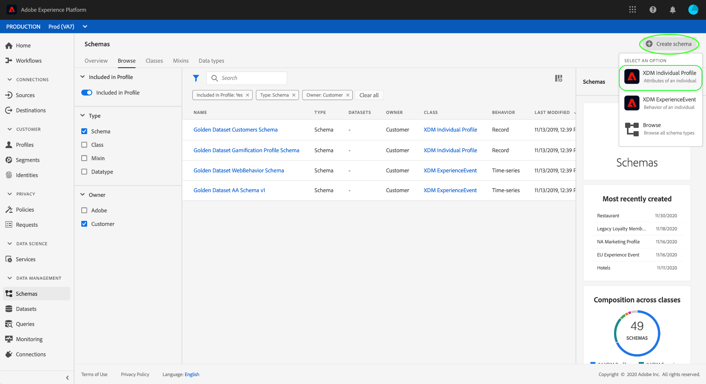
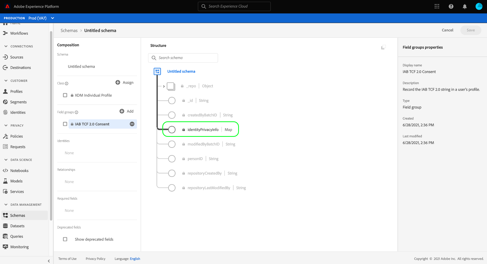

# Creare set di dati per l’acquisizione dei dati di consenso IAB TCF 2.0

Affinché Adobe Experience Platform possa elaborare i dati di consenso dei clienti in conformità all’IAB [!DNL Transparency & Consent Framework] (TCF) 2.0, tali dati devono essere inviati ai set di dati i cui schemi contengono campi di consenso TCF 2.0.

In particolare, per acquisire i dati di consenso TCF 2.0 sono necessari due set di dati:

* Un set di dati basato su [!DNL XDM Individual Profile] classe, abilitata per l&#39;uso in [!DNL Real-Time Customer Profile].
* Un set di dati basato su [!DNL XDM ExperienceEvent] classe.

>[!IMPORTANT]
>
>Platform applica solo le stringhe TCF raccolte nel set di dati di profilo individuale. Anche se è ancora necessario un set di dati ExperienceEvent per creare un datastream come parte di questo flusso di lavoro, è necessario acquisire solo i dati nel set di dati del profilo. Il set di dati ExperienceEvent può ancora essere utilizzato se desideri tenere traccia degli eventi di modifica del consenso nel tempo, ma questi valori non vengono utilizzati in quando si impone l’attivazione dei segmenti.

Questo documento descrive i passaggi necessari per impostare questi due set di dati. Per una panoramica dell’intero flusso di lavoro per configurare le operazioni relative ai dati della piattaforma per TCF 2.0, consulta la sezione [Panoramica sulla conformità IAB TCF 2.0](./overview.md).

## Prerequisiti

Questa esercitazione richiede una buona comprensione dei seguenti componenti di Adobe Experience Platform:

* [Experience Data Model (XDM)](../../../../xdm/home.md): Il quadro standardizzato [!DNL Experience Platform] organizza i dati sulla customer experience.
   * [Nozioni di base sulla composizione dello schema](../../../../xdm/schema/composition.md): Scopri i blocchi di base degli schemi XDM.
* [Servizio Adobe Experience Platform Identity](../../../../identity-service/home.md): Consente di collegare le identità dei clienti da diverse origini dati tra dispositivi e sistemi.
   * [Namespace Identity](../../../../identity-service/namespaces.md): I dati di identità cliente devono essere forniti in uno spazio dei nomi di identità specifico riconosciuto dal servizio Identity.
* [Profilo cliente in tempo reale](../../../../profile/home.md): Sfruttamento [!DNL Identity Service] per creare profili cliente dettagliati dai set di dati in tempo reale. [!DNL Real-Time Customer Profile] richiama i dati dal Data Lake e persiste i profili dei clienti nel proprio archivio dati separato.

## Gruppi di campi TCF 2.0 {#field-groups}

La [!UICONTROL Dettagli sul consenso IAB TCF 2.0] il gruppo di campi schema fornisce i campi di consenso del cliente richiesti per il supporto TCF 2.0. Sono disponibili due versioni di questo gruppo di campi: compatibile con [!DNL XDM Individual Profile] e l&#39;altro con il [!DNL XDM ExperienceEvent] classe.

Le sezioni seguenti illustrano la struttura di ciascuno di questi gruppi di campi, compresi i dati attesi durante l’acquisizione.

### Gruppo di campi del profilo {#profile-field-group}

Per gli schemi basati su [!DNL XDM Individual Profile], [!UICONTROL Dettagli sul consenso IAB TCF 2.0] un gruppo di campi fornisce un singolo campo di tipo mappa, `identityPrivacyInfo`, che mappa le identità dei clienti alle loro preferenze di consenso TCF. Questo gruppo di campi deve essere incluso in uno schema basato su record abilitato per Profilo cliente in tempo reale per consentire l’applicazione automatica.

Consulta la sezione [guida di riferimento](../../../../xdm/field-groups/profile/iab.md) per questo gruppo di campi per ulteriori informazioni sulla struttura e sul caso d’uso.

### Gruppo di campi evento {#event-field-group}

Se desideri tenere traccia degli eventi di modifica del consenso nel tempo, puoi aggiungere la [!UICONTROL Dettagli sul consenso IAB TCF 2.0] gruppo di campi [!UICONTROL ExperienceEvent XDM] schema.

Se non prevedi di tenere traccia degli eventi di modifica del consenso nel tempo, non devi includere questo gruppo di campi nello schema dell’evento. Quando si applicano automaticamente i valori di consenso TCF, in Experience Platform vengono utilizzate solo le informazioni di consenso più recenti acquisite nel [gruppo di campi del profilo](#profile-field-group). I valori di consenso acquisiti dagli eventi non partecipano ai flussi di lavoro di implementazione automatica.

Consulta la sezione [guida di riferimento](../../../../xdm/field-groups/event/iab.md) per questo gruppo di campi per ulteriori informazioni sulla struttura e il caso d’uso.

## Creare schemi di consenso dei clienti {#create-schemas}

Per creare set di dati che acquisiscono i dati di consenso, devi prima creare schemi XDM su cui basare tali set di dati.

Come indicato nella sezione precedente, uno schema che utilizza [!UICONTROL Profilo individuale XDM] è necessaria per applicare il consenso nei flussi di lavoro della piattaforma a valle. Facoltativamente, puoi anche creare uno schema separato basato su [!UICONTROL ExperienceEvent XDM] se desideri tenere traccia delle modifiche del consenso nel tempo. Entrambi gli schemi devono contenere un `identityMap` e un gruppo di campi TCF 2.0 appropriato.

Nell’interfaccia utente di Platform, seleziona **[!UICONTROL Schemi]** nel menu di navigazione a sinistra per aprire [!UICONTROL Schemi] workspace. Da qui, segui i passaggi descritti nelle sezioni seguenti per creare ogni schema richiesto.

>[!NOTE]
>
>Se disponi di schemi XDM esistenti che desideri utilizzare per acquisire i dati di consenso, puoi modificarli invece di crearne di nuovi. Tuttavia, se uno schema esistente è stato abilitato per l’utilizzo in Profilo cliente in tempo reale, la sua identità principale non può essere un campo direttamente identificabile che non è consentito utilizzare nella pubblicità basata su interessi, ad esempio un indirizzo e-mail. Consulta il tuo consulente legale se non sei sicuro di quali campi siano soggetti a restrizioni.
>
>Inoltre, quando si modificano gli schemi esistenti, è possibile apportare solo modifiche aggiuntive (non rivoluzionarie). Vedi la sezione sul [principi dell&#39;evoluzione dello schema](../../../../xdm/schema/composition.md#evolution) per ulteriori informazioni.

### Creare uno schema di consenso del profilo {#profile-schema}

Seleziona **[!UICONTROL Creare uno schema]**, quindi scegli **[!UICONTROL Profilo individuale XDM]** dal menu a discesa .

La **[!UICONTROL Aggiungi gruppi di campi]** viene visualizzata una finestra di dialogo che consente di iniziare subito ad aggiungere gruppi di campi allo schema. Da qui, seleziona **[!UICONTROL Dettagli sul consenso IAB TCF 2.0]** dall&#39;elenco. Facoltativamente, puoi utilizzare la barra di ricerca per limitare i risultati per individuare più facilmente il gruppo di campi.

Quindi, trova il **[!UICONTROL IdentityMap]** gruppo di campi dall’elenco e selezionalo. Una volta elencati entrambi i gruppi di campi nella barra a destra, seleziona **[!UICONTROL Aggiungi gruppi di campi]**.

L&#39;area di lavoro viene visualizzata nuovamente, mostrando che la `identityPrivacyInfo` e `identityMap` i campi sono stati aggiunti alla struttura dello schema.

Prima di aggiungere altri campi allo schema, seleziona il campo principale da visualizzare **[!UICONTROL Proprietà dello schema]** nella barra a destra, dove puoi fornire un nome e una descrizione per lo schema.

Dopo aver fornito un nome e una descrizione, puoi facoltativamente aggiungere altri campi allo schema selezionando **[!UICONTROL Aggiungi]** in **[!UICONTROL Gruppi di campi]** sul lato sinistro dell&#39;area di lavoro.

Se si modifica uno schema esistente già abilitato per l&#39;utilizzo in [!DNL Real-Time Customer Profile], seleziona **[!UICONTROL Salva]** per confermare le modifiche prima di passare alla sezione in [creazione di un set di dati basato sullo schema di consenso](#dataset). Se stai creando un nuovo schema, continua a seguire i passaggi descritti nella sottosezione seguente.

#### Abilita lo schema da utilizzare in [!DNL Real-Time Customer Profile]

Affinché Platform possa associare i dati di consenso ricevuti a profili cliente specifici, lo schema di consenso deve essere abilitato per l’utilizzo in [!DNL Real-Time Customer Profile].

>[!NOTE]
>
>Lo schema di esempio mostrato in questa sezione utilizza il relativo `identityMap` campo come identità principale. Se desideri impostare un altro campo come identità principale, accertati di utilizzare un identificatore indiretto come un ID cookie e non un campo direttamente identificabile che non è possibile utilizzare nella pubblicità basata su interessi, ad esempio un indirizzo e-mail. Consulta il tuo consulente legale se non sei sicuro di quali campi siano soggetti a restrizioni.
>
>I passaggi su come impostare un campo di identità principale per uno schema si trovano in [[!UICONTROL Schemi] Guida all’interfaccia utente](../../../../xdm/ui/fields/identity.md).

Per abilitare lo schema per [!DNL Profile], seleziona il nome dello schema nella barra a sinistra per aprire il **[!UICONTROL Proprietà dello schema]** sezione . Da qui, seleziona la **[!UICONTROL Profilo]** pulsante di attivazione/disattivazione.

Viene visualizzato un puntatore che indica un&#39;identità principale mancante. Seleziona la casella di controllo per utilizzare un&#39;identità principale alternativa, in quanto l&#39;identità principale sarà contenuta in `identityMap` campo .

Infine, seleziona **[!UICONTROL Salva]** per confermare le modifiche.

### Creare uno schema di consenso evento {#event-schema}

>[!NOTE]
>
>Gli schemi di consenso degli eventi vengono utilizzati solo per monitorare gli eventi di modifica del consenso nel tempo e non partecipano ai flussi di lavoro di implementazione a valle. Se non desideri tenere traccia delle modifiche al consenso nel tempo, puoi passare alla sezione successiva in [creazione di set di dati di consenso](#datasets).

In **[!UICONTROL Schemi]** area di lavoro, seleziona **[!UICONTROL Creare uno schema]**, quindi scegli **[!UICONTROL ExperienceEvent XDM]** dal menu a discesa .

La **[!UICONTROL Aggiungi gruppi di campi]** viene visualizzata la finestra di dialogo . Da qui, seleziona **[!UICONTROL Dettagli sul consenso IAB TCF 2.0]** dall&#39;elenco. Facoltativamente, puoi utilizzare la barra di ricerca per limitare i risultati per individuare più facilmente il gruppo di campi.

Quindi, trova il **[!UICONTROL IdentityMap]** gruppo di campi dall’elenco e selezionalo. Una volta elencati entrambi i gruppi di campi nella barra a destra, seleziona **[!UICONTROL Aggiungi gruppi di campi]**.

L&#39;area di lavoro viene visualizzata nuovamente, mostrando che la `consentStrings` e `identityMap` i campi sono stati aggiunti alla struttura dello schema.

Prima di aggiungere altri campi allo schema, seleziona il campo principale da visualizzare **[!UICONTROL Proprietà dello schema]** nella barra a destra, dove puoi fornire un nome e una descrizione per lo schema.

Dopo aver fornito un nome e una descrizione, puoi facoltativamente aggiungere altri campi allo schema selezionando **[!UICONTROL Aggiungi]** in **[!UICONTROL Gruppi di campi]** sul lato sinistro dell&#39;area di lavoro.

Dopo aver aggiunto i gruppi di campi necessari, completa selezionando **[!UICONTROL Salva]**.

## Creare set di dati in base agli schemi di consenso {#datasets}

Per ciascuno degli schemi richiesti sopra descritti, devi creare un set di dati che in definitiva acquisirà i dati di consenso dei clienti. Il set di dati basato sullo schema del record deve essere abilitato per [!DNL Real-Time Customer Profile], mentre il set di dati si basa sullo schema delle serie temporali **non** essere [!DNL Profile]-abilitato.

Per iniziare, seleziona **[!UICONTROL Set di dati]** nel menu di navigazione a sinistra, seleziona **[!UICONTROL Creare un set di dati]** nell&#39;angolo in alto a destra.

Nella pagina successiva, seleziona **[!UICONTROL Creare un set di dati dallo schema]**.

La **[!UICONTROL Creare un set di dati dallo schema]** viene visualizzato il flusso di lavoro, a partire dalla **[!UICONTROL Seleziona schema]** passo. Nell’elenco fornito, individua uno degli schemi di consenso creati in precedenza. Facoltativamente, puoi utilizzare la barra di ricerca per limitare i risultati e individuare più facilmente lo schema. Seleziona il pulsante di scelta accanto allo schema desiderato, quindi seleziona **[!UICONTROL Successivo]** per continuare.

La **[!UICONTROL Configurare il set di dati]** viene visualizzato il passaggio . Fornisci un nome e una descrizione univoci e facilmente identificabili per il set di dati prima di selezionarli **[!UICONTROL Fine]**.

Viene visualizzata la pagina dei dettagli per il set di dati appena creato. Se il set di dati è basato sullo schema delle serie temporali, il processo è completo. Se il set di dati è basato sullo schema del record, il passaggio finale del processo consiste nell’abilitare il set di dati per l’utilizzo in [!DNL Real-Time Customer Profile].

Nella barra a destra, seleziona la **[!UICONTROL Profilo]** seleziona , quindi **[!UICONTROL Abilita]** nel percorso di conferma per abilitare lo schema per [!DNL Profile].

Per creare un set di dati basato su eventi, segui nuovamente i passaggi indicati sopra se hai creato uno schema per esso.

## Passaggi successivi

Seguendo questa esercitazione, hai creato almeno un set di dati che può essere utilizzato per raccogliere i dati di consenso dei clienti:

* Un set di dati basato su record abilitato per l’utilizzo in Profilo cliente in tempo reale. **(Obbligatorio)**
* Un set di dati basato su serie temporale non abilitato per [!DNL Profile]. (Facoltativo)

Ora puoi tornare alla sezione [Panoramica di IAB TCF 2.0](./overview.md#merge-policies) continuare il processo di configurazione di Platform per la conformità TCF 2.0.
