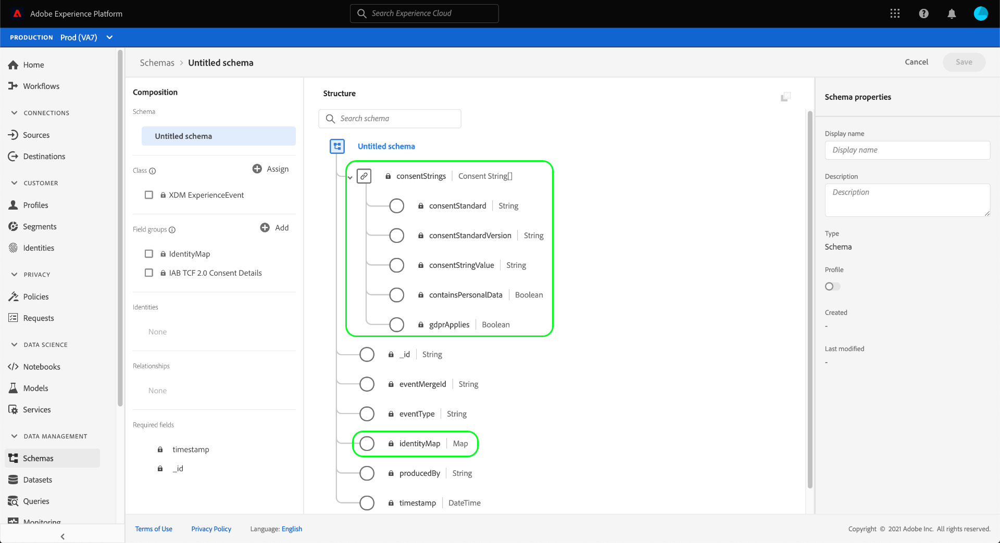

# Creare set di dati per l’acquisizione dei dati di consenso IAB TCF 2.0

Affinché Adobe Experience Platform possa elaborare i dati sul consenso del cliente in conformità all’IAB [!DNL Transparency & Consent Framework] (TCF) 2.0, tali dati devono essere inviati a set di dati i cui schemi contengono campi di consenso TCF 2.0.

In particolare, per acquisire i dati di consenso TCF 2.0 sono necessari due set di dati:

* Set di dati basato sulla classe [!DNL XDM Individual Profile], abilitato per l&#39;utilizzo in [!DNL Real-Time Customer Profile].
* Un set di dati basato sulla classe [!DNL XDM ExperienceEvent].

>[!IMPORTANT]
>
>Platform applica solo le stringhe TCF raccolte nel set di dati Profilo individuale. Anche se è ancora necessario un set di dati ExperienceEvent per creare un flusso di dati come parte di questo flusso di lavoro, è sufficiente acquisire i dati nel set di dati del profilo. Il set di dati ExperienceEvent può ancora essere utilizzato se desideri tenere traccia degli eventi di modifica del consenso nel tempo, ma questi valori non vengono utilizzati in durante l’applicazione all’attivazione dei segmenti.

Questo documento descrive la procedura per impostare questi due set di dati. Per una panoramica del flusso di lavoro completo per configurare le operazioni sui dati di Platform per TCF 2.0, consulta la [panoramica sulla conformità IAB TCF 2.0](./overview.md).

## Prerequisiti

Questo tutorial richiede una buona conoscenza dei seguenti componenti di Adobe Experience Platform:

* [Experience Data Model (XDM)](../../../../xdm/home.md): framework standardizzato tramite il quale [!DNL Experience Platform] organizza i dati sull&#39;esperienza del cliente.
   * [Nozioni di base sulla composizione dello schema](../../../../xdm/schema/composition.md): scopri i blocchi predefiniti di base degli schemi XDM.
* [Servizio Adobe Experience Platform Identity](../../../../identity-service/home.md): consente di collegare le identità dei clienti da diverse origini dati tra dispositivi e sistemi.
   * [Spazi dei nomi di identità](../../../../identity-service/features/namespaces.md): i dati di identità del cliente devono essere forniti in uno spazio dei nomi di identità specifico riconosciuto da Identity Service.
* [Profilo cliente in tempo reale](../../../../profile/home.md): sfrutta [!DNL Identity Service] per creare profili cliente dettagliati dai set di dati in tempo reale. [!DNL Real-Time Customer Profile] estrae dati dal Data Lake e mantiene i profili cliente nel proprio archivio dati separato.

## Gruppi di campi TCF 2.0 {#field-groups}

Il gruppo di campi dello schema [!UICONTROL IAB TCF 2.0 Consent Details] fornisce i campi di consenso del cliente necessari per il supporto di TCF 2.0. Esistono due versioni di questo gruppo di campi: una compatibile con la classe [!DNL XDM Individual Profile] e l&#39;altra con la classe [!DNL XDM ExperienceEvent].

Le sezioni seguenti spiegano la struttura di ciascuno di questi gruppi di campi, inclusi i dati previsti durante l’acquisizione.

### Gruppo di campi Profilo {#profile-field-group}

Per gli schemi basati su [!DNL XDM Individual Profile], il gruppo di campi [!UICONTROL Dettagli consenso IAB TCF 2.0] fornisce un singolo campo di tipo mappa, `identityPrivacyInfo`, che mappa le identità dei clienti in base alle preferenze di consenso TCF. Per consentire l’applicazione automatica, questo gruppo di campi deve essere incluso in uno schema basato su record abilitato per Real-Time Customer Profile.

Per ulteriori informazioni sulla struttura e sul caso d&#39;uso di questo gruppo di campi, consulta la [guida di riferimento](../../../../xdm/field-groups/profile/iab.md).

### Gruppo di campi evento {#event-field-group}

Se desideri tenere traccia degli eventi di modifica del consenso nel tempo, puoi aggiungere il gruppo di campi [!UICONTROL Dettagli consenso IAB TCF 2.0] allo schema [!UICONTROL XDM ExperienceEvent].

Se non prevedi di tenere traccia degli eventi di modifica del consenso nel tempo, non è necessario includere questo gruppo di campi nello schema dell’evento. Quando si applicano automaticamente i valori di consenso TCF, Experience Platform utilizza solo le informazioni di consenso più recenti acquisite nel gruppo di campi [profilo](#profile-field-group). I valori di consenso acquisiti dagli eventi non partecipano ai flussi di lavoro di applicazione automatica.

Per ulteriori informazioni sulla struttura e sul caso d&#39;uso di questo gruppo di campi, consulta la [guida di riferimento](../../../../xdm/field-groups/event/iab.md).

## Creare schemi di consenso dei clienti {#create-schemas}

Per creare set di dati che acquisiscano i dati del consenso, devi prima creare schemi XDM su cui basare tali set di dati.

Come indicato nella sezione precedente, per applicare il consenso nei flussi di lavoro a valle di Platform è necessario uno schema che utilizza la classe [!UICONTROL XDM Individual Profile]. Facoltativamente, puoi anche creare uno schema separato basato su [!UICONTROL XDM ExperienceEvent] se desideri tenere traccia delle modifiche del consenso nel tempo. Entrambi gli schemi devono contenere un campo `identityMap` e un gruppo di campi TCF 2.0 appropriato.

Nell&#39;interfaccia utente di Platform, seleziona **[!UICONTROL Schemi]** nell&#39;area di navigazione a sinistra per aprire l&#39;area di lavoro [!UICONTROL Schemi]. Da qui, segui i passaggi descritti nelle sezioni seguenti per creare ogni schema richiesto.

>[!NOTE]
>
>Se disponi di schemi XDM esistenti che desideri utilizzare per acquisire i dati del consenso, puoi modificarli invece di crearne di nuovi. Tuttavia, se uno schema esistente è stato abilitato per l’utilizzo in Real-Time Customer Profile, la sua identità primaria non può essere un campo direttamente identificabile che non può essere utilizzato in annunci pubblicitari basati su interessi, come un indirizzo e-mail. Se non sei sicuro di quali campi sono soggetti a restrizioni, rivolgiti al tuo consulente legale.
>
>Inoltre, quando si modificano gli schemi esistenti, è possibile apportare solo modifiche aggiuntive (non interrompenti). Per ulteriori informazioni, consulta la sezione sui [principi dell&#39;evoluzione dello schema](../../../../xdm/schema/composition.md#evolution).

### Creare uno schema di consenso del profilo {#profile-schema}

Seleziona **[!UICONTROL Crea schema]**, quindi scegli **[!UICONTROL Profilo individuale XDM]** dal menu a discesa.

Viene visualizzata la finestra di dialogo **[!UICONTROL Aggiungi gruppi di campi]**, che consente di iniziare ad aggiungere gruppi di campi allo schema immediatamente. Da qui, seleziona **[!UICONTROL IAB TCF 2.0 Consent Details]** dall&#39;elenco. Facoltativamente, è possibile utilizzare la barra di ricerca per limitare i risultati in modo da individuare più facilmente il gruppo di campi.

Individuare quindi il gruppo di campi **[!UICONTROL IdentityMap]** dall&#39;elenco e selezionarlo. Dopo aver elencato entrambi i gruppi di campi nella barra a destra, seleziona **[!UICONTROL Aggiungi gruppi di campi]**.

L&#39;area di lavoro viene nuovamente visualizzata, mostrando che i campi `identityPrivacyInfo` e `identityMap` sono stati aggiunti alla struttura dello schema.

Prima di aggiungere altri campi allo schema, seleziona il campo principale per visualizzare **[!UICONTROL le proprietà dello schema]** nella barra a destra, dove puoi fornire un nome e una descrizione dello schema.

Dopo aver fornito un nome e una descrizione, è possibile aggiungere altri campi allo schema selezionando **[!UICONTROL Aggiungi]** nella sezione **[!UICONTROL Gruppi di campi]** sul lato sinistro dell&#39;area di lavoro.

Se stai modificando uno schema esistente già abilitato per l&#39;utilizzo in [!DNL Real-Time Customer Profile], seleziona **[!UICONTROL Salva]** per confermare le modifiche prima di passare alla sezione [creazione di un set di dati basato sullo schema di consenso](#dataset). Se stai creando un nuovo schema, continua seguendo i passaggi descritti nella sottosezione seguente.

#### Abilita lo schema da utilizzare in [!DNL Real-Time Customer Profile]

Per consentire a Platform di associare i dati sul consenso ricevuti a profili cliente specifici, lo schema di consenso deve essere abilitato per l&#39;utilizzo in [!DNL Real-Time Customer Profile].

>[!NOTE]
>
>Lo schema di esempio mostrato in questa sezione utilizza il campo `identityMap` come identità primaria. Se desideri impostare un altro campo come identità primaria, accertati di utilizzare un identificatore indiretto come un ID cookie e non un campo direttamente identificabile che non può essere utilizzato in annunci pubblicitari basati su interessi, come un indirizzo e-mail. Se non sei sicuro di quali campi sono soggetti a restrizioni, rivolgiti al tuo consulente legale.
>
>I passaggi per l&#39;impostazione di un campo di identità primaria per uno schema sono disponibili nella [[!UICONTROL Guida dell&#39;interfaccia utente Schemi]](../../../../xdm/ui/fields/identity.md).

Per abilitare lo schema per [!DNL Profile], seleziona il nome dello schema nella barra a sinistra per aprire la sezione **[!UICONTROL Proprietà schema]**. Da qui, seleziona il pulsante di attivazione/disattivazione **[!UICONTROL Profilo]**.

Viene visualizzato un messaggio a comparsa che indica un&#39;identità primaria mancante. Selezionare la casella di controllo per l&#39;utilizzo di un&#39;identità primaria alternativa, in quanto l&#39;identità primaria sarà contenuta nel campo `identityMap`.

Infine, seleziona **[!UICONTROL Salva]** per confermare le modifiche.

### Creare uno schema di consenso all’evento {#event-schema}

>[!NOTE]
>
>Gli schemi di consenso degli eventi vengono utilizzati solo per tenere traccia degli eventi di modifica del consenso nel tempo e non partecipano ai flussi di lavoro di applicazione a valle. Se non desideri tenere traccia delle modifiche del consenso nel tempo, puoi passare alla sezione successiva sulla [creazione dei set di dati del consenso](#datasets).

Nell&#39;area di lavoro **[!UICONTROL Schemi]**, seleziona **[!UICONTROL Crea schema]**, quindi scegli **[!UICONTROL XDM ExperienceEvent]** dal menu a discesa.

Viene visualizzata la finestra di dialogo **[!UICONTROL Aggiungi gruppi di campi]**. Da qui, seleziona **[!UICONTROL IAB TCF 2.0 Consent Details]** dall&#39;elenco. Facoltativamente, è possibile utilizzare la barra di ricerca per limitare i risultati in modo da individuare più facilmente il gruppo di campi.

Individuare quindi il gruppo di campi **[!UICONTROL IdentityMap]** dall&#39;elenco e selezionarlo. Dopo aver elencato entrambi i gruppi di campi nella barra a destra, seleziona **[!UICONTROL Aggiungi gruppi di campi]**.

L&#39;area di lavoro viene nuovamente visualizzata, mostrando che i campi `consentStrings` e `identityMap` sono stati aggiunti alla struttura dello schema.

Prima di aggiungere altri campi allo schema, seleziona il campo principale per visualizzare **[!UICONTROL le proprietà dello schema]** nella barra a destra, dove puoi fornire un nome e una descrizione dello schema.

Dopo aver fornito un nome e una descrizione, è possibile aggiungere altri campi allo schema selezionando **[!UICONTROL Aggiungi]** nella sezione **[!UICONTROL Gruppi di campi]** sul lato sinistro dell&#39;area di lavoro.

Dopo aver aggiunto i gruppi di campi necessari, terminare selezionando **[!UICONTROL Salva]**.

## Creare set di dati in base agli schemi di consenso {#datasets}

Per ciascuno degli schemi richiesti descritti in precedenza, devi creare un set di dati che acquisirà in ultima analisi i dati sul consenso dei clienti. Il set di dati basato sullo schema del record deve essere abilitato per [!DNL Real-Time Customer Profile], mentre il set di dati basato sullo schema della serie temporale **non deve essere abilitato per [!DNL Profile]**.

Per iniziare, seleziona **[!UICONTROL Set di dati]** nell&#39;area di navigazione a sinistra, quindi seleziona **[!UICONTROL Crea set di dati]** nell&#39;angolo in alto a destra.

Nella pagina successiva, seleziona **[!UICONTROL Crea set di dati dallo schema]**.

Viene visualizzato il flusso di lavoro **[!UICONTROL Crea set di dati dallo schema]** a partire dal passaggio **[!UICONTROL Seleziona schema]**. Nell’elenco fornito, individua uno degli schemi di consenso creati in precedenza. Facoltativamente, puoi utilizzare la barra di ricerca per limitare i risultati e individuare più facilmente lo schema. Seleziona il pulsante di scelta accanto allo schema desiderato, quindi seleziona **[!UICONTROL Successivo]** per continuare.

Viene visualizzato il passaggio **[!UICONTROL Configura set di dati]**. Fornisci un nome e una descrizione univoci e facilmente identificabili per il set di dati prima di selezionare **[!UICONTROL Fine]**.

Viene visualizzata la pagina dei dettagli per il set di dati appena creato. Se il set di dati si basa sullo schema della serie temporale, il processo è completo. Se il set di dati è basato sullo schema del record, il passaggio finale nel processo consiste nell&#39;abilitare il set di dati per l&#39;utilizzo in [!DNL Real-Time Customer Profile].

Nella barra a destra, seleziona l&#39;interruttore **[!UICONTROL Profilo]**, quindi seleziona **[!UICONTROL Abilita]** nel popover di conferma per abilitare lo schema per [!DNL Profile].

Segui nuovamente i passaggi precedenti per creare un set di dati basato su eventi, se hai creato uno schema per esso.

## Passaggi successivi

Seguendo questa esercitazione, hai creato almeno un set di dati che ora può essere utilizzato per raccogliere i dati sul consenso del cliente:

* Un set di dati basato su record abilitato per l’utilizzo in Real-Time Customer Profile. **(Obbligatorio)**
* Set di dati basato su serie temporali non abilitato per [!DNL Profile]. (Facoltativo)

È ora possibile tornare alla [panoramica di IAB TCF 2.0](./overview.md#merge-policies) per continuare il processo di configurazione della piattaforma per la conformità a TCF 2.0.
