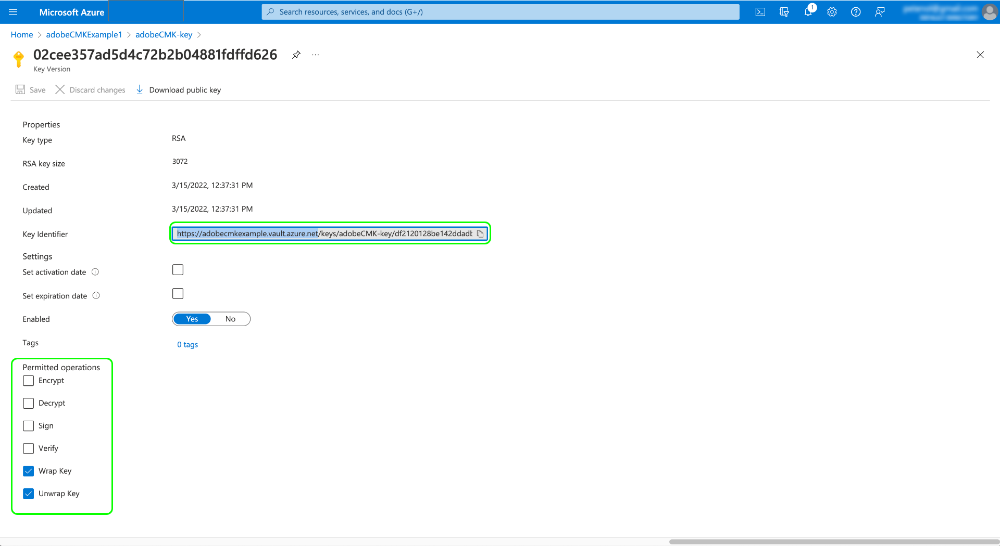

# Tasti gestiti dal cliente in Adobe Experience Platform

I dati archiviati in Adobe Experience Platform vengono crittografati a riposo utilizzando le chiavi a livello di sistema. Se utilizzi un’applicazione basata su Platform, puoi scegliere di utilizzare le tue chiavi di crittografia, per avere un maggiore controllo sulla sicurezza dei dati.

>[!NOTE]
>
>I dati in Adobe Experience Platform data lake e Profile Store (CosmosDB) sono crittografati utilizzando CMK.

Questo documento illustra il processo di abilitazione della funzione chiavi gestite dal cliente (CMK) in Platform.

## Prerequisiti

Per abilitare CMK, il tuo [!DNL Azure] L&#39;insieme di credenziali chiave deve essere configurato con le seguenti impostazioni:

* [Abilita protezione da eliminazione](https://learn.microsoft.com/en-us/azure/key-vault/general/soft-delete-overview#purge-protection)
* [Abilita eliminazione temporanea](https://learn.microsoft.com/en-us/azure/key-vault/general/soft-delete-overview)
* [Configura l&#39;accesso tramite [!DNL Azure] controllo dell&#39;accesso basato su ruoli](https://learn.microsoft.com/en-us/azure/role-based-access-control/)

## Riepilogo del processo

CMK è inclusa nell&#39;offerta Healthcare Shield e Privacy and Security Shield dell&#39;Adobe. Dopo che l’organizzazione acquista una licenza per una di queste offerte, puoi iniziare un processo una tantum per la configurazione della funzione.

>[!WARNING]
>
>Dopo aver impostato CMK, non puoi tornare alle chiavi gestite dal sistema. Sei responsabile della gestione sicura delle chiavi e dell&#39;accesso all&#39;app Key Vault, Key e CMK in [!DNL Azure] per evitare di perdere l&#39;accesso ai dati.

Il processo è il seguente:

1. [Configura un [!DNL Azure] Vault](#create-key-vault) in base ai criteri della tua organizzazione, quindi [generare una chiave di crittografia](#generate-a-key) questo sarà in definitiva condiviso con l&#39;Adobe.
1. Utilizzare le chiamate API per [configurare l’app CMK](#register-app) con il tuo [!DNL Azure] inquilino.
1. Utilizzare le chiamate API per [invia ad Adobe l&#39;ID chiave di crittografia](#send-to-adobe) e avvia il processo di abilitazione per la funzione.
1. [Controlla lo stato della configurazione](#check-status) per verificare se CMK è stato abilitato.

Una volta completato il processo di configurazione, tutti i dati caricati in Platform in tutte le sandbox verranno crittografati utilizzando il [!DNL Azure] configurazione della chiave. Per utilizzare CMK, sfrutterai [!DNL Microsoft Azure] funzionalità che possono far parte delle [programma di anteprima pubblica](https://azure.microsoft.com/en-ca/support/legal/preview-supplemental-terms/).

## Configura un [!DNL Azure] Vault {#create-key-vault}

CMK supporta solo le chiavi da un [!DNL Microsoft Azure] Archivio chiavi Per iniziare, devi lavorare con [!DNL Azure] per creare un nuovo account enterprise o utilizzare un account enterprise esistente e seguire i passaggi riportati di seguito per creare l&#39;insieme di credenziali chiave.

>[!IMPORTANT]
>
>Solo i livelli di servizio Premium e Standard per [!DNL Azure] L&#39;insieme di credenziali delle chiavi è supportato. [!DNL Azure Managed HSM], [!DNL Azure Dedicated HSM] e [!DNL Azure Payments HSM] non sono supportati. Fai riferimento a [[!DNL Azure] documentazione](https://learn.microsoft.com/en-us/azure/security/fundamentals/key-management#azure-key-management-services) per ulteriori informazioni sui servizi di gestione delle chiavi offerti.

>[!NOTE]
>
>La documentazione seguente tratta solo i passaggi di base per creare l’insieme di credenziali chiave. Al di fuori di questa guida, devi configurare l’insieme di credenziali chiave in base ai criteri della tua organizzazione.

Accedi a [!DNL Azure] e utilizza la barra di ricerca per individuare **[!DNL Key vaults]** nell&#39;elenco dei servizi.


La **[!DNL Key vaults]** dopo aver selezionato il servizio viene visualizzata la pagina . Da qui, seleziona **[!DNL Create]**.


Utilizzando il modulo fornito, compila i dettagli di base dell’insieme di chiavi, tra cui un nome e un gruppo di risorse assegnato.

>[!WARNING]
>
>Mentre la maggior parte delle opzioni può essere lasciata come valori predefiniti, **assicurati di attivare le opzioni di protezione soft-delete ed eliminazione**. Se non si attivano queste funzioni, si potrebbe perdere l&#39;accesso ai dati se l&#39;insieme di credenziali chiave viene eliminato.
>
>

Da qui, continua a seguire il flusso di lavoro chiave per la creazione di archivi e configura le diverse opzioni in base ai criteri della tua organizzazione.

Una volta arrivati al **[!DNL Review + create]** è possibile esaminare i dettagli dell&#39;insieme di credenziali chiave durante la convalida. Al termine della convalida, seleziona **[!DNL Create]** per completare il processo.


### Configurare le opzioni di rete

Se l&#39;insieme di credenziali chiave è configurato per limitare l&#39;accesso pubblico a determinate reti virtuali o per disabilitare completamente l&#39;accesso pubblico, è necessario concedere a Microsoft un&#39;eccezione firewall.

Seleziona **[!DNL Networking]** (Progetti) nel pannello di navigazione a sinistra. Sotto **[!DNL Firewalls and virtual networks]**, seleziona la casella di controllo **[!DNL Allow trusted Microsoft services to bypass this firewall]**, quindi seleziona **[!DNL Apply]**.


### Genera una chiave {#generate-a-key}

Dopo aver creato un insieme di credenziali chiave, puoi generare una nuova chiave. Passa a **[!DNL Keys]** e seleziona **[!DNL Generate/Import]**.


Utilizza il modulo fornito per specificare un nome per la chiave e seleziona **RSA** per il tipo di chiave. Come minimo, la **[!DNL RSA key size]** devono essere almeno **3072** bit richiesti da [!DNL Cosmos DB]. [!DNL Azure Data Lake Storage] è compatibile anche con RSA 3027.

>[!NOTE]
>
>Ricorda il nome fornito per la chiave, in quanto verrà utilizzato in un passaggio successivo quando [invio della chiave ad Adobe](#send-to-adobe).

Utilizza i controlli rimanenti per configurare la chiave da generare o importare come desiderato. Al termine, seleziona **[!DNL Create]**.


La chiave configurata viene visualizzata nell&#39;elenco delle chiavi per l&#39;insieme di credenziali.


## Configurare l’app CMK {#register-app}

Una volta configurato l&#39;insieme di credenziali chiave, il passaggio successivo consiste nel registrarsi per l&#39;applicazione CMK che si collegherà al tuo [!DNL Azure] inquilino.

### Introduzione

Per registrare l’app CMK è necessario effettuare chiamate alle API di Platform. Per informazioni dettagliate su come raccogliere le intestazioni di autenticazione necessarie per effettuare queste chiamate, vedi [Guida all’autenticazione API di Platform](../../landing/api-authentication.md).

Mentre la guida all’autenticazione fornisce istruzioni su come generare il proprio valore univoco per il `x-api-key` intestazione della richiesta, tutte le operazioni API in questa guida utilizzano il valore statico `acp_provisioning` invece. È comunque necessario fornire i propri valori per `{ACCESS_TOKEN}` e `{ORG_ID}`Tuttavia.

In tutte le chiamate API mostrate in questa guida, `platform.adobe.io` viene utilizzato come percorso principale, che utilizza per impostazione predefinita l&#39;area VA7. Se l&#39;organizzazione utilizza un&#39;area diversa, `platform` deve essere seguito da un trattino e dal codice di regione assegnati alla tua organizzazione: `nld2` per NLD2 o `aus5` per AUS5 (ad esempio: `platform-aus5.adobe.io`). Se non conosci l&#39;area geografica dell&#39;organizzazione, contatta l&#39;amministratore di sistema.

### Recupero di un URL di autenticazione

Per avviare il processo di registrazione, effettua una richiesta GET all’endpoint di registrazione dell’app per recuperare l’URL di autenticazione richiesto per la tua organizzazione.

**Richiesta**

```shell
curl -X GET \
  https://platform.adobe.io/data/infrastructure/manager/byok/app-registration \ 
  -H 'Authorization: Bearer {ACCESS_TOKEN}' \
  -H 'x-api-key: acp_provisioning' \
  -H 'x-gw-ims-org-id: {ORG_ID}'
```

**Risposta**

Una risposta corretta restituisce un `applicationRedirectUrl` , contenente l&#39;URL di autenticazione.

```json
{
    "id": "byok",
    "name": "acpebae9422Caepcmkmultitenantapp",
    "applicationUri": "https://adobe.com/acpebae9422Caepcmkmultitenantapp",
    "applicationId": "e463a445-c6ac-4ca2-b36a-b5146fcf6a52",
    "applicationRedirectUrl": "https://login.microsoftonline.com/common/oauth2/authorize?response_type=code&client_id=e463a445-c6ac-4ca2-b36a-b5146fcf6a52&redirect_uri=https://adobe.com/acpebae9422Caepcmkmultitenantapp&scope=user.read"
}
```

Copiare e incollare `applicationRedirectUrl` indirizzare in un browser per aprire una finestra di dialogo di autenticazione. Seleziona **[!DNL Accept]** per aggiungere l&#39;entità servizio app CMK al tuo [!DNL Azure] inquilino.


### Assegnare l’app CMK a un ruolo {#assign-to-role}

Dopo aver completato il processo di autenticazione, torna al tuo [!DNL Azure] Archivio chiavi e seleziona **[!DNL Access control]** nella navigazione a sinistra. Da qui, seleziona **[!DNL Add]** seguito da **[!DNL Add role assignment]**.


Nella schermata successiva viene richiesto di scegliere un ruolo per l&#39;assegnazione. Seleziona **[!DNL Key Vault Crypto Service Encryption User]** prima di selezionare **[!DNL Next]** per continuare.


Nella schermata successiva, scegli **[!DNL Select members]** per aprire una finestra di dialogo nella barra a destra. Utilizzare la barra di ricerca per individuare l&#39;entità servizio per l&#39;applicazione CMK e selezionarla dall&#39;elenco. Al termine, seleziona **[!DNL Save]**.

>[!NOTE]
>
>Se non è possibile trovare l&#39;applicazione nell&#39;elenco, l&#39;entità servizio non è stata accettata nel tenant. Per favore, collabora con [!DNL Azure] amministratore o rappresentante per verificare di disporre dei privilegi corretti.

## Abilita la configurazione della chiave di crittografia su Experience Platform {#send-to-adobe}

Dopo aver installato l’app CMK su [!DNL Azure], puoi inviare ad Adobe l’identificatore della chiave di crittografia . Seleziona **[!DNL Keys]** nel menu di navigazione a sinistra, seguito dal nome della chiave che desideri inviare.


Seleziona la versione più recente della chiave e viene visualizzata la relativa pagina dei dettagli. Da qui puoi anche configurare le operazioni consentite per la chiave. Come minimo, è necessario assegnare alla chiave il **[!DNL Wrap Key]** e **[!DNL Unwrap Key]** autorizzazioni.

La **[!UICONTROL Identificatore chiave]** visualizza l’identificatore URI della chiave. Copia questo valore URI da utilizzare nel passaggio successivo.



Una volta ottenuto l’URI dell’archivio chiavi, puoi inviarlo utilizzando una richiesta POST all’endpoint di configurazione CMK.

>[!NOTE]
>
>Solo l&#39;insieme di credenziali e il nome della chiave sono memorizzati con Adobe, non con la versione chiave.

**Richiesta**

```shell
curl -X POST \
  https://platform.adobe.io/data/infrastructure/manager/customer/config \ 
  -H 'Authorization: Bearer {ACCESS_TOKEN}' \
  -H 'x-api-key: acp_provisioning' \
  -H 'x-gw-ims-org-id: {ORG_ID}' \
  -d '{
        "name": "Config1",
        "type": "BYOK_CONFIG",
        "imsOrgId": "{ORG_ID}",
        "configData": {
          "providerType": "AZURE_KEYVAULT",
          "keyVaultKeyIdentifier": "https://adobecmkexample.vault.azure.net/keys/adobeCMK-key/7c1d50lo28234cc895534c00d7eb4eb4"
        }
      }'
```

| Proprietà | Descrizione |
| --- | --- |
| `name` | Un nome per la configurazione. Ricorda questo valore in quanto sarà necessario per controllare lo stato della configurazione in una [passaggio successivo](#check-status). Il valore distingue tra maiuscole e minuscole. |
| `type` | Tipo di configurazione. Deve essere impostato su `BYOK_CONFIG`. |
| `imsOrgId` | Il tuo ID organizzazione. Deve essere lo stesso valore fornito in `x-gw-ims-org-id` intestazione. |
| `configData` | Contiene i seguenti dettagli sulla configurazione:<ul><li>`providerType`: Deve essere impostato su `AZURE_KEYVAULT`.</li><li>`keyVaultKeyIdentifier`: URI dell&#39;archivio chiavi copiato [precedente](#send-to-adobe).</li></ul> |

**Risposta**

Una risposta corretta restituisce i dettagli del processo di configurazione.

```json
{
  "id": "4df7886b-a122-4391-880b-47888d5c5b92",
  "config": {
    "configData": {
      "keyVaultUri": "https://adobecmkexample.vault.azure.net",
      "keyVaultKeyIdentifier": "https://adobecmkexample.vault.azure.net/keys/adobeCMK-key/7c1d50lo28234cc895534c00d7eb4eb4",
      "keyVersion": "7c1d50lo28234cc895534c00d7eb4eb4",
      "keyName": "Config1",
      "providerType": "AZURE_KEYVAULT"
    },
    "name": "acpcf978863Aaepcmkmultitenantapp",
    "type": "BYOK_CONFIG",
    "imsOrgId": "{IMS_ORG}",
    "status": "NEW"
  },
  "status": "CREATED"
}
```

Il processo deve completare l&#39;elaborazione entro pochi minuti.

## Verifica lo stato della configurazione {#check-status}

Per verificare lo stato della richiesta di configurazione, puoi effettuare una richiesta GET.

**Richiesta**

È necessario aggiungere il `name` della configurazione che desideri controllare nel percorso (`config1` nell’esempio seguente) e includi un `configType` parametro di query impostato su `BYOK_CONFIG`.

```shell
curl -X GET \
  https://platform.adobe.io/data/infrastructure/manager/customer/config/config1?configType=BYOK_CONFIG \ 
  -H 'Authorization: Bearer {ACCESS_TOKEN}' \
  -H 'x-api-key: acp_provisioning' \
  -H 'x-gw-ims-org-id: {ORG_ID}'
```

**Risposta**

Una risposta corretta restituisce lo stato del processo.

```json
{
  "name": "acpcf978863Aaepcmkmultitenantapp",
  "type": "BYOK_CONFIG",
  "status": "COMPLETED",
  "configData": {
    "keyVaultUri": "https://adobecmkexample.vault.azure.net",
    "keyVaultKeyIdentifier": "https://adobecmkexample.vault.azure.net/keys/adobeCMK-key/7c1d50lo28234cc895534c00d7eb4eb4",
    "keyVersion": "7c1d50lo28234cc895534c00d7eb4eb4",
    "keyName": "Config1",
    "providerType": "AZURE_KEYVAULT"
  },
  "imsOrgId": "{IMS_ORG}",
  "subscriptionId": "cf978863-7325-47b1-8fd9-554b9fdb6c36",
  "id": "4df7886b-a122-4391-880b-47888d5c5b92",
  "rowType": "BYOK_KEY"
}
```

La `status` L&#39;attributo può avere uno dei quattro valori con i seguenti significati:

1. `RUNNING`: Verifica che Platform sia in grado di accedere all’insieme di credenziali chiave e chiave.
1. `UPDATE_EXISTING_RESOURCES`: Il sistema sta aggiungendo l’insieme di chiavi e il nome della chiave ai datastore in tutte le sandbox della tua organizzazione.
1. `COMPLETED`: L&#39;insieme di credenziali e il nome della chiave sono stati aggiunti ai datastore.
1. `FAILED`: Si è verificato un problema, principalmente correlato alla configurazione dell&#39;app chiave, dell&#39;insieme di credenziali chiave o multi-tenant.

## Passaggi successivi

Completando i passaggi precedenti, hai abilitato correttamente CMK per la tua organizzazione. I dati acquisiti in Platform verranno ora crittografati e decrittografati utilizzando le chiavi nella [!DNL Azure] Archivio chiavi Se desideri revocare l’accesso a Platform ai tuoi dati, puoi rimuovere il ruolo utente associato all’applicazione dall’insieme di chiavi in [!DNL Azure].

Dopo aver disabilitato l’accesso all’applicazione, potrebbero essere necessarie da alcuni minuti a 24 ore perché i dati non siano più accessibili in Platform. Lo stesso ritardo si applica al fatto che i dati siano nuovamente disponibili quando si riabilita l’accesso all’applicazione.

>[!WARNING]
>
>Una volta che l’app Key Vault, Key o CMK è disabilitata e i dati non sono più accessibili in Platform, non sarà più possibile eseguire operazioni downstream relative a tali dati. Assicurati di comprendere gli impatti a valle della revoca dell’accesso a Platform ai dati prima di apportare modifiche alla configurazione.
