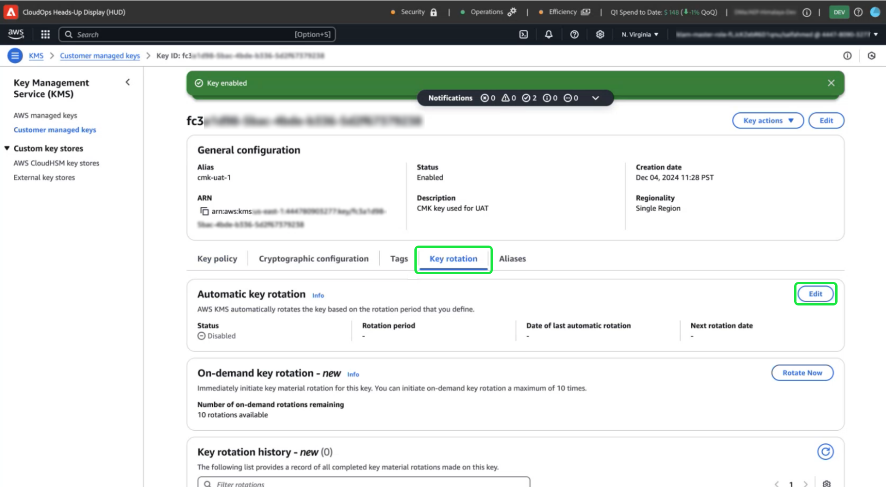

# Configurare le chiavi gestite dal cliente con AWS tramite l’interfaccia utente di Platform

Utilizza questa guida per abilitare le chiavi gestite dal cliente (CMK) per le istanze di Platform in hosting su AWS tramite l’interfaccia utente di Platform.

>[!IMPORTANT]
>
>Prima di continuare con questa guida, assicurati di aver completato la configurazione descritta nel documento [&#39;Configure AWS KMS for CMK&#39;](./configure-kms.md).

## Aggiorna i criteri chiave di AWS per integrare la chiave con Experience Platform

Per integrare la chiave AWS con Experience Platform, devi modificare il JSON nella sezione **[!DNL Key Policy]** dell&#39;area di lavoro KMS. Un criterio chiave predefinito è simile al JSON seguente.

<!-- The AWS ID below is fake. Q) Can I refer to it simply as AWS_ACCOUNT_ID ? Is that suitable? -->

```JSON
{
  "Id": "key-consolepolicy-3",
  "Version": "2012-10-17",
  "Statement": [
    {
      "Sid": "Enable IAM User Permissions",
      "Effect": "Allow",
      "Principal": {
        "AWS": "arn:aws:iam::123464903283:root" // this is a mock AWS Principal ID, your ID will differ
      },
      "Action": "kms:*",
      "Resource": "*"
    }
  ]
}
```

Nell&#39;esempio precedente, tutte le risorse (`"Resource": "*"`) all&#39;interno dello stesso account (`Principal.AWS`) possono accedere alla chiave. Questo criterio consente ai servizi dell&#39;account di eseguire operazioni di crittografia e decrittografia limitate all&#39;account specificato. Per concedere all’account single-tenant di Platform l’accesso a questa chiave, aggiungi nuove istruzioni al criterio predefinito di AWS. Puoi ottenere i criteri JSON richiesti dall’interfaccia utente di Platform e applicarli alla chiave KMS di AWS per stabilire una connessione sicura con Adobe Experience Platform.

Nell&#39;interfaccia utente di Platform, vai alla sezione **[!UICONTROL Amministrazione]** nella barra di navigazione a sinistra e seleziona **[!UICONTROL Crittografia]**. Nell&#39;area di lavoro [!UICONTROL Configurazione crittografia], selezionare **[!UICONTROL Configura]** nella scheda [!UICONTROL Chiavi gestite dal cliente].


Viene visualizzata la [!UICONTROL configurazione chiavi gestite dal cliente]. Copiare l&#39;oggetto `statement` dal criterio CMK KMS visualizzato in [!UICONTROL Customer Managed Keys] [!UICONTROL Encryption Configuration].

<!-- Select the copy icon () to copy the CMK KMS policy to your clipboard. A green pop-up notification confirms that the policy was copied.  -->

<!-- I cannot add the 'and the copy icon highlighted.' to the alt text below as i do not have access to this UI. -->


<!-- This part of the workflow was in contention at the time of the demo.  -->

Quindi, torna all’area di lavoro del KMS di AWS e aggiorna il criterio chiave mostrato di seguito.


Aggiungere al criterio predefinito le quattro istruzioni dell&#39;area di lavoro [!UICONTROL Configurazione crittografia piattaforma], come illustrato di seguito: `Enable IAM User Permissions`, `CJA Flow IAM User Permissions`, `CJA Integrity IAM User Permissions`, `CJA Oberon IAM User Permissions`.

```json
{
    "Version": "2012-10-17",
    "Id": "key-consolepolicy",
    "Statement": [
        {
            "Sid": "Enable IAM User Permissions",
            "Effect": "Allow",
            "Principal": {
                "AWS": "arn:aws:iam::975049898882:root" // this is a mock AWS Principal ID, your ID will differ
            },
            "Action": [
                "kms:Decrypt",
                "kms:Encrypt",
                "kms:ReEncrypt*",
                "kms:GenerateDataKey*",
                "kms:DescribeKey",
                "kms:CreateGrant"
            ],
            "Resource": "*",
            "Condition": {
                "StringEquals": {
                    "aws:PrincipalAccount": "975049898882" // this is a mock AWS Principal ID, your ID will differ
                }
            }
        },
        {
            "Sid": "CJA Flow IAM User Permissions",
            "Effect": "Allow",
            "Principal": {
                "AWS": "arn:aws:iam::767397686373:root"
            },
            "Action": [
                "kms:Decrypt",
                "kms:Encrypt",
                "kms:ReEncrypt*",
                "kms:GenerateDataKey*",
                "kms:DescribeKey",
                "kms:CreateGrant"
            ],
            "Resource": "*",
            "Condition": {
                "StringEquals": {
                    "aws:PrincipalAccount": "767397686373"
                }
            }
        },
        {
            "Sid": "CJA Integrity IAM User Permissions",
            "Effect": "Allow",
            "Principal": {
                "AWS": "arn:aws:iam::730335345392:root"
            },
            "Action": [
                "kms:Decrypt",
                "kms:Encrypt",
                "kms:ReEncrypt*",
                "kms:GenerateDataKey*",
                "kms:DescribeKey",
                "kms:CreateGrant"
            ],
            "Resource": "*",
            "Condition": {
                "StringEquals": {
                    "aws:PrincipalAccount": "730335345392"
                }
            }
        },
        {
            "Sid": "CJA Oberon IAM User Permissions",
            "Effect": "Allow",
            "Principal": {
                "AWS": "arn:aws:iam::891377157113:root"
            },
            "Action": [
                "kms:Decrypt",
                "kms:Encrypt",
                "kms:ReEncrypt*",
                "kms:GenerateDataKey*",
                "kms:DescribeKey",
                "kms:CreateGrant"
            ],
            "Resource": "*",
            "Condition": {
                "StringEquals": {
                    "aws:PrincipalAccount": "891377157113"
                }
            }
        }
    ]
}
```

Selezionare **[!DNL Finish]** per confermare il criterio aggiornato e creare la chiave. La configurazione ora include cinque istruzioni, che consentono al tuo account AWS di comunicare con Adobe Experience Platform. Le modifiche hanno effetto immediato.

Viene visualizzata l&#39;area di lavoro [!DNL Customer Managed Keys] aggiornata dell&#39;AWS [!DNL Key Management Service].

### Aggiungere i dettagli della chiave di crittografia AWS alla piattaforma

Quindi, per abilitare la crittografia, aggiungi il nome risorsa Amazon (ARN) della chiave alla [!UICONTROL configurazione di chiavi gestite dal cliente] della piattaforma. Dalla sezione [!DNL Customer Managed Keys] di AWS, seleziona l&#39;alias della nuova chiave dall&#39;elenco in [!DNL Key Management Service].


Vengono visualizzati i dettagli della chiave. Tutto in AWS ha un nome di risorsa Amazon (ARN) che
è un identificatore univoco utilizzato per specificare le risorse nei servizi AWS. Segue un formato standardizzato: `arn:partition:service:region:account-id:resource`.

Seleziona l’icona Copia per copiare l’ARN. Viene visualizzata una finestra di dialogo di conferma.


Ora torna all&#39;interfaccia utente di Platform [!UICONTROL Customer Managed Keys configuration]. Nella sezione **[!UICONTROL Aggiungi dettagli chiave di crittografia AWS]**, aggiungi un **[!UICONTROL nome configurazione]** e la **[!UICONTROL chiave KMS ARN]** copiata dall&#39;interfaccia utente di AWS.


Quindi, seleziona **[!UICONTROL SALVA]** per inviare il nome della configurazione, la chiave KMS ARN e avviare la convalida della chiave.


Sei tornato all&#39;area di lavoro [!UICONTROL Configurazioni crittografia]. Lo stato della configurazione della crittografia viene visualizzato nella parte inferiore della scheda **[!UICONTROL Chiavi gestite dal cliente]**.


Una volta convalidata la chiave, gli identificatori di Vault chiave vengono aggiunti al data lake e agli archivi dati del profilo per tutte le sandbox.

>[!NOTE]
>
>La durata del processo dipende dalla dimensione dei dati. In genere, il processo viene completato in meno di 24 ore. Ogni sandbox viene generalmente aggiornata in due o tre minuti.

## Revoca chiave {#key-revocation}

>[!IMPORTANT]
>
>Comprendi le implicazioni della revoca della chiave sulle applicazioni a valle prima di revocare qualsiasi accesso.

Di seguito sono riportate le considerazioni principali per la revoca della chiave:

- La revoca o la disattivazione della chiave renderà i dati di Platform inaccessibili. Questa azione è irreversibile e deve essere eseguita con cautela.
- Considera le timeline di propagazione quando l’accesso alle chiavi di crittografia viene revocato. Gli archivi dati primari diventano inaccessibili in pochi minuti o in 24 ore. Gli archivi di dati memorizzati nella cache o transitori diventano inaccessibili entro sette giorni.

Per revocare una chiave, accedi all’area di lavoro del servizio di gestione delle chiavi di AWS. Nella sezione **[!DNL Customer managed keys]** sono visualizzate tutte le chiavi disponibili per il tuo account AWS. Seleziona l’alias della chiave dall’elenco.


Vengono visualizzati i dettagli della chiave. Per disattivare la chiave, selezionare **[!DNL Key actions]**, quindi **[!DNL Disable]** dal menu a discesa.


Viene visualizzata una finestra di dialogo di conferma. Seleziona **[!DNL Disable key]** per confermare la scelta. L’impatto della disattivazione della chiave dovrebbe riflettersi nelle applicazioni Platform e nell’interfaccia utente entro circa cinque minuti.

>[!NOTE]
>
>Dopo aver disabilitato la chiave, puoi abilitarla nuovamente utilizzando lo stesso metodo descritto in precedenza, qualora necessario. Questa opzione è disponibile dal menu a discesa **[!DNL Key actions]**.


In alternativa, se la chiave viene utilizzata in altri servizi, puoi rimuovere l’accesso, ad Experience Platform direttamente dal criterio chiave. Seleziona **[!UICONTROL Modifica]** nella sezione **[!DNL Key Policy]**.


Viene visualizzata la pagina **[!DNL Edit key policy]**. Evidenzia ed elimina l’istruzione dei criteri, copiata dall’interfaccia utente di Platform, per rimuovere le autorizzazioni per l’app Chiavi gestite dal cliente. Quindi, selezionare **[!DNL Save changes]** per completare il processo.


## Rotazione chiave {#key-rotation}

AWS offre la rotazione automatica e su richiesta delle chiavi. Per ridurre il rischio di compromissione delle chiavi o soddisfare i requisiti di conformità per la sicurezza, è possibile generare automaticamente nuove chiavi di crittografia su richiesta o a intervalli regolari. Pianificare la rotazione automatica delle chiavi per limitare la durata di una chiave e assicurarsi che, se questa è compromessa, diventi inutilizzabile dopo la rotazione. Anche se i moderni algoritmi di crittografia sono altamente sicuri, la rotazione delle chiavi è un&#39;importante misura di conformità per la sicurezza e dimostra il rispetto delle best practice per la sicurezza.

### Rotazione automatica dei tasti {#automatic-key-rotation}

La rotazione automatica dei tasti è disattivata per impostazione predefinita. Per pianificare la rotazione automatica delle chiavi dall&#39;area di lavoro del servizio di gestione delle chiavi, selezionare la scheda **[!DNL Key rotation]**, seguita da **[!DNL Edit]** in **[!DNL Automatic key rotation section]**.



Verrà visualizzata l&#39;area di lavoro **[!DNL Edit automatic key rotation]**. Da qui, selezionare il pulsante di opzione per attivare o disattivare la rotazione automatica dei tasti. Utilizzare quindi il campo di immissione testo o il menu a discesa per scegliere un periodo di tempo per la rotazione dei tasti. Seleziona **[!DNL Save]** per confermare le impostazioni e tornare all&#39;area di lavoro dei dettagli chiave.

>[!NOTE]
>
>Il periodo minimo di rotazione dei tasti è di 90 giorni, quello massimo di 2.560.


### Rotazione chiave su richiesta {#on-demand-key-rotation}

Selezionare **[!DNL Rotate Now]** per eseguire una rotazione immediata delle chiavi se la chiave corrente è compromessa. AWS limita questa funzione a 10 rotazioni. Per una manutenzione regolare, programmare invece le rotazioni automatiche dei tasti.


## Passaggi successivi

Dopo aver letto questo documento, hai imparato a creare, configurare e gestire le chiavi di crittografia in AWS KMS for Adobe Experience Platform. Rivedi quindi le politiche di sicurezza e conformità della tua organizzazione per implementare le best practice, come la pianificazione delle rotazioni chiave e la garanzia di uno storage sicuro.
