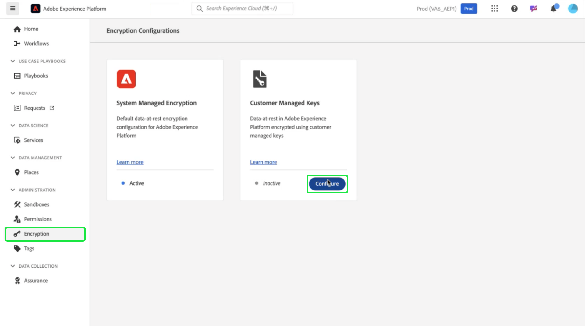

# Come utilizzare Amazon Web Services Key Management Service per la crittografia dei dati Adobe Experience Platform

>[!AVAILABILITY]
>
>Questo documento si applica alle implementazioni di Experience Platform in esecuzione su Amazon Web Services (AWS). Un Experience Platform in esecuzione su AWS è attualmente disponibile per un numero limitato di clienti. Per ulteriori informazioni sull&#39;infrastruttura Experience Platform supportata, consulta l&#39;[panoramica sul cloud multiplo di Experience Platform](https://experienceleague.adobe.com/en/docs/experience-platform/landing/multi-cloud).
>
>[Le chiavi gestite dal cliente](../customer-managed-keys/overview.md) (CMK) su AWS sono supportate per Privacy e Security Shield, ma non sono disponibili per Healthcare Shield. CMK su Azure è supportato per Privacy e Security Shield e Healthcare Shield.

Utilizza questa guida per proteggere i dati con il servizio Key Management Service (KMS) di Amazon Web Services (AWS) creando, gestendo e controllando le chiavi di crittografia per Adobe Experience Platform. Questa integrazione semplifica la conformità, semplifica le operazioni attraverso l&#39;automazione ed elimina la necessità di mantenere la propria infrastruttura di gestione delle chiavi.

Per istruzioni specifiche per il Customer Journey Analytics, consulta la [documentazione CMK del Customer Journey Analytics](https://experienceleague.adobe.com/en/docs/analytics-platform/using/cja-privacy/cmk)

>[!IMPORTANT]
>
>Adobe Experience Platform crittografa i dati inattivi per impostazione predefinita utilizzando le chiavi gestite dal sistema. Abilitando Customer Managed Keys (CMK), puoi assumere il controllo completo della sicurezza dei dati. Tuttavia, questa modifica è irreversibile e, una volta abilitata la CMK, non è più possibile ripristinare le chiavi gestite dal sistema. L’utente è responsabile della gestione sicura delle chiavi per garantire un accesso ininterrotto ai dati e impedire potenziali inaccessibilità.

Questa guida descrive la procedura per creare e gestire le chiavi di crittografia nel KMS di AWS per proteggere i dati in Experience Platform.

## Prerequisiti {#prerequisites}

Prima di continuare con questo documento, è necessario conoscere bene i concetti e le funzionalità chiave seguenti:

- **Servizio di gestione delle chiavi di AWS**: comprendere le nozioni di base di AWS KMS, incluse le modalità di creazione, gestione e rotazione delle chiavi di crittografia. Per ulteriori informazioni, consulta la [documentazione ufficiale di KMS](https://docs.aws.amazon.com/kms/).
- **Criteri di gestione delle identità e degli accessi (IAM) in AWS**: IAM è un servizio che consente di gestire l&#39;accesso ai servizi e alle risorse di AWS in modo sicuro. Utilizza IAM per:
   - Definisci quali utenti, gruppi e ruoli hanno accesso a risorse specifiche.
   - Specifica le azioni che gli utenti possono eseguire o le quali non possono eseguire.
   - Implementa un controllo dell’accesso dettagliato assegnando le autorizzazioni tramite i criteri IAM.
Per ulteriori informazioni, consulta la [documentazione ufficiale dei criteri IAM per AWS KMS](https://docs.aws.amazon.com/kms/latest/developerguide/iam-policies.html).
- **Sicurezza dei dati nell&#39;Experience Platform**: scopri in che modo Platform garantisce la sicurezza dei dati e si integra con servizi esterni come AWS KMS per la crittografia. Platform protegge i dati con HTTPS TLS v1.2 per il transito, la crittografia del provider cloud su disco, l’archiviazione isolata e opzioni di autenticazione e crittografia personalizzabili. Per ulteriori informazioni su come proteggere i dati, consulta la [panoramica su governance, privacy e sicurezza](../overview.md) o il documento sulla crittografia dei dati [in Platform](../encryption.md).
- **AWS Management Console**: hub centrale da cui è possibile accedere e gestire tutti i servizi AWS da un&#39;unica applicazione basata sul Web. Utilizza la barra di ricerca per trovare rapidamente strumenti, controllare le notifiche, gestire il tuo account e la fatturazione e personalizzare le impostazioni. Per ulteriori informazioni, consulta la [documentazione ufficiale della console di gestione AWS](https://docs.aws.amazon.com/awsconsolehelpdocs/latest/gsg/what-is.html).

## Introduzione {#get-started}

Questa guida richiede che tu abbia già accesso a un account Amazon Web Services e alla console di gestione. Per iniziare, segui i passaggi seguenti:

1. **Verifica autorizzazioni**: assicurati di disporre delle autorizzazioni AWS Identity and Access Management (IAM) necessarie per creare, gestire e utilizzare le chiavi di crittografia in KMS. Per verificare le autorizzazioni:
   1. Accedere a [IAM Policy Simulator](https://policysim.aws.amazon.com/).
   1. Seleziona l’account utente o il ruolo.
   1. Simulare azioni KMS come `kms:CreateKey` o `kms:Encrypt`.
Se la simulazione restituisce un errore o non sei sicuro delle tue autorizzazioni, consulta l’amministratore AWS per assistenza.

1. **Verifica la configurazione dell&#39;account AWS**: verifica che l&#39;account AWS sia abilitato per l&#39;utilizzo dei servizi AWS KMS. La maggior parte degli account dispone dell&#39;accesso KMS per impostazione predefinita, ma puoi rivedere la configurazione dell&#39;account visitando [AWS Management Console](https://aws.amazon.com/console/). Per ulteriori dettagli, vedere la [Guida per gli sviluppatori di AWS Key Management Service](https://docs.aws.amazon.com/kms/latest/developerguide/overview.html).

1. **Seleziona un&#39;area supportata**: AWS KMS è disponibile in aree specifiche. Assicurati di operare in un’area in cui è supportato KMS. È possibile visualizzare un elenco completo delle aree supportate nell&#39;[elenco di endpoint e quote di AWS KMS](https://aws.amazon.com/about-aws/global-infrastructure/regional-product-services/).

### Passa a AWS KMS per iniziare la configurazione della chiave

>[!IMPORTANT]
>
>Garantire l&#39;archiviazione sicura, l&#39;accesso e la disponibilità delle chiavi di crittografia. L’utente è responsabile della gestione delle chiavi e della prevenzione delle interruzioni delle operazioni di Platform.

Per iniziare a configurare e gestire la chiave di crittografia, accedi al tuo account AWS e passa a AWS Key Management Service (KMS). Da AWS Management Console e selezionare **Key Management Service (KMS)** dal menu Services.


## Crea una nuova chiave {#create-a-key}

Verrà visualizzata l&#39;area di lavoro [!DNL Key Management Service (KMS)]. Seleziona **[!DNL Create a key]**.


## Configurare le impostazioni della chiave {#configure-key}

Verrà visualizzato il flusso di lavoro [!DNL Configure Key]. Per impostazione predefinita, il tipo di chiave è impostato su **[!DNL Symmetric]** e l&#39;utilizzo della chiave su **[!DNL Encrypt and Decrypt]**. Assicurati che queste opzioni siano selezionate prima di procedere.


Espandere il menu a discesa **[!DNL Advanced options]**. Si consiglia di utilizzare l&#39;opzione **[!DNL KMS]**, che consente ad AWS di creare e gestire il materiale chiave. L&#39;opzione **[!DNL KMS]** è selezionata per impostazione predefinita.

>[!NOTE]
>
>Se disponi già di una chiave, puoi importare materiale della chiave esterna o utilizzare l&#39;archivio chiavi [!DNL CloudHSM] di AWS. Queste opzioni non sono incluse nell&#39;ambito del presente documento.

Selezionare quindi l&#39;impostazione [!DNL Regionality], che specifica l&#39;ambito di area della chiave. Selezionare **[!DNL Single-Region key]**, seguito da **[!DNL Next]** per procedere al secondo passaggio.

>[!IMPORTANT]
>
>AWS applica restrizioni di area per le chiavi KMS. Questa restrizione di area significa che la chiave deve trovarsi nella stessa area del tuo account Adobe. Adobe può accedere solo alle chiavi KMS che si trovano nell’area geografica del tuo account. Assicurati che l’area selezionata corrisponda a quella del tuo account Adobe a tenant singolo.


## Etichettare e assegnare tag alla chiave {#add-labels-and-tags-to-key}

Viene visualizzata la seconda fase [!DNL Add labels] del flusso di lavoro. Qui puoi configurare i campi [!DNL Alias] e [!DNL Tags] per gestire e individuare la chiave di crittografia dalla console AWS KMS.

Immettere un&#39;etichetta descrittiva per la chiave nel campo di input **[!DNL Alias]**. L’alias funge da identificatore intuitivo per individuare rapidamente la chiave utilizzando la barra di ricerca nella console KMS di AWS. Per evitare confusione, scegli un nome significativo che rifletta lo scopo della chiave, ad esempio &quot;Adobe-Platform-Key&quot; o &quot;Customer-Encryption-Key&quot;. È inoltre possibile includere una descrizione della chiave se l&#39;alias della chiave non è sufficiente per descriverne lo scopo.

Infine, assegna i metadati alla chiave aggiungendo coppie chiave-valore nella sezione [!DNL Tags]. Questo passaggio è facoltativo, ma è necessario aggiungere tag per categorizzare e filtrare le risorse AWS al fine di semplificarne la gestione. Ad esempio, se la tua organizzazione utilizza più risorse relative ad Adobe, puoi assegnare loro i tag &quot;Adobe&quot; o &quot;Experience-Platform&quot;. Questo passaggio aggiuntivo semplifica la ricerca e la gestione di tutte le risorse associate in AWS Management Console. Selezionare **[!DNL Add tag]** per avviare il processo.

<!-- I do not have an AWS account with which to document the Add tag process as yet. -->

Quando si è soddisfatti delle impostazioni, selezionare **[!DNL Next]** per continuare il flusso di lavoro.


## Definire le autorizzazioni amministrative chiave {#define-key-admins}

Viene visualizzato il terzo passaggio del flusso di lavoro di creazione della chiave. Per garantire un accesso sicuro e controllato, puoi scegliere quali utenti e ruoli IAM possono gestire la chiave. In questa fase sono disponibili due opzioni: [!DNL Key administrators] e [!DNL Key deletion]. Nella sezione **[!DNL Key administrators]** selezionare una o più caselle di controllo accanto al nome di qualsiasi utente o ruolo a cui si desidera concedere le autorizzazioni di amministratore per questa chiave.

>[!NOTE]
>
>In questa fase del flusso di lavoro non è possibile creare amministratori.

Nella sezione **[!DNL Key deletion]**, abilita la casella di controllo per consentire agli amministratori di chiavi il diritto di eliminare questa chiave. Se non si seleziona la casella di controllo, agli utenti amministratori non è consentito eseguire tale operazione.

Selezionare **[!DNL Next]** per continuare il flusso di lavoro.


## Concedere l’accesso agli utenti chiave {#assign-key-users}

Nel passaggio quattro del flusso di lavoro, è possibile [!DNL Define key usage permissions]. Dall&#39;elenco **[!DNL Key users]** selezionare le caselle di controllo per tutti gli utenti e i ruoli IAM per i quali si desidera disporre dell&#39;autorizzazione all&#39;utilizzo di questa chiave.

Da questa visualizzazione, è anche possibile [!DNL Add another AWS account]; tuttavia, si sconsiglia vivamente di aggiungere altri account AWS. L&#39;aggiunta di un altro account può comportare rischi e complicare la gestione delle autorizzazioni per le operazioni di crittografia e decrittografia. Mantenendo la chiave associata a un singolo account AWS, Adobe garantisce l’integrazione sicura con AWS KMS, riducendo al minimo i rischi e garantendo un funzionamento affidabile.

Selezionare **[!DNL Next]** per continuare il flusso di lavoro.


## Verifica configurazione chiave {#review}

Viene visualizzata la fase di revisione della configurazione della chiave. Verificare i dettagli chiave nelle sezioni [!DNL Key configuration] e [!DNL Alias and description].

>[!NOTE]
>
>Assicurati che l’area chiave sia la stessa dell’account AWS.


### Aggiorna il criterio chiave per integrare la chiave con Experience Platform

Quindi, modifica il JSON nella sezione **[!DNL Key Policy]** per integrare la chiave con Experience Platform. Un criterio chiave predefinito è simile al JSON seguente.

<!-- The AWS ID below is fake. Q) Can I refer to it simply as AWS_ACCOUNT_ID ? Is that suitable? -->

```JSON
{
  "Id": "key-consolepolicy-3",
  "Version": "2012-10-17",
  "Statement": [
    {
      "Sid": "Enable IAM User Permissions",
      "Effect": "Allow",
      "Principal": {
        "AWS": "arn:aws:iam::123464903283:root" // this is a mock AWS Principal ID, your ID will differ
      },
      "Action": "kms:*",
      "Resource": "*"
    }
  ]
}
```

Nell&#39;esempio precedente, tutte le risorse (`"Resource": "*"`) nello stesso account (`Principal.AWS`) possono accedere a questa chiave. Il criterio consente ad altri servizi nello stesso account di utilizzare la chiave per eseguire la crittografia e la decrittografia. I servizi dispongono solo dell&#39;autorizzazione per questo account.

Quindi, concedi all’account tenant singolo di Platform l’accesso a questa chiave aggiungendo nuove istruzioni a questo criterio. Puoi ottenere i criteri JSON dall’interfaccia utente di Platform e applicarli alla chiave KMS di AWS per collegarli alla piattaforma in modo sicuro.

Passa all’interfaccia utente di Platform. Nella sezione **[!UICONTROL Amministrazione]** della barra di navigazione a sinistra, seleziona **[!UICONTROL Crittografia]**. Verrà visualizzata l&#39;area di lavoro [!UICONTROL Configurazione crittografia]. Quindi seleziona **[!UICONTROL Configura]** nella scheda [!UICONTROL Chiavi gestite dal cliente].



Viene visualizzata la [!UICONTROL configurazione chiavi gestite dal cliente]. Selezionare l&#39;icona Copia () per copiare il criterio CMK KMS negli Appunti. Una notifica pop-up verde conferma che il criterio è stato copiato.


<!-- This part of the workflow was in contention at the time of the demo.  -->

Quindi, torna all’area di lavoro del KMS di AWS e aggiorna il criterio chiave mostrato di seguito.


Aggiungere al criterio predefinito le quattro istruzioni dell&#39;area di lavoro [!UICONTROL Configurazione crittografia piattaforma], come illustrato di seguito: `Enable IAM User Permissions`, `CJA Flow IAM User Permissions`, `CJA Integrity IAM User Permissions`, `CJA Oberon IAM User Permissions`.

```json
{
    "Version": "2012-10-17",
    "Id": "key-consolepolicy",
    "Statement": [
        {
            "Sid": "Enable IAM User Permissions",
            "Effect": "Allow",
            "Principal": {
                "AWS": "arn:aws:iam::975049898882:root" // this is a mock AWS Principal ID, your ID will differ
            },
            "Action": [
                "kms:Decrypt",
                "kms:Encrypt",
                "kms:ReEncrypt*",
                "kms:GenerateDataKey*",
                "kms:DescribeKey",
                "kms:CreateGrant"
            ],
            "Resource": "*",
            "Condition": {
                "StringEquals": {
                    "aws:PrincipalAccount": "975049898882" // this is a mock AWS Principal ID, your ID will differ
                }
            }
        },
        {
            "Sid": "CJA Flow IAM User Permissions",
            "Effect": "Allow",
            "Principal": {
                "AWS": "arn:aws:iam::767397686373:root"
            },
            "Action": [
                "kms:Decrypt",
                "kms:Encrypt",
                "kms:ReEncrypt*",
                "kms:GenerateDataKey*",
                "kms:DescribeKey",
                "kms:CreateGrant"
            ],
            "Resource": "*",
            "Condition": {
                "StringEquals": {
                    "aws:PrincipalAccount": "767397686373"
                }
            }
        },
        {
            "Sid": "CJA Integrity IAM User Permissions",
            "Effect": "Allow",
            "Principal": {
                "AWS": "arn:aws:iam::730335345392:root"
            },
            "Action": [
                "kms:Decrypt",
                "kms:Encrypt",
                "kms:ReEncrypt*",
                "kms:GenerateDataKey*",
                "kms:DescribeKey",
                "kms:CreateGrant"
            ],
            "Resource": "*",
            "Condition": {
                "StringEquals": {
                    "aws:PrincipalAccount": "730335345392"
                }
            }
        },
        {
            "Sid": "CJA Oberon IAM User Permissions",
            "Effect": "Allow",
            "Principal": {
                "AWS": "arn:aws:iam::891377157113:root"
            },
            "Action": [
                "kms:Decrypt",
                "kms:Encrypt",
                "kms:ReEncrypt*",
                "kms:GenerateDataKey*",
                "kms:DescribeKey",
                "kms:CreateGrant"
            ],
            "Resource": "*",
            "Condition": {
                "StringEquals": {
                    "aws:PrincipalAccount": "891377157113"
                }
            }
        }
    ]
}
```


Selezionare **[!DNL Finish]** per confermare i dettagli chiave con il criterio aggiornato e creare la chiave. La chiave e il criterio sono stati configurati con un totale di cinque istruzioni per consentire al tuo account AWS di comunicare con l’account Experience Platform. L&#39;effetto è istantaneo.

Viene visualizzata l&#39;area di lavoro [!DNL Customer managed keys] aggiornata dell&#39;AWS [!DNL Key Management Service].

### Aggiungere i dettagli della chiave di crittografia AWS alla piattaforma

Quindi, per abilitare la crittografia, aggiungi il nome risorsa Amazon (ARN) della chiave alla [!UICONTROL configurazione di chiavi gestite dal cliente] della piattaforma. Dalla sezione [!DNL Customer Managed Keys] di AWS, seleziona l&#39;alias della nuova chiave dall&#39;elenco in [!DNL Key Management Service].


Vengono visualizzati i dettagli della chiave. Tutto in AWS ha un nome di risorsa Amazon (ARN) che
è un identificatore univoco utilizzato per specificare le risorse nei servizi AWS. Segue un formato standardizzato: `arn:partition:service:region:account-id:resource`.

Seleziona l’icona Copia per copiare l’ARN. Viene visualizzata una finestra di dialogo di conferma.


Ora torna all&#39;interfaccia utente di Platform [!UICONTROL Customer Managed Keys configuration]. Nella sezione **[!UICONTROL Aggiungi dettagli chiave di crittografia AWS]**, aggiungi un **[!UICONTROL nome configurazione]** e la **[!UICONTROL chiave KMS ARN]** copiata dall&#39;interfaccia utente di AWS.


Quindi, seleziona **[!UICONTROL SALVA]** per inviare il nome della configurazione, la chiave KMS ARN e avviare la convalida della chiave.


Sei tornato all&#39;area di lavoro [!UICONTROL Configurazioni crittografia]. Lo stato della configurazione della crittografia viene visualizzato nella parte inferiore della scheda **[!UICONTROL Chiavi gestite dal cliente]**.


Una volta convalidata la chiave, gli identificatori di Vault chiave vengono aggiunti al data lake e agli archivi dati del profilo per tutte le sandbox.

>[!NOTE]
>
>La durata del processo dipende dalla dimensione dei dati. In genere, il processo viene completato in meno di 24 ore. Ogni sandbox viene generalmente aggiornata in due o tre minuti.

## Revoca chiave {#key-revocation}

>[!IMPORTANT]
>
>Comprendi le implicazioni della revoca della chiave sulle applicazioni a valle prima di revocare qualsiasi accesso.

Di seguito sono riportate le considerazioni principali per la revoca della chiave:

- La revoca o la disattivazione della chiave renderà i dati di Platform inaccessibili. Questa azione è irreversibile e deve essere eseguita con cautela.
- Considera le timeline di propagazione quando l’accesso alle chiavi di crittografia viene revocato. Gli archivi dati primari diventano inaccessibili in pochi minuti o in 24 ore. Gli archivi di dati memorizzati nella cache o transitori diventano inaccessibili entro sette giorni.

Per revocare una chiave, accedi all’area di lavoro del servizio di gestione delle chiavi di AWS. Nella sezione **[!DNL Customer managed keys]** sono visualizzate tutte le chiavi disponibili per il tuo account AWS. Seleziona l’alias della chiave dall’elenco.


Vengono visualizzati i dettagli della chiave. Per disattivare la chiave, selezionare **[!DNL Key actions]**, quindi **[!DNL Disable]** dal menu a discesa.


Viene visualizzata una finestra di dialogo di conferma. Seleziona **[!DNL Disable key]** per confermare la scelta. L’impatto della disattivazione della chiave dovrebbe riflettersi nelle applicazioni Platform e nell’interfaccia utente entro circa cinque minuti.

>[!NOTE]
>
>Dopo aver disabilitato la chiave, puoi abilitarla nuovamente utilizzando lo stesso metodo descritto in precedenza, qualora necessario. Questa opzione è disponibile dal menu a discesa **[!DNL Key actions]**.


In alternativa, se la chiave viene utilizzata in altri servizi, puoi rimuovere l’accesso, ad Experience Platform direttamente dal criterio chiave. Seleziona **[!UICONTROL Modifica]** nella sezione **[!DNL Key Policy]**.


Viene visualizzata la pagina **[!DNL Edit key policy]**. Evidenzia ed elimina l’istruzione dei criteri, copiata dall’interfaccia utente di Platform, per rimuovere le autorizzazioni per l’app Chiavi gestite dal cliente. Quindi, selezionare **[!DNL Save changes]** per completare il processo.


## Rotazione chiave {#key-rotation}

AWS offre la rotazione automatica e su richiesta delle chiavi. Per ridurre il rischio di compromissione delle chiavi o soddisfare i requisiti di conformità per la sicurezza, è possibile generare automaticamente nuove chiavi di crittografia su richiesta o a intervalli regolari. Pianificare la rotazione automatica delle chiavi per limitare la durata di una chiave e assicurarsi che, se questa è compromessa, diventi inutilizzabile dopo la rotazione. Anche se i moderni algoritmi di crittografia sono altamente sicuri, la rotazione delle chiavi è un&#39;importante misura di conformità per la sicurezza e dimostra il rispetto delle best practice per la sicurezza.

### Rotazione automatica dei tasti {#automatic-key-rotation}

La rotazione automatica dei tasti è disattivata per impostazione predefinita. Per pianificare la rotazione automatica delle chiavi dall&#39;area di lavoro del servizio di gestione delle chiavi, selezionare la scheda **[!DNL Key rotation]**, seguita da **[!DNL Edit]** in **[!DNL Automatic key rotation section]**.


Verrà visualizzata l&#39;area di lavoro **[!DNL Edit automatic key rotation]**. Da qui, selezionare il pulsante di opzione per attivare o disattivare la rotazione automatica dei tasti. Utilizzare quindi il campo di immissione testo o il menu a discesa per scegliere un periodo di tempo per la rotazione dei tasti. Seleziona **[!DNL Save]** per confermare le impostazioni e tornare all&#39;area di lavoro dei dettagli chiave.

>[!NOTE]
>
>Il periodo minimo di rotazione dei tasti è di 90 giorni, quello massimo di 2.560.


### Rotazione chiave su richiesta {#on-demand-key-rotation}

Se la chiave corrente è compromessa, selezionare **[!DNL Rotate Now]** per ruotarla immediatamente. AWS consente solo 10 rotazioni su richiesta. Utilizza una rotazione chiave pianificata a meno che la sicurezza non sia già stata compromessa.


## Passaggi successivi

Dopo aver letto questo documento, hai imparato a creare, configurare e gestire le chiavi di crittografia in AWS KMS per l’utilizzo con Adobe Experience Platform. Come passo successivo, prendere in considerazione la revisione delle politiche di sicurezza e conformità dell&#39;organizzazione per garantire procedure di gestione delle chiavi corrette, ad esempio la rotazione delle chiavi pianificata e lo storage delle chiavi sicuro.
