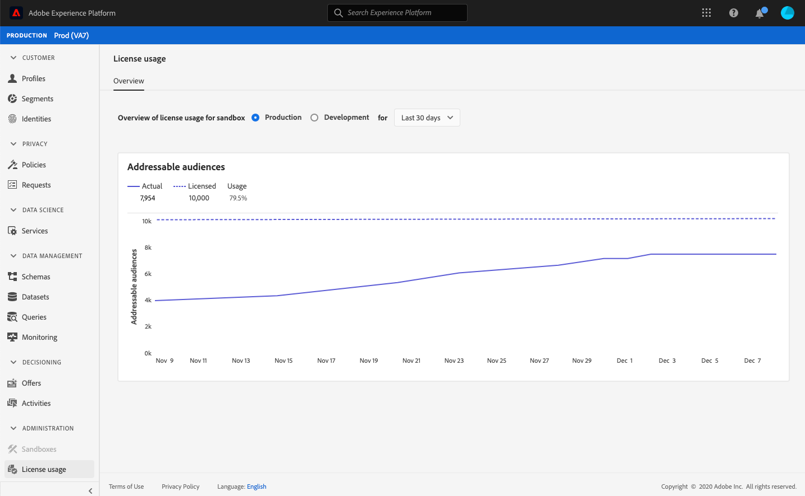

# (Alfa) [!UICONTROL License usage] dashboard {#license-usage-dashboard}

>[!IMPORTANT]
>
>La funzionalità del dashboard descritta in questo documento è attualmente in alfa e non è disponibile per tutti gli utenti. La documentazione e le funzionalità sono soggette a modifiche.

L&#39;interfaccia utente di Adobe Experience Platform (interfaccia utente) fornisce una dashboard attraverso la quale è possibile visualizzare informazioni importanti sull&#39;utilizzo della licenza da parte dell&#39;azienda, come acquisito durante un&#39;istantanea giornaliera. Questa guida descrive come accedere e utilizzare il dashboard di utilizzo della licenza nell’interfaccia utente e fornisce ulteriori informazioni sulle visualizzazioni visualizzate nel dashboard.

Per una panoramica generale dell&#39;interfaccia utente della piattaforma, visitate la guida [all&#39;interfaccia utente del Experience Platform](ui-guide.md).

## Dati del dashboard di utilizzo licenza

Nel dashboard di utilizzo della licenza viene visualizzata un&#39;istantanea dei dati relativi alla licenza dell&#39;organizzazione per  Experience Platform. I dati nel dashboard vengono visualizzati esattamente come visualizzati nel momento in cui è stata scattata l&#39;istantanea. In altre parole, l&#39;istantanea non è un&#39;approssimazione o un esempio dei dati e il dashboard non viene aggiornato in tempo reale.

>[!NOTE]
>
>Eventuali modifiche o aggiornamenti apportati ai dati dopo l&#39;acquisizione dell&#39;istantanea non verranno visualizzati nel dashboard fino all&#39;acquisizione dell&#39;istantanea successiva.

## Esplorazione del dashboard di utilizzo della licenza

Per passare al dashboard di utilizzo della licenza nell&#39;interfaccia utente della piattaforma, selezionate **[!UICONTROL License usage]** nella barra a sinistra. Si apre con la **[!UICONTROL Overview]** scheda che mostra il dashboard.

### Selezionare una sandbox

Per scegliere una sandbox da visualizzare nel dashboard, selezionate [!UICONTROL Production] o [!UICONTROL Development]. La sandbox selezionata è indicata dal pulsante di scelta accanto al nome della sandbox.

>[!NOTE]
>
>La generazione di rapporti sui consumi per le sandbox è cumulativa per tutte le sandbox dello stesso tipo. In altre parole, selezionando [!UICONTROL Production] o [!UICONTROL Development] genererà rapporti su tutte le sandbox di produzione o di sviluppo, rispettivamente.

### Selezionare un intervallo di date

Dopo aver selezionato una sandbox, potete utilizzare il menu a discesa dell&#39;intervallo di date per selezionare il periodo di tempo da visualizzare nel dashboard. Sono disponibili tre opzioni: [!UICONTROL Last 30 days], [!UICONTROL Last 90 days]e [!UICONTROL Last 12 months]. Per impostazione predefinita, sono selezionati gli ultimi 30 giorni.

### Widget e metriche

Il dashboard di utilizzo della licenza è composto da widget, che mostrano metriche di sola lettura che forniscono informazioni importanti sull&#39;utilizzo della licenza da parte dell&#39;azienda. Per ulteriori informazioni su questi widget, consulta la sezione relativa ai widget disponibili in questa guida.

## widget disponibili {#available-widgets}

 Experience Platform attualmente fornisce un widget che è possibile utilizzare per visualizzare l&#39;utilizzo della licenza, con più widget che verranno rilasciati presto.

### [!UICONTROL Addressable audiences] {#addressable-audiences}

Il **[!UICONTROL Addressable audiences]** widget misura il numero totale di audience presenti nello store Profilo, dopo aver applicato un criterio di unione generato dal sistema per combinare tutti i set di dati presenti utilizzando un algoritmo grafico deterministico (privato). Il criterio di unione utilizzato per calcolare questa metrica viene generato dalla piattaforma e non può essere modificato, né può essere selezionato un altro criterio di unione.

## Dashboard aggiuntivi

L&#39;interfaccia utente della piattaforma offre dashboard aggiuntivi per visualizzare istantanee dei dati all&#39;interno  Experience Platform. Questi dashboard includono il profilo cliente in tempo reale e i segmenti. Per ulteriori informazioni su queste dashboard, seleziona uno dei seguenti collegamenti:

* [[!DNL Profile] dashboard](../profile/ui/profile-dashboard.md)
* [Pannello segmento](../segmentation/ui/segment-dashboard.md)

## Passaggi successivi

Seguendo questo documento è ora possibile individuare il dashboard di utilizzo della licenza e selezionare una sandbox da visualizzare. È inoltre necessario comprendere le metriche visualizzate nei widget disponibili. Per ulteriori informazioni sull&#39;interfaccia utente del Experience Platform , consulta la guida [all&#39;interfaccia utente della](ui-guide.md)piattaforma.