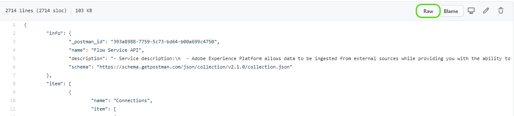

# Postman in Adobe Experience Platform

Postman è una piattaforma di collaborazione per lo sviluppo di API che consente di configurare ambienti con variabili preimpostate, condividere raccolte API, semplificare le richieste CRUD e altro ancora. La maggior parte dei servizi API di Platform dispone di raccolte Postman che possono essere utilizzate per facilitare l’esecuzione di chiamate API.

## Come impostare un ambiente Postman, ad Experience Platform

La seguente guida video illustra la creazione e la configurazione dell’ambiente Postman. Un ambiente Postman contiene tutte le intestazioni necessarie per effettuare chiamate API alle varie raccolte fornite di seguito. Una volta impostata, ogni volta che scade un valore (ad esempio un `ACCESS_TOKEN`) puoi aggiornare il valore corrente nell’ambiente e questo nuovo valore viene utilizzato in tutte le raccolte.

>[!VIDEO](https://video.tv.adobe.com/v/28832)

## Raccolte Postman {#collections}

Per trovare una cartella contenente tutte le raccolte Postman disponibili, visita il [Experience Platform di archivio GitHub di Postman](https://github.com/adobe/experience-platform-postman-samples/tree/master/apis/experience-platform). In alternativa, è possibile trovare un collegamento alla raccolta Postman in ogni singolo file swagger nel [Documentazione di riferimento API](https://www.adobe.com/go/platform-api-reference-en) su Adobe I/O.

Per scaricare una raccolta Postman, seleziona **[!DNL Raw]** dalla pagina GitHub per caricare il file JSON non elaborato in una nuova scheda. Quindi, fai clic con il pulsante destro del mouse e seleziona (Crea segmento da selezione) **[!DNL Save as]** per salvare il file in una destinazione locale di tua scelta.

## Importare una raccolta Postman {#import}

Per utilizzare un [Raccolta Postman](#collections), è necessario disporre di un ambiente configurato. Dopo aver completato la configurazione dell’ambiente, seleziona la **[!DNL Manage Environments]** nell&#39;angolo in alto a destra.

Viene visualizzato un popover che mostra tutti gli ambienti correnti. Per importare una raccolta, seleziona **[!DNL import]** .

Viene chiesto di scegliere un file da importare. Selezionare il file della raccolta Postman che si desidera importare. Una volta selezionata, la raccolta viene compilata nella barra a sinistra sotto la scheda Raccolte.

Ogni raccolta dispone di diverse coppie chiave-valore che potrebbero essere necessarie per eseguire un&#39;operazione CRUD riuscita. Rivedi i [Guida per gli sviluppatori API](api-guide.md#api-guides) per informazioni sui valori richiesti, suggerimenti e vedere esempi.

Per ulteriori informazioni sull’interfaccia utente di Postman e sulle sue funzioni disponibili, visita [Documentazione di Postman](https://learning.postman.com/docs/getting-started/navigating-postman/).

### Generare un token di accesso con Postman per un utilizzo non di produzione

>[!WARNING]
>
>Come indicato nella raccolta Postman del servizio Identity Management (IMS), i metodi di generazione indicati sono adatti per **utilizzo non di produzione**. La firma locale carica una libreria JavaScript da un host di terze parti e la firma remota invia la chiave privata a un servizio web di proprietà e gestito da Adobe. Anche se Adobe non memorizza questa chiave privata, le chiavi di produzione non devono mai essere condivise con nessuno.

Il video seguente utilizza [Raccolta Postman Identity Management Service (IMS)](https://github.com/adobe/experience-platform-postman-samples/blob/master/apis/ims/Identity%20Management%20Service.postman_collection.json) che possono essere scaricati dall’archivio GitHub pubblico.

>[!VIDEO](https://video.tv.adobe.com/v/29698/?quality=12&learn=on)

## Passaggi successivi

Questo documento illustra ambienti, raccolte e come importare le raccolte di Postman. Ora che Postman è pronto, visitare il [Guida introduttiva alla piattaforma](api-guide.md) per informazioni sulle intestazioni richieste, esempi e un elenco di [Guide API](api-guide.md#api-guides) disponibile per ciascun servizio Platform.
