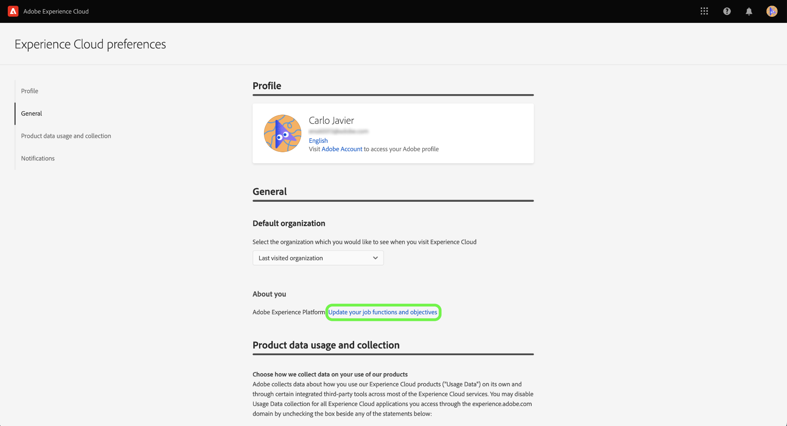

# Utilizza il sondaggio di auto-identificazione per creare il tuo profilo personale Experience Platform

>[!NOTE]
>
>L’indagine di auto-identificazione è in versione beta. Le sue funzioni e la sua documentazione sono soggette a modifiche.

Il sondaggio di auto-identificazione è un breve questionario presentato nella pagina Home dell’interfaccia utente di Adobe Experience Platform. È possibile compilare il sondaggio per fornire informazioni sulle funzioni lavorative e sugli obiettivi generali. Queste informazioni vengono quindi utilizzate per allineare meglio le guide interne al prodotto e, infine, per fornire contenuti più rilevanti per i tuoi obiettivi.

Questo documento fornisce informazioni su come utilizzare il sondaggio di auto-identificazione nell’interfaccia utente di Platform per ricevere contenuti rilevanti in base agli obiettivi e alle attività, nonché su come riconfigurare gli attributi del profilo personale utilizzando l’interfaccia utente.

Per ulteriori informazioni su Adobe Experience Platform, leggere [Panoramica Experience Platform](home.md).

## Sondaggio di auto-identificazione nell’interfaccia utente di Platform

All’accesso, la richiesta di sondaggio di identificazione automatica viene visualizzata in basso a destra nella home page dell’interfaccia utente di Platform.

Per iniziare il sondaggio, seleziona **[!UICONTROL Inizio]**.

Per la prima domanda di sondaggio, selezionare la funzione che meglio descrive il proprio lavoro.

Opzioni disponibili:

* Amministrazione
* Progettazione
* Privacy e governance
* Marketing
* Altro

>[!NOTE]
>
>È possibile selezionare più di una funzione dall&#39;elenco delle opzioni. Se si seleziona [!UICONTROL Altro], ti verrà chiesto di fornire dettagli sull’obiettivo.

Per continuare, seleziona le funzioni che meglio descrivono il lavoro corrente, quindi fai clic su **[!UICONTROL Successivo]**.

Quindi, seleziona gli obiettivi specifici che si applicano meglio al tuo lavoro.

L&#39;elenco degli obiettivi disponibili comprende:

* Creare e gestire gli utenti
* Assegnare ruoli, autorizzazioni e profili di prodotto
* Gestire l’utilizzo delle licenze, le sandbox e gli avvisi
* Configurare il sistema per l’acquisizione dei dati
* Modellare la struttura dati della mia organizzazione
* Esegui query, filtra e ottimizza i dati per generare insights
* Configurare il consenso e le policy dei dati
* Governance dei dati e conformità alla privacy
* Sviluppare strategie di marketing
* Creare, gestire e segmentare i tipi di pubblico
* Configurare dashboard per analizzare l’impatto sulle aziende
* Attiva i dati nelle destinazioni per il targeting a valle

Al termine, seleziona **[!UICONTROL Invia]**.

Una volta completato il sondaggio di identificazione automatica, seleziona **[!UICONTROL Fine]**.

>[!NOTE]
>
>Gli obiettivi e le raccomandazioni (se presenti) cambieranno in base alle funzioni di lavoro selezionate.

## Aggiorna le risposte al sondaggio

Aggiorna le funzioni e gli oggetti del processo utilizzando il menu delle preferenze di Experience Cloud. Per accedere al menu delle preferenze, seleziona l’icona del profilo nella navigazione superiore, quindi fai clic su **[!UICONTROL Preferenze]**.

Quindi, nella [!UICONTROL Generale] sezione del menu delle preferenze del profilo, seleziona **[!UICONTROL Aggiorna le tue funzioni lavorative e i tuoi obiettivi]**.

Viene visualizzato un sondaggio di identificazione automatica che consente di riconfigurare le risposte e aggiornare il profilo.

## Passaggi successivi

Dopo aver letto questo documento, hai inviato e aggiornato le informazioni relative alle funzioni lavorative e agli obiettivi, per ricevere contenuti più rilevanti quando utilizzi l’interfaccia utente di Platform. Per ulteriori informazioni sull’interfaccia utente di Platform, consulta [Panoramica Experience Platform](home.md).
