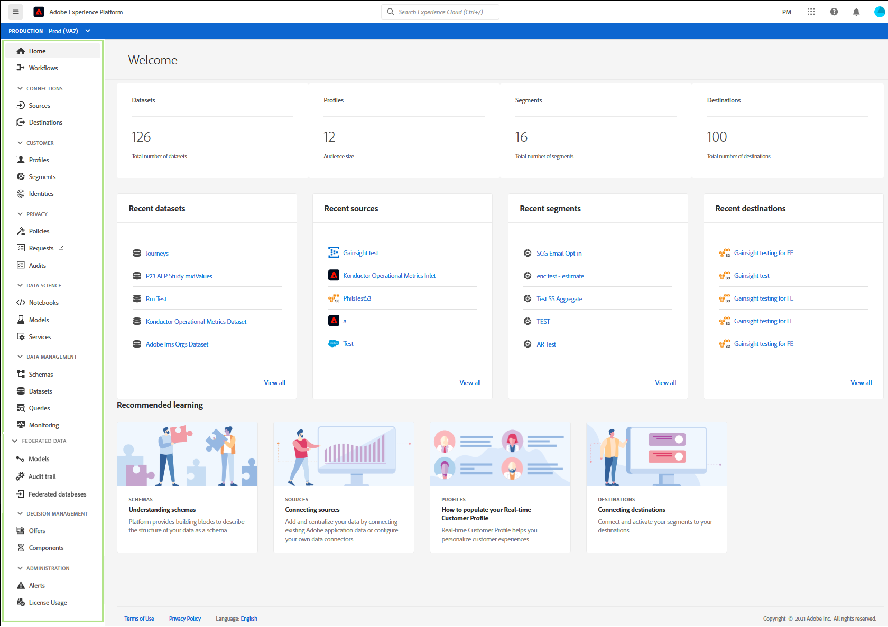

# Guida all&#39;interfaccia utente Adobe Experience Platform

Questa guida fornisce un’introduzione all’interfaccia utente (interfaccia utente) di Adobe Experience Platform, spiega i diversi componenti utilizzati e fornisce collegamenti verso ulteriori informazioni.

Per ulteriori informazioni su Adobe Experience Platform, leggere la [panoramica  Experience Platform](home.md).

## Schermata principale

Dopo aver effettuato l&#39;accesso in Adobe Experience Platform, ti trovi sulla pagina [!UICONTROL Home], composta dalle sezioni [dashboard metriche](#metrics), [dati recenti](#recent-data) e [apprendimento consigliato](#recommended-learning).

### Metriche

Il dashboard delle metriche fornisce schede che forniscono informazioni su set di dati, profili, segmenti e destinazioni all&#39;interno dell&#39;organizzazione.

La sezione **[!UICONTROL Datasets]** mostra il numero di set di dati all&#39;interno dell&#39;organizzazione IMS. Questo numero viene aggiornato al momento della creazione di un nuovo set di dati. Ulteriori informazioni sui set di dati sono disponibili nella [panoramica dei set di dati](../catalog/datasets/overview.md).

La sezione **[!UICONTROL Profiles]** mostra il numero totale di persone con profili all&#39;interno dell&#39;organizzazione IMS, esclusi i frammenti di profilo. Questo numero totale di persone rappresenta l&#39;audience totale indirizzabile ed è aggiornato una volta ogni 24 ore. Ulteriori informazioni sui profili sono disponibili nella [Panoramica sul profilo cliente in tempo reale](../profile/home.md).

La sezione **[!UICONTROL Segments]** mostra il numero totale di segmenti creati all&#39;interno dell&#39;organizzazione IMS. Questo numero viene aggiornato al momento della creazione di un nuovo segmento. Ulteriori informazioni sui segmenti sono disponibili nella [Panoramica del servizio di segmentazione](../segmentation/home.md).

La sezione **[!UICONTROL Destinations]** mostra il numero totale di destinazioni create per l&#39;organizzazione IMS. Questo numero viene aggiornato al momento della creazione di una nuova destinazione. Ulteriori informazioni sulle destinazioni sono disponibili nella [panoramica delle destinazioni](../destinations/home.md).

### Dati recenti

Il dashboard dati recente fornisce informazioni su set di dati, origini, segmenti e destinazioni creati di recente.

Nella sezione **[!UICONTROL Recent datasets]** sono elencati i cinque set di dati creati più di recente all&#39;interno dell&#39;organizzazione IMS. Questo elenco viene aggiornato ogni volta che viene creato un nuovo set di dati. È possibile selezionare un set di dati dall&#39;elenco per visualizzare ulteriori informazioni sul set di dati specificato oppure selezionare **[!UICONTROL View all]** per visualizzare un elenco di tutti i set di dati creati. Ulteriori informazioni sui set di dati sono disponibili nella [panoramica dei set di dati](../catalog/datasets/overview.md).

Nella sezione **[!UICONTROL Recent sources]** sono elencati i cinque connettori sorgente creati più di recente all&#39;interno dell&#39;organizzazione IMS. Questo elenco viene aggiornato ogni volta che viene creato un nuovo connettore di origine. È possibile selezionare una connessione di origine dall&#39;elenco per visualizzare ulteriori informazioni sul connettore specificato oppure selezionare **[!UICONTROL View all]** per visualizzare un elenco di tutte le connessioni di origine create. Ulteriori informazioni sulle origini sono disponibili nella [panoramica delle origini](../sources/home.md).

Nella sezione **[!UICONTROL Recent segments]** sono elencate le cinque definizioni di segmento create più di recente all&#39;interno dell&#39;organizzazione IMS. Questo elenco viene aggiornato ogni volta che viene creata una nuova definizione di segmento. È possibile selezionare una definizione di segmento dall&#39;elenco per visualizzare ulteriori informazioni sulla definizione di segmento specificata oppure selezionare **[!UICONTROL View all]** per visualizzare un elenco di tutte le definizioni di segmento create. Ulteriori informazioni sui segmenti sono disponibili nella [Panoramica del servizio di segmentazione](../segmentation/home.md).

Nella sezione **[!UICONTROL Recent destinations]** sono elencate le cinque destinazioni create più di recente all&#39;interno dell&#39;organizzazione IMS. Questo elenco viene aggiornato ogni volta che viene creata una nuova destinazione. È possibile selezionare una destinazione dall&#39;elenco per visualizzare ulteriori informazioni sulla destinazione specificata oppure selezionare **[!UICONTROL View all]** per visualizzare un elenco di tutte le destinazioni create. Ulteriori informazioni sulle destinazioni sono disponibili nella [panoramica delle destinazioni](../destinations/home.md).

### Apprendimento consigliato

La sezione **[!UICONTROL Recommended learning]** contiene collegamenti a documenti utili per iniziare a utilizzare Adobe Experience Platform.

## Barra di navigazione superiore

La barra di navigazione superiore nell’interfaccia utente della piattaforma mostra l’organizzazione IMS a cui siete attualmente collegati e fornisce diversi controlli importanti.

Sul lato sinistro della barra di navigazione si trova il logo Adobe Experience Platform. Selezionando questa opzione in qualsiasi momento potrete tornare alla schermata iniziale dell&#39;interfaccia utente della piattaforma.

### Switcher di organizzazione IMS

Il primo elemento a destra della barra di navigazione superiore è il **switcher di organizzazione IMS**.

Selezionando lo switcher, si apre un menu a discesa delle organizzazioni IMS a cui avete accesso, se disponibili. Selezionare un&#39;opzione elencata per passare a tale organizzazione IMS.

### Cambiare le applicazioni

L&#39;elemento successivo sul lato destro della navigazione superiore è il **commutatore applicazione**, rappresentato dall&#39;icona . Quando selezionate questa icona, potete passare  applicazioni di Adobe a cui l&#39;organizzazione IMS ha accesso, come  Experience Platform, Analytics, Assets e Launch.

### Aiuto

A destra dello switcher applicazione si trova il menu **help and support**, rappresentato dall&#39;icona . Quando selezionate questa icona, viene visualizzato un menu di scelta rapida contenente diverse risorse di aiuto e supporto. La scheda **[!UICONTROL Help]** contiene un elenco della documentazione pertinente per la pagina su cui si trova attualmente. La scheda **[!UICONTROL Support]** consente di creare un ticket di assistenza con il team di supporto del Adobe . La scheda **[!UICONTROL Feedback]** consente di inviare commenti sulla piattaforma a  Adobe.

### Notifiche e annunci

Nella sezione **notifiche**, rappresentata dall&#39;icona . La scheda **[!UICONTROL Notifications]** mostra informazioni importanti sul prodotto e altri aggiornamenti rilevanti, mentre la scheda **[!UICONTROL Announcements]** contiene informazioni sulla manutenzione del servizio.

### Profilo utente

L&#39;ultimo elemento nella barra di navigazione superiore è rappresentato dalle **impostazioni utente**, rappresentate dall&#39;icona . Selezionate questa icona per modificare le preferenze o disconnettervi.

### Sandbox

Immediatamente sotto la barra di navigazione superiore si trova la barra sandbox. Questa barra mostra la sandbox attualmente utilizzata per la piattaforma. Ulteriori informazioni sulle sandbox sono disponibili nella [panoramica delle sandbox](../sandboxes/home.md).

## Navigazione a sinistra {#left-nav}

La navigazione sul lato sinistro dello schermo elenca tutti i diversi servizi supportati nell&#39;interfaccia utente della piattaforma.

>[!IMPORTANT]
>
>Alcune delle sezioni della barra di navigazione a sinistra potrebbero non essere visualizzate o disattivate. Questo perché non avete accesso a tali funzioni. Se ritenete di dover accedere a queste sezioni, contattate l&#39;amministratore di sistema.

La sezione **[!UICONTROL Home]** consente di tornare alla home page dell&#39;interfaccia utente della piattaforma.

La sezione **[!UICONTROL Workflows]** mostra un elenco di flussi di lavoro con più fasi per l&#39;esecuzione di operazioni all&#39;interno della piattaforma. Ulteriori informazioni sui flussi di lavoro sono disponibili nella [panoramica dei flussi di lavoro](./workflows.md).

### [!UICONTROL Connections]

La sezione **[!UICONTROL Sources]** consente di creare, aggiornare ed eliminare connessioni di origine, consentendo di trasferire dati da origini esterne alla piattaforma. Ulteriori informazioni sulle origini sono disponibili nella [panoramica delle origini](../sources/home.md).

La sezione **[!UICONTROL Destinations]** consente di creare, aggiornare ed eliminare le destinazioni, consentendo di esportare i dati dalla piattaforma in molte destinazioni esterne. Ulteriori informazioni sulle destinazioni sono disponibili nella [panoramica delle destinazioni](../destinations/home.md).

### [!UICONTROL Customer]

La sezione **[!UICONTROL Profiles]** consente di esplorare i profili dei clienti, visualizzare le metriche del profilo, creare e gestire criteri di unione e visualizzare gli schemi di unione. Per ulteriori informazioni sull&#39;utilizzo della sezione [!UICONTROL Profiles], leggere la [[!DNL Profile] guida utente](../profile/ui/user-guide.md). Ulteriori informazioni sul profilo cliente in tempo reale sono disponibili nella [panoramica sul profilo cliente in tempo reale](../profile/home.md).

La sezione **[!UICONTROL Segments]** consente di creare e gestire le definizioni dei segmenti. Per ulteriori informazioni sull&#39;utilizzo della sezione [!UICONTROL Segments], leggere la [guida utente alla segmentazione](../segmentation/ui/overview.md). Ulteriori informazioni sul servizio di segmentazione sono disponibili nella [panoramica del servizio di segmentazione](../segmentation/home.md).

La sezione **[!UICONTROL Identities]** consente di creare e gestire gli spazi dei nomi delle identità. Per ulteriori informazioni sulla sezione [!UICONTROL Identities], comprese informazioni sugli spazi dei nomi identità e su come utilizzare le identità nell&#39;interfaccia utente della piattaforma, fare riferimento alla [panoramica dello spazio dei nomi identità](../identity-service/namespaces.md).

### [!UICONTROL Privacy]

La sezione **[!UICONTROL Policies]** consente di creare e gestire i criteri di utilizzo dei dati. Per ulteriori informazioni sull&#39;utilizzo della sezione Criteri, consultare la [guida utente dei criteri di utilizzo dei dati](../data-governance/policies/user-guide.md). Ulteriori informazioni sui criteri di utilizzo dei dati sono disponibili nella [panoramica dei criteri di utilizzo dei dati](../data-governance/policies/overview.md).

La sezione **[!UICONTROL Requests]** consente di creare e gestire le richieste di privacy. Per poter accedere all’interfaccia Privacy Service, è necessario essere inseriti nell&#39;elenco Consentiti. Per ulteriori informazioni sull&#39;utilizzo della sezione Richieste, consultare la [guida utente Privacy Service](../privacy-service/ui/user-guide.md). Ulteriori informazioni sui Privacy Service sono disponibili nella [Privacy Service overview](../privacy-service/home.md).

### [!UICONTROL Data Science]

La sezione **[!UICONTROL Notebooks]** fornisce l&#39;accesso a JupyterLab, un ambiente di sviluppo interattivo che consente di esplorare, analizzare e modellare i dati. Per ulteriori informazioni sull&#39;utilizzo della sezione Notebooks, leggere la [Guida utente di JupyterLab](../data-science-workspace/jupyterlab/overview.md). Ulteriori informazioni su Data Science Workspace sono disponibili nella [panoramica di Data Science Workspace](../data-science-workspace/home.md)

La sezione **[!UICONTROL Models]** consente di sfruttare l&#39;apprendimento automatico e l&#39;intelligenza artificiale per creare, sviluppare, formare e sintonizzare modelli per fare previsioni. Ulteriori informazioni sulla sezione Modelli sono disponibili nell&#39;esercitazione su [training e valutazione di un modello](../data-science-workspace/models-recipes/train-evaluate-model-ui.md).

La sezione **[!UICONTROL Services]** consente di gestire i modelli pubblicati per la formazione e il punteggio pianificati, o di sfruttare  Adobi  servizi intelligenti, un insieme di servizi AI che offrono esperienze cliente personalizzate in tempo reale. Ulteriori informazioni sulla sezione Servizi sono disponibili in [Pubblicazione di un modello come esercitazione sui servizi](../data-science-workspace/models-recipes/publish-model-service-ui.md).

### [!UICONTROL Data management]

La sezione **[!UICONTROL Schemas]** consente di creare e gestire gli schemi Experience Data Model (XDM). Per ulteriori informazioni sugli schemi, leggere l&#39;esercitazione su [creazione di uno schema](../xdm/tutorials/create-schema-ui.md). Ulteriori informazioni su XDM sono disponibili nella [Panoramica del sistema XDM](../xdm/home.md).

La sezione **[!UICONTROL Datasets]** consente di creare e gestire i set di dati. Ulteriori informazioni sui set di dati sono disponibili nella [guida utente dei set di dati](../catalog/datasets/user-guide.md).

La sezione **[!UICONTROL Queries]** consente di creare e gestire query, registrare query SQL eseguite da Adobe Experience Platform Query Service e visualizzare le credenziali PostgreSQL. Ulteriori informazioni sulle query sono disponibili nella [Guida utente del servizio query](../query-service/ui/overview.md).

La sezione **[!UICONTROL Monitoring]** consente di monitorare l&#39;inserimento di batch e streaming. Ulteriori informazioni sul monitoraggio sono disponibili nella [guida utente del monitoraggio dell&#39;inserimento dei dati](../ingestion/quality/monitor-data-ingestion.md).

### [!UICONTROL Decisioning]

 Offer Decisioning è un servizio applicazione integrato con Adobe Experience Platform. Consente di sfruttare  Experience Platform per offrire ai clienti la migliore offerta ed esperienza in tutti i punti di contatto al momento giusto. Per ulteriori informazioni su  Offer Decisioning, ad esempio sull&#39;utilizzo di [!UICONTROL Offers] e [!UICONTROL Activities] visitare la [ documentazione Offer Decisioning](https://experienceleague.adobe.com/docs/offer-decisioning.html).

### [!UICONTROL Administration]

L&#39;interfaccia utente della piattaforma (interfaccia utente) fornisce un dashboard attraverso il quale potete visualizzare informazioni importanti sull&#39;utilizzo della licenza dell&#39;organizzazione, come acquisito durante uno snapshot giornaliero. È possibile accedervi selezionando **[!UICONTROL License usage]** nella navigazione. Per ulteriori informazioni sul dashboard di utilizzo della licenza, visitare la [guida del dashboard di utilizzo della licenza](license-usage-dashboard.md).

>[!IMPORTANT]
>
>La funzionalità del dashboard di utilizzo licenza è attualmente in alfa e non è disponibile per tutti gli utenti. La documentazione e le funzionalità sono soggette a modifiche.

## Passaggi successivi

Leggendo questa guida, hai ora introdotto la pagina principale e i principali elementi di navigazione dell’interfaccia utente della piattaforma. Per informazioni più dettagliate sull&#39;utilizzo dell&#39;interfaccia utente, consulta la documentazione relativa a ciascun servizio Piattaforma. I collegamenti a questa documentazione sono forniti nella sezione [navigazione a sinistra](#left-nav) disponibile in precedenza in questo documento.