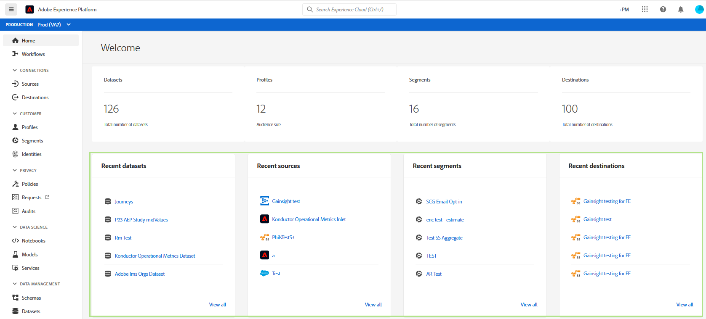

# Guida all’interfaccia utente di Adobe Experience Platform

Questa guida offre un’introduzione all’utilizzo dell’interfaccia utente di Adobe Experience Platform, spiegando a cosa servono i vari componenti e fornendo collegamenti verso ulteriori informazioni.

Per ulteriori informazioni su Adobe Experience Platform, leggere [Panoramica Experience Platform](home.md).

## Schermata iniziale

Dopo aver effettuato l’accesso a Adobe Experience Platform, accedi a [!UICONTROL Home] pagina, che è composta da [dashboard delle metriche](#metrics), [dati recenti](#recent-data), e [apprendimento consigliato](#recommended-learning) sezioni.

### Metriche

Il dashboard delle metriche fornisce schede che forniscono informazioni su set di dati, profili, segmenti e destinazioni all’interno della tua organizzazione.

Il **[!UICONTROL Set di dati]** mostra il numero di set di dati all’interno dell’organizzazione. Questo numero viene aggiornato quando viene creato un nuovo set di dati. Ulteriori informazioni sui set di dati sono disponibili nella sezione [panoramica dei set di dati](../catalog/datasets/overview.md).

Il **[!UICONTROL Profili]** mostra il numero totale di persone con profili all’interno dell’organizzazione, esclusi i frammenti di profilo. Questo numero totale di persone rappresenta il pubblico indirizzabile totale e viene aggiornato una volta ogni 24 ore. Ulteriori informazioni sui profili sono disponibili nella sezione [Panoramica del profilo cliente in tempo reale](../profile/home.md).

Il **[!UICONTROL Segmenti]** mostra il numero totale di segmenti creati all’interno dell’organizzazione. Questo numero viene aggiornato quando viene creato un nuovo segmento. Ulteriori informazioni sui segmenti sono disponibili nella sezione [Panoramica del servizio di segmentazione](../segmentation/home.md).

Il **[!UICONTROL Destinazioni]** mostra il numero totale di destinazioni create per l’organizzazione. Questo numero viene aggiornato quando viene creata una nuova destinazione. Ulteriori informazioni sulle destinazioni sono disponibili nella sezione [panoramica sulle destinazioni](../destinations/home.md).

### Dati recenti

Il dashboard dati recente fornisce informazioni su set di dati, origini, segmenti e destinazioni creati di recente.

Il **[!UICONTROL Set di dati recenti]** In questa sezione sono elencati gli ultimi cinque set di dati creati nell’organizzazione. Questo elenco viene aggiornato ogni volta che viene creato un nuovo set di dati. Puoi selezionare un set di dati dall’elenco per visualizzare ulteriori informazioni sul set di dati specificato oppure selezionare **[!UICONTROL Visualizza tutto]** per visualizzare un elenco di tutti i set di dati creati. Ulteriori informazioni sui set di dati sono disponibili nella sezione [panoramica dei set di dati](../catalog/datasets/overview.md).

Il **[!UICONTROL Origini recenti]** In questa sezione sono elencati gli ultimi cinque connettori di origine creati nell’organizzazione. Questo elenco viene aggiornato ogni volta che viene creato un nuovo connettore di origine. È possibile selezionare una connessione di origine dall&#39;elenco per visualizzare ulteriori informazioni sul connettore specificato oppure selezionare **[!UICONTROL Visualizza tutto]** per visualizzare un elenco di tutte le connessioni di origine create. Ulteriori informazioni sulle origini sono disponibili nella sezione [panoramica sulle origini](../sources/home.md).

Il **[!UICONTROL Segmenti recenti]** In questa sezione sono elencate le cinque definizioni di segmenti create più di recente all’interno dell’organizzazione. Questo elenco viene aggiornato ogni volta che viene creata una nuova definizione di segmento. Puoi selezionare una definizione di segmento dall’elenco per visualizzare ulteriori informazioni sulla definizione di segmento specificata oppure selezionare **[!UICONTROL Visualizza tutto]** per visualizzare un elenco di tutte le definizioni di segmenti create. Ulteriori informazioni sui segmenti sono disponibili nella sezione [Panoramica del servizio di segmentazione](../segmentation/home.md).

Il **[!UICONTROL Destinazioni recenti]** In questa sezione sono elencate le cinque destinazioni create più di recente all’interno dell’organizzazione. Questo elenco viene aggiornato ogni volta che viene creata una nuova destinazione. È possibile selezionare una destinazione dall&#39;elenco per visualizzare ulteriori informazioni sulla destinazione specificata oppure selezionare **[!UICONTROL Visualizza tutto]** per visualizzare un elenco di tutte le destinazioni create. Ulteriori informazioni sulle destinazioni sono disponibili nella sezione [panoramica sulle destinazioni](../destinations/home.md).

### Risorse di apprendimento consigliate

Il **[!UICONTROL Apprendimento consigliato]** Questa sezione fornisce collegamenti a documentazione utile per iniziare a utilizzare Adobe Experience Platform.

## Barra di navigazione superiore

La barra di navigazione superiore nell’interfaccia utente di Platform mostra l’organizzazione a cui sei attualmente connesso e fornisce diversi controlli importanti.

Sul lato sinistro della barra di navigazione è presente il logo Adobe Experience Platform. Se selezioni questo logo in qualsiasi momento, torna alla schermata iniziale dell’interfaccia utente di Platform.

### Commutatore organizzazione

Il primo elemento a destra della barra di navigazione superiore è **Commutatore organizzazione**.

Selezionando il selettore si apre un menu a discesa contenente le organizzazioni a cui hai accesso, se disponibili. Per passare a un’altra organizzazione, seleziona un’opzione elencata.

### Cambiare applicazioni

L’elemento successivo a destra della navigazione superiore è il **commutatore applicazione**, rappresentato dal  icona. Quando selezioni questa icona, puoi passare da un’applicazione Adobe a cui la tua organizzazione ha accesso, come Experience Platform, Analytics, Assets e altre.

### Aiuto

A destra del commutatore dell&#39;applicazione si trova il **menu guida e supporto**, rappresentato dal  icona. Quando selezioni questa icona, viene visualizzato un menu a comparsa contenente diverse risorse di aiuto e supporto. Il **[!UICONTROL Aiuto]** Questa scheda mostra un elenco della documentazione rilevante per la pagina che stai visitando. Il **[!UICONTROL Supporto]** Questa scheda ti consente di creare un ticket di supporto con il team di supporto Adobe. Il **[!UICONTROL Feedback]** La scheda ti consente di inviare ad Adobe un feedback su Platform.

### Notifiche e annunci

In **sezione notifiche**, rappresentato dal  icona. Il **[!UICONTROL Notifiche]** mostra informazioni importanti sul prodotto e altri aggiornamenti rilevanti, mentre il **[!UICONTROL Annunci]** Questa scheda mostra informazioni sulla manutenzione del servizio.

### Profilo utente

L’elemento finale nella barra di navigazione superiore è il **impostazioni utente**, rappresentato dal  icona. Seleziona questa icona per modificare le preferenze o uscire.

Puoi alternare tra il tema chiaro e scuro per l’interfaccia Platform con lo switch che si trova appena sotto il tuo nome e l’e-mail. Seleziona il tema desiderato.

### Sandbox

La barra della sandbox si trova immediatamente sotto la barra di navigazione superiore. Questa barra mostra quale sandbox stai utilizzando attualmente per Platform. Ulteriori informazioni sulle sandbox sono disponibili nella sezione [panoramica sulle sandbox](../sandboxes/home.md).

## Pannello di navigazione a sinistra {#left-nav}

Nella barra di navigazione a sinistra della schermata sono elencati tutti i diversi servizi supportati nell’interfaccia utente di Platform.

Fai clic sull’icona del menu per mostrare o nascondere il pannello di navigazione a sinistra.

Per bloccare la navigazione in posizione aperta, fai nuovamente clic su dopo aver visualizzato il pannello.

>[!IMPORTANT]
>
>La barra di navigazione a sinistra mostra solo le funzioni a cui sei in grado di accedere. Nelle versioni precedenti di Adobe Experience Platform, gli elementi non disponibili erano disabilitati. Se ritieni di dover accedere a una sezione che non viene visualizzata, contatta l’amministratore di sistema.

Il **[!UICONTROL Home]** consente di tornare alla pagina home dell’interfaccia utente di Platform.

Il **[!UICONTROL Flussi di lavoro]** Questa sezione mostra un elenco di flussi di lavoro con più passaggi per eseguire operazioni in Platform. Ulteriori informazioni sui flussi di lavoro sono disponibili nella sezione [panoramica dei flussi di lavoro](./workflows.md).

### [!UICONTROL Connessioni]

Il **[!UICONTROL Sorgenti]** Questa sezione ti consente di creare, aggiornare ed eliminare le connessioni di origine, consentendoti di acquisire in Platform dati da origini esterne. Ulteriori informazioni sulle origini sono disponibili nella sezione [panoramica sulle origini](../sources/home.md).

Il **[!UICONTROL Destinazioni]** Questa sezione ti consente di creare, aggiornare ed eliminare le destinazioni per esportare i dati da Platform a molte destinazioni esterne. Ulteriori informazioni sulle destinazioni sono disponibili nella sezione [panoramica sulle destinazioni](../destinations/home.md).

### [!UICONTROL Cliente]

Il **[!UICONTROL Profili]** Questa sezione ti consente di sfogliare i profili dei clienti, visualizzare le metriche dei profili, creare e gestire criteri di unione e visualizzare gli schemi di unione. Per ulteriori informazioni sull&#39;utilizzo di [!UICONTROL Profili] , leggi la sezione [[!DNL Profile] guida utente](../profile/ui/user-guide.md). Ulteriori informazioni su Real-Time Customer Profile sono disponibili nella sezione [Panoramica del profilo cliente in tempo reale](../profile/home.md).

Il **[!UICONTROL Tipi di pubblico]** consente di creare e gestire le definizioni dei segmenti. Per ulteriori informazioni sull&#39;utilizzo di [!UICONTROL Tipi di pubblico] , leggi la sezione [guida utente alla segmentazione](../segmentation/ui/overview.md). Ulteriori informazioni sul servizio di segmentazione sono disponibili nella sezione [Panoramica del servizio di segmentazione](../segmentation/home.md).

Il **[!UICONTROL Identità]** consente di creare e gestire gli spazi dei nomi di identità. Per ulteriori informazioni su [!UICONTROL Identità] , incluse informazioni sugli spazi dei nomi delle identità e su come utilizzare le identità nell’interfaccia utente di Platform, consulta [panoramica dello spazio dei nomi delle identità](../identity-service/features/namespaces.md).

### [!UICONTROL Privacy]

Il **[!UICONTROL Criteri]** consente di creare e gestire i criteri di utilizzo dei dati. Per ulteriori informazioni sull’utilizzo della sezione Criteri, consulta la sezione [guida utente sui criteri di utilizzo dei dati](../data-governance/policies/user-guide.md). Ulteriori informazioni sui criteri di utilizzo dei dati sono disponibili nella sezione [panoramica dei criteri di utilizzo dei dati](../data-governance/policies/overview.md).

Il **[!UICONTROL Richieste]** consente di creare e gestire le richieste di privacy. Tieni presente che per poter accedere all’interfaccia utente di Privacy Service devi essere inserito nell&#39;elenco Consentiti. Per ulteriori informazioni sull’utilizzo della sezione Richieste, consulta la sezione [Guida utente di Privacy Service](../privacy-service/ui/user-guide.md). Ulteriori informazioni su Privacy Service sono disponibili nella sezione [Panoramica di Privacy Service](../privacy-service/home.md).

### [!UICONTROL Data Science]

Il **[!UICONTROL Notebook]** fornisce accesso a JupyterLab, un ambiente di sviluppo interattivo che consente di esplorare, analizzare e modellare i dati. Per ulteriori informazioni sull’utilizzo della sezione Notebook, consulta la sezione [Guida utente di JupyterLab](../data-science-workspace/jupyterlab/overview.md). Ulteriori informazioni su Data Science Workspace sono disponibili nella sezione [Panoramica di Data Science Workspace](../data-science-workspace/home.md)

Il **[!UICONTROL Modelli]** Questa sezione consente di utilizzare l’apprendimento automatico e l’intelligenza artificiale per creare, sviluppare, addestrare e ottimizzare i modelli per effettuare previsioni. Ulteriori informazioni sulla sezione Modelli sono disponibili nell’esercitazione su [formazione e valutazione di un modello](../data-science-workspace/models-recipes/train-evaluate-model-ui.md).

Il **[!UICONTROL Servizi]** Questa sezione ti consente di gestire i modelli pubblicati per l’apprendimento pianificato e il punteggio, oppure di utilizzare Adobe Intelligent Services, un set di servizi di intelligenza artificiale che offre esperienze cliente personalizzate in tempo reale. Ulteriori informazioni sulla sezione Servizi sono disponibili nella sezione [Tutorial sulla pubblicazione di un modello come servizio](../data-science-workspace/models-recipes/publish-model-service-ui.md).

### [!UICONTROL Gestione dei dati]

Il **[!UICONTROL Schemi]** Questa sezione ti consente di creare e gestire gli schemi Experience Data Model (XDM). Per ulteriori informazioni sugli schemi, consulta l’esercitazione su [creazione di uno schema](../xdm/tutorials/create-schema-ui.md). Ulteriori informazioni su XDM sono disponibili nella sezione [Panoramica del sistema XDM](../xdm/home.md).

Il **[!UICONTROL Set di dati]** consente di creare e gestire i set di dati. Ulteriori informazioni sui set di dati sono disponibili nella sezione [guida utente sui set di dati](../catalog/datasets/user-guide.md).

Il **[!UICONTROL Query]** sezione consente di creare e gestire query, registrare query SQL eseguite da Adobe Experience Platform Query Service e visualizzare [!DNL PostgreSQL] credenziali. Ulteriori informazioni sulle query sono disponibili nella sezione [Guida utente di Query Service](../query-service/ui/overview.md).

Il **[!UICONTROL Monitorare]** consente di monitorare l’acquisizione in batch e in streaming. Ulteriori informazioni sul monitoraggio sono disponibili nella sezione [guida utente sul monitoraggio dell’acquisizione dei dati](../ingestion/quality/monitor-data-ingestion.md).

### [!UICONTROL Decisioning]

Adobe Journey Optimizer è un servizio applicativo basato su Experience Platform. Consente di utilizzare tecnologie decisionali potenti per offrire ai clienti l’offerta e l’esperienza migliore al momento giusto, in tutti i punti di contatto. Per ulteriori informazioni su Journey Optimizer, incluso l’utilizzo di [!UICONTROL Offerte] e [!UICONTROL Attività] visita il [Documentazione di Journey Optimizer](https://experienceleague.adobe.com/docs/journey-optimizer.html?lang=it).

### [!UICONTROL Amministrazione]

L’interfaccia utente di Platform fornisce una dashboard attraverso la quale puoi visualizzare informazioni importanti sull’utilizzo delle licenze della tua organizzazione, acquisite durante un’istantanea giornaliera. Accedi a questo dashboard selezionando **[!UICONTROL Utilizzo licenze]** nella navigazione. Per ulteriori informazioni sulla dashboard di utilizzo della licenza, visita [guida del dashboard utilizzo licenze](./license-usage-and-guardrails/license-usage-dashboard.md).

>[!IMPORTANT]
>
>La funzionalità del dashboard utilizzo licenze è attualmente in formato alfa e non è disponibile per tutti gli utenti. La documentazione e le funzionalità sono soggette a modifiche.

## Passaggi successivi

Una volta letta questa guida, potrai conoscere la home page e i principali elementi di navigazione dell’interfaccia utente di Platform. Per informazioni più dettagliate su come lavorare nell’interfaccia utente, consulta la documentazione per ogni singolo servizio di Platform. I collegamenti a questa documentazione sono forniti nella sezione [navigazione a sinistra](#left-nav) in questo documento.
