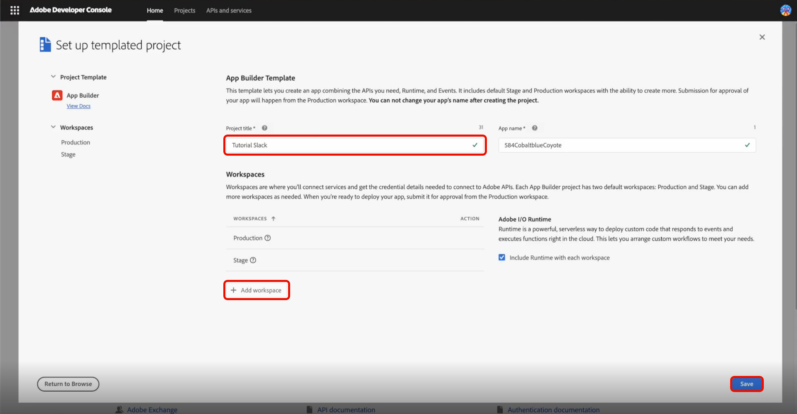
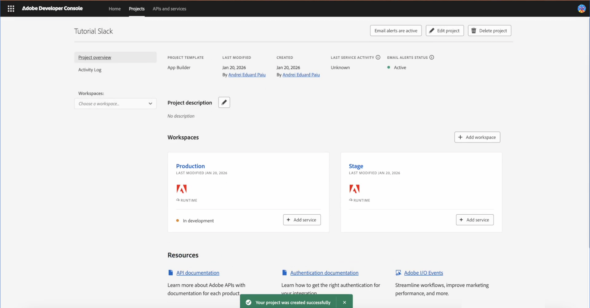
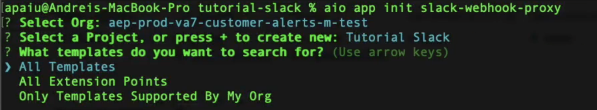
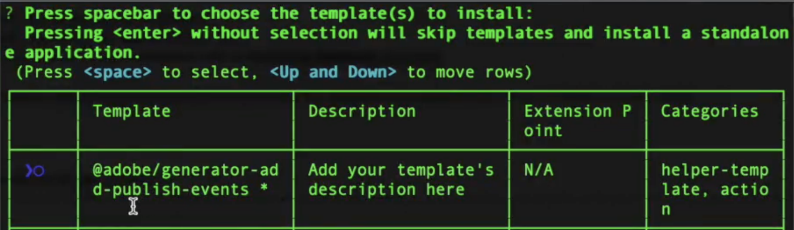
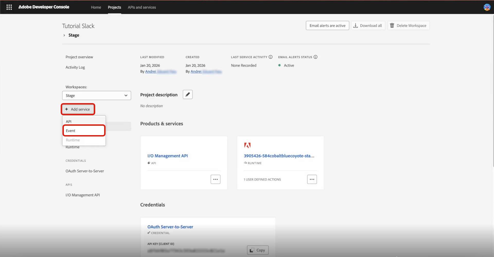
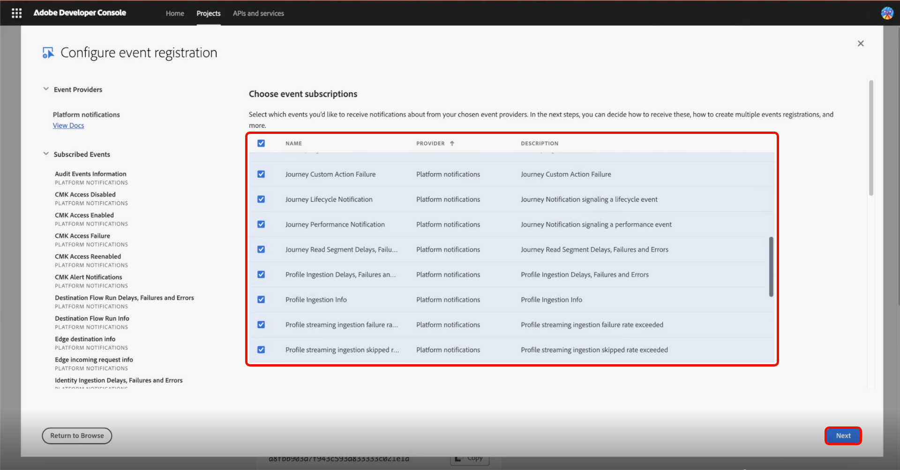

# Integrazione di Slack per gli avvisi rivolti ai clienti

Adobe Experience Platform consente di utilizzare un proxy webhook in [Adobe App Builder](https://developer.adobe.com/app-builder/docs/get_started/app_builder_get_started/first-app) per ricevere [Adobe I/O Events](https://developer.adobe.com/events/docs/guides/) in [!DNL Slack]. Il proxy gestisce l&#39;handshake di verifica di Adobe e trasforma i payload degli eventi in [!DNL Slack] messaggi, in modo da poter ricevere gli avvisi rivolti al cliente nella tua area di lavoro.

## Prerequisiti {#prerequisites}

Prima di iniziare, assicurati di disporre dei seguenti elementi:

* **Accesso a Adobe Developer Console**: ruolo Amministratore di sistema o Sviluppatore in un&#39;organizzazione con App Builder abilitato.
* **Node.js e npm**: Node.js (consigliato LTS), che include npm per l&#39;installazione delle dipendenze di Adobe CLI e del progetto. Per ulteriori informazioni, consulta la [Guida introduttiva di Node.js](https://nodejs.org/) e [npm](https://docs.npmjs.com/getting-started).
* **Adobe I/O CLI**: installa Adobe I/O CLI dal terminale: `npm install -g @adobe/aio-cli`.
* **App Slack con webhook in ingresso**: app Slack nell&#39;area di lavoro con **webhook in ingresso** abilitato. Consulta [Creare un&#39;app Slack](https://api.slack.com/apps) e la [Guida ai webhook in arrivo di Slack](https://api.slack.com/messaging/webhooks) per creare l&#39;app e ottenere l&#39;URL del webhook (formato: `https://hooks.slack.com/...`).

## Configurare un progetto basato su modelli {#templated-project}

Per configurare un progetto basato su modelli, accedere a Adobe Developer Console, quindi selezionare **[!UICONTROL Create project from template]** dalla scheda **[!UICONTROL Home]**.


Selezionare il modello **[!UICONTROL App Builder]**, quindi immettere un **[!UICONTROL Project Title]** e selezionare **[!UICONTROL Add workspace]**. Infine, selezionare **[!UICONTROL Save]**.



Riceverai la conferma che il progetto è stato creato e che verrà visualizzata la scheda **[!UICONTROL Project overview]**. Da qui puoi aggiungere **[!UICONTROL Project description]**.



## Inizializza progetto {#initialize-project}

Dopo aver configurato il progetto basato su modelli, inizializza il progetto.

1. Apri il terminale e immetti il seguente comando per accedere ad Adobe I/O.

   ```bash
   aio login
   ```

1. Inizializza l’applicazione e fornisci un nome.

   ```bash
   aio app init slack-webhook-proxy
   ```

1. Seleziona `Organization` utilizzando i tasti freccia, quindi seleziona `Project` creato in precedenza in Developer Console. Selezionare `Only Templates Supported By My Org` per i modelli da cercare. Quindi, premi **Invio** per saltare i modelli e installare un&#39;applicazione autonoma.

   

1. Specifica le funzioni dell’app Adobe I/O da abilitare per questo progetto. Utilizzare i tasti freccia per scorrere e selezionare `Actions: Deploy Runtime actions`.

   

1. Utilizzare i tasti freccia per scorrere e selezionare `Adobe Experience Platform: Realtime Customer Profile` per il tipo di azioni di esempio che si desidera creare.

   

1. Scorrere e selezionare `Pure HTML/JS` per l&#39;interfaccia utente da aggiungere al modello. Premi **Invio** per lasciare le azioni di esempio come predefinite, quindi premi di nuovo **Invio** per lasciare il nome come predefinito.

   

   Ricevi una conferma del completamento dell’inizializzazione dell’app.

1. Passa alla directory del progetto.

   ```bash
   cd slack-webhook-proxy
   ```

1. Aggiungi l’azione web.

   ```bash
   aio app add action
   ```

1. Seleziona `Only Action Templates Supported By My Org`. Viene visualizzato un elenco di modelli.

   

1. Seleziona il modello premendo la barra spaziatrice, quindi passa a `@adobe/generator-add-publish-events` utilizzando le frecce **Su** e **Giù**. Infine, selezionare il modello premendo **Barra spaziatrice** e premere **Invio**.

   

   Viene visualizzata una conferma dell&#39;installazione di `npm package @adobe/generator-add-publish-events`.

1. Denomina l&#39;azione `webhook-proxy`.

   

   Viene visualizzata una conferma dell’installazione del modello.

## Creare le azioni file e distribuire {#create-file-actions}

Aggiungi il codice proxy, imposta le variabili di ambiente, quindi distribuisci. L’azione sarà quindi disponibile in Developer Console per la registrazione.

### Implementare il proxy runtime {#runtime-proxy}

>[!NOTE]
>
>La verifica della firma e la gestione della verifica della verifica sono automatiche quando si utilizza la registrazione delle azioni di runtime.

Passare alla cartella del progetto e aprire il file `actions/webhook-proxy/index.js`. Eliminare il contenuto e sostituirlo con il seguente:

```
const fetch = require("node-fetch");
const { Core } = require("@adobe/aio-sdk");
 
/**
 * Adobe I/O Events to Slack Runtime Proxy
 *
 * Receives events from Adobe I/O Events and forwards them to Slack.
 * Signature verification and challenge handling are automatic when
 * using Runtime Action registration (non-web action).
 */
async function main(params) {
  const logger = Core.Logger("runtime-proxy", { level: params.LOG_LEVEL || "info" });
 
  try {
    logger.info(`Event received: ${JSON.stringify(params)}`);
 
    // Forward to Slack
    return forwardToSlack(params, params.SLACK_WEBHOOK_URL, logger);
 
  } catch (error) {
    logger.error(`Error: ${error.message}`);
    return { statusCode: 500, body: { error: "Internal server error" } };
  }
}
 
/**
 * Forwards the event payload to Slack
 */
async function forwardToSlack(payload, webhookUrl, logger) {
  if (!webhookUrl) {
    logger.error("SLACK_WEBHOOK_URL not configured");
    return { statusCode: 500, body: { error: "Server configuration error" } };
  }
 
  // Extract Adobe headers passed to runtime action
  const headers = {
    "x-adobe-event-code": payload["x-adobe-event-code"],
    "x-adobe-event-id": payload["x-adobe-event-id"],
    "x-adobe-provider": payload["x-adobe-provider"]
  };
 
  const slackMessage = buildSlackMessage(payload, headers);
 
  const response = await fetch(webhookUrl, {
    method: "POST",
    headers: { "Content-Type": "application/json" },
    body: JSON.stringify(slackMessage)
  });
 
  if (!response.ok) {
    const errorText = await response.text();
    logger.error(`Slack API error: ${response.status} - ${errorText}`);
    return { statusCode: response.status, body: { error: errorText } };
  }
 
  logger.info("Event forwarded to Slack");
  return { statusCode: 200, body: { success: true } };
}
 
/**
 * Builds a Slack Block Kit message from the event payload
 */
function buildSlackMessage(payload, headers) {
  // Adobe passes event code as x-adobe-event-code header (available in params for runtime actions)
  const eventType = headers["x-adobe-event-code"] ||
                    payload["x-adobe-event-code"] ||
                    payload.event_code ||
                    payload.type ||
                    payload.event_type ||
                    "Adobe Event";
  const eventId = headers["x-adobe-event-id"] || payload["x-adobe-event-id"] || payload.event_id || payload.id || "N/A";
  const eventData = payload.data || payload.event || payload;
 
  return {
    blocks: [
      {
        type: "header",
        text: { type: "plain_text", text: `Event: ${eventType}`, emoji: true }
      },
      {
        type: "section",
        fields: formatDataFields(eventData)
      },
      { type: "divider" },
      {
        type: "context",
        elements: [{
          type: "mrkdwn",
          text: `*Event ID:* ${eventId}  |  *Time:* ${new Date().toISOString()}`
        }]
      }
    ]
  };
}
 
/**
 * Formats event data as Slack mrkdwn fields
 */
function formatDataFields(data, maxFields = 10) {
  if (typeof data !== "object" || data === null) {
    return [{ type: "mrkdwn", text: `*Payload:*\n${String(data)}` }];
  }
 
  const entries = Object.entries(data);
  if (entries.length === 0) {
    return [{ type: "mrkdwn", text: "_No data provided_" }];
  }
 
  return entries.slice(0, maxFields).map(([key, value]) => ({
    type: "mrkdwn",
    text: `*${key}:*\n${typeof value === "object" ? `\`\`\`${JSON.stringify(value)}\`\`\`` : value}`
  }));
}
 
exports.main = main;
```

### Configurare l’azione in app.config.yaml {#app-config}

>[!IMPORTANT]
>
>La configurazione dell&#39;azione in `app.config.yaml` è critica. È necessario utilizzare `web: no` per creare un&#39;azione non Web che può essere registrata come azione di runtime in Developer Console.

Passare alla cartella del progetto e aprire `app.config.yaml`. Sostituire il contenuto con quanto segue:

```
application:
  runtimeManifest:
    packages:
      slack-webhook-proxy:
        license: Apache-2.0
        actions:
          webhook-proxy:
            function: actions/webhook-proxy/index.js
            web: no
            runtime: nodejs:22
            inputs:
              LOG_LEVEL: info
              SLACK_WEBHOOK_URL: $SLACK_WEBHOOK_URL
            annotations:
              require-adobe-auth: false
              final: true
```

### Variabili di ambiente {#environment-variables}

>[!IMPORTANT]
>
>L&#39;applicazione non verrà eseguita senza un file .env configurato correttamente.

Per gestire le credenziali in modo sicuro, utilizza le variabili di ambiente. Modifica il file `.env` nella directory principale del progetto e aggiungi:

```
SLACK_WEBHOOK_URL=https://hooks.slack.com/services/YOUR/WEBHOOK/URL
```

### Distribuire l’azione {#deploy-action}

Una volta impostate le variabili di ambiente, distribuisci l’azione. Assicurarsi di trovarsi nella radice del progetto (`slack-webhook-proxy`) quando si esegue questo comando nel terminale:

```bash
aio app deploy
```

Viene visualizzata una conferma dell’esito positivo della distribuzione.

>[!IMPORTANT]
>
>L&#39;azione viene distribuita in Adobe I/O Runtime. L&#39;azione sarà ora disponibile in Developer Console per la registrazione.

## Registra l’azione con Adobe I/O Events {#register-events}

Una volta implementata l’azione, registrala come destinazione per Adobe I/O Events.

In Developer Console, apri il progetto App Builder, quindi seleziona **[!UICONTROL Workspace]**.

Nella pagina della panoramica di Workspace, selezionare **[!UICONTROL Add service]** e **[!UICONTROL Event]**.



Nella pagina Aggiungi eventi selezionare **[!UICONTROL Experience Platform]** e **[!UICONTROL Platform notifications]**, quindi selezionare **[!UICONTROL Next]**.


Selezionare gli eventi per i quali si desidera ricevere notifiche, quindi selezionare **[!UICONTROL Next]**.



Selezionare le credenziali di autenticazione server-to-server, quindi selezionare **[!UICONTROL Next]**.


Immettere un **[!UICONTROL Event registration name]** e cancellare **[!UICONTROL Event registration description]** per la registrazione, quindi selezionare **[!UICONTROL Next]**.


Seleziona **[!UICONTROL Runtime Action]** come metodo di consegna e l&#39;azione `slack-webhook-proxy/runtime-proxy` creata, quindi seleziona **[!UICONTROL Save configured events]**.


Il proxy del webhook è ora configurato. Viene visualizzata di nuovo la pagina proxy del webhook. È possibile verificare l&#39;intero flusso end-to-end selezionando l&#39;icona **[!UICONTROL Send sample event]** accanto a qualsiasi evento configurato.


