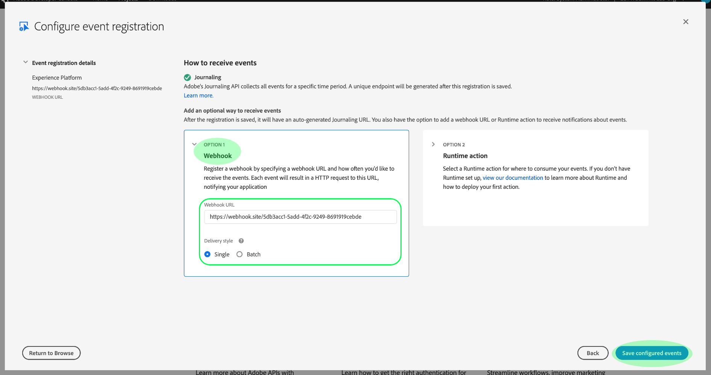

# Iscriviti alle notifiche dell’evento di Adobe I/O

[!DNL Observability Insights] ti consente di abbonarti alle notifiche evento di Adobe I/O relative alle attività Adobe Experience Platform. Questi eventi vengono inviati a un webhook configurato per facilitare l&#39;automazione efficiente del monitoraggio delle attività.

Questo documento fornisce passaggi su come effettuare l’abbonamento ad Adobi I/O di notifiche di eventi per i servizi Adobe Experience Platform. Vengono inoltre fornite informazioni di riferimento sui tipi di evento disponibili, insieme a collegamenti a ulteriori informazioni su come interpretare i dati dell’evento restituiti per ogni tipo di evento applicabile [!DNL Platform] servizio.

## Introduzione

Questo documento richiede una comprensione funzionante dei webhook e come collegare un webhook da un&#39;applicazione a un&#39;altra. Fai riferimento a [[!DNL I/O Events] documentazione](https://www.adobe.io/apis/experienceplatform/events/docs.html#!adobedocs/adobeio-events/master/intro/webhook_docs_intro.md) per un&#39;introduzione ai webhooks.

## Crea un webhook

Per ricevere [!DNL I/O Event] notifiche, è necessario registrare un webhook specificando un URL webhook univoco come parte dei dettagli di registrazione dell&#39;evento.

Puoi configurare il tuo webhook utilizzando il client di tua scelta. Per un indirizzo webhook temporaneo da utilizzare come parte di questa esercitazione, visita [Webhook.site](https://webhook.site/) e copia l’URL univoco fornito.

Durante il processo di convalida iniziale, [!DNL I/O Events] invia un `challenge` parametro query in una richiesta GET al webhook. Devi configurare il webhook per restituire il valore di questo parametro nel payload di risposta. Se utilizzi Webhook.site, seleziona **[!DNL Edit]** nell&#39;angolo in alto a destra, quindi immetti `$request.query.challenge$` sotto **[!DNL Response body]** prima di selezionare **[!DNL Save]**.

## Creare un nuovo progetto in Adobe Developer Console

Vai a [Adobe Developer Console](https://www.adobe.com/go/devs_console_ui) e accedi con il tuo Adobe ID. Quindi, segui i passaggi descritti nell’esercitazione su [creazione di un progetto vuoto](https://www.adobe.io/apis/experienceplatform/console/docs.html#!AdobeDocs/adobeio-console/master/projects-empty.md) nella documentazione di Adobe Developer Console .

## Iscriviti agli eventi

Dopo aver creato un nuovo progetto, accedi alla schermata di panoramica del progetto. Da qui, seleziona **[!UICONTROL Aggiungi evento]**.

Viene visualizzata una finestra di dialogo che consente di aggiungere un provider di eventi al progetto:

* Se si sottoscrive un avviso di Experience Platform, selezionare **[!UICONTROL Notifiche di Platform]**
* Se ti stai iscrivendo a Adobe Experience Platform [!DNL Privacy Service] notifiche, seleziona **[!UICONTROL Eventi Privacy Service]**

Dopo aver scelto un provider di eventi, seleziona **[!UICONTROL Successivo]**.

Nella schermata successiva viene visualizzato un elenco dei tipi di evento a cui effettuare l’abbonamento. Seleziona gli eventi a cui desideri abbonarti, quindi seleziona **[!UICONTROL Successivo]**.

>[!NOTE]
>
>Se non sei sicuro degli eventi a cui effettuare l’abbonamento per il servizio con cui stai lavorando, consulta la seguente documentazione:
>
>* [Notifiche di Platform](./rules.md)
>* [Notifiche di Privacy Service](../../privacy-service/privacy-events.md)

Nella schermata successiva viene richiesto di creare un token Web JSON (JWT). Puoi generare automaticamente una coppia di chiavi o caricare una tua chiave pubblica generata nel terminale.

Ai fini di questa esercitazione, viene seguita la prima opzione. Seleziona la casella delle opzioni per **[!UICONTROL Generare una coppia di chiavi]**, quindi seleziona la **[!UICONTROL Genera coppia di chiavi]** nell&#39;angolo in basso a destra.

Quando la coppia di chiavi viene generata, viene scaricata automaticamente dal browser. Devi memorizzare questo file da solo in quanto non viene mantenuto nella Console per sviluppatori.

La schermata successiva ti consente di esaminare i dettagli della nuova coppia di chiavi generata. Seleziona **[!UICONTROL Next]** (Avanti) per continuare.

Nella schermata successiva, fornisci un nome e una descrizione per la registrazione dell’evento nel [!UICONTROL Dettagli della registrazione degli eventi] sezione . Si consiglia di creare un nome univoco e facilmente identificabile per distinguere la registrazione di questo evento da altri sullo stesso progetto.

Più giù sullo stesso schermo sotto il [!UICONTROL Come ricevere gli eventi] Facoltativamente, puoi configurare come ricevere gli eventi. **[!UICONTROL Webhook]** consente di fornire un indirizzo webhook personalizzato per ricevere gli eventi, mentre **[!UICONTROL Azione runtime]** consente di eseguire le stesse operazioni utilizzando [Adobe I/O Runtime](https://www.adobe.io/apis/experienceplatform/runtime/docs.html).

Per questa esercitazione, seleziona **[!UICONTROL Webhook]** e fornire l&#39;URL del webhook creato in precedenza. Al termine, seleziona **[!UICONTROL Salva eventi configurati]** per completare la registrazione dell&#39;evento.

Viene visualizzata la pagina dei dettagli per la registrazione dell’evento appena creata, in cui è possibile modificarne la configurazione, esaminare gli eventi ricevuti, eseguire il tracciamento del debug e aggiungere nuovi provider di eventi.

## Passaggi successivi

Seguendo questa esercitazione, hai registrato un webhook da ricevere [!DNL I/O Event] notifiche [!DNL Experience Platform] e/o [!DNL Privacy Service]. Per informazioni dettagliate sugli eventi disponibili e su come interpretare i payload di notifica per ciascun servizio, consulta la seguente documentazione:

* [[!DNL Privacy Service] Notifiche](../../privacy-service/privacy-events.md)
* [[!DNL Data Ingestion] Notifiche](../../ingestion/quality/subscribe-events.md)
* [[!DNL Flow Service] (fonti) notifiche](../../sources/notifications.md)

Consulta la sezione [[!DNL Observability Insights] panoramica](../home.md) per ulteriori informazioni su come monitorare le attività in [!DNL Experience Platform] e [!DNL Privacy Service].
