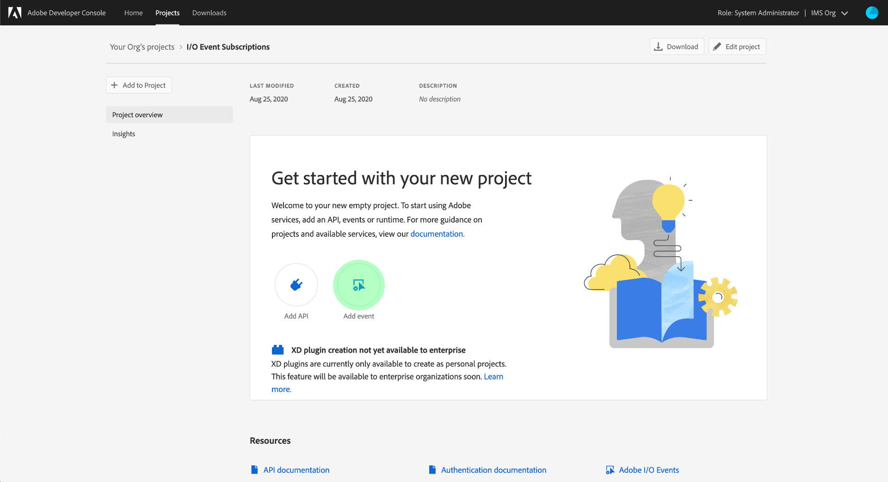

# Abbonati alle notifiche di eventi di Adobe I/O

[!DNL Observability Insights] ti consente di abbonarti alle notifiche degli eventi di Adobe I/O relative alle attività di Adobe Experience Platform. Questi eventi vengono inviati a un webhook configurato per facilitare l’automazione efficiente del monitoraggio delle attività.

In questo documento vengono descritti i passaggi necessari per iscriversi alle notifiche degli eventi Adobe I/O per i servizi Adobe Experience Platform. Vengono inoltre fornite informazioni di riferimento sui tipi di evento disponibili, insieme ai collegamenti a ulteriore documentazione su come interpretare i dati di evento restituiti per ogni servizio [!DNL Platform] applicabile.

## Introduzione

Questo documento richiede una buona conoscenza dei webhook e di come collegarli da un&#39;applicazione a un&#39;altra. Per un&#39;introduzione ai webhook, consulta la [[!DNL I/O Events] documentazione](https://www.adobe.io/apis/experienceplatform/events/docs.html#!adobedocs/adobeio-events/master/intro/webhook_docs_intro.md).

## Creare un webhook

Per ricevere le notifiche di [!DNL I/O Event], è necessario registrare un webhook specificando un URL univoco come parte dei dettagli di registrazione dell&#39;evento.

Puoi configurare il webhook utilizzando il client desiderato. Per un indirizzo del webhook temporaneo da utilizzare come parte di questa esercitazione, visita [Webhook.site](https://webhook.site/) e copia l&#39;URL univoco fornito.

Durante il processo di convalida iniziale, [!DNL I/O Events] invia un parametro di query `challenge` in una richiesta GET al webhook. Devi configurare il webhook in modo che restituisca il valore di questo parametro nel payload di risposta. Se utilizzi Webhook.site, seleziona **[!DNL Edit]** nell&#39;angolo in alto a destra, quindi immetti `$request.query.challenge$` in **[!DNL Response body]** prima di selezionare **[!DNL Save]**.

## Crea un nuovo progetto in Adobe Developer Console

Vai a [Adobe Developer Console](https://www.adobe.com/go/devs_console_ui) e accedi con il tuo Adobe ID. Quindi, segui i passaggi descritti nel tutorial su [creazione di un progetto vuoto](https://developer.adobe.com/developer-console/docs/guides/projects/projects-empty/) nella documentazione di Adobe Developer Console.

## Iscriviti agli eventi

>[!NOTE]
>
>L’evento di notifica dell’acquisizione dei dati è stato dichiarato obsoleto nell’Adobe I/O. È invece necessario utilizzare l&#39;evento I/O **Informazioni esecuzione flusso origini**.

Dopo aver creato un nuovo progetto, passa alla schermata di panoramica del progetto. Selezionare **[!UICONTROL Aggiungi evento]**.

Viene visualizzata una finestra di dialogo che consente di aggiungere un provider di eventi al progetto:

* Se ti stai abbonando ad avvisi Experience Platform, seleziona **[!UICONTROL Notifiche Platform]**
* Se si sottoscrivono le notifiche di Adobe Experience Platform [!DNL Privacy Service], selezionare **[!UICONTROL Eventi Privacy Service]**

Dopo aver scelto un provider di eventi, seleziona **[!UICONTROL Avanti]**.

Nella schermata successiva viene visualizzato un elenco dei tipi di evento a cui iscriversi. Seleziona gli eventi a cui vuoi abbonarti, quindi seleziona **[!UICONTROL Successivo]**.

>[!NOTE]
>
>Se non sai a quali eventi abbonarti per il servizio che stai lavorando, consulta la seguente documentazione:
>
>* [Notifiche piattaforma](./rules.md)
>* [Notifiche Privacy Service](../../privacy-service/privacy-events.md)

>[!IMPORTANT]
>
>Gli avvisi relativi ad Edge sono attualmente in versione beta e sono disponibili solo per alcuni clienti beta.

Nella schermata successiva viene richiesto di creare un token web JSON (JWT). Puoi generare automaticamente una coppia di chiavi o caricare la tua chiave pubblica generata nel terminale.

Ai fini di questa esercitazione, viene seguita la prima opzione. Seleziona la casella delle opzioni per **[!UICONTROL Generare una coppia di chiavi]**, quindi seleziona il pulsante **[!UICONTROL Generate keypair]** nell&#39;angolo in basso a destra.

Quando la coppia di chiavi viene generata, viene scaricata automaticamente dal browser. Devi archiviare questo file da solo in quanto non viene mantenuto in Developer Console.

La schermata successiva consente di rivedere i dettagli della coppia di chiavi appena generata. Seleziona **[!UICONTROL Avanti]** per continuare.

Nella schermata successiva, fornisci un nome e una descrizione per la registrazione dell&#39;evento nella sezione [!UICONTROL Dettagli registrazione evento]. Si consiglia di creare un nome univoco e facilmente identificabile per distinguere la registrazione di questo evento da quella di altri sullo stesso progetto.

Più in basso nella stessa schermata nella sezione [!UICONTROL Come ricevere gli eventi], puoi facoltativamente configurare la modalità di ricezione degli eventi. **[!UICONTROL Webhook]** consente di fornire un indirizzo webhook personalizzato per la ricezione di eventi, mentre **[!UICONTROL Azione runtime]** consente di eseguire la stessa operazione utilizzando [Adobe I/O Runtime](https://www.adobe.io/apis/experienceplatform/runtime/docs.html).

Per questo tutorial, seleziona **[!UICONTROL Webhook]** e fornisci l&#39;URL del webhook creato in precedenza. Al termine, selezionare **[!UICONTROL Salva eventi configurati]** per completare la registrazione dell&#39;evento.

Viene visualizzata la pagina dei dettagli per la registrazione dell&#39;evento appena creata, in cui è possibile modificarne la configurazione, esaminare gli eventi ricevuti, eseguire la traccia di debug e aggiungere nuovi provider di eventi.

## Passaggi successivi

Seguendo questa esercitazione, hai registrato un webhook per ricevere [!DNL I/O Event] notifiche per [!DNL Experience Platform] e/o [!DNL Privacy Service]. Per informazioni dettagliate sugli eventi disponibili e su come interpretare i payload di notifica per ciascun servizio, consulta la seguente documentazione:

* [[!DNL Privacy Service] notifiche](../../privacy-service/privacy-events.md)
* [[!DNL Flow Service] notifiche (origini)](../../sources/notifications.md)

Per ulteriori informazioni su come monitorare le attività in [!DNL Experience Platform] e [!DNL Privacy Service], consulta la [[!DNL Observability Insights] panoramica](../home.md).
