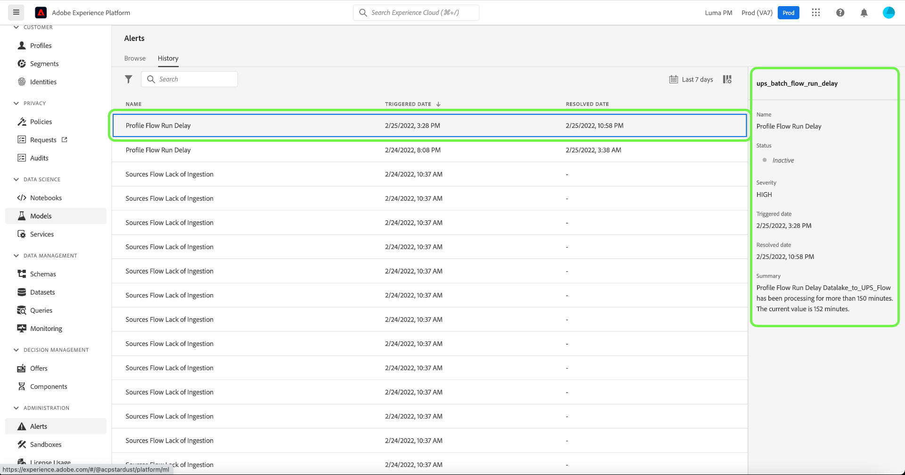

# Guida all’interfaccia utente Avvisi

L’interfaccia utente di Adobe Experience Platform consente di visualizzare una cronologia degli avvisi ricevuti in base alle metriche rivelate da Adobe Experience Platform Observability Insights. L’interfaccia utente consente inoltre di visualizzare, abilitare, disabilitare e sottoscrivere le regole di avviso disponibili.

>[!NOTE]
>
>Per un&#39;introduzione agli avvisi in Experience Platform, consulta la [panoramica degli avvisi](./overview.md).

Per iniziare, seleziona **[!UICONTROL Avvisi]** nel menu di navigazione a sinistra.

![Pagina Avvisi che evidenzia [!UICONTROL Avvisi] nel menu di navigazione a sinistra.](../images/alerts/ui/workspace.png)

## Gestire le regole di avviso {#manage-rules}

Nella scheda **[!UICONTROL Sfoglia]** sono elencate le regole disponibili che possono attivare un avviso.

![Nella scheda [!UICONTROL Sfoglia] viene visualizzato un elenco degli avvisi disponibili.](../images/alerts/ui/rules.png)

Seleziona una regola dall’elenco per visualizzarne la descrizione e i parametri di configurazione nella barra a destra, inclusi soglia e gravità.

Selezionare i puntini di sospensione (**...**) accanto al nome di una regola e un menu a discesa visualizza i controlli per abilitare o disabilitare l&#39;avviso (a seconda dello stato corrente) e per sottoscrivere o annullare l&#39;abbonamento alle notifiche e-mail per l&#39;avviso.

## Gestisci gli iscritti agli avvisi {#manage-subscribers}

>[!NOTE]
>
> Per assegnare un avviso a un ID utente Adobe, un indirizzo e-mail esterno o un elenco di gruppi e-mail, devi essere un amministratore.

Nella scheda **[!UICONTROL Sfoglia]** sono elencate le regole disponibili che possono attivare un avviso.

![Elenco delle regole di avviso disponibili visualizzato nella scheda [!UICONTROL Sfoglia].](../images/alerts/ui/rules.png)

Selezionare i puntini di sospensione (**...**) accanto al nome di una regola. In un elenco a discesa vengono visualizzati i controlli. Selezionare **[!UICONTROL Gestisci sottoscrittori avvisi]**.

![Selezionare i puntini di sospensione per visualizzare il menu a discesa. L&#39;opzione [!UICONTROL Gestisci sottoscrittori avvisi] è evidenziata.](../images/alerts/ui/manage-alert-subscribers.png)

Viene visualizzata la pagina [!UICONTROL Gestisci abbonati agli avvisi]. Per assegnare le notifiche a utenti specifici, inserisci il loro ID utente Adobe, l’indirizzo e-mail esterno o un elenco di gruppi e-mail, quindi premi Invio.

>[!NOTE]
>
>Per inviare questa notifica a più utenti contemporaneamente, fornisci un elenco di ID utente o indirizzi e-mail separati da virgole.

Gli indirizzi e-mail vengono visualizzati nell’elenco degli abbonati correnti elencati. Seleziona **[!UICONTROL Aggiorna]**.

![La pagina Gestisci sottoscrittori avvisi evidenzia i sottoscrittori e [!UICONTROL Aggiorna].](../images/alerts/ui/manage-alert-subscribers-added-email.png)

Gli utenti sono stati aggiunti all&#39;elenco di notifiche di avviso. Gli utenti inviati riceveranno notifiche e-mail relative a questo avviso, come illustrato nell’immagine seguente.

## Abilita avvisi e-mail {#enable-email}

Le notifiche degli avvisi possono essere inviate direttamente al tuo indirizzo e-mail.

Seleziona l&#39;icona a forma di campana () nella barra multifunzione superiore a destra per visualizzare notifiche e annunci. Nel menu a discesa visualizzato, seleziona l&#39;icona cog () per accedere alla pagina delle preferenze di Experience Cloud.

Viene visualizzata la pagina **Profilo**. Seleziona **[!UICONTROL Notifiche]** nella barra di navigazione a sinistra per accedere alle preferenze degli avvisi e-mail.

![La pagina Profilo evidenzia [!UICONTROL Notifiche] nella navigazione a sinistra.](../images/alerts/ui/profile.png)

Scorri fino alla sezione **E-mail** nella parte inferiore della pagina e seleziona **[!UICONTROL Notifiche istantanee]**

Tutti gli avvisi a cui sei abbonato verranno ora inviati all’indirizzo e-mail connesso al tuo account Adobe ID.

## Personalizzare la soglia di avviso {#alert-threshold}

Le soglie di avviso possono essere personalizzate per i seguenti tipi di avviso:

| Tipo di avviso | Parametro personalizzato |
|---|---|
| Ritardo processo segmento | Soglia di ritardo |
| Ritardo esportazione segmento | Soglia di ritardo |
| Ritardo esecuzione flusso destinazione | Soglia di ritardo |
| Ritardo esecuzione flusso servizio identità | Soglia di ritardo |
| Ritardo esecuzione flusso profilo | Soglia di ritardo |
| Ritardo esecuzione flusso origini | Soglia di ritardo |
| Ritardo esecuzione query | Soglia di ritardo |
| Frequenza di salto attivazione superata | Soglia di errore |
| Frequenza errori di acquisizione origini superata | Soglia di errore |

Selezionare i puntini di sospensione (**...**) accanto al nome di una regola. In un elenco a discesa vengono visualizzati i controlli. Seleziona **[!UICONTROL Modifica]**.

![L&#39;opzione [!UICONTROL Modifica] è evidenziata per la regola selezionata.](../images/alerts/ui/threshold-edit.png)

Viene visualizzata la pagina **[!UICONTROL Personalizza avviso]**. Aggiorna la soglia ai minuti desiderati, quindi seleziona **[!UICONTROL Conferma]**.

![La pagina di avviso Personalizza evidenziando [!UICONTROL Soglia] e [!UICONTROL Conferma] opzioni.](../images/alerts/ui/threshold-update.png)

Sei tornato alla pagina **[!UICONTROL Avvisi]**. Per visualizzare le impostazioni di soglia per l&#39;avviso, selezionare la regola dall&#39;elenco. Nella barra a destra puoi vedere le impostazioni della soglia per l’avviso, inclusi dettagli quali lo stato e la gravità.

![Un avviso evidenziato mostra i dettagli nella barra a destra ed evidenzia [!UICONTROL Soglia].](../images/alerts/ui/threshold-view.png)

## Visualizza cronologia avvisi {#alert-history}

La scheda **[!UICONTROL Cronologia]** mostra la cronologia degli avvisi ricevuti per l&#39;organizzazione, inclusa la regola che ha attivato l&#39;avviso, la data di attivazione e la data di risoluzione (se applicabile).

![Nella scheda [!UICONTROL Cronologia] viene visualizzato un elenco degli avvisi ricevuti.](../images/alerts/ui/history.png)

Seleziona un avviso elencato e nella barra a destra vengono visualizzati ulteriori dettagli, tra cui un breve riepilogo dell’evento che ha attivato l’avviso.

## Passaggi successivi

Questo documento fornisce una panoramica su come visualizzare e gestire gli avvisi nell’interfaccia utente di Platform. Per ulteriori informazioni sulle funzionalità del servizio, consulta la panoramica su [Observability Insights](../home.md).
