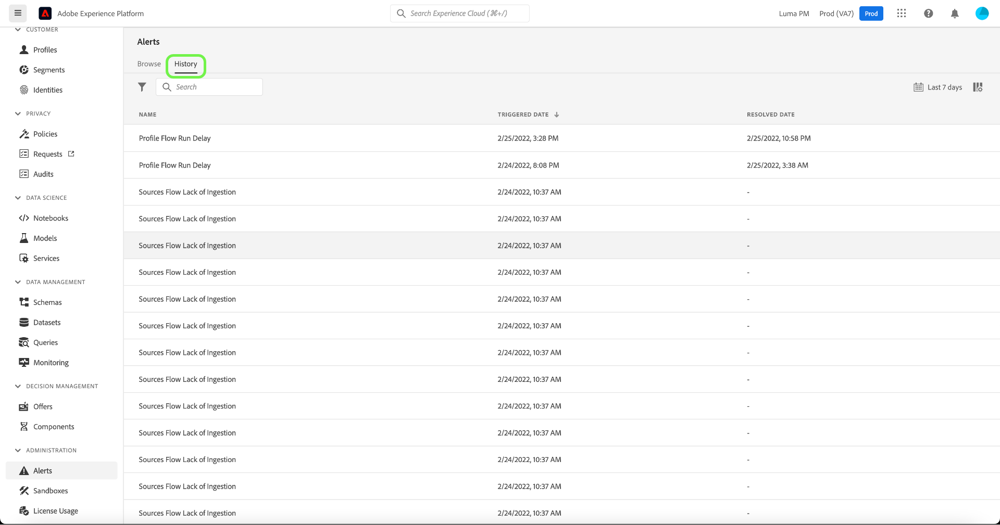

# Guida all’interfaccia utente Avvisi

L’interfaccia utente di Adobe Experience Platform consente di visualizzare una cronologia degli avvisi ricevuti in base alle metriche rivelate da Adobe Experience Platform Observability Insights. L’interfaccia utente consente inoltre di visualizzare, abilitare, disabilitare e sottoscrivere le regole di avviso disponibili.

>[!NOTE]
>
>Per un’introduzione agli avvisi in questo Experience Platform, consulta [panoramica degli avvisi](./overview.md).

Per iniziare, seleziona **[!UICONTROL Avvisi]** nel menu di navigazione a sinistra.

## Gestire le regole di avviso

Il **[!UICONTROL Sfoglia]** Questa scheda elenca le regole disponibili che possono attivare un avviso.

Seleziona una regola dall’elenco per visualizzarne la descrizione e i parametri di configurazione nella barra a destra, inclusi soglia e gravità.

Seleziona i puntini di sospensione (**...**) accanto al nome di una regola e un menu a discesa visualizza i controlli per abilitare o disabilitare l’avviso (a seconda del suo stato corrente) e per abbonarsi o annullare l’abbonamento alle notifiche e-mail per l’avviso.

## Abilita avvisi e-mail

Le notifiche degli avvisi possono essere inviate direttamente al tuo indirizzo e-mail.

Seleziona l’icona a forma di campana () che si trova nella barra multifunzione superiore a destra per visualizzare notifiche e annunci. Nel menu a discesa visualizzato, seleziona l’icona del baricentro () per accedere alla pagina delle preferenze di Experience Cloud.

Il **Profilo** viene visualizzata la scheda. Seleziona la **[!UICONTROL Notifiche]** nella barra di navigazione a sinistra per accedere alle preferenze degli avvisi e-mail.

Scorri fino a **E-mail** nella parte inferiore della pagina e seleziona **[!UICONTROL Notifiche immediate]**

Tutti gli avvisi a cui sei abbonato verranno ora inviati all’indirizzo e-mail connesso al tuo account Adobe ID.

## Visualizza cronologia avvisi

Il **[!UICONTROL Cronologia]** La scheda mostra la cronologia degli avvisi ricevuti per l’organizzazione, inclusa la regola che ha attivato l’avviso, la data di attivazione e la data di risoluzione (se applicabile).

Seleziona un avviso elencato e nella barra a destra vengono visualizzati ulteriori dettagli, tra cui un breve riepilogo dell’evento che ha attivato l’avviso.

## Passaggi successivi

Questo documento fornisce una panoramica su come visualizzare e gestire gli avvisi nell’interfaccia utente di Platform. Consulta la panoramica su [Observability Insights](../home.md) per ulteriori informazioni sulle funzionalità del servizio.
