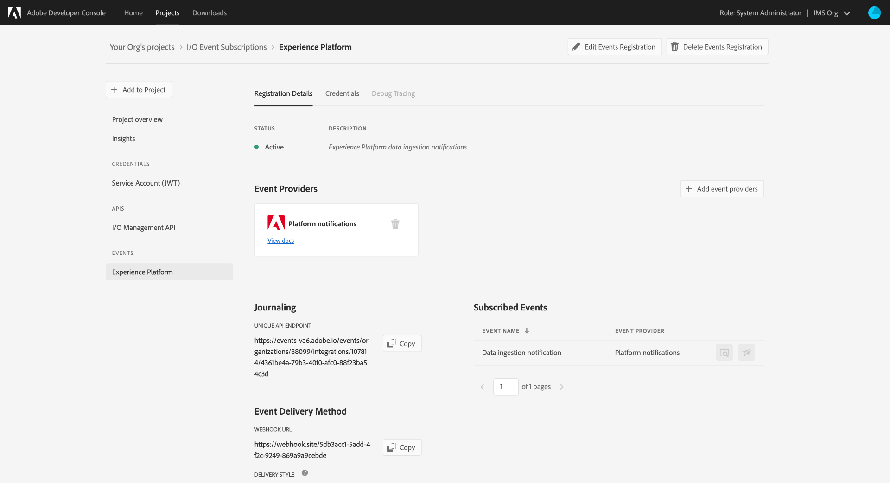

# Iscriviti per  le notifiche dell’evento Adobe I/O

[!DNL Observability Insights] consente di iscriversi  notifiche Adobe I/O Event relative alle attività Adobe Experience Platform. Questi eventi vengono inviati a un webhook configurato per facilitare l&#39;automazione efficiente del monitoraggio dell&#39;attività.

In questo documento sono descritti i passaggi per iscriversi  notifiche evento Adobe I/O per i servizi Adobe Experience Platform. Vengono inoltre fornite informazioni di riferimento sui tipi di evento disponibili, insieme a collegamenti verso ulteriori informazioni su come interpretare i dati dell&#39;evento restituiti per ciascun servizio [!DNL Platform] applicabile.

## Introduzione

Questo documento richiede una buona conoscenza dei webhook e di come collegare un webhook da un&#39;applicazione a un&#39;altra. Fare riferimento alla [[!DNL I/O Events] documentazione](https://www.adobe.io/apis/experienceplatform/events/docs.html#!adobedocs/adobeio-events/master/intro/webhook_docs_intro.md) per un&#39;introduzione ai webhooks.

## Creare un webhook

Per ricevere le notifiche [!DNL I/O Event], è necessario registrare un webhook specificando un URL webhook univoco come parte dei dettagli di registrazione dell&#39;evento.

Puoi configurare il tuo webhook utilizzando il client di tua scelta. Per utilizzare un indirizzo webhook temporaneo come parte di questa esercitazione, visita [Webhook.site](https://webhook.site/) e copia l&#39;URL univoco fornito.

Durante il processo di convalida iniziale, [!DNL I/O Events] invia un parametro di query `challenge` in una richiesta di GET al webhook. Dovete configurare il webhook per restituire il valore di questo parametro nel payload di risposta. Se si utilizza Webhook.site, selezionare **[!DNL Edit]** nell&#39;angolo superiore destro, quindi immettere `$request.query.challenge$` in **[!DNL Response body]** prima di selezionare **[!DNL Save]**.

## Creare un nuovo progetto in  Adobe Developer Console

Andate a [ Adobe Developer Console](https://www.adobe.com/go/devs_console_ui) ed effettuate l&#39;accesso con il vostro Adobe ID . Seguite quindi i passaggi descritti nell&#39;esercitazione su [creazione di un progetto vuoto](https://www.adobe.io/apis/experienceplatform/console/docs.html#!AdobeDocs/adobeio-console/master/projects-empty.md) nella documentazione  Developer Console.

## Iscriviti agli eventi

Dopo aver creato un nuovo progetto, andate alla schermata di panoramica del progetto. Da qui, selezionare **[!UICONTROL Add event]**.

Viene visualizzata una finestra di dialogo che consente di aggiungere un provider di eventi al progetto:

* Se ti iscrivi a [!DNL Experience Platform] notifiche, seleziona **[!UICONTROL Platform notifications]**
* Se ti iscrivi alle notifiche Adobe Experience Platform [!DNL Privacy Service], seleziona **[!UICONTROL Privacy Service Events]**

Dopo aver scelto un provider di eventi, selezionate **[!UICONTROL Next]**.

Nella schermata successiva viene visualizzato un elenco dei tipi di evento a cui effettuare la sottoscrizione. Selezionate gli eventi a cui desiderate iscrivervi, quindi selezionate **[!UICONTROL Next]**.

>[!NOTE]
>
>Se non sai a quali eventi abbonarti per il servizio con cui stai lavorando, consulta la documentazione di notifica specifica per il servizio:
>
>* [[!DNL Privacy Service] Notifiche](../../privacy-service/privacy-events.md)
>* [[!DNL Data Ingestion] Notifiche](../../ingestion/quality/subscribe-events.md)
>* [[!DNL Flow Service (sources)] Notifiche](../../sources/notifications.md)

Nella schermata successiva viene richiesto di creare un token Web JSON (JWT). Potete generare automaticamente una coppia di chiavi o caricare la vostra chiave pubblica generata nel terminale.

Ai fini di questa esercitazione, viene seguita la prima opzione. Selezionare la casella delle opzioni per **[!UICONTROL Generate a key pair]**, quindi selezionare il pulsante **[!UICONTROL Generate keypair]** nell&#39;angolo inferiore destro.

Quando la coppia di chiavi viene generata, viene scaricata automaticamente dal browser. Il file deve essere memorizzato personalmente, in quanto non è persistente nella Developer Console.

Nella schermata successiva è possibile esaminare i dettagli della coppia di chiavi appena generata. Selezionare **[!UICONTROL Next]** per continuare.

Nella schermata successiva, fornite un nome e una descrizione per la registrazione all&#39;evento nella sezione [!UICONTROL Event registration details]. È buona norma creare un nome univoco e facilmente identificabile per distinguere la registrazione a questo evento da altri sullo stesso progetto.

Più in basso sullo stesso schermo nella sezione [!UICONTROL How to receive events], è possibile configurare la modalità di ricezione degli eventi. **[!UICONTROL Webhook]** consente di fornire un indirizzo webhook personalizzato per ricevere gli eventi, mentre  **[!UICONTROL Runtime action]** consente di eseguire le stesse operazioni utilizzando  [Adobe I/O Runtime](https://www.adobe.io/apis/experienceplatform/runtime/docs.html).

Per questa esercitazione, selezionate **[!UICONTROL Webhook]** e fornite l&#39;URL del webhook creato in precedenza. Al termine, selezionate **[!UICONTROL Save configured events]** per completare la registrazione all&#39;evento.

Viene visualizzata la pagina dei dettagli per la registrazione dell&#39;evento appena creata, in cui è possibile modificarne la configurazione, esaminare gli eventi ricevuti, eseguire il debug del tracciamento e aggiungere nuovi provider di eventi.

## Passaggi successivi

Seguendo questa esercitazione, è stato registrato un webhook per ricevere le notifiche [!DNL I/O Event] per [!DNL Experience Platform] e/o [!DNL Privacy Service]. Per informazioni dettagliate sugli eventi disponibili e su come interpretare i payload di notifica per ciascun servizio, consultate la seguente documentazione:

* [[!DNL Privacy Service] Notifiche](../../privacy-service/privacy-events.md)
* [[!DNL Data Ingestion] Notifiche](../../ingestion/quality/subscribe-events.md)
* [[!DNL Flow Service (sources)] Notifiche](../../sources/notifications.md)

Per ulteriori informazioni su come monitorare le attività su [!DNL Experience Platform] e [!DNL Privacy Service], vedere la [[!DNL Observability Insights] panoramica](../home.md).