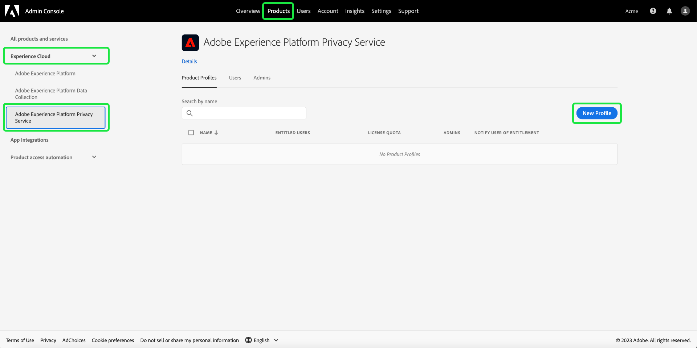

# Gestire le autorizzazioni per Privacy Service

L’accesso a [Adobe Experience Platform Privacy Service](./home.md) è controllato tramite autorizzazioni granulari basate sui ruoli in Adobe Admin Console. Creando profili di prodotto che assegnano autorizzazioni a gruppi di utenti, puoi determinare chi ha accesso a quali funzioni nell’[Interfaccia utente](./ui/overview.md) e nell’[API](./api/overview.md) di Privacy Service.

>[!NOTE]
>
>Quando crei un’integrazione per l’API di Privacy Service, devi selezionare un profilo di prodotto esistente per determinare per quali funzioni o azioni l’integrazione dispone delle autorizzazioni. Per ulteriori informazioni, consulta la [guida introduttiva all’API di Privacy Service](./api/getting-started.md).

Questa guida illustra come gestire le autorizzazioni per Privacy Service.

## Introduzione

Per configurare il controllo degli accessi per Privacy Service, è necessario disporre dei privilegi di amministratore per un’organizzazione che dispone di un’integrazione di prodotto con Adobe Experience Platform Privacy Service. Il ruolo minimo che può concedere o revocare le autorizzazioni è un **amministratore profilo di prodotto**. Altri ruoli di amministratore che possono gestire le autorizzazioni sono **amministratori di prodotto** (possono gestire tutti i profili all’interno di un prodotto) e **amministratori di sistema** (nessuna restrizione). Per ulteriori informazioni, consulta l’articolo sui [ruoli amministrativi](https://helpx.adobe.com/it/enterprise/using/admin-roles.html) nella guida all’amministrazione di Adobe Enterprise.

Questa guida presuppone che tu abbia familiarità con i concetti di base di Admin Console, come i profili di prodotto e il modo in cui concedono le autorizzazioni di prodotto a singoli utenti e gruppi. Per ulteriori informazioni, consulta la [Guida utente di Admin Console](https://helpx.adobe.com/it/enterprise/using/admin-console.html).

## Autorizzazioni disponibili

La tabella seguente illustra le autorizzazioni disponibili per Privacy Service con una descrizione delle funzionalità specifiche a cui concedono l’accesso:

>[!NOTE]
>
>Tutte le autorizzazioni di Privacy Service e [!UICONTROL Rinuncia alla vendita] sono distinte e separate l’una dall’altra senza sovrapposizioni funzionali. Ciò è possibile in quanto l’API di Privacy Service è considerata idempotente.

| Categoria | Autorizzazione | Descrizione |
| --- | --- | --- |
| [!UICONTROL Autorizzazioni di Privacy Service] | [!UICONTROL Autorizzazione di lettura della privacy] | Determina se l’utente può visualizzare le richieste di accesso ed eliminazione esistenti, insieme ai relativi dettagli. |
| [!UICONTROL Autorizzazioni di Privacy Service] | [!UICONTROL Autorizzazione di scrittura per la privacy] | Determina se un utente può creare nuove richieste di accesso ed eliminazione. |
| [!UICONTROL Autorizzazioni di Privacy Service] | [!UICONTROL Autorizzazione di lettura (accesso) per la distribuzione dei contenuti] | Quando una richiesta di accesso viene elaborata da Privacy Service, al cliente viene inviato un file ZIP contenente i relativi dati. Quando si cercano i dettagli di una richiesta di accesso, questa autorizzazione determina se l’utente può accedere al collegamento di download per il file ZIP della richiesta. |
| [!UICONTROL Autorizzazioni di rinuncia alla vendita] | [!UICONTROL Autorizzazione di lettura - Rinuncia alla vendita] | Determina se l’utente può visualizzare le richieste di rinuncia alla vendita esistenti, insieme ai relativi dettagli. |
| [!UICONTROL Autorizzazioni di rinuncia alla vendita] | [!UICONTROL Autorizzazione di scrittura - Rinuncia alla vendita] | Determina se un utente può creare nuove richieste di rinuncia della vendita. |

{style="table-layout:auto"}

## Gestire le autorizzazioni {#manage}

Per gestire le autorizzazioni di Privacy Service, accedi ad [Admin Console](https://adminconsole.adobe.com/) e seleziona **[!UICONTROL Prodotti]** nell’area di navigazione in alto. Da qui, seleziona **[!UICONTROL Adobe Experience Platform Privacy Service]**.

### Selezionare o creare un profilo di prodotto

La schermata successiva mostra un elenco dei profili di prodotto disponibili per Privacy Service nell’organizzazione. Se non esiste alcun profilo di prodotto, seleziona **[!UICONTROL Nuovo profilo]** per crearne uno. Se nell’organizzazione sono presenti più ruoli o gruppi di utenti che richiedono livelli di accesso diversi, è necessario creare un profilo di prodotto separato per ciascuno di essi.

Dopo aver selezionato un profilo di prodotto, puoi utilizzare la scheda **[!UICONTROL Autorizzazioni]** per iniziare le [autorizzazioni di modifica](#edit-permissions) per il profilo, oppure seleziona la scheda **[!UICONTROL Utenti]** per iniziare l’[assegnazione di utenti](#assign-users) al profilo.

### Modificare le autorizzazioni per il profilo {#edit-permissions}

Nella scheda **[!UICONTROL Autorizzazioni]**, seleziona una delle categorie di autorizzazione visualizzate per accedere alla vista modifica delle autorizzazioni.

Quando si modificano le autorizzazioni per un profilo, le autorizzazioni disponibili sono elencate nella colonna a sinistra, mentre quelle incluse nel profilo sono elencate nella colonna a destra. Seleziona le autorizzazioni elencate per spostarle tra una colonna e l’altra.

Le autorizzazioni sono organizzate in categorie. Per passare da una categoria all’altra, seleziona la categoria desiderata dal menu di navigazione a sinistra.

![La sezione [!UICONTROL Rinuncia] in autorizzazioni.](./images/permissions/switch-category.png)

Al termine della configurazione delle autorizzazioni, seleziona **[!UICONTROL Salva]**.

La vista del profilo di prodotto viene nuovamente visualizzata con le autorizzazioni aggiunte riportate.

### Assegnare utenti al profilo {#assign-users}

Per assegnare gli utenti al profilo di prodotto (e concedere loro le autorizzazioni configurate per il profilo), seleziona la scheda **[!UICONTROL Utenti]**, seguita da **[!UICONTROL Aggiungi utente]**.

Per ulteriori informazioni sulla gestione degli utenti per un profilo di prodotto, consulta la [documentazione di Admin Console](https://helpx.adobe.com/it/enterprise/using/manage-product-profiles.html).

### Migrare le credenziali API legacy al profilo {#migrate-tech-accounts}

>[!NOTE]
>
>Questa sezione si applica solo alle credenziali API esistenti create prima che le autorizzazioni Privacy Service fossero integrate in Adobe Admin Console. Per le nuove credenziali, i profili di prodotto (e le relative autorizzazioni) vengono assegnati tramite [Progetti di Adobe Developer Console](https://developer.adobe.com/developer-console/docs/guides/projects/).Per ulteriori informazioni,   consulta la sezione sull’[assegnazione di profili di prodotto a un progetto](./api/getting-started.md#product-profiles) nella guida introduttiva all’API di Privacy Service.

In precedenza, gli account tecnici non richiedevano un profilo di prodotto per l’integrazione e le autorizzazioni. Tuttavia, a causa dei recenti miglioramenti apportati alle autorizzazioni di Privacy Service, ora è necessario migrare le credenziali API legacy al profilo di prodotto. Questo aggiornamento consente di concedere autorizzazioni granulari ai titolari di account tecnici. Per aggiornare le autorizzazioni dell’account tecnico per Privacy Service, segui la procedura indicata di seguito.

#### Aggiornare le autorizzazioni dell’account tecnico {#update-tech-account-permissions}

Il primo passaggio nell’assegnazione di un set di autorizzazioni per il tuo account tecnico consiste nel passare ad [Adobe Admin Console](https://adminconsole.adobe.com/) e creare un nuovo profilo di prodotto per Privacy Service.

Dall’interfaccia utente di Admin Console, seleziona **Prodotti** dalla barra di navigazione, seguito da **[!UICONTROL Experience Cloud]** e **[!UICONTROL Adobe Experience Platform Privacy Service]** nella barra laterale a sinistra. Viene visualizzata la scheda [!UICONTROL Profili di prodotto]. Seleziona **Nuovo profilo** per creare un nuovo profilo di prodotto per Privacy Service.

Viene visualizzata la finestra di dialogo [!UICONTROL Crea un nuovo profilo di prodotto]. Le istruzioni complete su come creare un profilo di prodotto sono disponibili nella [Guida all’interfaccia utente per creare profili](../access-control/ui/create-profile.md).

Dopo aver salvato il nuovo profilo di prodotto, passa ad [Adobe Developer Console](https://developer.adobe.com/console/projects) e accedi al prodotto o al progetto. Nell’area di navigazione in altro, seleziona **[!UICONTROL Progetti]**, seguito dalla scheda del progetto.

>[!NOTE]
>
>Potrebbe essere necessario cancellare la cache e/o attendere un po’ di tempo prima che il nuovo progetto venga visualizzato nell’elenco dei progetti di Developer Console.

Dopo aver effettuato l’accesso al progetto, seleziona l’integrazione **[!UICONTROL API di Privacy Service]** dalla barra laterale a sinistra.

Viene visualizzata la dashboard di integrazione dell’API di Privacy Service. Da questa dashboard puoi modificare il profilo di prodotto associato a quel progetto. Per iniziare il processo, seleziona **[!UICONTROL Modifica i profili di prodotto]**. Viene visualizzata la finestra di dialogo [!UICONTROL Configura API].

La finestra di dialogo [!UICONTROL Configura API] mostra i profili di prodotto attualmente presenti nel servizio. Sono correlati ai profili di prodotto creati in Admin Console. Dall’elenco dei profili di prodotto disponibili, seleziona la casella di controllo per il nuovo profilo di prodotto creato per l’account tecnico in Admin Console. Questo associa automaticamente questo account tecnico alle autorizzazioni nel profilo di prodotto selezionato. Seleziona **[!UICONTROL Salva API configurata]** per confermare le impostazioni.

>[!NOTE]
>
>Se a un account tecnico è già associato un profilo di prodotto, verrà già selezionata una delle caselle di controllo dell’elenco dei profili di prodotto disponibili.

#### Confermare l’applicazione delle impostazioni {#confirm-applied-settings}

Per verificare che le impostazioni siano state applicate all’account. Torna ad [Admin Console](https://adminconsole.adobe.com/) e passa al nuovo profilo di prodotto creato. Seleziona la scheda **[!UICONTROL Credenziali API]** per visualizzare un elenco dei progetti associati. Il progetto utilizzato in Developer Console in cui hai assegnato il profilo di prodotto all’account tecnico viene visualizzato nell’elenco delle credenziali. Il nome di ciascuna credenziale API è composto dal nome del progetto con un numero generato in modo casuale e con un suffisso alla fine. Seleziona una credenziale per aprire il pannello [!UICONTROL Dettagli].

Il pannello [!UICONTROL Dettagli] contiene informazioni sulle credenziali API, tra cui l’ID tecnico associato, la chiave API, la data di creazione e dell’ultima modifica, nonché i prodotti Adobe associati.

## Passaggi successivi

Questa guida descrive le autorizzazioni disponibili per Privacy Service e come gestirle con Admin Console.

Per informazioni su come creare una nuova integrazione API dopo la configurazione dei profili di prodotto, consulta la [guida introduttiva all’API di Privacy Service](./api/getting-started.md). Per ulteriori informazioni sulla gestione delle autorizzazioni per altre funzionalità di Adobe Experience Platform, consulta la [documentazione sul controllo degli accessi](../access-control/home.md).
