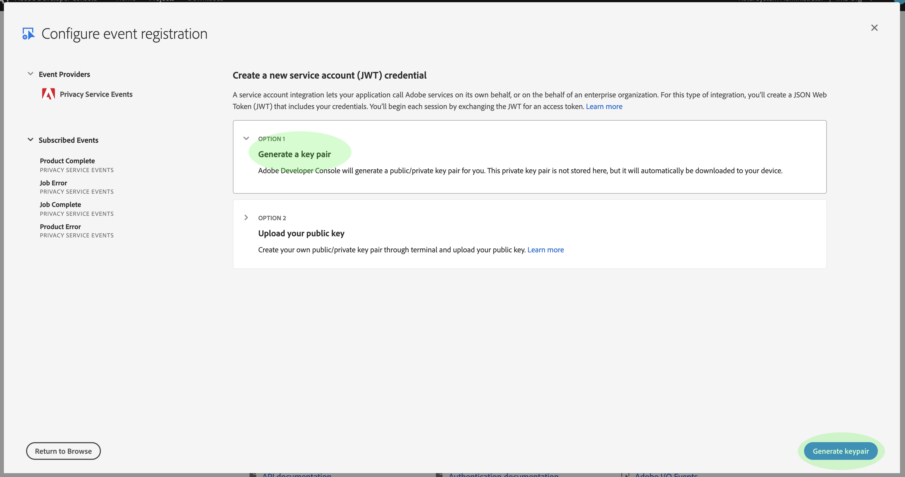

# Iscriviti a [!DNL Privacy Events]

[!DNL Privacy Events] sono messaggi forniti da  Adobe Experience Platform [!DNL Privacy Service], che sfruttano gli eventi di I/O Adobe inviati a un webhook configurato per facilitare l’automazione efficiente delle richieste di lavoro. Essi riducono o eliminano la necessità di eseguire il polling dell&#39; [!DNL Privacy Service] API per verificare se un processo è completo o se è stata raggiunta una determinata fase cardine all&#39;interno di un flusso di lavoro.

Al momento sono disponibili quattro tipi di notifiche relative al ciclo di vita della richiesta di lavoro per la privacy:

| Tipo | Descrizione |
--- | ---
| Processo completato | Tutte [!DNL Experience Cloud] le soluzioni hanno riportato indietro i dati e lo stato globale o globale del processo è stato contrassegnato come completo. |
| Errore processo | Una o più soluzioni hanno segnalato un errore durante l&#39;elaborazione della richiesta. |
| Prodotto completo | Una delle soluzioni associate a questo processo ha completato il lavoro. |
| Errore del prodotto | Una delle soluzioni ha segnalato un errore durante l&#39;elaborazione della richiesta. |

Questo documento fornisce i passaggi per configurare un&#39;integrazione per [!DNL Privacy Service] le notifiche all&#39;interno di Adobe I/O. Per una panoramica di alto livello di [!DNL Privacy Service] e delle sue funzioni, consultate la panoramica [di](home.md)Privacy Service.

## Introduzione

Questa esercitazione utilizza **ngrok**, un prodotto software che espone i server locali a Internet pubblico attraverso tunnel sicuri. Prima di avviare questa esercitazione, [installare ngrok](https://ngrok.com/download) per seguire e creare un webhook nel computer locale. Questa guida richiede inoltre il download di un repository GIT contenente un semplice server [Node.js](https://nodejs.org/) .

## Creare un server locale

Il server Node.js deve restituire un `challenge` parametro inviato da una richiesta all’endpoint principale (`/`). Configurate il `index.js` file con il seguente codice JavaScript:

```js
var express = require('express')
var app = express()

app.set('port', (process.env.PORT || 3000))
app.use(express.static(__dirname + '/public'))

app.get('/', function(request, response) {
  response.send(request.originalUrl.split('?challenge=')[1]);
})

app.listen(app.get('port'), function() {
  console.log("Node app is running at localhost:" + app.get('port'))
})
```

Utilizzando la riga di comando, andate alla directory principale del server Node.js. Quindi, digitate i comandi seguenti:

1. `npm install`
1. `npm start`

Questi comandi installano tutte le dipendenze e inizializzano il server. In caso di esito positivo, il server è in esecuzione all&#39;indirizzo http://localhost:3000/.

## Creare un webhook utilizzando ngrok

Aprite una nuova finestra della riga di comando e andate alla directory in cui avete installato ngrok in precedenza. Da qui, digitate il comando seguente:

```shell
./ngrok http -bind-tls=true 3000
```

Un output di successo è simile al seguente:


Prendete nota dell’ `Forwarding` URL (`https://212d6cd2.ngrok.io`), che verrà utilizzato per identificare il webhook nel passaggio successivo.

## Creare un nuovo progetto in Adobe Developer Console

Andate ad [Adobe Developer Console](https://www.adobe.com/go/devs_console_ui) ed effettuate l&#39;accesso con il vostro Adobe ID . Attenetevi quindi ai passaggi descritti nell&#39;esercitazione sulla [creazione di un progetto](https://www.adobe.io/apis/experienceplatform/console/docs.html#!AdobeDocs/adobeio-console/master/projects-empty.md) vuoto nella documentazione di Adobe Developer Console.

## Aggiunta di eventi sulla privacy al progetto

Dopo aver creato un nuovo progetto nella console, fate clic **[!UICONTROL Add event]** sulla schermata Panoramica __ progetto.


Viene visualizzata la finestra di dialogo _Aggiungi eventi_ . Selezionate **[!UICONTROL Experience Cloud]** per filtrare l&#39;elenco dei tipi di evento disponibili, quindi selezionate **[!UICONTROL Privacy Service Events]** prima di fare clic su **[!UICONTROL Next]**.


Viene visualizzata la finestra di dialogo _Configura registrazione_ evento. Selezionare gli eventi che si desidera ricevere selezionando le relative caselle di controllo. Gli eventi selezionati vengono visualizzati sotto _[!UICONTROL Subscribed Events]_la colonna di sinistra. Al termine, fate clic **[!UICONTROL Next]**.


Nella schermata successiva viene richiesto di fornire una chiave pubblica per la registrazione dell&#39;evento. Potete generare automaticamente una coppia di chiavi o caricare la vostra chiave pubblica generata nel terminale.

Ai fini di questa esercitazione, viene seguita la prima opzione. Fare clic sulla casella delle opzioni per **[!UICONTROL Generate a key pair]**, quindi fare clic sul **[!UICONTROL Generate keypair]** pulsante nell&#39;angolo inferiore destro.



Quando la coppia di chiavi viene generata, viene scaricata automaticamente dal browser. Il file deve essere memorizzato personalmente, in quanto non è persistente nella Developer Console.

Nella schermata successiva è possibile esaminare i dettagli della coppia di chiavi appena generata. Fare clic **[!UICONTROL Next]** per continuare.


Nella schermata successiva, fornite un nome e una descrizione per la registrazione all’evento. È buona norma creare un nome univoco e facilmente identificabile per distinguere la registrazione a questo evento da altri sullo stesso progetto.


Più in basso sullo stesso schermo, vengono fornite due opzioni per configurare la modalità di ricezione degli eventi. Selezionate **[!UICONTROL Webhook]** e fornite l&#39; `Forwarding` URL per il webhook di ngrok creato in precedenza in _[!UICONTROL Webhook URL]_. Quindi, selezionate lo stile di consegna preferito (singolo o batch) prima di fare clic **[!UICONTROL Save configured events]**per completare la registrazione dell&#39;evento.


Viene nuovamente visualizzata la pagina dei dettagli del progetto, con [!DNL Privacy Events] la visualizzazione _[!UICONTROL Events]_nella parte sinistra.

## Visualizzare i dati dell’evento

Una volta che vi siete registrati [!DNL Privacy Events] nel progetto e che i processi relativi alla privacy sono stati elaborati, potete visualizzare tutte le notifiche ricevute per tale registrazione. Dalla **[!UICONTROL Projects]** scheda Developer Console, selezionate il progetto dall&#39;elenco per aprire la pagina di panoramica _del_ prodotto. Da qui, selezionate **[!UICONTROL Privacy Events]** dalla navigazione a sinistra.


Viene visualizzata la scheda _Dettagli_ registrazione, che consente di visualizzare ulteriori informazioni sulla registrazione, modificarne la configurazione o visualizzare gli eventi effettivi ricevuti dall&#39;attivazione del webhook.


Fate clic sulla **[!UICONTROL Debug Tracing]** scheda per visualizzare un elenco degli eventi ricevuti. Fate clic su un evento elencato per visualizzarne i dettagli.


La _[!UICONTROL Payload]_sezione fornisce dettagli sull&#39;evento selezionato, incluso il relativo tipo di evento (`com.adobe.platform.gdpr.productcomplete`), come evidenziato nell&#39;esempio precedente.

## Passaggi successivi

Potete ripetere i passaggi indicati sopra per aggiungere nuove integrazioni per indirizzi Web diversi, in base alle esigenze.