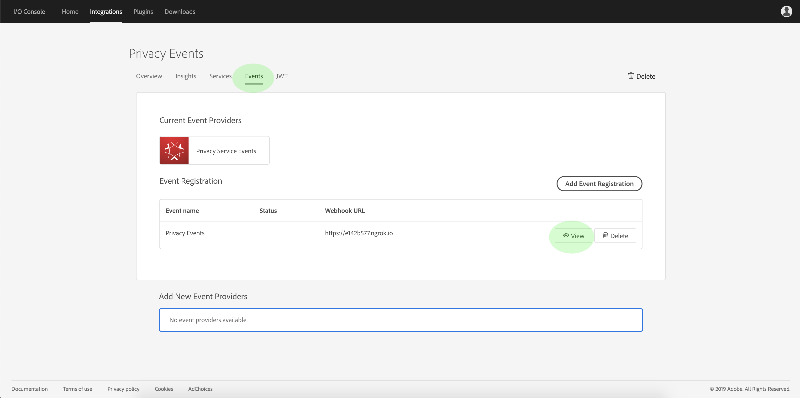

# Iscriviti agli eventi sulla privacy

Gli eventi sulla privacy sono messaggi forniti dal servizio per la privacy Adobe Experience Platform, che sfrutta gli eventi di I/O Adobe inviati a un webhook configurato per facilitare l’automazione efficiente delle richieste di lavoro. Essi riducono o eliminano la necessità di eseguire il polling dell’API del servizio Privacy per verificare se un processo è completo o se è stata raggiunta una determinata fase cardine all’interno di un flusso di lavoro.

Al momento sono disponibili quattro tipi di notifiche relative al ciclo di vita della richiesta di lavoro per la privacy:

| Tipo | Descrizione |
--- | ---
| Processo completato | Tutte le soluzioni Experience Cloud hanno riportato un report e lo stato globale o globale del processo è stato contrassegnato come completo. |
| Errore processo | Una o più soluzioni hanno segnalato un errore durante l&#39;elaborazione della richiesta. |
| Prodotto completo | Una delle soluzioni associate a questo processo ha completato il lavoro. |
| Errore del prodotto | Una delle soluzioni ha segnalato un errore durante l&#39;elaborazione della richiesta. |

Questo documento fornisce i passaggi per configurare un&#39;integrazione per le notifiche del servizio sulla privacy all&#39;interno di Adobe I/O. Per una panoramica di alto livello del servizio sulla privacy e delle sue funzioni, consulta la panoramica [del servizio sulla](home.md)privacy.

## Introduzione

Questa esercitazione utilizza **ngrok**, un prodotto software che espone i server locali a Internet pubblico attraverso tunnel sicuri. Prima di avviare questa esercitazione, [installare ngrok](https://ngrok.com/download) per seguire e creare un webhook nel computer locale. Questa guida richiede inoltre il download di un repository GIT contenente un server semplice scritto in [Node.js](https://nodejs.org/).

## Creare un server locale

Il server Node.js deve restituire un `challenge` parametro inviato da una richiesta all’endpoint principale (`/`). Configurate il `index.js` file con il seguente codice JavaScript:

```js
var express = require('express')
var app = express()

app.set('port', (process.env.PORT || 3000))
app.use(express.static(__dirname + '/public'))

app.get('/', function(request, response) {
  response.send(request.originalUrl.split('?challenge=')[1]);
})

app.listen(app.get('port'), function() {
  console.log("Node app is running at localhost:" + app.get('port'))
})
```

Utilizzando la riga di comando, andate alla directory principale del server Node.js. Quindi, digitate i comandi seguenti:

1. `npm install`
1. `npm start`

Questi comandi installano tutte le dipendenze e inizializzano il server. In caso di esito positivo, il server è in esecuzione all&#39;indirizzo http://localhost:3000/.

## Creare un webhook utilizzando ngrok

Nella stessa directory e in una nuova finestra della riga di comando, digitare il comando seguente:

```shell
ngrok http -bind-tls=true 3000
```

Un output di successo è simile al seguente:


Prendete nota dell’ `Forwarding` URL (`https://e142b577.ngrok.io`), che verrà utilizzato per identificare il webhook nel passaggio successivo.

## Creazione di una nuova integrazione tramite la console di I/O di Adobe

Effettuate l&#39;accesso ad [Adobe I/O Console](https://console.adobe.io) e fate clic sulla scheda **Integrazioni** . Viene visualizzata la finestra _Integrazioni_ . Da qui, fate clic su **Nuova integrazione**.


Viene visualizzata la finestra *Crea nuova integrazione* . Selezionate **Ricevi eventi** in tempo quasi reale, quindi fate clic su **Continua**.


Nella schermata successiva sono disponibili opzioni per creare integrazioni con eventi, prodotti e servizi diversi disponibili per l&#39;organizzazione in base a iscrizioni, adesioni e autorizzazioni. Per questa integrazione, seleziona Eventi **** del servizio sulla privacy, quindi fai clic su **Continua**.


Viene visualizzato il modulo *Dettagli* integrazione, che richiede di fornire un nome e una descrizione per l&#39;integrazione, nonché un certificato di chiave pubblica.


Se non disponete di un certificato pubblico, potete generarne uno utilizzando il seguente comando terminale:

```shell
openssl req -x509 -sha256 -nodes -days 365 -newkey rsa:2048 -keyout private.key -out certificate_pub
```

Dopo aver generato un certificato, trascinate e rilasciate il file nella casella Certificati **di chiavi** pubbliche oppure fate clic su **Seleziona un file** per esplorare la directory del file e selezionare il certificato direttamente.

Dopo aver aggiunto il certificato, viene visualizzata l&#39;opzione Registrazione ** evento. Fate clic su **Aggiungi registrazione** evento.


La finestra di dialogo si espande per visualizzare controlli aggiuntivi. Qui potete selezionare i tipi di evento desiderati e registrare il webhook. Inserite un nome per la registrazione dell’evento, l’URL del webhook (l’ `Forwarding` indirizzo restituito al momento della [creazione iniziale del webhook](#create-a-webhook-using-ngrok)) e una breve descrizione. Infine, selezionate i tipi di evento a cui desiderate iscrivervi, quindi fate clic su **Salva**.


Una volta completato il modulo di registrazione all’evento, fate clic su **Crea integrazione** e l’integrazione dell’I/O sarà completa.


## Visualizzare i dati dell’evento

Una volta elaborati i processi di integrazione I/O e privacy, potete visualizzare tutte le notifiche ricevute per tale integrazione. Dalla scheda **Integrazioni** nella console I/O, andate alla vostra integrazione e fate clic su **Visualizza**.


Viene visualizzata la pagina dei dettagli per l&#39;integrazione. Fate clic su **Eventi** per visualizzare le registrazioni degli eventi per l&#39;integrazione. Individuate la registrazione agli eventi relativi alla privacy e fate clic su **Visualizza**.



Viene visualizzata la finestra Dettagli ** evento, che consente di visualizzare ulteriori informazioni sulla registrazione, modificarne la configurazione o visualizzare gli eventi effettivi ricevuti dall’attivazione del webhook. Potete visualizzare i dettagli dell&#39;evento e passare all&#39;opzione **Debug Tracing** .


La sezione **Payload** fornisce dettagli sull&#39;evento selezionato, incluso il relativo tipo di evento (`"com.adobe.platform.gdpr.productcomplete"`) come evidenziato nell&#39;esempio precedente.

## Passaggi successivi

Potete ripetere i passaggi indicati sopra per aggiungere nuove integrazioni per indirizzi Web diversi, in base alle esigenze.