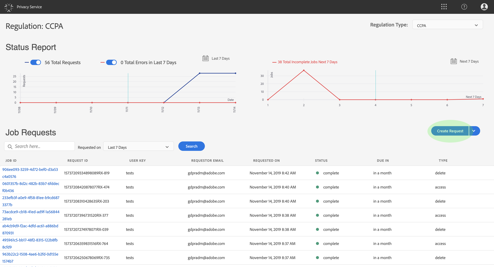

# Guida utente del servizio sulla privacy

Questo documento fornisce i passaggi necessari per creare e gestire le richieste di privacy utilizzando l&#39;interfaccia utente del servizio per la privacy.

## Sfogliare il dashboard dell’interfaccia utente del servizio sulla privacy

Il dashboard per l’interfaccia utente del servizio Privacy offre due widget che consentono di visualizzare lo stato dei processi relativi alla privacy: Report **** stato e richieste **** processo. Il dashboard visualizza anche il regolamento selezionato corrente per i processi visualizzati.

### Tipo di regolamento

Il servizio Privacy supporta le richieste di lavoro per due tipi di regolamentazione:

* Regolamento generale sulla protezione dei dati (GDPR)
* Il California Consumer Privacy Act (CCPA).

I processi per ciascun tipo di regolamento vengono tracciati separatamente. Per passare da un tipo di regola all&#39;altro, fare clic sul menu a discesa Tipo **** regolamento e selezionare la regola desiderata dall&#39;elenco.

Dopo aver modificato il tipo di regolazione, il dashboard si aggiorna e mostra tutte le operazioni, i filtri, i widget e le finestre di dialogo per la creazione di posti di lavoro che si applicano al regolamento selezionato.

### Rapporto stato

Il grafico a sinistra del widget Rapporto di stato tiene traccia dei processi inviati rispetto a eventuali processi che potrebbero essere stati riportati con errori. Il grafico a destra tiene traccia dei processi che si avvicinano alla fine della finestra di conformità di 30 giorni.

Fate clic su uno dei due pulsanti di attivazione/disattivazione sopra il grafico per mostrare o nascondere le rispettive metriche.

Per visualizzare il numero esatto di processi associati a qualsiasi punto dati del grafico, posizionate il puntatore del mouse sul punto di dati in questione.

Per visualizzare ulteriori dettagli su un dato punto dati, fare clic sul punto dati in questione per visualizzare i processi associati nel widget Richieste di processo. Prendete nota del filtro applicato appena sopra l’elenco dei processi.

>[!NOTE] Quando un filtro è stato applicato al widget Richieste di processo, potete rimuovere il filtro facendo clic sulla **X** nella pillola del filtro. Le richieste di processo tornano quindi all’elenco di tracciamento predefinito.

### Richieste di processo

Il widget Richieste di lavoro elenca tutte le richieste di processo disponibili nell’organizzazione, inclusi dettagli quali il tipo di richiesta, lo stato corrente, la data di scadenza e l’e-mail del richiedente.

>[!NOTE] I dati per i processi creati in precedenza sono accessibili solo per 30 giorni dopo la data di completamento.

Potete filtrare l’elenco digitando le parole chiave nella barra di ricerca sotto il titolo Richieste di processo. L’elenco filtra automaticamente durante la digitazione, mostrando le richieste contenenti valori corrispondenti ai termini di ricerca. Potete inoltre utilizzare il menu a discesa **Richiesto** per selezionare un intervallo di tempo per i processi elencati.

Per visualizzare i dettagli di una particolare richiesta di processo, fate clic sull’ID del processo della richiesta dall’elenco per aprire la pagina Dettagli ** processo.

Questa finestra di dialogo contiene informazioni sullo stato di ciascuna soluzione Experience Cloud e sullo stato corrente in relazione al processo complessivo. Poiché ogni processo di privacy è asincrono, la pagina visualizza la data e l’ora di comunicazione più recenti (GMT) di ciascuna soluzione, in quanto alcuni richiedono più tempo di altri per elaborare la richiesta.

Se una soluzione ha fornito dati aggiuntivi, questi possono essere visualizzati in questa finestra di dialogo. Per visualizzare questi dati, fai clic sulle singole righe di prodotto.

Per scaricare i dati del processo completo come file CSV, fate clic su **Esporta in CSV** , in alto a destra nella finestra di dialogo.

## Creare una nuova richiesta di lavoro per la privacy

L’interfaccia utente del servizio Privacy offre due metodi per creare nuove richieste di lavoro:

* Utilizzare il Generatore di richieste
* Caricare un file JSON

I passaggi per utilizzare ciascuno di questi metodi sono descritti nelle sezioni seguenti.

### Utilizzare il Generatore di richieste

Utilizzando Request Builder, potete creare manualmente una nuova richiesta di processo per la privacy nell’interfaccia utente. Il Generatore di richieste è indicato per set di richieste sempre più semplici, perché il Generatore di richieste limita le richieste a disporre solo di ID per utente. Per richieste più complesse, potrebbe essere meglio [caricare un file](#upload-a-json-file) JSON.

Per iniziare a utilizzare il generatore di richieste, fate clic su **Crea richiesta** sotto il widget Rapporto di stato sul lato destro della schermata.

Viene visualizzata la finestra di dialogo *Crea richiesta* , con le opzioni disponibili per l’invio di una richiesta di lavoro per la privacy per il tipo di regolamento attualmente selezionato.

Selezionare il Tipo **di** processo della richiesta (&quot;Elimina&quot; o &quot;Accesso&quot;) e uno o più **Prodotti** disponibili dall&#39;elenco. In ID **** cliente, seleziona un tipo di ID dal menu a discesa (e-mail, ECID o AAID). Digitate a destra i valori ID nella casella di testo, premendo **\&lt;enter>** per ciascun ID per aggiungerlo all&#39;elenco.

Gli ID inclusi in questo elenco riceveranno una copia di tutte le notifiche e-mail inviate dal Servizio Privacy quando un processo viene completato, terminato con errori o timeout. Al termine, fate clic su **Crea**.

La finestra di dialogo scompare e il nuovo processo (o i nuovi processi) sono elencati nel widget Richieste di processo insieme al relativo stato di elaborazione corrente.

### Caricare un file JSON

Quando crei richieste più complesse, ad esempio quelle che utilizzano più tipi di ID per ciascun oggetto dati in fase di elaborazione, puoi creare una richiesta caricando un file JSON.

Fate clic sulla freccia accanto a **Crea richiesta**, sotto il widget Rapporto stato sul lato destro della schermata. Dall’elenco delle opzioni visualizzate, selezionate **Carica JSON**.

Viene visualizzata la finestra di dialogo *Carica JSON* , che consente di trascinare e rilasciare il file JSON.

Se non disponete di un file JSON da caricare, fate clic su **Scarica Adobe-GDPR-Request.json** per scaricare un modello che potete compilare in base ai valori raccolti dai vostri soggetti dati.

Individuate il file JSON sul computer e trascinatelo nella finestra di dialogo. Se il caricamento ha esito positivo, il nome del file viene visualizzato nella finestra di dialogo. Per continuare ad aggiungere altri file JSON, trascinateli e rilasciateli nella finestra di dialogo.

Al termine, fate clic su **Crea**. La finestra di dialogo scompare e il nuovo processo o i nuovi processi sono elencati nel widget Richieste _di_ processo insieme al relativo stato di elaborazione corrente.

### Passaggi successivi

Leggendo questo documento, hai imparato a usare l’interfaccia utente del servizio per la privacy per creare un processo di privacy, visualizzare i dettagli di un processo e controllarne lo stato di elaborazione e scaricare i risultati al termine.

Per i passaggi su come eseguire queste operazioni a livello di programmazione tramite l&#39;API del servizio sulla privacy, fare riferimento alla guida per gli sviluppatori.