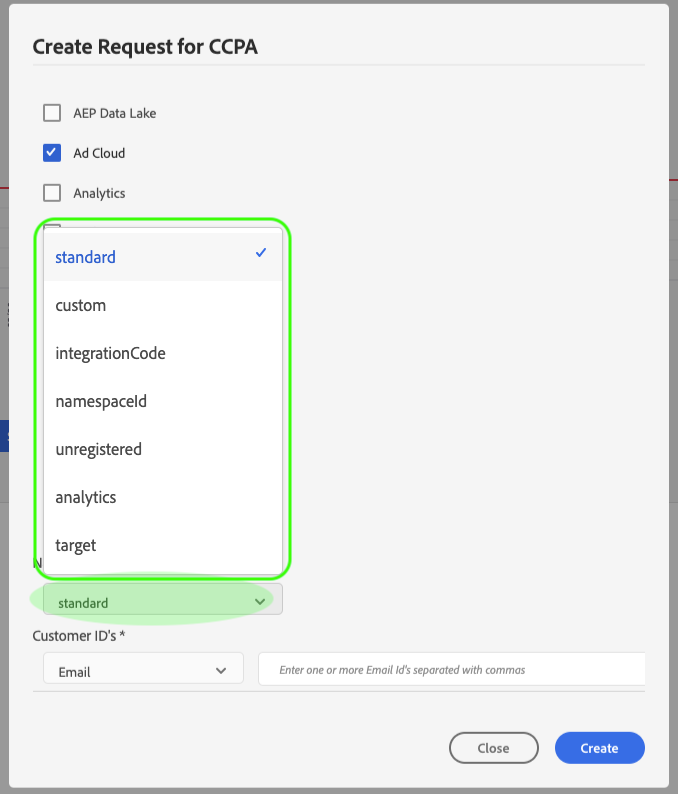
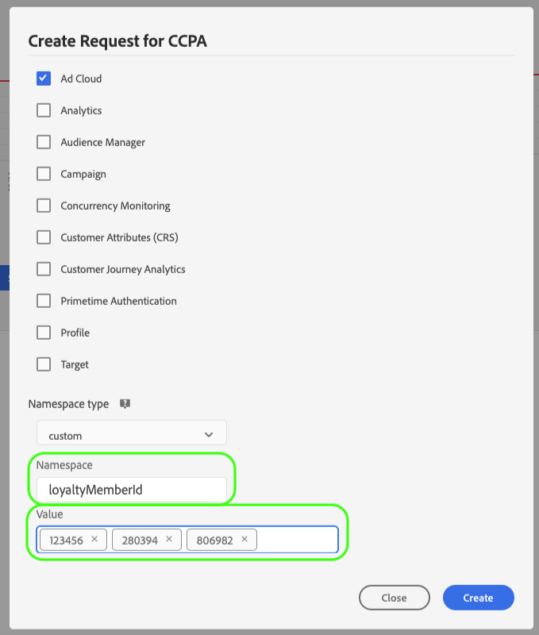

# Gestione dei processi relativi alla privacy nell’interfaccia utente di Privacy Service {#user-guide}

>[!CONTEXTUALHELP]
>id="platform_privacyConsole_requests_description"
>title="Rispettare le richieste sulla privacy dell’interessato"
>abstract="<h2>Descrizione</h2>
Adobe Experience Platform Privacy Service ti consente di creare e gestire le richieste sulla privacy per conto dei clienti che desiderano accedere o cancellare i propri dati personali in conformità alle normative legali sulla privacy.
"

In questo documento vengono descritti i passaggi per la creazione e la gestione delle richieste di accesso a dati personali tramite l&#39;interfaccia utente [!DNL Privacy Service].

>[!IMPORTANT]
>
>Privacy Service è destinato solo alle richieste degli interessati e dei diritti dei consumatori. Qualsiasi altro utilizzo di Privacy Service per la pulizia o la manutenzione dei dati non è supportato o consentito. L&#39;Adobe ha l&#39;obbligo giuridico di adempiere tali obblighi in modo tempestivo. Di conseguenza, il test di carico su Privacy Service non è consentito in quanto si tratta di un ambiente di sola produzione e crea un backlog inutile di richieste di privacy valide.
>
>È ora disponibile un limite massimo di caricamento giornaliero per evitare abusi del servizio. Se gli utenti rilevano un abuso del sistema, l’accesso al servizio verrà disattivato. Successivamente si terrà una riunione con i Privacy Service per discutere le loro azioni e l&#39;uso accettabile di tali strumenti.

## Sfoglia il dashboard dell&#39;interfaccia utente [!DNL Privacy Service]

Il dashboard per l&#39;interfaccia utente [!DNL Privacy Service] fornisce due widget che consentono di visualizzare lo stato dei processi relativi alla privacy: &quot;[!UICONTROL Report di stato]&quot; e &quot;[!UICONTROL Richieste di processi]&quot;. Il dashboard visualizza anche il regolamento corrente selezionato per i job visualizzati.

### Tipo di regolamento

[!DNL Privacy Service] supporta le richieste di processi per diverse normative sulla privacy. Nella tabella seguente sono elencate le normative supportate e l’etichetta corrispondente, come rappresentata nell’interfaccia utente:

| Etichetta interfaccia utente | Regolamento |
| --- | --- |
| [!UICONTROL APA_AUS] | [!DNL Australia Privacy Act (Privacy Act)] |
| [!UICONTROL CPA] | [!DNL Colorado Privacy Act] |
| [!UICONTROL CCPA] | [!DNL California Consumer Privacy Act] |
| [!UICONTROL CPRA_USA] | [!DNL California Consumer Privacy Rights Act (CPRA)] |
| [!UICONTROL CTDPA] | [!DNL Connecticut Data Privacy Act] |
| [!UICONTROL RGPD] | Il [!DNL General Data Protection Regulation] dell&#39;Unione Europea |
| [!UICONTROL HIPAA_AUS] | [!DNL Health Insurance Portability and Accountability Act] |
| [!UICONTROL LGPD_BRA] | [!DNL Lei Geral de Proteção de Dados] del Brasile |
| [!UICONTROL MHMDA] | [!DNL Washington My Health My Data Act] |
| [!UICONTROL NZPA_NZL] | Nuova Zelanda [!DNL Privacy Act] |
| [!UICONTROL PDPA_THA] | Thailandese: [!DNL Personal Data Protection Act] |
| [!UICONTROL UCPA] | [!DNL Utah Consumer Privacy Act] |
| [!UICONTROL VCDPA_USA] | [!DNL Virginia Consumer Data Protection Act] |

{style="table-layout:auto"}

<!--Not released yet:
| [!UICONTROL PDPA_VNM] | Vietnam's [!DNL Personal Data Protection Decree] |
 -->

>[!NOTE]
>
>Per ulteriori informazioni sul contesto legale di ciascun regolamento, consulta la panoramica sulle [normative sulla privacy supportate](../regulations/overview.md).

I processi per ogni tipo di regolamento vengono tracciati separatamente. Per passare da un tipo di regolamento all&#39;altro, selezionare il menu a discesa **[!UICONTROL Tipo di regolamento]** e selezionare il regolamento desiderato dall&#39;elenco.

Quando si modifica il tipo di regolamento, il dashboard viene aggiornato in modo da visualizzare tutte le operazioni, i filtri, i widget e le finestre di dialogo per la creazione di posti di lavoro che si applicano al regolamento selezionato.

### Relazione sullo stato

Il grafico sul lato sinistro del widget Rapporto di stato tiene traccia dei processi inviati rispetto a quelli che potrebbero essere stati segnalati con errori. Il grafico sul lato destro traccia i processi che si avvicinano alla fine dell’intervallo di conformità di 30 giorni.

Seleziona uno dei due pulsanti di attivazione/disattivazione sopra il grafico per mostrare o nascondere le rispettive metriche.

Puoi visualizzare il numero esatto di processi associati a qualsiasi punto dati sui grafici passando il mouse sopra il punto dati in questione.

Per visualizzare ulteriori dettagli su un dato punto dati, selezionare il punto dati in questione per visualizzare i job associati nel widget Richieste di job. Prendi nota del filtro applicato appena sopra l’elenco dei processi.

>[!NOTE]
>
>Quando è stato applicato un filtro al widget Richieste di lavoro, è possibile rimuovere il filtro selezionando **X** nella pillola del filtro. Le richieste di lavoro quindi tornano all&#39;elenco di tracciamento predefinito.

### Richieste di processi {#job-requests}

Nell&#39;area di lavoro [!UICONTROL Richieste di processi] sono elencati i dettagli relativi alle richieste di processi recenti nell&#39;organizzazione. I dettagli includono il tipo di richiesta, lo stato corrente, la data di scadenza, l’e-mail del richiedente e così via. Vengono caricati set di 100 record alla volta. Per impostazione predefinita, i processi creati più di recente vengono visualizzati nella parte superiore con più set di record caricati mentre si scorre verso il basso per sfogliare.

>[!NOTE]
>
>I dati per i processi creati in precedenza sono accessibili solo per 30 giorni dopo la data di completamento.

Puoi filtrare l&#39;elenco digitando le parole chiave nella barra di ricerca sotto il titolo [!UICONTROL Richieste di lavoro]. L’elenco filtra automaticamente durante la digitazione, mostrando le richieste che contengono valori che corrispondono ai termini di ricerca. Il campo di ricerca esegue una ricerca &quot;rapida&quot; che corrisponde agli ID del processo di privacy dei processi attualmente renderizzati/caricati nell’interfaccia utente. Non è una ricerca completa di tutti i lavori inviati. Si tratta piuttosto di un filtro applicato ai risultati caricati. Utilizza l&#39;API Privacy Service per [restituire i processi in base a un regolamento specifico, intervalli di date o un singolo processo](../api/privacy-jobs.md#list).

>[!TIP]
>
>Per caricare i record nell’interfaccia utente degli ultimi 30 giorni, devi scorrere la tabella verso il basso e caricare altri batch di record.

In alternativa, utilizza il pulsante di ricerca per eseguire una query del processo di privacy che si estende su un particolare intervallo di date. Questa azione restituisce tutti i processi relativi alla privacy inviati dall’organizzazione durante l’intervallo di tempo specificato. Selezionare il menu a discesa **[!UICONTROL Richiesto il]** per scegliere una data di inizio e una data di fine per la query. Le opzioni disponibili sono [!UICONTROL Oggi], [!UICONTROL Ultimi 7 Giorni], [!UICONTROL Ultime 2 Settimane], [!UICONTROL Ultimi 30 Giorni] o [!UICONTROL Personalizzato]. Se utilizzata con l&#39;opzione [!UICONTROL Richiesto il], la funzionalità di ricerca visualizza solo le richieste di processo inviate tra gli intervalli di date scelti.

Per visualizzare i dettagli di una richiesta di processo particolare, selezionare l&#39;ID del processo della richiesta dall&#39;elenco per aprire la pagina **[!UICONTROL Dettagli processo]**.

Questa finestra di dialogo contiene informazioni sullo stato di ciascuna soluzione [!DNL Experience Cloud] e del relativo stato corrente in relazione al processo complessivo. Poiché ogni processo di privacy è asincrono, la pagina visualizza la data e l’ora di comunicazione più recente (GMT) di ogni soluzione, in quanto alcune richiedono più tempo di altre per elaborare la richiesta.

Se una soluzione ha fornito dati aggiuntivi, questi sono visualizzabili in questa finestra di dialogo. Puoi visualizzare questi dati selezionando singole righe di prodotto.

Per scaricare i dati del processo completo come file CSV, seleziona **[!UICONTROL Esporta in CSV]** in alto a destra nella finestra di dialogo.

## Crea una nuova richiesta di processo per la privacy {#create-a-new-privacy-job-request}

>[!CONTEXTUALHELP]
>id="platform_privacyConsole_requests_instructions"
>title="Istruzioni"
>abstract="<ul><li>Seleziona <a href="https://experienceleague.adobe.com/docs/experience-platform/privacy/ui/overview.html?lang=it#logging-in-from-experience-platform">Richieste</a> nel menu di navigazione a sinistra per aprire l’interfaccia utente della privacy, quindi seleziona <b>Crea richiesta</b>.</li><li>Da qui puoi utilizzare il generatore di richieste o caricare un file JSON di persone interessate.</li><li>Se utilizzi il generatore di richieste, seleziona il tipo di processo (accesso e/o eliminazione), quindi scegli il tipo di identità fornito (e-mail, ECID o AAID) oppure immetti uno spazio dei nomi di identità personalizzato. Una volta terminato, immetti i valori di identità appropriati per i clienti e seleziona <b>Crea</b>.</li><li>Se carichi un file JSON, seleziona la freccia accanto a Crea richiesta. Dall’elenco delle opzioni, seleziona <b>Carica JSON</b> e carica il file. Se non disponi di un file JSON da caricare, seleziona <b>Scarica Adobe-GDPR-Request.json</b> per scaricare un modello da poter compilare. Una volta terminato, carica il file JSON e seleziona <b>Crea</b>.</li><li>Per ulteriori informazioni su questa funzione, consulta la sezione <a href="https://experienceleague.adobe.com/docs/experience-platform/privacy/ui/user-guide.html?lang=it">Guida utente di Privacy Service</a> su Experience League.</li></ul>"

>[!NOTE]
>
>Per creare una richiesta di processo per la privacy, devi fornire informazioni sull’identità per i clienti specifici i cui dati devono essere accessibili o eliminati. Rivedi il documento su [dati di identità per le richieste di privacy](../identity-data.md) prima di continuare con questa sezione.

L&#39;interfaccia utente di [!DNL Privacy Service] fornisce due metodi per creare nuove richieste di processi:

* [Utilizzare Request Builder](#request-builder)
* [Caricare un file JSON](#json)

I passaggi per l’utilizzo di ciascuno di questi metodi sono descritti nelle sezioni seguenti.

### Utilizzare Request Builder {#request-builder}

Utilizzando il Generatore di richieste, puoi creare manualmente una nuova richiesta di processo per la privacy nell’interfaccia utente. Request Builder (Generatore di richieste) è indicato per set di richieste più semplici e piccoli, perché il Generatore di richieste limita le richieste in modo che abbiano solo il tipo ID per utente. Per richieste più complesse, potrebbe essere preferibile [caricare un file JSON](#json).

Per iniziare a utilizzare il Generatore di richieste, seleziona **[!UICONTROL Crea richiesta]** sotto il widget Rapporto di stato sul lato destro dello schermo.

Viene visualizzata la finestra di dialogo **[!UICONTROL Crea richiesta]**, in cui sono visualizzate le opzioni disponibili per l&#39;invio di una richiesta di processo per la privacy per il tipo di regolamento attualmente selezionato.

 

Selezionare **[!UICONTROL Tipo di processo]** della richiesta (&quot;Elimina&quot; o &quot;Accesso&quot;) e uno o più prodotti disponibili dall&#39;elenco.

Privacy Service supporta due tipi di richieste di processi per dati personali: [!UICONTROL Access] (lettura) e/o [!UICONTROL Delete]. È possibile inviare una richiesta per ricevere tutte le informazioni contenute nel prodotto relative all&#39;oggetto della richiesta oppure richiedere la cancellazione di tutte le informazioni relative all&#39;oggetto della richiesta.

 

In **[!UICONTROL Tipo di spazio dei nomi]**, selezionare il tipo di spazio dei nomi appropriato per gli ID cliente inviati a [!DNL Privacy Service].

 

Quando utilizzi il tipo di spazio dei nomi standard, seleziona uno spazio dei nomi dal menu a discesa (e-mail, ECID o AAID), quindi digita i valori ID nella casella di testo a destra, premendo **\&lt;invio>** per ogni ID per aggiungerlo all&#39;elenco.

 

Quando utilizzi il tipo di spazio dei nomi personalizzato, devi immettere manualmente lo spazio dei nomi prima di fornire i valori ID seguenti.

 

Al termine, selezionare **[!UICONTROL Crea]**.

 

La finestra di dialogo scompare e il nuovo job (o job) viene elencato nel widget Richieste di job insieme al relativo stato di elaborazione corrente.

### Caricare un file JSON {#json}

Quando crei richieste più complicate, ad esempio quelle che utilizzano più tipi di ID per ogni persona interessata elaborata, puoi creare una richiesta caricando un file JSON.

Selezionare la freccia accanto a **[!UICONTROL Crea richiesta]**, sotto il widget Rapporto di stato sul lato destro dello schermo. Dall&#39;elenco delle opzioni visualizzate, selezionare **[!UICONTROL Carica JSON]**.

Viene visualizzata la finestra di dialogo **[!UICONTROL Carica JSON]** che consente di trascinare e rilasciare il file JSON in.

 

Se non hai un file JSON da caricare, seleziona **[!UICONTROL Scarica Adobe-GDPR-Request.json]** per scaricare un modello che puoi compilare in base ai valori raccolti dalle persone interessate.

 

Individua il file JSON sul computer e trascinalo nella finestra di dialogo. Se il caricamento ha esito positivo, il nome del file viene visualizzato nella finestra di dialogo. Puoi continuare ad aggiungere altri file JSON, se necessario, trascinandoli nella finestra di dialogo.

Al termine, selezionare **[!UICONTROL Crea]**. La finestra di dialogo scompare e il nuovo job (o job) viene elencato nel widget Richieste di job insieme al relativo stato di elaborazione corrente.

### Passaggi successivi

Dopo aver letto questo documento, hai imparato a utilizzare l&#39;interfaccia utente [!DNL Privacy Service] per creare un processo di privacy, visualizzarne i dettagli, monitorarne lo stato di elaborazione e scaricare i risultati al termine del processo.

Per i passaggi su come eseguire queste operazioni a livello di programmazione utilizzando l&#39;API [!DNL Privacy Service], fare riferimento alla [guida API](../api/overview.md).
