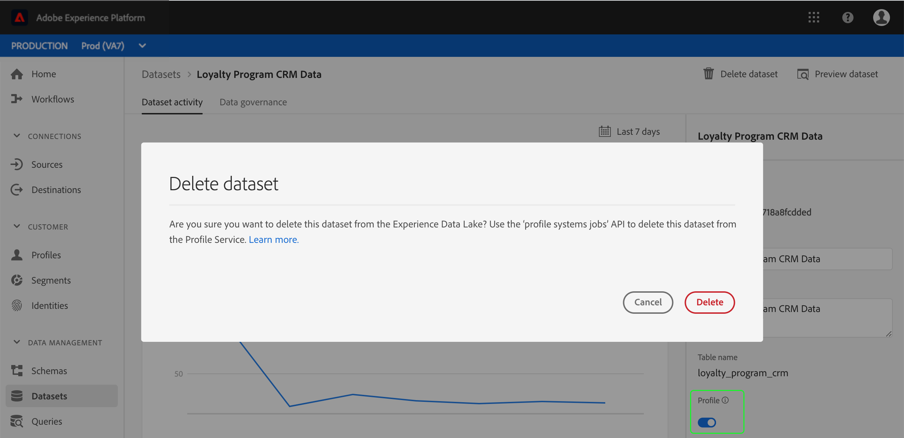

# Processi del sistema dei profili (richieste di eliminazione)

 Adobe Experience Platform consente di acquisire dati da più origini e di creare profili affidabili per i singoli clienti. I dati acquisiti in Platform sono memorizzati nel Data Lake e nell&#39;archivio dati del profilo cliente in tempo reale. Talvolta potrebbe essere necessario eliminare un set di dati o un batch dall&#39;archivio profili per rimuovere i dati non più necessari o che sono stati aggiunti per errore. Ciò richiede l’utilizzo dell’API Profilo cliente in tempo reale per creare un processo del sistema di profili, noto anche come &quot;richiesta di eliminazione&quot;, che può anche essere modificato, monitorato o rimosso, se necessario.

>[!NOTE]
>Se state tentando di eliminare insiemi di dati o batch dal Data Lake, consultate la panoramica [del servizio](../../catalog/home.md) catalogo per le istruzioni.

## Introduzione

L&#39;endpoint API utilizzato in questa guida fa parte dell&#39;API [Profilo cliente in tempo](https://www.adobe.io/apis/experienceplatform/home/api-reference.html#!acpdr/swagger-specs/real-time-customer-profile.yaml)reale. Prima di continuare, consultate la guida [](getting-started.md) introduttiva per i collegamenti alla documentazione correlata, una guida alla lettura delle chiamate API di esempio in questo documento e informazioni importanti sulle intestazioni richieste necessarie per effettuare correttamente chiamate a qualsiasi API Experience Platform .

## Visualizza richieste di eliminazione

Una richiesta di eliminazione è un processo asincrono a lungo termine, il che significa che l&#39;organizzazione potrebbe eseguire più richieste di eliminazione contemporaneamente. Per visualizzare tutte le richieste di eliminazione attualmente in esecuzione nell&#39;organizzazione, potete eseguire una richiesta GET all&#39; `/system/jobs` endpoint.

È inoltre possibile utilizzare parametri di query facoltativi per filtrare l&#39;elenco delle richieste di eliminazione restituite nella risposta. Per utilizzare più parametri, separateli utilizzando una e commerciale (&amp;).

**Formato API**

```http
GET /system/jobs
GET /system/jobs?{QUERY_PARAMETERS}
```

| Parametro | Descrizione |
|---|---|
| `start` | Consente di scostare la pagina dei risultati restituiti, in base al tempo di creazione della richiesta. Esempio: `start=4` |
| `limit` | Limita il numero di risultati restituiti. Esempio: `limit=10` |
| `page` | Restituisce una pagina specifica di risultati, in base all’ora di creazione della richiesta. Esempio: `page=2` |
| `sort` | Ordinare i risultati in base a un campo specifico in ordine crescente (`asc`) o decrescente (`desc`). Il parametro sort non funziona quando si restituiscono più pagine di risultati. Esempio: `sort=batchId:asc` |

**Richiesta**

```shell
curl -X POST \
  https://platform.adobe.io/data/core/ups/system/jobs \
  -H 'Authorization: Bearer {ACCESS_TOKEN}' \
  -H 'x-api-key: {API_KEY}' \
  -H 'x-gw-ims-org-id: {IMS_ORG}' \
  -H 'x-sandbox-name: {SANDBOX_NAME}' \
```

**Risposta**

La risposta include un array &quot;child&quot; con un oggetto per ogni richiesta di eliminazione contenente i dettagli di tale richiesta.

```json
{
  "_page": {
    "count": 100,
    "next": "K1JJRDpFaWc5QUwyZFgtMEpBQUFBQUFBQUFBPT0jUlQ6MSNUUkM6MiNGUEM6QWdFQUFBQVFBQWZBQUg0Ly9yL25PcmpmZndEZUR3QT0="
  },
  "children": [
    {
      "id": "9c2018e2-cd04-46a4-b38e-89ef7b1fcdf4",
      "imsOrgId": "{IMS_ORG}",
      "batchId": "8d075b5a178e48389126b9289dcfd0ac",
      "jobType": "DELETE",
      "status": "COMPLETED",
      "metrics": "{\"recordsProcessed\":5,\"timeTakenInSec\":1}",
      "createEpoch": 1559026134,
      "updateEpoch": 1559026137
    },
    {
      "id": "3f225e7e-ac8c-4904-b1d5-0ce79e03c2ec",
      "imsOrgId": "{IMS_ORG}",
      "dataSetId": "5c802d3cd83fc114b741c4b5",
      "jobType": "DELETE",
      "status": "PROCESSING",
      "metrics": "{\"recordsProcessed\":0,\"timeTakenInSec\":15}",
      "createEpoch": 1559025404,
      "updateEpoch": 1559025406
    }
  ]
}
```

| Proprietà | Descrizione |
|---|---|
| _page.count | Numero totale di richieste. Questa risposta è stata troncata per lo spazio. |
| _page.next | Se esiste una pagina aggiuntiva di risultati, puoi visualizzare la pagina successiva dei risultati sostituendo il valore ID in una richiesta [di](#view-a-specific-delete-request) ricerca con il valore &quot;next&quot; fornito. |
| jobType | Tipo di processo da creare. In questo caso, restituirà sempre &quot;DELETE&quot;. |
| status | Stato della richiesta di eliminazione. I valori possibili sono &quot;NEW&quot;, &quot;PROCESSING&quot;, &quot;COMPLETED&quot;, &quot;ERROR&quot;. |
| metriche | Un oggetto che include il numero di record elaborati (&quot;recordsProcessed&quot;) e il tempo in secondi durante il quale la richiesta è stata elaborata, oppure il tempo impiegato per completare la richiesta (&quot;timeTakenInSec&quot;). |

## Creare una richiesta di eliminazione {#create-a-delete-request}

L&#39;avvio di una nuova richiesta di eliminazione viene eseguito tramite una richiesta POST all&#39; `/systems/jobs` endpoint, dove l&#39;ID del set di dati o del batch da eliminare viene fornito nel corpo della richiesta.

### Eliminare un dataset

Per eliminare un set di dati, l’ID del set di dati deve essere incluso nel corpo della richiesta POST. Questa azione eliminerà TUTTI i dati per un dato dataset.  Experience Platform consente di eliminare i set di dati basati su schemi di record e serie temporali.

>[!CAUTION]
> Quando si tenta di eliminare un dataset abilitato per il profilo utilizzando l&#39;interfaccia utente  di Experience Platform, il dataset viene disabilitato per l&#39;inserimento ma non verrà eliminato finché non viene creata una richiesta di eliminazione tramite l&#39;API. Per ulteriori informazioni, vedere l&#39; [appendice](#appendix) di questo documento.

**Formato API**

```http
POST /system/jobs
```

**Richiesta**

```shell
curl -X POST \
  https://platform.adobe.io/data/core/ups/system/jobs \
  -H 'Content-Type: application/json' \
  -H 'Authorization: Bearer {ACCESS_TOKEN}' \
  -H 'x-api-key: {API_KEY}' \
  -H 'x-gw-ims-org-id: {IMS_ORG}' \
  -H 'x-sandbox-name: {SANDBOX_NAME}' \
  -d '{
        "dataSetId": "5c802d3cd83fc114b741c4b5"
      }'
```

| Proprietà | Descrizione |
|---|---|
| dataSetId | **(Obbligatorio)** L&#39;ID del set di dati da eliminare. |

**Risposta**

Una risposta corretta restituisce i dettagli della nuova richiesta di eliminazione, incluso un ID di sola lettura univoco generato dal sistema per la richiesta. Questo può essere utilizzato per cercare la richiesta e controllarne lo stato. La richiesta `status` al momento della creazione è `"NEW"` fino all’inizio dell’elaborazione. Il contenuto `dataSetId` della risposta deve corrispondere a quello `dataSetId` inviato nella richiesta.

```json
{
    "id": "3f225e7e-ac8c-4904-b1d5-0ce79e03c2ec",
    "imsOrgId": "{IMS_ORG}",
    "dataSetId": "5c802d3cd83fc114b741c4b5",
    "jobType": "DELETE",
    "status": "NEW",
    "createEpoch": 1559025404,
    "updateEpoch": 1559025406
}
```

| Proprietà | Descrizione |
|---|---|
| id | ID univoco, generato dal sistema, di sola lettura della richiesta di eliminazione. |
| dataSetId | ID del set di dati, come specificato nella richiesta POST. |

### Eliminare un batch

Per eliminare un batch, l’ID batch deve essere incluso nel corpo della richiesta POST. Non è possibile eliminare i batch per i set di dati basati sugli schemi di record. È possibile eliminare solo i batch per i set di dati basati sugli schemi delle serie temporali.

>[!NOTE]
> Il motivo per cui non è possibile eliminare i batch per i set di dati basati su schemi di record è che i batch di set di dati di tipo record sovrascrivono i record precedenti e pertanto non possono essere &quot;annullati&quot; o eliminati. L&#39;unico modo per rimuovere l&#39;impatto dei batch errati per i set di dati basati sugli schemi di record è quello di ripetere il batch con i dati corretti per sovrascrivere i record errati.

Per ulteriori informazioni sul comportamento dei record e delle serie temporali, consulta la [sezione sui comportamenti](../../xdm/home.md#data-behaviors) dei dati XDM nella panoramica di XDM System.

**Formato API**

```http
POST /system/jobs
```

**Richiesta**

```shell
curl -X POST \
  https://platform.adobe.io/data/core/ups/system/jobs \
  -H 'Content-Type: application/json' \
  -H 'Authorization: Bearer {ACCESS_TOKEN}' \
  -H 'x-api-key: {API_KEY}' \
  -H 'x-gw-ims-org-id: {IMS_ORG}' \
  -H 'x-sandbox-name: {SANDBOX_NAME}' \
  -d '{
       "batchId": "8d075b5a178e48389126b9289dcfd0ac"
      }'
```

| Proprietà | Descrizione |
|---|---|
| batchId | **(Obbligatorio)** L&#39;ID del batch da eliminare. |

**Risposta**

Una risposta corretta restituisce i dettagli della nuova richiesta di eliminazione, incluso un ID di sola lettura univoco generato dal sistema per la richiesta. Questo può essere utilizzato per cercare la richiesta e controllarne lo stato. Lo &quot;stato&quot; della richiesta al momento della creazione è &quot;NUOVO&quot; fino all’inizio dell’elaborazione. Il &quot;batchId&quot; nella risposta deve corrispondere al &quot;batchId&quot; inviato nella richiesta.

```json
{
    "id": "9c2018e2-cd04-46a4-b38e-89ef7b1fcdf4",
    "imsOrgId": "{IMS_ORG}",
    "batchId": "8d075b5a178e48389126b9289dcfd0ac",
    "jobType": "DELETE",
    "status": "NEW",
    "createEpoch": 1559026131,
    "updateEpoch": 1559026132
}
```

| Proprietà | Descrizione |
|---|---|
| id | ID univoco, generato dal sistema, di sola lettura della richiesta di eliminazione. |
| batchId | L’ID del batch, come specificato nella richiesta POST. |

Se si tenta di avviare una richiesta di eliminazione per un batch di set di dati di record, si verificherà un errore a 400 livelli, simile al seguente:

```json
{
    "requestId": "bc4eb29f-63a8-4653-9133-71238884bb81",
    "errors": {
        "400": [
            {
                "code": "500",
                "message": "Batch can only be specified for EE type 'a294e36d382649dab2cc6ad64a41b674'"
            }
        ]
    }
}
```

## Visualizzare una richiesta di eliminazione specifica {#view-a-specific-delete-request}

Per visualizzare una richiesta di eliminazione specifica, inclusi dettagli come il suo stato, potete eseguire una richiesta di ricerca (GET) all&#39; `/system/jobs` endpoint e includere l&#39;ID della richiesta di eliminazione nel percorso.

**Formato API**

```http
GET /system/jobs/{DELETE_REQUEST_ID}
```

| Parametro | Descrizione |
|---|---|
| {DELETE_REQUEST_ID} | **(Obbligatorio)** L&#39;ID della richiesta di eliminazione che si desidera visualizzare. |

**Richiesta**

```shell
curl -X POST \
  https://platform.adobe.io/data/core/ups/system/jobs/9c2018e2-cd04-46a4-b38e-89ef7b1fcdf4 \
  -H 'Authorization: Bearer {ACCESS_TOKEN}' \
  -H 'x-api-key: {API_KEY}' \
  -H 'x-gw-ims-org-id: {IMS_ORG}' \
  -H 'x-sandbox-name: {SANDBOX_NAME}' \
```

**Risposta**

La risposta fornisce i dettagli della richiesta di eliminazione, incluso il suo stato aggiornato. L’ID della richiesta di eliminazione nella risposta deve corrispondere all’ID inviato nel percorso della richiesta.

```json
{
    "id": "9c2018e2-cd04-46a4-b38e-89ef7b1fcdf4",
    "imsOrgId": "{IMS_ORG}",
    "batchId": "8d075b5a178e48389126b9289dcfd0ac",
    "jobType": "DELETE",
    "status": "COMPLETED",
    "metrics": "{\"recordsProcessed\":5,\"timeTakenInSec\":1}",
    "createEpoch": 1559026134,
    "updateEpoch": 1559026137
}
```

| Proprietà | Descrizione |
|---|---|
| jobType | Il tipo di processo creato, in questo caso restituirà sempre &quot;DELETE&quot;. |
| status | Stato della richiesta di eliminazione. Valori possibili: &quot;NEW&quot;, &quot;PROCESSING&quot;, &quot;COMPLETED&quot;, &quot;ERROR&quot;. |
| metriche | Un array che include il numero di record elaborati (&quot;recordsProcessed&quot;) e il tempo in secondi durante il quale la richiesta è stata elaborata, oppure il tempo impiegato per completare la richiesta (&quot;timeTakenInSec&quot;). |

Una volta che lo stato della richiesta di eliminazione è &quot;COMPLETATO&quot;, puoi confermare che i dati sono stati eliminati cercando di accedere ai dati eliminati tramite l&#39;API di accesso ai dati. Per istruzioni su come utilizzare l&#39;API di accesso ai dati per accedere a set di dati e batch, consulta la documentazione [sull&#39;accesso ai](../../data-access/home.md)dati.

## Rimozione di una richiesta di eliminazione

 Experience Platform consente di eliminare una richiesta precedente, che può essere utile per una serie di motivi, ad esempio se il processo di eliminazione non è stato completato o si è bloccato nella fase di elaborazione. Per rimuovere una richiesta di eliminazione, potete eseguire una richiesta di DELETE all&#39; `/system/jobs` endpoint e includere l&#39;ID della richiesta di eliminazione che desiderate rimuovere nel percorso della richiesta.

**Formato API**

```http
DELETE /system/jobs/{DELETE_REQUEST_ID}
```

| Parametro | Descrizione |
|---|---|
| {DELETE_REQUEST_ID} | ID della richiesta di eliminazione che si desidera rimuovere. |

**Richiesta**

```shell
curl -X POST \
  https://platform.adobe.io/data/core/ups/system/jobs/9c2018e2-cd04-46a4-b38e-89ef7b1fcdf4 \
  -H 'Authorization: Bearer {ACCESS_TOKEN}' \
  -H 'x-api-key: {API_KEY}' \
  -H 'x-gw-ims-org-id: {IMS_ORG}' \
  -H 'x-sandbox-name: {SANDBOX_NAME}' \
```

**Risposta**

Una richiesta di eliminazione riuscita restituisce lo stato HTTP 200 (OK) e un corpo di risposta vuoto. Potete confermare che la richiesta è stata eliminata eseguendo una richiesta GET per visualizzare la richiesta di eliminazione con il relativo ID. Deve restituire uno stato HTTP 404 (non trovato), a indicare che la richiesta di eliminazione è stata rimossa.

## Passaggi successivi

Ora che si conoscono i passaggi necessari per eliminare i set di dati e i batch dall&#39;archivio profili all&#39;interno  Experience Platform, è possibile eliminare in modo sicuro i dati che sono stati aggiunti erroneamente o che l&#39;azienda non ha più bisogno. Ricorda che una richiesta di eliminazione non può essere annullata, pertanto devi solo eliminare i dati che sono sicuri di non aver bisogno ora e non sarà necessario in futuro.

## Appendice {#appendix}

Le seguenti informazioni sono complementari all’eliminazione di un set di dati dallo store Profilo.

### Eliminazione di un set di dati tramite l’interfaccia  di Experience Platform

Quando si utilizza l&#39;interfaccia utente  Experience Platform per eliminare un set di dati abilitato per il profilo, si apre una finestra di dialogo in cui si chiede: &quot;Eliminare il set di dati dal lago di dati esperienza? Utilizzate l&#39;API &#39;profile systems jobs&#39; per eliminare questo set di dati dal servizio profili.&quot;

Facendo clic su **Elimina** nell&#39;interfaccia utente, il set di dati viene disattivato per l&#39;inserimento, ma NON viene eliminato automaticamente il set di dati nel backend. Per eliminare definitivamente il set di dati, è necessario creare manualmente una richiesta di eliminazione tramite i passaggi descritti in questa guida per [creare una richiesta](#create-a-delete-request)di eliminazione.

L&#39;immagine seguente mostra l&#39;avviso quando si tenta di eliminare un dataset abilitato per il profilo utilizzando l&#39;interfaccia utente.



Per ulteriori informazioni sull&#39;utilizzo dei set di dati, consultare la panoramica [dei](../../catalog/datasets/overview.md)set di dati.