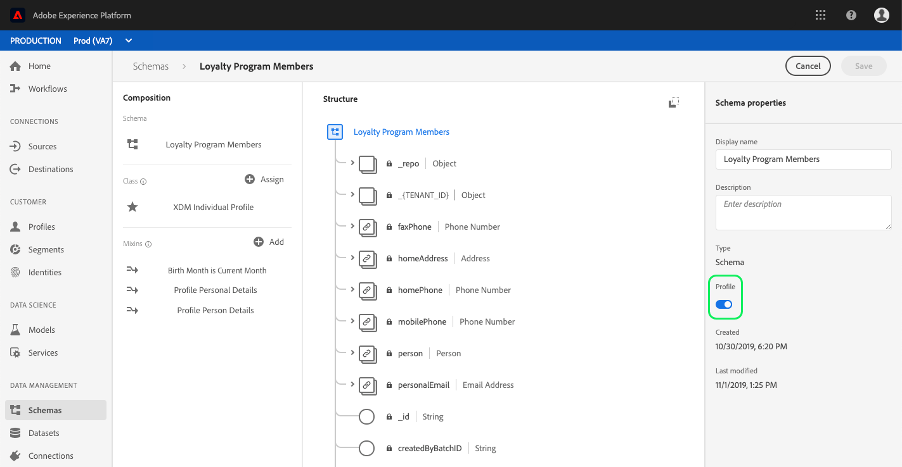

# (Alfa) Configura un campo attributo calcolato nell’interfaccia utente

>[!IMPORTANT]
>
>La funzionalità dell&#39;attributo calcolato è attualmente in alfa e non è disponibile per tutti gli utenti. La documentazione e le funzionalità sono soggette a modifiche.

Per configurare un attributo calcolato, devi innanzitutto identificare il campo che conterrà il valore dell’attributo calcolato. È possibile creare il campo utilizzando un gruppo di campi dello schema per aggiungere il campo a uno schema esistente oppure selezionando un campo già definito in uno schema.

>[!NOTE]
>
>Gli attributi calcolati non possono essere aggiunti ai campi all’interno di gruppi di campi definiti da Adobe. Il campo deve trovarsi all’interno della `tenant` spazio dei nomi, ovvero deve essere un campo definito e aggiunto a uno schema.

Per definire correttamente un campo attributo calcolato, è necessario abilitare lo schema per [!DNL Profile] e vengono visualizzati come parte dello schema di unione per la classe su cui è basato lo schema. Per ulteriori informazioni su [!DNL Profile]- schemi e sindacati abilitati, si prega di rivedere la sezione del [!DNL Schema Registry] sezione guida per sviluppatori su [abilitazione di uno schema per il profilo e visualizzazione degli schemi di unione](../../xdm/api/getting-started.md). Si consiglia inoltre di rivedere il [sezione sui sindacati](../../xdm/schema/composition.md) nella documentazione di base sulla composizione dello schema.

Il flusso di lavoro in questa esercitazione utilizza un [!DNL Profile]schema abilitato e segue i passaggi necessari per definire un nuovo gruppo di campi contenente il campo dell&#39;attributo calcolato e assicurarsi che sia lo spazio dei nomi corretto. Se disponi già di un campo nello spazio dei nomi corretto all’interno di uno schema abilitato per il profilo, puoi procedere direttamente al passaggio per [creazione di un attributo calcolato](#create-a-computed-attribute).

## Visualizzare uno schema

I passaggi seguenti utilizzano l’interfaccia utente di Adobe Experience Platform per individuare uno schema, aggiungere un gruppo di campi e definire un campo. Se preferisci utilizzare il [!DNL Schema Registry] API, fai riferimento al [Guida per gli sviluppatori del Registro di sistema dello schema](../../xdm/api/getting-started.md) per i passaggi relativi alla creazione di un gruppo di campi, aggiungere un gruppo di campi a uno schema e abilitare uno schema da utilizzare con [!DNL Real-Time Customer Profile].

Nell’interfaccia utente, fai clic su **[!UICONTROL Schemi]** nella barra a sinistra e utilizza la barra di ricerca nella barra **[!UICONTROL Sfoglia]** per trovare rapidamente lo schema da aggiornare.

Una volta individuato lo schema, fai clic sul suo nome per aprire [!DNL Schema Editor] in cui è possibile apportare modifiche allo schema.

## Creare un gruppo di campi

Per creare un nuovo gruppo di campi, fai clic su **[!UICONTROL Aggiungi]** accanto a **[!UICONTROL Gruppi di campi]** in **[!UICONTROL Composizione]** a sinistra dell’editor. Viene aperta la **[!UICONTROL Aggiungi gruppo di campi]** in cui è possibile visualizzare i gruppi di campi esistenti. Fai clic sul pulsante di scelta per **[!UICONTROL Crea nuovo gruppo di campi]** per definire il nuovo gruppo di campi.

Assegna un nome e una descrizione al gruppo di campi e fai clic su **[!UICONTROL Aggiungi gruppo di campi]** una volta completato.

## Aggiungi un campo attributo calcolato allo schema

Il nuovo gruppo di campi dovrebbe ora essere visualizzato in &quot;[!UICONTROL Gruppi di campi]&quot; sezione sotto &quot;[!UICONTROL Composizione]&quot;. Fai clic sul nome del gruppo di campi e su più **[!UICONTROL Aggiungi campo]** nella **[!UICONTROL Struttura]** dell’editor.

Seleziona **[!UICONTROL Aggiungi campo]** accanto al nome dello schema per aggiungere un campo di livello superiore, oppure puoi aggiungere il campo in un punto qualsiasi all’interno dello schema desiderato.

Dopo aver fatto clic su **[!UICONTROL Aggiungi campo]** viene aperto un nuovo oggetto, denominato ID tenant, che mostra che il campo si trova nello spazio dei nomi corretto. All&#39;interno di tale oggetto, un **[!UICONTROL Nuovo campo]** appare. Questo se il campo in cui verrà definito l&#39;attributo calcolato.

## Configura il campo

Utilizzo della **[!UICONTROL Proprietà campo]** nella sezione a destra dell’editor, fornisci le informazioni necessarie per il nuovo campo, compreso il nome, il nome visualizzato e il tipo.

>[!NOTE]
>
>Il tipo del campo deve essere lo stesso tipo del valore dell&#39;attributo calcolato. Ad esempio, se il valore dell’attributo calcolato è una stringa, il campo definito nello schema deve essere una stringa.

Al termine, fai clic su **[!UICONTROL Applica]** e il nome del campo, nonché il relativo tipo, verranno visualizzati nella **[!UICONTROL Struttura]** dell’editor.

## Abilita schema per [!DNL Profile]

Prima di continuare, assicurati che lo schema sia stato abilitato per [!DNL Profile]. Fai clic sul nome dello schema nel **[!UICONTROL Struttura]** della sezione dell&#39;editor in modo che **[!UICONTROL Proprietà schema]** viene visualizzata la scheda . Se la **[!UICONTROL Profilo]** il cursore è blu, lo schema è stato abilitato per [!DNL Profile].

>[!NOTE]
>
>Abilitazione di uno schema per [!DNL Profile] non può essere annullata, quindi se fai clic sul cursore una volta abilitato, non devi rischiare di disattivarlo.

Ora puoi fare clic su **[!UICONTROL Salva]** per salvare lo schema aggiornato e continuare con il resto dell’esercitazione utilizzando l’API .

## Passaggi successivi

Ora che hai creato un campo in cui verrà memorizzato il valore dell&#39;attributo calcolato, puoi creare l&#39;attributo calcolato utilizzando `/computedattributes` Endpoint API. Per passaggi dettagliati per la creazione di un attributo calcolato nell’API, segui i passaggi forniti nella [guida all’endpoint API degli attributi calcolati](ca-api.md).