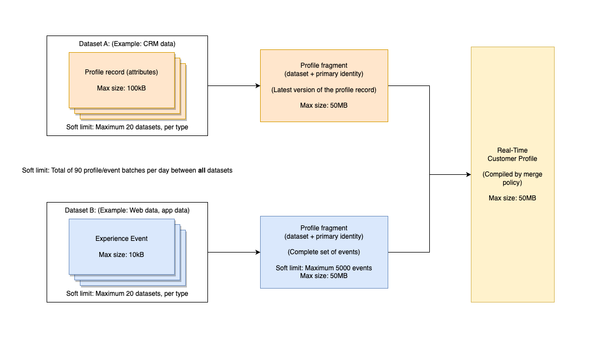

# Guardrail predefiniti per dati e segmentazione [!DNL Real-Time Customer Profile]

Adobe Experience Platform consente di fornire esperienze cross-channel personalizzate basate su informazioni comportamentali e attributi del cliente sotto forma di profili cliente in tempo reale. Per supportare questo nuovo approccio ai profili, Experience Platform utilizza un modello di dati ibridi altamente denormalizzati che differisce dal modello tradizionale di dati relazionali.

>[!IMPORTANT]
>
>Controlla i diritti di licenza nell&#39;ordine di vendita e la corrispondente [descrizione del prodotto](https://helpx.adobe.com/it/legal/product-descriptions.html) sui limiti di utilizzo effettivi, oltre a questa pagina di guardrail.

Questo documento fornisce i limiti predefiniti di utilizzo e tasso per aiutarti a modellare i dati profilo per ottenere prestazioni di sistema ottimali. Durante l’esame dei seguenti guardrail, si presume che i dati siano stati modellati correttamente. In caso di domande su come modellare i dati, contatta il rappresentante del servizio clienti.

>[!NOTE]
>
>La maggior parte dei clienti non supera questi limiti predefiniti. Per informazioni sui limiti personalizzati, contatta il rappresentante dell’assistenza clienti.

## Introduzione

I seguenti servizi di Experience Platform sono coinvolti nella modellazione dei dati del Profilo cliente in tempo reale:

* [[!DNL Real-Time Customer Profile]](home.md): creare profili consumer unificati utilizzando dati provenienti da più origini.
* [Identità](../identity-service/home.md): identità Bridge da diverse origini dati acquisite in Platform.
* [Schemi](../xdm/home.md): gli schemi Experience Data Model (XDM) sono il framework standardizzato in base al quale Platform organizza i dati sull&#39;esperienza del cliente.
* [Tipi di pubblico](../segmentation/home.md): il motore di segmentazione in Platform viene utilizzato per creare tipi di pubblico dai profili dei clienti in base ai comportamenti e agli attributi dei clienti.

## Tipi di limite

In questo documento sono disponibili due tipi di limiti predefiniti:

| Tipo di guardrail | Descrizione |
| -------------- | ----------- |
| **Guardrail delle prestazioni (limite software)** | I guardrail di prestazioni sono limiti di utilizzo relativi all’ambito dei tuoi casi d’uso. Quando si superano i guardrail delle prestazioni, è possibile che si verifichi un peggioramento delle prestazioni e della latenza. Adobe non è responsabile di tale degrado delle prestazioni. I clienti che superano costantemente il limite di prestazioni possono scegliere di concedere licenze aggiuntive per evitare il degrado delle prestazioni. |
| **Guardrail applicati dal sistema (limite rigido)** | I guardrail applicati dal sistema vengono applicati dall’interfaccia utente o dall’API di Real-Time CDP. Questi sono i limiti che non puoi superare, poiché l’interfaccia utente e l’API ti impediranno di farlo o restituiranno un errore. |

{style="table-layout:auto"}

>[!NOTE]
>
>I limiti delineati nel presente documento vengono costantemente migliorati. Controlla regolarmente se ci sono aggiornamenti. Se ti interessa conoscere i limiti personalizzati, contatta il rappresentante dell’assistenza clienti.

## Limiti del modello dati

Le seguenti protezioni forniscono i limiti consigliati per la modellazione dei dati Profilo cliente in tempo reale. Per ulteriori informazioni sulle entità primarie e sulle entità dimensione, vedere la sezione relativa ai [tipi di entità](#entity-types) nell&#39;appendice.

### Guardrail dell’entità primaria

| Guardrail | Limite | Tipo limite | Descrizione |
| --------- | ----- | ---------- | ----------- |
| Set di dati della singola classe di profilo XDM | 20 | Guardrail delle prestazioni | Si consiglia un massimo di 20 set di dati che sfruttano la classe Profilo individuale XDM. |
| Set di dati della classe XDM ExperienceEvent | 20 | Guardrail delle prestazioni | Si consiglia un massimo di 20 set di dati che sfruttano la classe ExperienceEvent XDM. |
| Set di dati della suite di rapporti di Adobe Analytics abilitati per il profilo | 1 | Guardrail delle prestazioni | Per il profilo deve essere abilitato un massimo di un (1) set di dati della suite di rapporti di Analytics. Il tentativo di abilitare più set di dati della suite di rapporti di Analytics per il profilo può avere conseguenze indesiderate sulla qualità dei dati. Per ulteriori informazioni, vedere la sezione relativa ai [set di dati di Adobe Analytics](#aa-datasets) nell&#39;appendice. |
| Relazioni tra più entità | 5 | Guardrail delle prestazioni | Si consiglia di definire un massimo di 5 relazioni tra più entità tra entità principali ed entità dimensione. Non è consigliabile eseguire mapping di relazioni aggiuntivi finché non viene rimossa o disabilitata una relazione esistente. |
| Profondità JSON per il campo ID utilizzato nella relazione tra più entità | 4 | Guardrail delle prestazioni | La profondità JSON massima consigliata per un campo ID utilizzato nelle relazioni tra più entità è 4. Ciò significa che in uno schema altamente nidificato, i campi nidificati con profondità superiore a 4 livelli non devono essere utilizzati come campo ID in una relazione. |
| Cardinalità dell’array in un frammento di profilo | &lt;=500 | Guardrail delle prestazioni | La cardinalità dell’array ottimale in un frammento di profilo (dati indipendenti dal tempo) è &lt;=500. |
| Cardinalità dell’array in ExperienceEvent | &lt;=10 | Guardrail delle prestazioni | La cardinalità dell’array ottimale in un ExperienceEvent (dati di serie temporali) è &lt;=10. |
| Grafico identità conteggio identità per singolo profilo | 50 | Guarddrail imposto dal sistema | **Il numero massimo di identità in un grafo identità per un singolo profilo è 50.** Tutti i profili con più di 50 identità sono esclusi da segmentazione, esportazioni e ricerche. |

{style="table-layout:auto"}

### guardrail entità Dimension

| Guardrail | Limite | Tipo limite | Descrizione |
| --------- | ----- | ---------- | ----------- |
| Non sono consentiti dati di serie temporali per entità diverse da [!DNL XDM Individual Profile] | 0 | Guarddrail imposto dal sistema | **I dati della serie temporale non sono consentiti per entità non [!DNL XDM Individual Profile] nel servizio profili.** Se un set di dati della serie temporale è associato a un ID non [!DNL XDM Individual Profile], il set di dati non deve essere abilitato per [!DNL Profile]. |
| Nessuna relazione nidificata | 0 | Guardrail delle prestazioni | Non creare una relazione tra due schemi diversi da [!DNL XDM Individual Profile]. La possibilità di creare relazioni non è consigliata per gli schemi che non fanno parte dello schema di unione [!DNL Profile]. |
| Profondità JSON per il campo ID primario | 4 | Guardrail delle prestazioni | La profondità JSON massima consigliata per il campo ID primario è 4. Ciò significa che in uno schema altamente nidificato, non devi selezionare un campo come ID primario se è nidificato a più di 4 livelli di profondità. Un campo che si trova al quarto livello nidificato può essere utilizzato come ID primario. |

{style="table-layout:auto"}

## Limiti di dimensione dei dati

I seguenti guardrail si riferiscono alle dimensioni dei dati e forniscono i limiti consigliati per i dati che possono essere acquisiti, memorizzati e interrogati come previsto. Per ulteriori informazioni sulle entità primarie e sulle entità dimensione, vedere la sezione relativa ai [tipi di entità](#entity-types) nell&#39;appendice.

>[!NOTE]
>
>La dimensione dei dati viene misurata come dati non compressi in JSON al momento dell’acquisizione.

### Guardrail dell’entità primaria

| Guardrail | Limite | Tipo limite | Descrizione |
| --------- | ----- | ---------- | ----------- |
| Dimensione massima ExperienceEvent | 10 KB | Guarddrail imposto dal sistema | **La dimensione massima di un evento è 10 KB.L&#39;acquisizione di** continuerà, tuttavia tutti gli eventi di dimensioni superiori a 10 KB verranno eliminati. |
| Dimensione massima record profilo | 100 KB | Guarddrail imposto dal sistema | **La dimensione massima di un record di profilo è 100 KB.L&#39;acquisizione di** continuerà, tuttavia i record di profilo di dimensioni superiori a 100 KB verranno eliminati. |
| Dimensione massima del frammento di profilo | 50 MB | Guarddrail imposto dal sistema | **La dimensione massima di un singolo frammento di profilo è di 50 MB.** Segmentazione, esportazioni e ricerche potrebbero non riuscire per qualsiasi [frammento di profilo](#profile-fragments) di dimensioni superiori a 50 MB. |
| Dimensione massima archiviazione profilo | 50 MB | Guardrail delle prestazioni | **La dimensione massima di un profilo memorizzato è di 50 MB.** L&#39;aggiunta di nuovi [frammenti di profilo](#profile-fragments) in un profilo di dimensioni superiori a 50 MB influisce sulle prestazioni del sistema. Ad esempio, un profilo potrebbe contenere un singolo frammento di 50 MB oppure più frammenti in più set di dati con una dimensione totale combinata di 50 MB. Il tentativo di memorizzare un profilo con un singolo frammento di dimensioni superiori a 50 MB o con più frammenti di dimensioni combinate superiori a 50 MB influisce sulle prestazioni del sistema. |
| Numero di batch di profili o ExperienceEvent acquisiti al giorno | 90 | Guardrail delle prestazioni | **Il numero massimo di batch di profili o ExperienceEvent acquisiti al giorno è 90.** Ciò significa che il totale combinato dei batch di profili ed ExperienceEvent acquisiti ogni giorno non può superare i 90. L&#39;acquisizione di batch aggiuntivi influisce sulle prestazioni del sistema. |
| Numero di ExperienceEvents per record di profilo | 5000 | Guardrail delle prestazioni | **Il numero massimo di ExperienceEvents per record di profilo è 5000.** profili con più di 5000 ExperienceEvents **non** verranno considerati per la segmentazione. |

{style="table-layout:auto"}

### guardrail entità Dimension

| Guardrail | Limite | Tipo limite | Descrizione |
| --------- | ----- | ---------- | ----------- |
| Dimensione totale per tutte le entità dimensionali | 5GB | Guardrail delle prestazioni | La dimensione totale consigliata per tutte le entità dimensionali è 5 GB. L&#39;inserimento di entità di dimensioni grandi può influire sulle prestazioni del sistema. Ad esempio, non è consigliabile tentare di caricare un catalogo di prodotti da 10 GB come entità dimensione. |
| Set di dati per schema di entità dimensionale | 5 | Guardrail delle prestazioni | Si consiglia un massimo di 5 set di dati associati a ogni schema di entità dimensionale. Ad esempio, se crei uno schema per &quot;prodotti&quot; e aggiungi cinque set di dati contributivi, non devi creare un sesto set di dati associato allo schema prodotti. |
| Batch di entità Dimension acquisiti al giorno | 4 per entità | Guardrail delle prestazioni | Il numero massimo consigliato di batch di entità dimensione acquisiti al giorno è 4 per entità. Ad esempio, puoi acquisire gli aggiornamenti di un catalogo di prodotti fino a 4 volte al giorno. L&#39;acquisizione di batch di entità di dimensione aggiuntivi per la stessa entità può influire sulle prestazioni del sistema. |

{style="table-layout:auto"}

## Guardrail di segmentazione {#segmentation-guardrails}

I guardrail descritti in questa sezione si riferiscono al numero e alla natura dei tipi di pubblico che un’organizzazione può creare in Experience Platform, nonché alla mappatura e all’attivazione dei tipi di pubblico nelle destinazioni.

| Guardrail | Limite | Tipo limite | Descrizione |
| --------- | ----- | ---------- | ----------- |
| Tipi di pubblico per sandbox | 4000 | Guardrail delle prestazioni | Un’organizzazione può avere più di 4000 tipi di pubblico in totale, purché ci siano meno di 4000 tipi di pubblico in ogni singola sandbox. Sono inclusi i tipi di pubblico batch, in streaming e edge. Il tentativo di creare ulteriori tipi di pubblico può influire sulle prestazioni del sistema. Ulteriori informazioni sulla [creazione di tipi di pubblico](/help/segmentation/ui/segment-builder.md) tramite il Generatore di segmenti. |
| Tipi di pubblico di Edge per sandbox | 150 | Guardrail delle prestazioni | Un’organizzazione può avere più di 150 tipi di pubblico Edge in totale, purché ci siano meno di 150 tipi di pubblico Edge in ogni singola sandbox. Il tentativo di creare un pubblico perimetrale aggiuntivo può influire sulle prestazioni del sistema. Ulteriori informazioni su [tipi di pubblico edge](/help/segmentation/ui/edge-segmentation.md). |
| Throughput di Edge in tutte le sandbox | 1500 RPS | Guardrail delle prestazioni | La segmentazione di Edge supporta un valore di picco di 1500 eventi in entrata al secondo per l’accesso all’Edge Network Adobe Experience Platform. La segmentazione di Edge può richiedere fino a 350 millisecondi per elaborare un evento in entrata dopo che è entrato nell’Edge Network di Adobe Experience Platform. Ulteriori informazioni su [tipi di pubblico edge](/help/segmentation/ui/edge-segmentation.md). |
| Tipi di pubblico in streaming per sandbox | 500 | Guardrail delle prestazioni | Un’organizzazione può avere più di 500 pubblici di streaming in totale, purché ci siano meno di 500 pubblici di streaming in ogni singola sandbox. Ciò include sia i tipi di pubblico in streaming che quelli edge. Il tentativo di creare ulteriori tipi di pubblico in streaming può influire sulle prestazioni del sistema. Ulteriori informazioni su [tipi di pubblico in streaming](/help/segmentation/ui/streaming-segmentation.md). |
| Velocità effettiva in streaming su tutte le sandbox | 1500 RPS | Guardrail delle prestazioni | La segmentazione in streaming supporta un valore di picco di 1500 eventi in entrata al secondo. La segmentazione in streaming può richiedere fino a 5 minuti per qualificare un profilo per l’iscrizione al segmento. Ulteriori informazioni su [tipi di pubblico in streaming](/help/segmentation/ui/streaming-segmentation.md). |
| Pubblico in batch per sandbox | 4000 | Guardrail delle prestazioni | Un’organizzazione può avere più di 4000 tipi di pubblico in batch in totale, purché ci siano meno di 4000 tipi di pubblico in batch in ogni singola sandbox. Il tentativo di creare un pubblico batch aggiuntivo può influire sulle prestazioni del sistema. |
| Pubblico dell’account per sandbox | 50 | Guarddrail imposto dal sistema | Puoi creare un massimo di 50 tipi di pubblico di account in una sandbox. Dopo aver raggiunto 50 tipi di pubblico in una sandbox, il controllo **[!UICONTROL Crea pubblico]** è disabilitato quando si tenta di creare un nuovo pubblico account. Ulteriori informazioni su [tipi di pubblico dell&#39;account](/help/segmentation/ui/account-audiences.md). |
| Composizioni pubblicate per sandbox | 10 | Guardrail delle prestazioni | Puoi avere un massimo di 10 composizioni pubblicate in una sandbox. Ulteriori informazioni sulla [composizione del pubblico nella guida dell&#39;interfaccia utente](/help/segmentation/ui/audience-composition.md). |
| Dimensione massima del pubblico | 30% | Guardrail delle prestazioni | L’appartenenza massima consigliata a un pubblico è il 30% del numero totale di profili nel sistema. È possibile creare tipi di pubblico con più del 30% dei profili come membri o più tipi di pubblico di grandi dimensioni, ma questo influirà sulle prestazioni del sistema. |

{style="table-layout:auto"}

## Disponibilità prevista

La sezione seguente illustra la disponibilità **prevista** per i tipi di pubblico e i criteri di unione nei servizi a valle come le destinazioni Real-Time CDP:

| Tipo di sandbox | Ora |
| ------------ | ---- |
| Sandbox esistenti | 1 ora |
| Nuove sandbox | 2 ore |
| Sandbox ripristinate di recente | 2 ore |

{style="table-layout:auto"}

## Appendice

Questa sezione fornisce ulteriori dettagli sui limiti riportati in questo documento.

### Tipi di entità

Il modello dati dell&#39;archivio [!DNL Profile] è costituito da due tipi di entità di base: [entità primarie](#primary-entity) e [entità dimensionali](#dimension-entity).

#### Entità primaria

Un’entità primaria, o entità di profilo, unisce i dati per formare una &quot;singola sorgente di verità&quot; per un individuo. Questi dati unificati vengono rappresentati utilizzando la cosiddetta &quot;visualizzazione unione&quot;. Una vista unione aggrega i campi di tutti gli schemi che implementano la stessa classe in un unico schema di unione. Lo schema di unione per [!DNL Real-Time Customer Profile] è un modello di dati ibridi denormalizzati che funge da contenitore per tutti gli attributi di profilo e gli eventi comportamentali.

Gli attributi indipendenti dal tempo, noti anche come &quot;dati record&quot;, vengono modellati utilizzando [!DNL XDM Individual Profile], mentre i dati della serie temporale, noti anche come &quot;dati evento&quot;, vengono modellati utilizzando [!DNL XDM ExperienceEvent]. Quando i dati dei record e delle serie temporali vengono acquisiti in Adobe Experience Platform, attiva [!DNL Real-Time Customer Profile] per iniziare ad acquisire i dati abilitati per il relativo utilizzo. Più interazioni e dettagli vengono acquisiti, più solidi saranno i singoli profili.

#### Entità Dimension

Anche se l’archivio dati profilo che gestisce i dati profilo non è un archivio relazionale, Profilo consente l’integrazione con entità dimensionali di piccole dimensioni per creare tipi di pubblico in modo semplificato e intuitivo. Questa integrazione è nota come [segmentazione con più entità](../segmentation/multi-entity-segmentation.md).

La tua organizzazione può anche definire classi XDM per descrivere elementi diversi dai singoli utenti, ad esempio store, prodotti o proprietà. Questi schemi non [!DNL XDM Individual Profile] sono denominati &quot;entità dimensione&quot; (note anche come &quot;entità di ricerca&quot;) e non contengono dati di serie temporali. Gli schemi che rappresentano entità dimensione sono collegati alle entità profilo tramite l&#39;utilizzo di [relazioni schema](../xdm/tutorials/relationship-ui.md).

Le entità di Dimension forniscono dati di ricerca che facilitano e semplificano le definizioni dei segmenti con più entità e devono essere sufficientemente piccole da consentire al motore di segmentazione di caricare l’intero set di dati in memoria per un’elaborazione ottimale (ricerca rapida dei punti).

### Frammenti di profilo

In questo documento sono presenti diversi guardrail che fanno riferimento a &quot;frammenti di profilo&quot;. Ad Experience Platform, più frammenti di profilo vengono uniti per formare Real-Time Customer Profile. Ogni frammento rappresenta un’identità primaria univoca e il record corrispondente o il set completo di dati evento per tale ID all’interno di un dato set di dati. Per ulteriori informazioni sui frammenti di profilo, consulta la [Panoramica profilo](home.md#profile-fragments-vs-merged-profiles).

### Criteri di unione {#merge-policies}

Quando si riuniscono dati da più origini, i criteri di unione sono le regole utilizzate da Platform per determinare come i dati verranno prioritari e quali dati verranno combinati per creare tale vista unificata. Ad esempio, se un cliente interagisce con il tuo marchio su più canali, la tua organizzazione avrà più frammenti di profilo relativi a quel singolo cliente che appaiono in più set di dati. Quando questi frammenti vengono acquisiti in Platform, vengono uniti per creare un unico profilo per quel cliente. Quando i dati provenienti da più origini sono in conflitto, il criterio di unione determina quali informazioni includere nel profilo per la persona. È consentito un massimo di cinque (5) criteri di unione che utilizzano lo schema `_xdm.context.profile` per sandbox. Per ulteriori informazioni sui criteri di unione, leggere la [panoramica dei criteri di unione](merge-policies/overview.md).

### Set di dati della suite di rapporti di Adobe Analytics in Platform {#aa-datasets}

È possibile abilitare più suite di rapporti per il profilo, purché tutti i conflitti di dati siano stati risolti. Puoi utilizzare la funzionalità Preparazione dati per risolvere i conflitti di dati tra eVar, Elenchi e Proprietà. Per ulteriori informazioni su come utilizzare la funzionalità Preparazione dati, consulta la [guida dell&#39;interfaccia utente del connettore Adobe Analytics](../sources/tutorials/ui/create/adobe-applications/analytics.md).

## Passaggi successivi

Consulta la seguente documentazione per ulteriori informazioni su altri guardrail dei servizi Experience Platform, informazioni sulla latenza end-to-end e informazioni sulle licenze dai documenti di descrizione del prodotto Real-Time CDP:

* [Guardrail Real-Time CDP](/help/rtcdp/guardrails/overview.md)
* [Diagrammi di latenza end-to-end](https://experienceleague.adobe.com/docs/blueprints-learn/architecture/architecture-overview/deployment/guardrails.html?lang=en#end-to-end-latency-diagrams) per vari servizi Experience Platform.
* [Real-time Customer Data Platform (Edizione B2C - Pacchetti Prime e Ultimate)](https://helpx.adobe.com/legal/product-descriptions/real-time-customer-data-platform-b2c-edition-prime-and-ultimate-packages.html)
* [Real-time Customer Data Platform (B2P - Pacchetti Prime e Ultimate)](https://helpx.adobe.com/legal/product-descriptions/real-time-customer-data-platform-b2p-edition-prime-and-ultimate-packages.html)
* [Real-time Customer Data Platform (B2B - Pacchetti Prime e Ultimate)](https://helpx.adobe.com/legal/product-descriptions/real-time-customer-data-platform-b2b-edition-prime-and-ultimate-packages.html)
