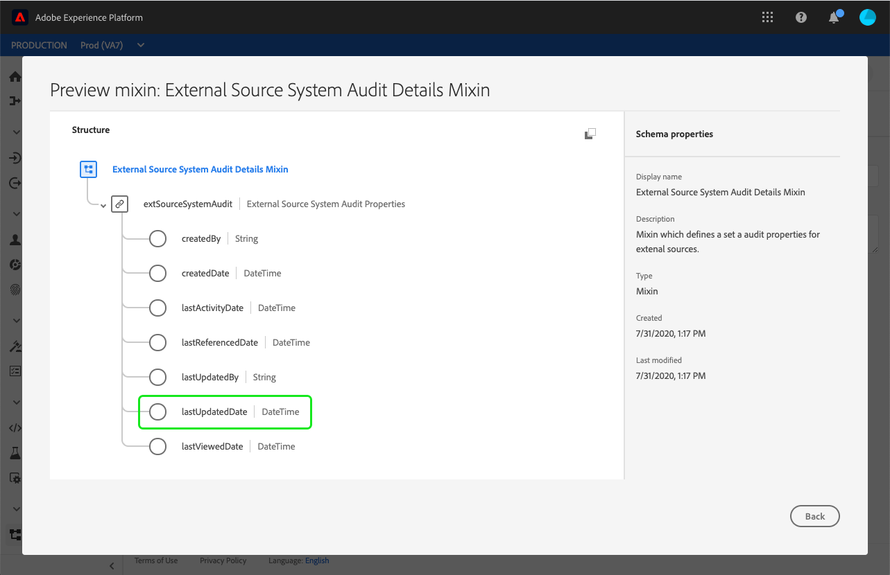

# Panoramica sui criteri di unione

Adobe Experience Platform consente di unire frammenti di dati provenienti da più sorgenti e di combinarli per ottenere una visualizzazione completa di ciascuno dei singoli clienti. Quando si riuniscono questi dati, i criteri di unione sono le regole utilizzate da [!DNL Platform] per determinare in che modo i dati verranno definiti come prioritari e quali dati verranno combinati per creare una visualizzazione unificata.

Utilizzando le API RESTful o l&#39;interfaccia utente, è possibile creare nuovi criteri di unione, gestire i criteri esistenti e impostare un criterio di unione predefinito per la propria organizzazione. Questo documento fornisce una panoramica dei criteri di unione e del ruolo che essi svolgono all&#39;interno dell&#39;Experience Platform.

## Introduzione

Questa guida richiede una comprensione approfondita di diverse importanti funzioni [!DNL Experience Platform] . Prima di seguire questa guida e di utilizzare i criteri di unione, controlla la documentazione relativa ai seguenti servizi:

* [Profilo](../home.md) cliente in tempo reale: Fornisce un profilo di consumatore unificato e in tempo reale basato su dati aggregati provenienti da più origini.
* [Servizio](../../identity-service/home.md) Adobe Experience Platform Identity: Abilita il Profilo del cliente in tempo reale collegando le identità da diverse sorgenti di dati in  [!DNL Platform].
* [Experience Data Model (XDM)](../../xdm/home.md): Il framework standardizzato in base al quale  [!DNL Platform] vengono organizzati i dati sulla customer experience.

## Informazioni sui criteri di unione

Adobe Experience Platform consente di unire frammenti di dati provenienti da più sorgenti e di combinarli per ottenere una visualizzazione completa e unificata di ciascuno dei singoli clienti. Quando si riuniscono questi dati, i criteri di unione sono le regole utilizzate da Platform per determinare in che modo i dati verranno definiti come prioritari e quali dati verranno combinati per creare tale visualizzazione unificata.

Ad esempio, se un cliente interagisce con il tuo marchio su più canali, la tua organizzazione avrà più frammenti di profilo relativi al singolo cliente che compaiono in più set di dati. Quando questi frammenti vengono acquisiti in Platform, vengono uniti per creare un singolo profilo per quel cliente.

Quando i dati provenienti da più origini sono in conflitto (ad esempio, un frammento elenca il cliente come &quot;singolo&quot;, mentre l’altro elenca il cliente come &quot;sposato&quot;), il criterio di unione determina quali informazioni includere nel profilo dell’utente.

I criteri di unione sono privati dell’organizzazione IMS e consentono di creare diversi criteri per unire gli schemi nei modi specifici necessari. È inoltre possibile specificare un criterio di unione predefinito che verrà utilizzato se non viene fornito in modo esplicito. Per ulteriori informazioni, consulta la sezione sui [criteri di unione predefiniti](#default-merge-policy) più avanti in questo documento.

## Metodi di unione {#merge-methods}

Ogni frammento di profilo contiene informazioni per una sola identità sul numero totale di identità che possono esistere per un singolo utente. Quando unisci i dati per formare un profilo cliente, è possibile che tali informazioni siano in conflitto e occorre specificare la priorità.

La selezione di un metodo di unione consente di specificare quali attributi del set di dati dare la priorità se si verifica un conflitto di unione tra i set di dati.

Sono disponibili due possibili metodi di unione per i criteri di unione. Ciascuno di questi metodi è riassunto di seguito con ulteriori dettagli forniti nelle sezioni seguenti:

* **[!UICONTROL Precedenza set di dati]:** in caso di conflitto, assegna priorità ai frammenti di profilo in base al set di dati da cui provengono. Quando selezioni questa opzione, devi scegliere i set di dati correlati e il loro ordine di priorità. Ulteriori informazioni sul metodo di unione [precedenza set di dati](#dataset-precedence).
* **[!UICONTROL Timestamp ordered]:** in caso di conflitto, viene data priorità al frammento di profilo aggiornato più di recente. Ulteriori informazioni sul metodo di unione [timestamp ordered](#timestamp-ordered) .
   * **Marca temporale personalizzata:** il metodo di unione ordinata per le marche temporali supporta anche marche temporali personalizzate che hanno priorità rispetto alle marche temporali del sistema quando si uniscono dati all’interno dello stesso set di dati (più identità) o tra set di dati. Per ulteriori informazioni, consulta la sezione sull’ [utilizzo di marche temporali personalizzate](#custom-timestamps).

### Precedenza del set di dati {#dataset-precedence}

Quando **[!UICONTROL Precedenza set di dati]** è selezionato come metodo di unione per un criterio di unione, è possibile assegnare la priorità ai frammenti di profilo in base al set di dati da cui provengono. Un esempio di caso d’uso è quello di informazioni presenti in un set di dati preferito o attendibile rispetto ai dati di un altro set di dati.

Per creare un criterio di unione utilizzando **[!UICONTROL Precedenza set di dati]**, è necessario selezionare i set di dati Profilo ed ExperienceEvent inclusi, quindi è possibile ordinare manualmente i set di dati Profilo per la precedenza. Una volta selezionati e ordinati i set di dati, al set di dati principale verrà data la priorità più alta, al secondo e così via.

### Timestamp ordered {#timestamp-ordered}

Poiché i record di profilo vengono acquisiti in Experience Platform, al momento dell’acquisizione viene ottenuta una marca temporale di sistema che viene aggiunta al record. Quando **[!UICONTROL Timestamp ordered]** è selezionato come metodo di unione per un criterio di unione, i profili vengono uniti in base alla marca temporale del sistema. In altre parole, l’unione viene eseguita in base alla marca temporale per quando il record è stato acquisito in Platform.

#### Utilizzo di marche temporali personalizzate {#custom-timestamps}

Talvolta possono verificarsi casi d’uso in cui è necessario fornire una marca temporale personalizzata e il criterio di unione rispetta la marca temporale personalizzata anziché quella di sistema. Esempi di ciò includono il recupero dei dati o la garanzia dell’ordine corretto degli eventi se i record vengono acquisiti in modo errato.

Per utilizzare una marca temporale personalizzata, è necessario aggiungere allo schema di profilo il gruppo di campi **[!UICONTROL Dettagli controllo sistema origine esterna]**. Una volta aggiunta, la marca temporale personalizzata può essere compilata utilizzando il campo `lastUpdatedDate` . Quando un record viene acquisito con il campo `lastUpdatedDate` popolato, Experience Platform lo utilizzerà per unire i record tra i set di dati. Se `lastUpdatedDate` non è presente o non è popolato, Platform continuerà a utilizzare la marca temporale del sistema.

>[!NOTE]
>
>È necessario assicurarsi che la marca temporale `lastUpdatedDate` sia compilata quando si acquisisce un aggiornamento sullo stesso record.

Nella schermata seguente sono visualizzati i campi nel gruppo di campi [!UICONTROL Dettagli controllo sistema di origine esterna] . Per istruzioni dettagliate sull’utilizzo degli schemi tramite l’interfaccia utente di Platform e su come aggiungere gruppi di campi agli schemi, visita l’ [esercitazione per creare uno schema utilizzando l’interfaccia utente](../../xdm/tutorials/create-schema-ui.md) .

Per utilizzare le marche temporali personalizzate utilizzando l&#39;API, consulta la sezione [guida all&#39;endpoint dei criteri di unione sull&#39;utilizzo di marche temporali personalizzate](../api/merge-policies.md#custom-timestamps).

## Unione identità {#id-stitching}

L&#39;unione delle identità ([!UICONTROL unione degli ID]) è il processo di identificazione dei frammenti di dati e di loro combinazione per formare un record completo del profilo. Per illustrare i diversi comportamenti di unione, considera un singolo cliente che interagisce con un marchio utilizzando due indirizzi e-mail diversi.

* **[!UICONTROL Nessuno]:** quando questa opzione è selezionata, gli ID non vengono uniti. Quando si verifica la segmentazione, le identità che possono appartenere alla stessa persona non vengono unite e la segmentazione considera solo gli attributi associati a ciascun singolo ID quando si determina se un cliente è idoneo per l’appartenenza al segmento. Questo potrebbe comportare l’invio di più messaggi di marketing allo stesso cliente a un singolo cliente con più profili e ciascun profilo potrebbe qualificarsi per segmenti diversi.
* **[!UICONTROL Grafico privato]:** quando è selezionato il grafico privato, più identità relative allo stesso individuo vengono unite tra loro. Questo fa sì che il cliente abbia un singolo profilo e consenta alla segmentazione di considerare più attributi da più identità correlate durante la determinazione della qualifica del segmento. In questo scenario, è probabile che il cliente abbia un singolo profilo, si qualifichi per un segmento in base alla combinazione di attributi tra identità e riceva un solo messaggio di marketing.

Per ulteriori informazioni sulle identità e sul loro ruolo nella generazione di profili e segmenti, leggi la [panoramica del servizio Identity](../../identity-service/home.md).

## Criterio di unione predefinito {#default-merge-policy}

Un&#39;organizzazione può creare un criterio di unione predefinito da utilizzare per l&#39;unione dei frammenti di profilo. Questo consente agli utenti di selezionare facilmente il criterio predefinito durante l’esecuzione di azioni, ad Experience Platform la visualizzazione dei profili dei clienti o la creazione di segmenti. Nella maggior parte dei casi, a meno che non venga specificato un altro criterio di unione, verrà utilizzato il criterio di unione predefinito.

Ciascuna organizzazione può creare più criteri di unione relativi a una singola classe di schema XDM, tuttavia può avere un solo criterio di unione predefinito dichiarato per ogni classe. Ad esempio, l&#39;organizzazione potrebbe disporre di un criterio di unione predefinito correlato alla classe [!DNL XDM Individual Profile] e di un diverso criterio di unione predefinito per una classe di inventario prodotto personalizzata.

Se si crea un nuovo criterio di unione e lo si imposta come predefinito, il precedente criterio di unione predefinito verrà aggiornato automaticamente dal sistema in modo che non sia più il predefinito.

>[!WARNING]
>
>Potrebbero essere interessati i conteggi e i segmenti di profilo con un criterio di unione predefinito esistente. Tutti i segmenti a cui è stato applicato un criterio di unione predefinito verranno aggiornati al nuovo criterio di unione predefinito.

## Passaggi successivi

Dopo aver letto questa guida è ora possibile sapere cosa sono i criteri di unione e il ruolo che svolgono all’interno di Experience Platform. Per iniziare a utilizzare i criteri di unione nell&#39;interfaccia utente di Experience Platform, fare riferimento alla [guida all&#39;interfaccia utente dei criteri di unione](ui-guide.md). Per utilizzare i criteri di unione utilizzando l&#39;API, visita la [guida all&#39;endpoint API dei criteri di unione](../api/merge-policies.md).