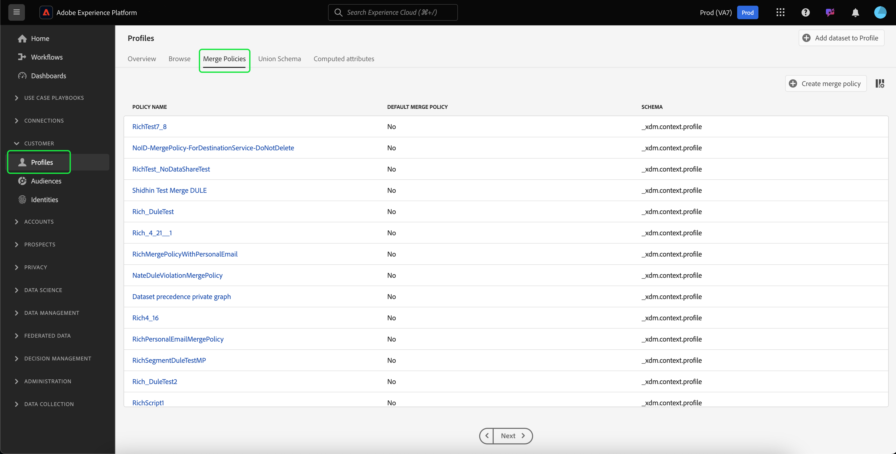
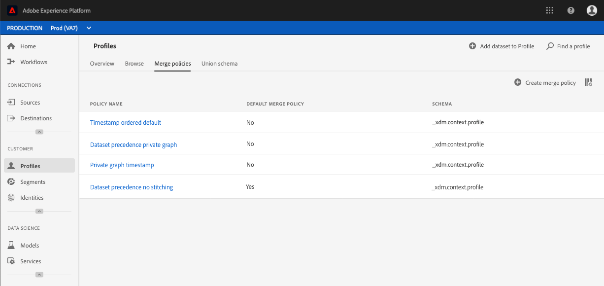

# Guida dell’interfaccia utente dei criteri di unione

Adobe Experience Platform consente di unire frammenti di dati provenienti da più origini e di combinarli in modo da ottenere una visualizzazione completa di ciascuno dei singoli clienti. Quando si riuniscono questi dati, i criteri di unione sono le regole che [!DNL Platform] utilizza per determinare come assegnare la priorità ai dati e quali dati verranno combinati per creare la vista unificata.

Utilizzando le API RESTful o l’interfaccia utente di, puoi creare nuovi criteri di unione, gestire i criteri esistenti e impostare un criterio di unione predefinito per la tua organizzazione. Questa guida fornisce istruzioni dettagliate per l’utilizzo dei criteri di unione tramite l’interfaccia utente di Adobe Experience Platform.

Per ulteriori informazioni sui criteri di unione e sul ruolo che svolgono all’interno di Experience Platform, consulta la sezione [panoramica dei criteri di unione](overview.md).

## Introduzione

Questa guida richiede una buona conoscenza di diversi [!DNL Experience Platform] funzioni. Prima di seguire questa guida, consulta la documentazione relativa ai seguenti servizi:

* [Profilo cliente in tempo reale](../home.md): fornisce un profilo consumer unificato e in tempo reale basato su dati aggregati provenienti da più origini.
* [Servizio Adobe Experience Platform Identity](../../identity-service/home.md): abilita Real-Time Customer Profile collegando le identità da diverse origini dati in cui vengono acquisite [!DNL Platform].
* [Experience Data Model (XDM)](../../xdm/home.md): il quadro standardizzato mediante il quale [!DNL Platform] organizza i dati sull’esperienza del cliente.

## Visualizza criteri di unione {#view-merge-policies}

All&#39;interno del [!DNL Experience Platform] interfaccia utente, puoi iniziare a utilizzare i criteri di unione selezionando **[!UICONTROL Profili]** nel menu di navigazione a sinistra, quindi seleziona la **[!UICONTROL Criteri di unione]** scheda. Questa scheda include un elenco di tutti i criteri di unione esistenti per l’organizzazione, nonché i dettagli di ciascun criterio di unione, incluso il nome del criterio, indipendentemente dal fatto che il criterio di unione sia o meno il criterio di unione predefinito, e la classe di schema a cui il criterio di unione si riferisce.

Per selezionare i dettagli visibili o per aggiungere altre colonne alla visualizzazione, selezionare **[!UICONTROL Configurare le colonne]** e fai clic sul nome di una colonna per aggiungerla o rimuoverla dalla vista.

## Creare un criterio di unione {#create-a-merge-policy}

Per creare un nuovo criterio di unione, seleziona **[!UICONTROL Crea criterio di unione]** nella scheda criteri di unione per inserire il nuovo flusso di lavoro dei criteri di unione.

Il **[!UICONTROL Nuovo criterio di unione]** , richiede di fornire informazioni importanti per il nuovo criterio di unione tramite una serie di passaggi guidati. Questi passaggi sono descritti nelle sezioni che seguono.

## [!UICONTROL Configurare gli] {#configure}

Il primo passaggio nel flusso di lavoro consente di configurare il criterio di unione fornendo informazioni di base. Queste informazioni includono:

* **[!UICONTROL Nome]**: il nome del criterio di unione deve essere descrittivo ma conciso.
* **[!UICONTROL Classe schema]**: classe dello schema XDM associata al criterio di unione. Specifica la classe di schema per la quale viene creato il criterio di unione. Le organizzazioni possono creare più criteri di unione per classe di schema. Attualmente solo il [!UICONTROL Profilo individuale XDM] è disponibile nell’interfaccia utente. Puoi visualizzare in anteprima lo schema di unione per la classe di schema selezionando **[!UICONTROL Visualizza schema di unione]**. Per ulteriori informazioni, consulta la sezione su [visualizzazione dello schema di unione](#view-union-schema) questo è quanto segue.
* **[!UICONTROL Unione ID]**: questo campo definisce come determinare le identità correlate di un cliente. Esistono due possibili valori per l’unione di identità ed è importante comprendere in che modo il tipo di unione di identità selezionato influirà sui dati. Per ulteriori informazioni, consulta [panoramica dei criteri di unione](overview.md).
   * **[!UICONTROL Nessuno]**: non eseguire alcuna unione di identità.
   * **[!UICONTROL Private Graph]**: esegui l’unione delle identità in base al grafico delle identità private.
* **[!UICONTROL Criterio di unione predefinito]**: pulsante che consente di scegliere se il criterio di unione sarà o meno il criterio predefinito per l’organizzazione. Se il selettore è attivato, viene visualizzato un avviso che richiede di confermare la modifica del criterio di unione predefinito dell&#39;organizzazione. Consulta la [panoramica dei criteri di unione](overview.md) per ulteriori informazioni sui criteri di unione predefiniti.
   
* **[!UICONTROL Criterio di unione Attivo su Edge]**: pulsante di attivazione/disattivazione che consente di selezionare se il criterio di unione sarà attivo o meno su Edge. Per garantire che tutti i consumatori di profili utilizzino la stessa vista sugli spigoli, i criteri di unione possono essere contrassegnati come attivi sugli spigoli. Affinché un segmento possa essere attivato sullo spigolo (contrassegnato come segmento dello spigolo), deve essere associato a un criterio di unione contrassegnato come attivo sullo spigolo. Se un segmento è **non** associato a un criterio di unione contrassegnato come attivo su edge, il segmento non verrà contrassegnato come attivo su edge e verrà contrassegnato come segmento di streaming. Inoltre, ogni sandbox in un’organizzazione può avere solo **uno** criterio di unione attivo su edge.

Una volta completati i campi obbligatori, puoi selezionare **[!UICONTROL Successivo]** per continuare con il flusso di lavoro.

## [!UICONTROL Visualizza schema di unione] {#view-union-schema}

Quando crei o modifichi un criterio di unione, puoi visualizzare lo schema di unione per la classe di schema selezionata selezionando **[!UICONTROL Visualizza schema di unione]**.

Verrà aperto il [!UICONTROL Visualizza schema di unione] , mostrando tutti gli schemi, le identità e le relazioni partecipanti associati allo schema di unione. Puoi utilizzare la finestra di dialogo per esplorare lo schema di unione nello stesso modo in cui accedi a [!UICONTROL Schema di unione] scheda in [!UICONTROL Profili] sezione dell’interfaccia utente di Platform.

Per informazioni dettagliate sugli schemi di unione, tra cui come interagire con essi nella [!UICONTROL Schema di unione] scheda o [!UICONTROL Visualizza schema di unione] visualizzata nel flusso di lavoro dei criteri di unione, visita il [guida dell’interfaccia utente per lo schema di unione](../ui/union-schema.md).

## [!UICONTROL Seleziona set di dati profilo] {#select-profile-datasets}

Il giorno **[!UICONTROL Seleziona set di dati profilo]** , è necessario selezionare la **[!UICONTROL Metodo di unione]** da utilizzare per il criterio di unione. Sullo schermo viene visualizzato anche il numero totale di [!UICONTROL Set di dati del profilo] nell’organizzazione che si riferiscono alla classe dello schema selezionata nella schermata precedente.

A seconda del metodo di unione scelto, tutti i set di dati profilo verranno uniti in base all’ordine in cui sono stati aggiornati l’ultima volta (marca temporale ordinata) oppure dovrai selezionare i set di dati profilo da includere nel criterio di unione e l’ordine in cui unirli (precedenza set di dati).

Per ulteriori informazioni sui metodi di unione, consultare [panoramica dei criteri di unione](overview.md).

### Timestamp ordinato {#timestamp-ordered-profile}

Selezione **[!UICONTROL Timestamp ordinato]** poiché il metodo merge significa che gli attributi dei set di dati aggiornati più di recente avranno la precedenza. Questo si applica a tutti i set di dati profilo.

>[!NOTE]
>
>Il numero tra parentesi accanto a **[!UICONTROL Set di dati del profilo]** (ad esempio, `(37)` nell’immagine mostrata) mostra il numero totale di set di dati di profilo che verranno inclusi.

### Precedenza set di dati {#dataset-precedence-profile}

Selezione **[!UICONTROL Precedenza set di dati]** poiché il metodo di unione richiede di selezionare i set di dati profilo e di assegnarvi manualmente le priorità. Ogni set di dati elencato include anche lo stato dell’ultimo batch acquisito o visualizza un avviso che indica che non è stato acquisito alcun batch in tale set di dati.

Dall’elenco dei set di dati puoi selezionare fino a 50 set di dati da includere nel criterio di unione.

>[!NOTE]
>
>Il numero tra parentesi accanto a **[!UICONTROL Set di dati del profilo]** (ad esempio, `(37)` nell’immagine mostrata) mostra il numero totale di set di dati di profilo disponibili per la selezione.

Man mano che i set di dati vengono selezionati, vengono aggiunti al **[!UICONTROL Seleziona set di dati]** , che consente di trascinare e rilasciare i set di dati e di ordinarli in base alla precedenza desiderata. Man mano che i set di dati vengono regolati nell’elenco, viene aggiornato il numero ordinale (1, 2, 3, ecc.) accanto al set di dati, con priorità visualizzabile (1 a cui viene assegnata la priorità più alta, quindi 2 e in avanti).

La selezione di un set di dati aggiorna anche **[!UICONTROL Schema di unione]** , che mostra i campi nello schema di unione a cui ogni set di dati contribuisce. Per ulteriori informazioni sugli schemi di unione, tra cui come interagire con le visualizzazioni nell’interfaccia utente, consulta la sezione [guida dell’interfaccia utente per lo schema di unione](../ui/union-schema.md)

## [!UICONTROL Seleziona set di dati ExperienceEvent] {#select-experienceevent-datasets}

Il passaggio successivo nel flusso di lavoro richiede la selezione di set di dati ExperienceEvent. Questa schermata è influenzata dal metodo di unione selezionato nel [[!UICONTROL Seleziona set di dati profilo]](#select-profile-datasets) schermo.

### Timestamp ordinato {#timestamp-ordered-experienceevent}

Se hai selezionato **[!UICONTROL Timestamp ordinato]** come metodo di unione per i set di dati profilo, anche qui avranno la precedenza gli attributi dei set di dati ExperienceEvent aggiornati più di recente.

>[!NOTE]
>
>Il numero tra parentesi accanto a **[!UICONTROL Set di dati ExperienceEvent]** (ad esempio, `(20)` nell’immagine mostrata) mostra il numero totale di set di dati ExperienceEvent creati dall’organizzazione e relativi alla classe di schema selezionata nella schermata di configurazione del criterio di unione.

### Precedenza set di dati {#dataset-precedence-experienceevent}

Se hai selezionato **[!UICONTROL Precedenza set di dati]** come metodo di unione per i set di dati Profilo, dovrai selezionare i set di dati ExperienceEvent da includere. Puoi selezionare fino a 50 set di dati ExperienceEvent dall’elenco dei set di dati.

>[!NOTE]
>
>Il numero tra parentesi accanto a **[!UICONTROL Set di dati ExperienceEvent]** (ad esempio, `(20)` nell’immagine mostrata) mostra il numero totale di set di dati ExperienceEvent creati dall’organizzazione e relativi alla classe di schema selezionata nella schermata di configurazione del criterio di unione.

Quando i set di dati vengono selezionati, vengono visualizzati nel [!UICONTROL Seleziona set di dati] sezione.

I set di dati ExperienceEvent non possono essere ordinati manualmente, ma gli attributi nei set di dati ExperienceEvent vengono aggiunti ai set di dati profilo se fanno parte dello stesso frammento di profilo.

Simile alla selezione dei set di dati profilo, la selezione di un set di dati ExperienceEvent aggiorna anche il **[!UICONTROL Schema di unione]** , che mostra i campi nello schema di unione a cui ogni set di dati contribuisce. Per ulteriori informazioni sugli schemi di unione, tra cui come interagire con le visualizzazioni nell’interfaccia utente, consulta la sezione [guida dell’interfaccia utente per lo schema di unione](../ui/union-schema.md)

## [!UICONTROL Revisione] {#review}

L’ultimo passaggio nel flusso di lavoro consiste nel rivedere il criterio di unione. Il **[!UICONTROL Revisione]** nella schermata vengono visualizzate informazioni sul criterio di unione, tra cui il metodo di unione ID selezionato, il metodo di unione selezionato e i set di dati inclusi. Per visualizzare tutti i set di dati Profilo o ExperienceEvent inclusi, seleziona il numero di set di dati per espandere l’elenco a discesa.

Nella schermata di revisione è inoltre incluso **[!UICONTROL Anteprima dati]** tabella che mostra i record di profilo di esempio utilizzando il criterio di unione. Questo consente di visualizzare in anteprima l’aspetto di un profilo cliente prima di salvare il criterio di unione.

Prima di selezionare, controlla attentamente la configurazione del criterio di unione e visualizza in anteprima i dati **[!UICONTROL Fine]** per completare il flusso di lavoro di creazione

### Timestamp ordinato {#timestamp-ordered-review}

Se hai selezionato **[!UICONTROL Timestamp ordinato]** come metodo di unione per il criterio di unione, l’elenco dei set di dati profilo include tutti i set di dati creati dall’organizzazione in relazione alla classe dello schema, in ordine di marca temporale. L’elenco dei set di dati ExperienceEvent include tutti i set di dati creati dalla tua organizzazione per la classe di schema selezionata e verranno aggiunti ai set di dati profilo.

Il **[!UICONTROL Anteprima dati]** La tabella mostra alcuni record di profilo di esempio in base a un ordine di marca temporale dei set di dati. Questo consente di visualizzare in anteprima l’aspetto di un profilo cliente prima di salvare il criterio di unione.

### Precedenza set di dati {#dataset-precedence-review}

Se hai selezionato **[!UICONTROL Precedenza set di dati]** come metodo di unione per il criterio di unione, gli elenchi dei set di dati Profile ed ExperienceEvent includono solo i set di dati Profile ed ExperienceEvent selezionati rispettivamente durante il flusso di lavoro di creazione. L’ordine dei set di dati profilo deve corrispondere alla precedenza specificata durante la creazione. In caso contrario, utilizza [!UICONTROL Indietro] per tornare ai passaggi precedenti del flusso di lavoro e regolare la priorità.

Il **[!UICONTROL Anteprima dati]** nella tabella sono riportati i record di profilo di esempio che utilizzano i set di dati selezionati. Questo consente di visualizzare in anteprima l’aspetto di un profilo cliente prima di salvare il criterio di unione.

### Elenco aggiornato dei criteri di unione {#updated-list}

Dopo aver completato il flusso di lavoro per creare un nuovo criterio di unione, si ritorna al **[!UICONTROL Criteri di unione]** scheda. L’elenco dei criteri di unione per l’organizzazione deve ora includere il criterio di unione appena creato.

## Modificare un criterio di unione

Dalla sezione [!UICONTROL Criteri di unione] , è possibile modificare un criterio di unione esistente creato per [!DNL XDM Individual Profile] classe selezionando la **[!UICONTROL Nome criterio]** per il criterio di unione da modificare.

Quando **[!UICONTROL Modifica criterio di unione]** , è possibile modificare il nome e [!UICONTROL Unione ID] e modificare se questo criterio è il criterio di unione predefinito per l&#39;organizzazione.

Seleziona **[!UICONTROL Successivo]** per continuare il flusso di lavoro del criterio di unione per aggiornare il metodo di unione e i set di dati inclusi nel criterio di unione.

Dopo aver apportato le modifiche necessarie, rivedi il criterio di unione e seleziona **[!UICONTROL Fine]** per salvare le modifiche e tornare a [!UICONTROL Criteri di unione] scheda.

>[!WARNING]
>
>La modifica di un criterio di unione può influire sulla segmentazione e sui risultati del profilo, in quanto modificherà il modo in cui i conflitti di dati vengono risolti. Prima di salvare le modifiche apportate ai criteri di unione, assicurati di rivederle attentamente.

## Violazioni dei criteri di governance dei dati

Durante la creazione o l’aggiornamento di un criterio di unione, viene eseguito un controllo per determinare se tale criterio viola uno dei criteri di utilizzo dei dati definiti dall’organizzazione. I criteri di utilizzo dei dati fanno parte della governance dei dati di Adobe Experience Platform e sono regole che descrivono i tipi di azioni di marketing che possono essere eseguiti o meno su [!DNL Platform] dati. Ad esempio, se per creare un segmento attivato in una destinazione di terze parti veniva utilizzato un criterio di unione e la tua organizzazione disponeva di un criterio di utilizzo dei dati che impediva l’esportazione di dati specifici a terze parti, riceverai un **[!UICONTROL È stata rilevata una violazione dei criteri di governance dei dati]** notifica quando si tenta di salvare il criterio di unione.

Questa notifica include un elenco dei criteri di utilizzo dei dati che sono stati violati e consente di visualizzare i dettagli della violazione selezionando un criterio dall’elenco. Quando si seleziona una policy violata, **[!UICONTROL Derivazione dei dati]** fornisce il motivo della violazione e le attivazioni interessate, ciascuna delle quali fornisce ulteriori dettagli sulla violazione dei criteri di utilizzo dei dati.

Per ulteriori informazioni sulle modalità di governance dei dati in Adobe Experience Platform, consulta la sezione [Panoramica sulla governance dei dati](../../data-governance/home.md).

## Passaggi successivi

Dopo aver creato e configurato i criteri di unione per la tua organizzazione, puoi utilizzarli per regolare la visualizzazione dei profili dei clienti in Platform e per creare segmenti di pubblico dai dati del profilo. Consulta la [panoramica sulla segmentazione](../../segmentation/home.md) per ulteriori informazioni su come creare e lavorare con i segmenti utilizzando [!DNL Experience Platform] Interfaccia utente e API di.
