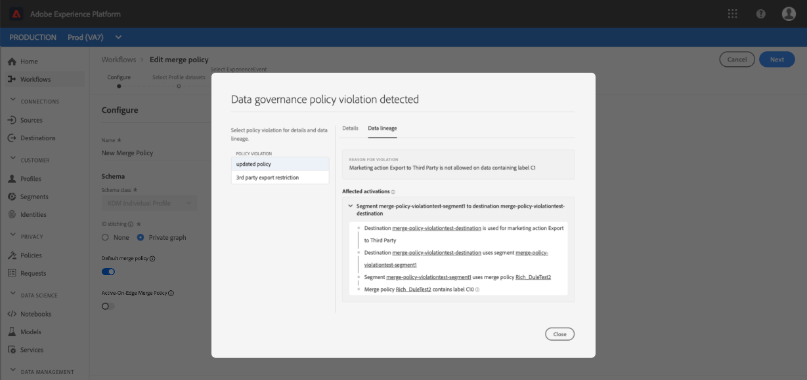

# Guida utente per i criteri di unione

Adobe Experience Platform consente di unire dati provenienti da più origini e combinarli per visualizzare una visione completa di ogni singolo cliente. Quando si uniscono questi dati, i criteri di unione sono le regole che [!DNL Platform] utilizzano per determinare in che modo i dati verranno classificati come priorità e quali dati verranno combinati per creare tale visualizzazione unificata.

Utilizzando le API RESTful o l&#39;interfaccia utente, puoi creare nuovi criteri di unione, gestire i criteri esistenti e impostare un criterio di unione predefinito per la tua organizzazione. Questa guida fornisce istruzioni dettagliate per l&#39;utilizzo dei criteri di unione tramite l&#39;interfaccia utente di Adobe Experience Platform.

Se si preferisce lavorare con i criteri di unione utilizzando l&#39; [!DNL Real-time Customer Profile] API, seguire le istruzioni indicate nell&#39;esercitazione [API](../api/merge-policies.md)Unisci criteri.

## Introduzione

Questa guida richiede una conoscenza approfondita dei vari [!DNL Experience Platform] servizi che intervengono con i criteri di unione. Prima di iniziare questa esercitazione, consulta la documentazione relativa ai seguenti servizi:

* [!DNL Real-time Customer Profile](../home.md): Fornisce un profilo di consumo unificato e in tempo reale basato su dati aggregati provenienti da più origini.
* [!DNL Identity Service](../../identity-service/home.md): Consente [!DNL Real-time Customer Profile] di colmare le identità provenienti da origini dati diverse in cui viene eseguito il caricamento [!DNL Platform].
* [!DNL Experience Data Model (XDM)](../../xdm/home.md): Il framework standard con cui [!DNL Platform] organizzare i dati relativi all&#39;esperienza del cliente.

## Visualizza criteri di unione

Nell&#39;interfaccia [!DNL Experience Platform] utente, è possibile iniziare a lavorare con i criteri di unione e visualizzare un elenco dei criteri di unione esistenti dell&#39;organizzazione selezionando **[!UICONTROL Profiles]** nella barra a sinistra e quindi selezionando la **[!UICONTROL Merge policies]** scheda.

I dettagli per ciascun criterio di unione disponibile per l&#39;organizzazione sono visibili sulla pagina di destinazione, inclusi [!UICONTROL Policy Name], [!UICONTROL Default merge policy]e [!UICONTROL Schema].

Per selezionare i dettagli visibili, o per aggiungere ulteriori colonne alla visualizzazione, selezionate l&#39;icona del selettore delle colonne e fate clic sul nome di una colonna per aggiungerla o rimuoverla dalla visualizzazione.

## Creare un criterio di unione

Per creare un nuovo criterio di unione, selezionare **[!UICONTROL Create merge policy]**.

Viene visualizzata **[!UICONTROL Create merge policy]** la schermata che consente di fornire informazioni importanti per il nuovo criterio di unione.

* **[!UICONTROL Name]**: Il nome del criterio di unione deve essere descrittivo ma conciso.
* **[!UICONTROL Schema]**: Schema associato al criterio di unione. Indica lo schema XDM per il quale viene creato il criterio di unione. Le organizzazioni possono creare più criteri di unione per schema.
* **[!UICONTROL ID stitching]**: Questo campo definisce come determinare le identità correlate di un cliente. Esistono due possibili valori:
   * **[!UICONTROL None]**: Non eseguire alcuna cucitura di identità.
   * **[!UICONTROL Private Graph]**: Esegue l&#39;unione delle identità in base al grafico dell&#39;identità privata.
* **[!UICONTROL Attribute merge]**: Un frammento di profilo è l&#39;informazione di profilo per una sola identità inclusa nell&#39;elenco di identità esistenti per un singolo cliente. Quando il tipo di grafico identità utilizzato genera più identità, è possibile che vi siano attributi di profilo in conflitto e che sia necessario specificare la priorità. Utilizzando [!UICONTROL Attribute merge] è possibile specificare quali valori di profilo del set di dati dare la priorità in caso di conflitto di unione tra i set di dati di tipo Valore chiave (dati del record). Esistono due possibili valori:
   * **[!UICONTROL Timestamp ordered]**: In caso di conflitto, date priorità al profilo aggiornato più di recente. [!UICONTROL Timestamp ordered] supporta inoltre marche temporali personalizzate che hanno la priorità sulle marche temporali del sistema quando si uniscono dati all&#39;interno dello stesso dataset (identità multiple) o tra set di dati. Per ulteriori informazioni, vedere la sezione [timestamp ordinati](#timestamp-ordered) che segue.
   * **[!UICONTROL Dataset precedence]** : Attribuire priorità ai frammenti di profilo in base al set di dati da cui provengono. Quando si seleziona questa opzione, è necessario selezionare i set di dati correlati e il relativo ordine di priorità. Per ulteriori informazioni, vedi i dettagli sulla precedenza [del](#dataset-precedence) set di dati indicati di seguito.
* **[!UICONTROL Default merge policy]**: Pulsante di attivazione/disattivazione che consente di selezionare se il criterio di unione sarà o meno il valore predefinito per l&#39;organizzazione. Se il selettore è attivato e il nuovo criterio viene salvato, il criterio predefinito precedente viene aggiornato automaticamente per non essere più il predefinito.

### Timestamp ordinato {#timestamp-ordered}

Poiché i record Profilo vengono assimilati  Experience Platform, al momento dell&#39;assimilazione viene ottenuta una marca temporale di sistema che viene aggiunta al record. Se [!UICONTROL Timestamp ordered] è selezionato come [!UICONTROL Attribute merge] tipo per un criterio di unione, i profili vengono uniti in base alla marca temporale del sistema. In altre parole, l&#39;unione viene eseguita in base alla marca temporale per l&#39;inserimento del record nella piattaforma.

Talvolta possono verificarsi casi di utilizzo, ad esempio il backfill dei dati o la verifica dell&#39;ordine corretto degli eventi se i record vengono ordinati in modo non corretto, se è necessario fornire una marca temporale personalizzata e fare in modo che il criterio di unione rispetti la marca temporale personalizzata invece che la marca temporale del sistema.

>[!NOTE]
>
>Questa funzionalità è disponibile solo per l&#39;inserimento tra set di dati. Se i record vengono acquisiti utilizzando lo stesso dataset, si verifica il comportamento predefinito di sostituzione.

### Utilizzo di marche temporali personalizzate {#custom-timestamps}

Per utilizzare una marca temporale personalizzata, è [!UICONTROL External Source System Audit Details Mixin] necessario aggiungerla allo schema Profilo. Una volta aggiunta, la marca temporale personalizzata può essere compilata utilizzando il `lastUpdatedDate` campo.

Quando un record viene assimilato con il `lastUpdatedDate` campo popolato,  Experience Platform utilizzerà tale campo per unire record tra set di dati. Se non `lastUpdatedDate` è presente o non è popolato, la piattaforma continuerà a utilizzare la marca temporale del sistema.

>[!NOTE]
>
>È necessario assicurarsi che la `lastUpdatedDate` marca temporale sia compilata durante l&#39;assimilazione di un aggiornamento sullo stesso record.

Nella schermata seguente sono visualizzati i campi nella finestra di dialogo [!UICONTROL External Source System Audit Details Mixin]. Per istruzioni dettagliate sull’utilizzo degli schemi nell’interfaccia utente, inclusa l’aggiunta di mixin agli schemi, vedere l’ [esercitazione per la creazione di uno schema tramite l’interfaccia utente](../../xdm/tutorials/create-schema-ui.md).

Per utilizzare le marche temporali personalizzate utilizzando l&#39;API, fare riferimento all&#39;Appendice della guida [endpoint per criteri di](../api/merge-policies.md) unione e quindi alla sezione sull&#39; [uso delle marche temporali](../api/merge-policies.md#custom-timestamps)personalizzate.

### Precedenza set di dati {#dataset-precedence}

Quando si seleziona un [!UICONTROL Attribute merge] valore, è possibile selezionare [!UICONTROL Dataset precedence] che consente di assegnare priorità ai frammenti di profilo in base al set di dati da cui provengono.

Un esempio di utilizzo sarebbe se l&#39;organizzazione dispone di informazioni presenti in un set di dati preferito o affidabile rispetto ai dati in un altro set di dati.

Quando si seleziona [!UICONTROL Dataset precedence], si apre un pannello separato che richiede di selezionare tra [!UICONTROL Available datasets] (o utilizzare la casella di controllo per selezionare tutti) i set di dati da includere. Potete quindi trascinare i set di dati nel [!UICONTROL Selected Datasets] pannello e trascinarli nell’ordine di priorità corretto. Al set di dati superiore verrà data la priorità più alta, al secondo sarà il secondo più alto e così via.

Dopo aver creato il criterio di unione, selezionare **[!UICONTROL Save]** per tornare alla [!UICONTROL Merge policies] scheda in cui il nuovo criterio di unione viene ora visualizzato nell&#39;elenco dei criteri.

## Modificare un criterio di unione

È possibile modificare un criterio di unione esistente tramite la [!UICONTROL Merge policies] scheda facendo clic su [!UICONTROL Policy name]* per il criterio di unione che si desidera modificare.

Quando viene [!UICONTROL Edit merge policy] visualizzata la schermata, potete apportare modifiche al [!UICONTROL Name], [!UICONTROL Schema], [!UICONTROL ID stitching] tipo e [!UICONTROL Attribute merge] tipo, nonché selezionare se questo criterio sarà o meno il criterio [!UICONTROL Default merge policy] per l&#39;organizzazione.

>[!NOTE]
>
>Non potete modificare l&#39;ID del criterio di unione, visualizzato nella parte superiore della schermata di modifica. Si tratta di un ID di sola lettura generato dal sistema che non può essere modificato.

Dopo aver apportato le modifiche necessarie, selezionare **[!UICONTROL Save]** per tornare alla [!UICONTROL Merge policies] scheda in cui sono ora visibili le informazioni aggiornate sul criterio di unione.

## Violazioni dei criteri di governance dei dati

Durante la creazione o l&#39;aggiornamento di un criterio di unione, viene eseguito un controllo per determinare se il criterio di unione viola uno qualsiasi dei criteri di utilizzo dei dati definiti dall&#39;organizzazione. I criteri di utilizzo dei dati fanno parte di Adobe Experience Platform [!DNL Data Governance] e sono regole che descrivono i tipi di azioni di marketing consentite o da cui è consentita l&#39;esecuzione su [!DNL Platform] dati specifici. Ad esempio, se un criterio di unione è stato utilizzato per creare un segmento che si è attivato a una destinazione terza e l&#39;organizzazione dispone di un criterio di utilizzo dei dati che impedisce l&#39;esportazione di dati specifici a terzi, durante il salvataggio del criterio di unione riceverai una notifica[!UICONTROL Data governance policy violation detected]&quot;notifica&quot;.

Questa notifica include un elenco di criteri di utilizzo dei dati che sono stati violati e consente di visualizzare i dettagli della violazione selezionando un criterio dall&#39;elenco. Quando si seleziona un criterio violato, la [!UICONTROL Data lineage] scheda fornisce il motivo della violazione e il [!UICONTROL Affected activations], ciascuno fornendo maggiori dettagli su come è stato violato il criterio di utilizzo dei dati.

Per ulteriori informazioni sulle modalità di gestione dei dati in Adobe Experience Platform, consultare la panoramica [sulla governance dei](../../data-governance/home.md)dati.

## Passaggi successivi

Dopo aver creato e configurato criteri di unione per la tua organizzazione IMS, puoi utilizzarli per creare segmenti di pubblico dai dati del tuo profilo. Per ulteriori informazioni su come creare e lavorare con i segmenti utilizzando i segmenti, consulta la panoramica sulla [segmentazione](../../segmentation/home.md) [!DNL Experience Platform].