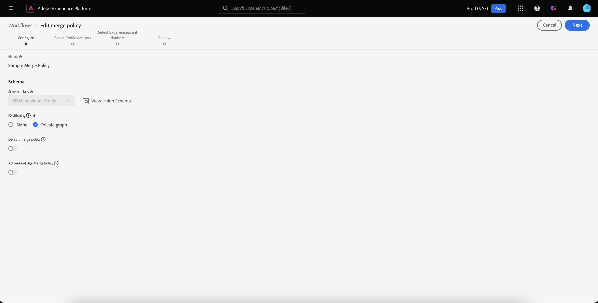

# Guida all&#39;interfaccia utente per i criteri di unione

Adobe Experience Platform consente di unire frammenti di dati provenienti da più origini e di combinarli per visualizzare in modo completo i singoli clienti. Quando si uniscono questi dati, i criteri di unione sono le regole utilizzate da [!DNL Platform] per determinare in che modo i dati verranno classificati come priorità e quali dati verranno combinati per creare una visualizzazione unificata.

Ad esempio, se un cliente interagisce con il tuo marchio su più canali, l&#39;organizzazione avrà più frammenti di profilo correlati a tale singolo cliente che saranno visualizzati in più set di dati. Quando questi frammenti vengono assimilati in Piattaforma, vengono uniti per creare un unico profilo per il cliente. Quando i dati provenienti da più origini sono in conflitto (ad esempio, un frammento indica il cliente come &quot;singolo&quot; mentre l&#39;altro elenca il cliente come &quot;sposato&quot;), il criterio di unione determina quali informazioni includere nel profilo dell&#39;individuo.

Utilizzando le API RESTful o l&#39;interfaccia utente, puoi creare nuovi criteri di unione, gestire i criteri esistenti e impostare un criterio di unione predefinito per la tua organizzazione. Questa guida fornisce istruzioni dettagliate per l&#39;utilizzo dei criteri di unione tramite l&#39;interfaccia utente (interfaccia utente) di Adobe Experience Platform.

Se si preferisce lavorare con i criteri di unione utilizzando l&#39;API [!DNL Real-time Customer Profile], seguire le istruzioni riportate nella [guida API dei criteri di unione](../api/merge-policies.md).

## Introduzione

Questa guida richiede una buona conoscenza di diverse importanti funzioni [!DNL Experience Platform]. Prima di seguire questa guida o di utilizzare le API dei profili, consulta la documentazione relativa ai seguenti servizi:

* [Profilo](../home.md) cliente in tempo reale: Fornisce un profilo di consumo unificato e in tempo reale basato su dati aggregati provenienti da più origini.
* [Servizio](../../identity-service/home.md) identità Adobe Experience Platform: Abilita il profilo cliente in tempo reale collegando le identità da origini dati diverse in cui viene effettuato il caricamento  [!DNL Platform].
* [Experience Data Model (XDM)](../../xdm/home.md): Il framework standard con cui  [!DNL Platform] organizzare i dati relativi all&#39;esperienza dei clienti.

## Metodi di unione {#merge-methods}

Ciascun frammento di profilo contiene informazioni relative a una sola identità rispetto al numero totale di identità che possono esistere per un singolo utente. Quando si uniscono tali dati per formare un profilo cliente, è possibile che le informazioni siano in conflitto e che sia specificata la priorità. La selezione di un metodo di unione consente di specificare gli attributi del set di dati da assegnare come priorità in caso di conflitto di unione tra i set di dati.

Per i criteri di unione sono disponibili due possibili metodi di unione. Ciascuno di questi metodi è riassunto di seguito con ulteriori dettagli forniti nelle sezioni seguenti:

* **[!UICONTROL Timestamp ordered]:** In caso di conflitto, viene data priorità al frammento di profilo aggiornato più di recente.
   * **Marca temporale personalizzata:** [!UICONTROL Timestamp ordered] supporta anche marche temporali personalizzate che hanno priorità rispetto alle marche temporali del sistema durante l&#39;unione di dati all&#39;interno dello stesso dataset (identità multiple) o tra set di dati. Per ulteriori informazioni, consulta la sezione relativa all&#39;utilizzo di marche temporali personalizzate in [.](#custom-timestamps)
* **[!UICONTROL Dataset precedence]:** In caso di conflitto, assegnare priorità ai frammenti di profilo in base al set di dati da cui provengono. Quando si seleziona questa opzione, è necessario scegliere i set di dati correlati e il relativo ordine di priorità.

### Timestamp ordinato {#timestamp-ordered}

Poiché i record di profilo vengono trasferiti  Experience Platform, al momento dell&#39;assimilazione viene ottenuta una marca temporale di sistema che viene aggiunta al record. Quando **[!UICONTROL Timestamp ordered]** è selezionato come metodo di unione per un criterio di unione, i profili vengono uniti in base alla marca temporale del sistema. In altre parole, l&#39;unione viene eseguita in base alla marca temporale per l&#39;inserimento del record nella piattaforma.

#### Utilizzo di marche temporali personalizzate {#custom-timestamps}

Talvolta possono verificarsi casi di utilizzo in cui è necessario fornire una marca temporale personalizzata e fare in modo che il criterio di unione rispetti la marca temporale personalizzata anziché la marca temporale del sistema. Alcuni esempi di questo tipo includono il backfill dei dati o la garanzia dell&#39;ordine corretto degli eventi in caso di acquisizione di record non ordinata.

Per utilizzare una marca temporale personalizzata, è necessario aggiungere la **[!UICONTROL External Source System Audit Details Mixin]** allo schema del profilo. Una volta aggiunta, la marca temporale personalizzata può essere compilata utilizzando il campo `lastUpdatedDate`. Quando un record viene assimilato con il campo `lastUpdatedDate` popolato,  Experience Platform utilizzerà tale campo per unire record tra set di dati. Se `lastUpdatedDate` non è presente o non è popolato, la piattaforma continuerà a utilizzare la marca temporale del sistema.

>[!NOTE]
>
>È necessario assicurarsi che la marca temporale `lastUpdatedDate` sia compilata durante l&#39;assimilazione di un aggiornamento sullo stesso record.

Nella schermata seguente sono visualizzati i campi presenti in [!UICONTROL External Source System Audit Details Mixin]. Per istruzioni dettagliate sull&#39;utilizzo degli schemi nell&#39;interfaccia utente della piattaforma, inclusa l&#39;aggiunta di mixin agli schemi, vedere l&#39;esercitazione [per creare uno schema utilizzando l&#39;interfaccia utente](../../xdm/tutorials/create-schema-ui.md).

Per utilizzare le marche temporali personalizzate utilizzando l&#39;API, consultare la sezione relativa all&#39;endpoint guida [unione criteri sull&#39;utilizzo di marche temporali personalizzate.](../api/merge-policies.md#custom-timestamps)

### Precedenza del set di dati {#dataset-precedence}

Se **[!UICONTROL Dataset precedence]** è selezionato come metodo di unione per un criterio di unione, è possibile assegnare la priorità ai frammenti di profilo in base al set di dati da cui provengono. Un esempio di utilizzo sarebbe se l&#39;organizzazione dispone di informazioni presenti in un set di dati preferito o affidabile rispetto ai dati in un altro set di dati.

Per creare un criterio di unione utilizzando **[!UICONTROL Dataset precedence]**, è necessario selezionare i set di dati Profilo ed ExperienceEvent inclusi, quindi è possibile ordinare manualmente i set di dati Profilo per la precedenza. Una volta selezionati e ordinati i set di dati, al set di dati principale verrà data la priorità più alta, al secondo sarà il secondo più alto e così via.

## [!UICONTROL ID stitching] {#id-stitching}

L&#39;unione delle identità ([!UICONTROL ID stitching]) è il processo che consente di identificare i frammenti di dati e combinarli per creare un record completo del profilo. Per illustrare i diversi comportamenti di cucitura, si consideri un singolo cliente che interagisce con un marchio utilizzando due indirizzi e-mail diversi.

* **[!UICONTROL None]:** Quando questa opzione è selezionata, gli ID non vengono uniti. Quando si verifica la segmentazione, le identità che possono appartenere alla stessa persona non vengono unite insieme e la segmentazione considera solo gli attributi associati a ciascun singolo ID quando si determina se un cliente è idoneo per l&#39;appartenenza al segmento. Ciò potrebbe causare l&#39;invio di più profili a un singolo cliente e l&#39;invio di più messaggi di marketing allo stesso cliente.
* **[!UICONTROL Private graph]:** Quando il grafico privato è selezionato, più identità correlate allo stesso individuo vengono unite insieme. Questo consente al cliente di avere un unico profilo e alla segmentazione di considerare più attributi da identità correlate multiple per determinare la qualifica del segmento. In questo scenario, è probabile che il cliente abbia un profilo singolo, si qualifichi per un segmento in base alla combinazione di attributi tra identità diverse e riceva un solo messaggio di marketing.

Per saperne di più sulle identità e sul loro ruolo nella generazione di profili e segmenti, leggere la [Panoramica del servizio identità](../../identity-service/home.md).

## Criterio unione predefinito {#default-merge-policy}

Un&#39;organizzazione può creare un criterio di unione predefinito da utilizzare per l&#39;unione dei frammenti di profilo. Questo consente agli utenti di selezionare facilmente il criterio predefinito quando eseguono azioni in  Experience Platform, come la visualizzazione dei profili dei clienti o la creazione di segmenti. Nella maggior parte dei casi, a meno che non venga specificato un altro criterio di unione, verrà utilizzato il criterio di unione predefinito.

Ciascuna organizzazione può creare più criteri di unione relativi a una singola classe di schema XDM, ma può avere un solo criterio di unione predefinito dichiarato per ogni classe. Ad esempio, l&#39;organizzazione potrebbe disporre di un criterio di unione predefinito correlato alla classe [!DNL XDM Individual Profile] e di un altro criterio di unione predefinito per una classe Product Inventory personalizzata.

Se si crea un nuovo criterio di unione e lo si imposta come predefinito, il precedente criterio di unione predefinito verrà aggiornato automaticamente dal sistema in modo che non sia più il predefinito.

>[!WARNING]
>
>I conteggi dei profili e i segmenti con un criterio di unione predefinito esistente associato potrebbero essere interessati. Tutti i segmenti a cui è applicato un criterio di unione predefinito verranno aggiornati al nuovo criterio di unione predefinito.

## Visualizza criteri di unione {#view-merge-policies}

Nell&#39;interfaccia di [!DNL Experience Platform], è possibile iniziare a utilizzare i criteri di unione selezionando **[!UICONTROL Profiles]** nel menu di navigazione a sinistra, quindi selezionando la scheda **[!UICONTROL Merge Policies]**. Questa scheda include un elenco di tutti i criteri di unione esistenti per l&#39;organizzazione, nonché i dettagli per ciascun criterio di unione, incluso il nome del criterio, se il criterio di unione è o meno il criterio di unione predefinito e la classe dello schema a cui il criterio di unione fa riferimento.

Per selezionare i dettagli visibili o per aggiungere ulteriori colonne alla visualizzazione, selezionare **[!UICONTROL Configure columns]** e fare clic sul nome di una colonna per aggiungerla o rimuoverla dalla visualizzazione.

## Creare un criterio di unione {#create-a-merge-policy}

Per creare un nuovo criterio di unione, selezionare **[!UICONTROL Create merge policy]** nella scheda dei criteri di unione.

Nella schermata del flusso di lavoro **[!UICONTROL New merge policy]** potete fornire informazioni importanti per il nuovo criterio di unione tramite una serie di passaggi guidati.

### [!UICONTROL Configure] {#configure}

Il primo passaggio del flusso di lavoro consente di configurare il criterio di unione fornendo informazioni di base. Queste informazioni includono:

* **[!UICONTROL Name]**: Il nome del criterio di unione deve essere descrittivo ma conciso.
* **[!UICONTROL Schema class]**: La classe dello schema XDM associata al criterio di unione. Indica la classe dello schema per cui viene creato il criterio di unione. Le organizzazioni possono creare più criteri di unione per classe di schema. Attualmente solo la classe [!UICONTROL XDM Individual Profile] è disponibile nell&#39;interfaccia utente. È possibile visualizzare l&#39;anteprima dello schema unione per la classe dello schema selezionando **[!UICONTROL View Union Schema]**. Per ulteriori informazioni, vedere la sezione relativa alla [visualizzazione dello schema unione](#view-union-schema) che segue.
* **[!UICONTROL ID stitching]**: Questo campo definisce come determinare le identità correlate di un cliente. Per ulteriori informazioni, consulta la sezione relativa alla [cucchiainatura ID](#id-stitching) precedente in questa guida. Esistono due possibili valori:
   * **[!UICONTROL None]**: Non eseguire alcuna cucitura di identità.
   * **[!UICONTROL Private Graph]**: Esegue l&#39;unione delle identità in base al grafico dell&#39;identità privata.
* **[!UICONTROL Default merge policy]**: Pulsante di attivazione/disattivazione che consente di selezionare se il criterio di unione sarà o meno il valore predefinito per l&#39;organizzazione. Se il selettore è attivato, viene visualizzato un avviso che richiede di confermare la modifica del criterio di unione predefinito dell&#39;organizzazione. Per ulteriori informazioni, vedere la sezione relativa alle [policy di unione predefinite](#default-merge-policy) precedente in questa guida.
   

Una volta completati i campi richiesti, potete selezionare **[!UICONTROL Next]** per continuare il flusso di lavoro.

#### [!UICONTROL View Union Schema] {#view-union-schema}

Durante la creazione o la modifica di un criterio di unione, è possibile visualizzare lo schema unione per la classe di schema selezionata selezionando **[!UICONTROL View Union Schema]**.

Viene visualizzata la finestra di dialogo [!UICONTROL View Union Schema], che mostra tutti gli schemi, le identità e le relazioni che contribuiscono allo schema unione. È possibile utilizzare la finestra di dialogo per esplorare lo schema dell&#39;unione nello stesso modo in cui si accedeva alla scheda [!UICONTROL Union Schema] nella sezione [!UICONTROL Profiles] dell&#39;interfaccia utente della piattaforma.

Per informazioni dettagliate sugli schemi di unione, inclusa la modalità di interazione con essi nella scheda [!UICONTROL Union Schema] o nella finestra di dialogo [!UICONTROL View Union Schema] visualizzata nel flusso di lavoro dei criteri di unione, visitare la [guida dell&#39;interfaccia utente dello schema di unione](union-schema.md).

### [!UICONTROL Select Profile datasets] {#select-profile-datasets}

Nella schermata **[!UICONTROL Select Profile datasets]**, è necessario selezionare la **[!UICONTROL Merge method]** che si desidera utilizzare per il criterio di unione. Sullo schermo viene visualizzato anche il numero totale di [!UICONTROL Profile datasets] nell&#39;organizzazione che si riferiscono alla classe dello schema selezionata nella schermata precedente.

A seconda del metodo di unione scelto, tutti i set di dati Profilo verranno uniti in base all&#39;ordine in cui sono stati aggiornati per l&#39;ultima volta (timestamp ordinato) oppure dovrete selezionare i set di dati Profilo da includere nel criterio di unione e l&#39;ordine in cui unirli (precedenza set di dati). Per ulteriori informazioni sui metodi di unione, consultare la sezione [metodi di unione](#merge-methods) fornita in precedenza in questo documento.

#### Timestamp ordinato {#timestamp-ordered-profile}

Se si seleziona **[!UICONTROL Timestamp ordered]** come metodo di unione, gli attributi dei set di dati aggiornati più di recente avranno la precedenza. Questo vale per tutti i set di dati del profilo.

#### Precedenza del set di dati {#dataset-precedence-profile}

Se si seleziona **[!UICONTROL Dataset precedence]** come metodo di unione, è necessario selezionare i set di dati del profilo e assegnarne manualmente la priorità. Ogni set di dati elencato include anche lo stato dell’ultimo batch assimilato o un avviso che segnala che non è stato inserito alcun batch nel set di dati.

È possibile selezionare fino a 50 set di dati dall&#39;elenco dei set di dati da includere nel criterio di unione. I set di dati selezionati vengono aggiunti alla sezione **[!UICONTROL Select datasets]**, consentendo di trascinare e rilasciare i set di dati e di ordinarli in base alla precedenza desiderata. Man mano che i set di dati vengono modificati nell&#39;elenco, il numero ordinale (1, 2, 3, ecc.) accanto al set di dati si aggiorna e visualizza la priorità (1 con priorità maggiore, quindi 2 e più avanti).

La selezione di un dataset aggiorna anche la sezione **[!UICONTROL Union schema]**, mostrando i campi nello schema unione a cui ogni dataset contribuisce i dati. Per ulteriori informazioni sugli schemi di unione, inclusa la modalità di interazione con le visualizzazioni nell&#39;interfaccia utente, fare riferimento alla [guida dell&#39;interfaccia utente dello schema di unione](union-schema.md)

### [!UICONTROL Select ExperienceEvent datasets] {#select-experienceevent-datasets}

Il passaggio successivo del flusso di lavoro richiede la selezione dei set di dati ExperienceEvent. Questa schermata è influenzata dal metodo di unione selezionato nella schermata [[!UICONTROL Select Profile datasets]](#select-profile-datasets).

In questa schermata viene visualizzato anche il numero totale di **[!UICONTROL ExperienceEvent datasets]** creati dall&#39;organizzazione in relazione alla classe dello schema selezionata nella schermata di configurazione del criterio di unione.

#### Timestamp ordinato {#timestamp-ordered-experienceevent}

Se hai selezionato **[!UICONTROL Timestamp ordered]** come metodo di unione per i set di dati Profilo, anche in questo caso avranno precedenza gli attributi dei set di dati ExperienceEvent aggiornati più di recente.

#### Precedenza del set di dati {#dataset-precedence-experienceevent}

Se hai selezionato **[!UICONTROL Dataset precedence]** come metodo di unione per i set di dati Profilo, dovrai selezionare i set di dati ExperienceEvent da includere. Dall’elenco dei set di dati potete selezionare fino a 50 set di dati ExperienceEvent. I set di dati selezionati vengono visualizzati nella sezione [!UICONTROL Select datasets].

I set di dati ExperienceEvent non possono essere ordinati manualmente, ma gli attributi nei set di dati ExperienceEvent vengono aggiunti ai set di dati Profile se fanno parte dello stesso frammento di profilo.

Come per la selezione dei set di dati del profilo, la selezione di un set di dati ExperienceEvent comporta l&#39;aggiornamento della sezione **[!UICONTROL Union schema]**, che mostra i campi nello schema dell&#39;unione a cui ogni set di dati contribuisce i dati. Per ulteriori informazioni sugli schemi di unione, inclusa la modalità di interazione con le visualizzazioni nell&#39;interfaccia utente, fare riferimento alla [guida dell&#39;interfaccia utente dello schema di unione](union-schema.md)

### [!UICONTROL Review] {#review}

Il passaggio finale del flusso di lavoro consiste nel rivedere il criterio di unione. Nella schermata **[!UICONTROL Review]** vengono visualizzati il nome del nuovo criterio di unione, la classe dello schema su cui si basa, l&#39;opzione [!UICONTROL ID stitching] selezionata, nonché il metodo di unione e i set di dati inclusi nel criterio di unione. Per visualizzare tutti i set di dati Profilo o ExperienceEvent inclusi, selezionate il numero di set di dati per espandere l&#39;elenco a discesa.

Prima di selezionare **[!UICONTROL Finish]** per completare il flusso di lavoro di creazione, verifica attentamente i criteri di unione.

#### Timestamp ordinato {#timestamp-ordered-review}

Se è stato selezionato **[!UICONTROL Timestamp ordered]** come metodo di unione per il criterio di unione, l&#39;elenco dei set di dati del profilo include tutti i set di dati creati dall&#39;organizzazione in relazione alla classe dello schema, in ordine di timestamp. L&#39;elenco dei set di dati ExperienceEvent include tutti i set di dati creati dall&#39;organizzazione per la classe di schema selezionata e che verranno aggiunti ai set di dati Profile.

#### Precedenza del set di dati {#dataset-precedence-review}

Se avete selezionato **[!UICONTROL Dataset precedence]** come metodo di unione per il criterio di unione, gli elenchi dei set di dati Profile ed ExperienceEvent includono solo i set di dati Profile ed ExperienceEvent selezionati rispettivamente durante il flusso di lavoro di creazione. L&#39;ordine dei set di dati Profilo deve corrispondere alla precedenza specificata durante la creazione. In caso contrario, utilizzate il pulsante [!UICONTROL Back] per tornare ai passaggi del flusso di lavoro precedenti e regolare la priorità.

### Elenco aggiornato dei criteri di unione {#updated-list}

Dopo aver completato il flusso di lavoro per la creazione di un nuovo criterio di unione, viene nuovamente visualizzata la scheda **[!UICONTROL Merge Policies]**. L&#39;elenco dei criteri di unione per l&#39;organizzazione deve ora includere il criterio di unione appena creato.

## Modificare un criterio di unione

Dalla scheda [!UICONTROL Merge Policies], è possibile modificare un criterio di unione esistente creato per la classe [!DNL XDM Individual Profile] selezionando **[!UICONTROL Policy name]** per il criterio di unione che si desidera modificare.

Quando viene visualizzata la schermata **[!UICONTROL Edit merge policy]**, è possibile apportare modifiche al nome e a [!UICONTROL ID stitching], nonché modificare se questo criterio è o meno il criterio di unione predefinito per la propria organizzazione.

Selezionare **[!UICONTROL Next]** per continuare il flusso di lavoro dei criteri di unione per aggiornare il metodo di unione e i set di dati inclusi nel criterio di unione.

Dopo aver apportato le modifiche necessarie, controlla i criteri di unione e seleziona **[!UICONTROL Finish]** per tornare alla scheda **[!UICONTROL Merge policies]**.

>[!WARNING]
>
>La modifica di un criterio di unione può influenzare la segmentazione e i risultati del profilo, in quanto altererà il modo in cui vengono risolti i conflitti di dati.

## Violazioni dei criteri di governance dei dati

Durante la creazione o l&#39;aggiornamento di un criterio di unione, viene eseguito un controllo per determinare se il criterio di unione viola uno qualsiasi dei criteri di utilizzo dei dati definiti dall&#39;organizzazione. I criteri di utilizzo dei dati fanno parte di Adobe Experience Platform [!DNL Data Governance] e sono regole che descrivono i tipi di azioni di marketing consentite o da cui è consentita l&#39;esecuzione su dati [!DNL Platform] specifici. Ad esempio, se un criterio di unione è stato utilizzato per creare un segmento che si è attivato a una destinazione terza e l&#39;organizzazione dispone di un criterio di utilizzo dei dati che impedisce l&#39;esportazione di dati specifici a terzi, durante il tentativo di salvare il criterio di unione riceverai una notifica **[!UICONTROL Data governance policy violation detected]**.

Questa notifica include un elenco di criteri di utilizzo dei dati che sono stati violati e consente di visualizzare i dettagli della violazione selezionando un criterio dall&#39;elenco. Quando si seleziona un criterio violato, la scheda **[!UICONTROL Data lineage]** fornisce il motivo della violazione e le attivazioni interessate, ognuna delle quali fornisce maggiori dettagli sulle modalità di violazione del criterio di utilizzo dei dati.

Per ulteriori informazioni sulle modalità di gestione dei dati in Adobe Experience Platform, consultare la [Panoramica sulla governance dei dati](../../data-governance/home.md).

## Passaggi successivi

Dopo aver creato e configurato criteri di unione per la tua organizzazione, puoi utilizzarli per regolare la visualizzazione dei profili cliente all&#39;interno della piattaforma e per creare segmenti di pubblico dai dati del profilo. Per ulteriori informazioni su come creare e lavorare con i segmenti utilizzando l&#39;interfaccia utente e le API di [!DNL Experience Platform], consulta la [Panoramica sulla segmentazione](../../segmentation/home.md).