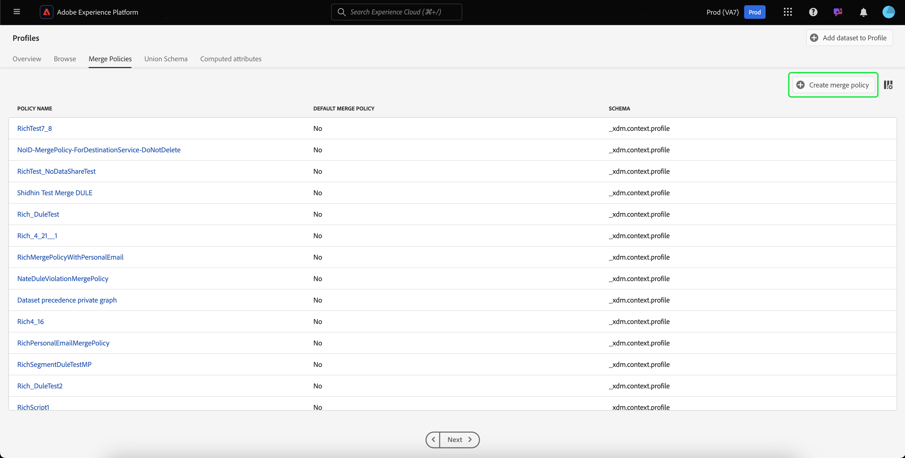

# Guida utente per i criteri di unione

Adobe Experience Platform consente di unire dati provenienti da più origini e combinarli per visualizzare una visione completa di ogni singolo cliente. Quando si uniscono questi dati, i criteri di unione sono le regole utilizzate dalla Piattaforma per determinare in che modo i dati verranno classificati come priorità e quali dati verranno combinati per creare tale visualizzazione unificata.

Utilizzando le API RESTful o l&#39;interfaccia utente, puoi creare nuovi criteri di unione, gestire i criteri esistenti e impostare un criterio di unione predefinito per la tua organizzazione. Questa guida fornisce istruzioni dettagliate per l&#39;utilizzo dei criteri di unione tramite l&#39;interfaccia utente di Adobe Experience Platform.

Se preferisci lavorare con i criteri di unione utilizzando l&#39;API Profilo cliente in tempo reale, segui le istruzioni indicate nell&#39;esercitazione [API](../api/merge-policies.md)Unisci criteri.

## Introduzione

Questa guida richiede una buona conoscenza dei diversi servizi della piattaforma Experience relativi ai criteri di unione. Prima di iniziare questa esercitazione, consulta la documentazione relativa ai seguenti servizi:

* [Profilo](../home.md)cliente in tempo reale: Fornisce un profilo di consumo unificato e in tempo reale basato su dati aggregati provenienti da più origini.
* [Servizio](../../identity-service/home.md)identità: Abilita il profilo cliente in tempo reale collegando identità da origini dati diverse che vengono caricate nella piattaforma.
* [Experience Data Model (XDM)](../../xdm/home.md): Il framework standardizzato tramite il quale la piattaforma organizza i dati sull&#39;esperienza cliente.

## Visualizza criteri di unione

Nell&#39;interfaccia utente di Experience Platform, puoi iniziare a lavorare con i criteri di unione e visualizzare un elenco dei criteri di unione esistenti dell&#39;organizzazione facendo clic su **Profilo** nella barra a sinistra, quindi selezionando la scheda **Unisci criteri** .

I dettagli per ciascun criterio di unione disponibile per l&#39;organizzazione sono visibili nella pagina di destinazione, inclusi Nome ** criterio, Criteri *di unione* predefiniti e *Schema*.

Per selezionare i dettagli visibili o per aggiungere ulteriori colonne alla visualizzazione, selezionate l&#39;icona del selettore colonna a destra e fate clic sul nome di una colonna per aggiungerla o rimuoverla dalla visualizzazione.

## Creare un criterio di unione

Per creare un nuovo criterio di unione, fare clic su **Crea criterio** unione in alto a destra nella scheda **Unisci criteri** .

Viene visualizzata la schermata **Crea criterio** unione, che consente di fornire informazioni importanti per il nuovo criterio di unione.

* **Nome**: Il nome del criterio di unione deve essere descrittivo ma conciso.
* **Schema**: Schema associato al criterio di unione. Indica lo schema XDM per il quale viene creato il criterio di unione. Le organizzazioni possono creare più criteri di unione per schema.
* **Cucitura** ID: Questo campo definisce come determinare le identità correlate di un cliente. Esistono due possibili valori:
   * **Nessuno**: Non eseguire alcuna cucitura di identità.
   * **Grafico** privato: Esegue l&#39;unione delle identità in base al grafico dell&#39;identità privata.
* **Unione** attributi: Un frammento di profilo è l&#39;informazione di profilo per una sola identità inclusa nell&#39;elenco di identità esistenti per un singolo cliente. Quando il tipo di grafico identità utilizzato genera più identità, è possibile che si verifichino conflitti tra i valori delle proprietà del profilo e specificare la priorità. L&#39;utilizzo dell&#39;unione ** di attributi consente di specificare quali valori di profilo di set di dati dare la priorità in caso di conflitto di unione. Esistono due possibili valori:
   * **Timestamp ordinato**: In caso di conflitto, date priorità al profilo aggiornato più di recente.
   * **Precedenza** set di dati: Attribuire priorità ai frammenti di profilo in base al set di dati da cui provengono. Quando si seleziona questa opzione, è necessario selezionare i set di dati correlati e il relativo ordine di priorità. Per ulteriori informazioni, vedi i dettagli sulla precedenza [del](#dataset-precedence) set di dati indicati di seguito.
* **Criterio** unione predefinito: Pulsante di attivazione/disattivazione che consente di selezionare se il criterio di unione sarà o meno il valore predefinito per l&#39;organizzazione. Se il selettore è attivato e il nuovo criterio viene salvato, il criterio predefinito precedente viene aggiornato automaticamente per non essere più il predefinito.

### Precedenza set di dati {#dataset-precedence}

Quando si seleziona un valore di unione *di* attributi, è possibile selezionare la precedenza *del set di* dati che consente di dare priorità ai frammenti di profilo in base al set di dati di provenienza.

Un esempio di utilizzo sarebbe se l&#39;organizzazione dispone di informazioni presenti in un set di dati preferito o affidabile rispetto ai dati in un altro set di dati.

Quando si seleziona la precedenza *del set di* dati, viene visualizzato un pannello separato che richiede di selezionare tra i set di dati ** disponibili (o di utilizzare la casella di controllo per selezionare tutti) i set di dati da includere. Puoi quindi trascinare i set di dati nel pannello Set di dati ** selezionati e trascinarli nell&#39;ordine di priorità corretto. Al set di dati superiore verrà data la priorità più alta, al secondo sarà il secondo più alto e così via.

Una volta completata la creazione del criterio di unione, fare clic su **Salva** per tornare alla scheda Criteri *di* unione, in cui il nuovo criterio di unione viene ora visualizzato nell&#39;elenco dei criteri.

## Modificare un criterio di unione

È possibile modificare un criterio di unione esistente tramite la scheda *Unisci criteri* facendo clic su Nome ** criterio per il criterio di unione che si desidera modificare.

Quando viene visualizzata la schermata *Modifica criterio* unione, è possibile apportare modifiche al tipo di unione *Nome*, *Schema*, *ID e unione* *attributo, nonché selezionare se il criterio sarà o meno il tipo di unione* ** predefinito per l&#39;organizzazione.

>[!Note]
>Non potete modificare l&#39;ID del criterio di unione, visualizzato nella parte superiore della schermata di modifica. Si tratta di un ID di sola lettura generato dal sistema che non può essere modificato.

Dopo aver apportato le modifiche necessarie, fare clic su **Salva** per tornare alla scheda Criteri *di* unione in cui sono ora visibili le informazioni aggiornate sui criteri di unione.

## Passaggi successivi

Dopo aver creato e configurato criteri di unione per la tua organizzazione IMS, puoi utilizzarli per creare segmenti di pubblico dai dati del tuo profilo. Consulta la panoramica sulla [segmentazione](../../segmentation/home.md) per ulteriori informazioni su come creare e lavorare con i segmenti utilizzando Experience Platform.