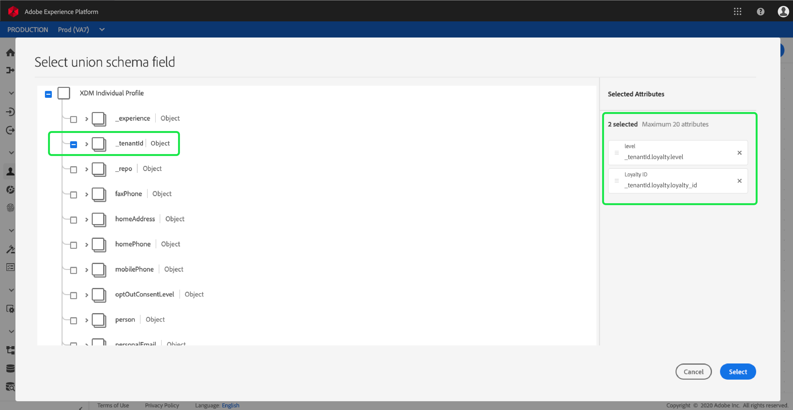

# [!DNL Real-time Customer Profile] personalizzazione dei dettagli  {#profile-detail-customization}

All&#39;interno dell&#39;interfaccia utente di Adobe Experience Platform, è possibile visualizzare e interagire con i dati [!DNL Real-time Customer Profile] sotto forma di profili cliente. Le informazioni di profilo visualizzate nell’interfaccia sono state unite da più frammenti di profilo per formare una singola vista di ciascun cliente. Ciò include dettagli quali attributi di base, identità collegate e preferenze del canale. I campi predefiniti mostrati nei profili possono essere modificati anche a livello organizzativo per visualizzare gli attributi preferiti [!DNL Profile]. Questa guida fornisce istruzioni dettagliate per personalizzare il modo in cui i dati [!DNL Profile] vengono visualizzati nell&#39;interfaccia utente della piattaforma.

Per una guida completa all&#39;interfaccia utente dei profili, visitare la [Guida all&#39;interfaccia utente dei profili](user-guide.md).

## Riordinare e ridimensionare le schede {#reorder-and-resize-cards}

Dalla scheda **[!UICONTROL Detail]** del profilo cliente, potete selezionare **[!UICONTROL Modify dashboard]** per ridimensionare e riordinare le schede esistenti.

Dopo aver scelto di modificare il dashboard, potete riordinare le schede selezionando il titolo della scheda e trascinando e rilasciando le schede nell&#39;ordine desiderato. Potete anche ridimensionare una scheda selezionando il simbolo dell&#39;angolo nell&#39;angolo inferiore destro della scheda (`⌟`) e trascinando la scheda nella dimensione desiderata. In questo esempio, la scheda **[!UICONTROL Basic attributes]** viene ridimensionata.

La scheda selezionata si adatta alle dimensioni desiderate e le schede circostanti vengono riposizionate in modo dinamico. Ciò potrebbe causare lo spostamento di alcune schede in righe aggiuntive, che richiedono lo scorrimento verso il basso per visualizzare tutte le schede. Ad esempio, quando la scheda &quot;[!UICONTROL Basic attributes]&quot; viene ridimensionata, la scheda &quot;[!UICONTROL Linked identities]&quot; non è più visibile sulla riga superiore e ora viene visualizzata su una nuova riga all&#39;interno del profilo (non visualizzata). Per riportare la scheda &quot;[!UICONTROL Linked identities]&quot; nella riga superiore, è possibile trascinarla e rilasciarla nella posizione corrente della scheda &quot;[!UICONTROL Channel preferences]&quot;.

## Modificare e rimuovere le schede

Oltre a ridimensionare e riordinare le schede, potete modificare il contenuto di alcune schede e rimuovere alcune schede dal dashboard completamente. Selezionate le ellissi (`...`) nell&#39;angolo superiore destro della scheda per modificarla o rimuoverla. Si apre un menu a discesa con opzioni per modificare o rimuovere la scheda, a seconda delle proprietà della scheda selezionata.

>[!NOTE]
>
>Non tutte le schede possono essere modificate o rimosse. Questo perché alcune schede contengono informazioni di sola lettura o obbligatorie. Se una scheda non ha un&#39;ellissi nell&#39;angolo superiore destro, contiene le informazioni di sola lettura E richieste e non può essere modificata né rimossa. Se una scheda ha delle ellissi nell&#39;angolo e la sua selezione mostra solo un&#39;opzione per rimuovere la scheda, le informazioni sulla scheda sono di sola lettura e non possono essere modificate.

Selezionate **[!UICONTROL Edit]** nel menu a discesa per aprire l&#39;area di lavoro **[!UICONTROL Edit widget]**, in cui potete aggiornare il titolo della scheda, riordinare o rimuovere gli attributi visibili, oppure aggiungere altri attributi utilizzando il pulsante **[!UICONTROL Add attributes]**.

## Aggiungi attributi {#add-attributes}

Dalla schermata **[!UICONTROL Edit widget]**, selezionate **[!UICONTROL Add attributes]** nell&#39;angolo superiore destro della scheda per iniziare ad aggiungere attributi alla scheda.

Quando si apre la finestra di dialogo **[!UICONTROL Select union schema field]**, il lato sinistro della finestra di dialogo mostra lo schema di unione completo [!UICONTROL XDM Individual Profile], con campi nidificati al di sotto. Per ulteriori informazioni sugli schemi di unione, fare riferimento alla sezione degli schemi di unione [della [!DNL Profile] guida utente](user-guide.md#union-schema).

La sezione **[!UICONTROL Selected Attributes]** a destra della finestra di dialogo mostra gli attributi attualmente inclusi nella scheda che si sta modificando. Potete anche rimuovere e riordinare gli attributi. Viene visualizzato il numero totale di attributi selezionati, nonché il numero massimo di attributi (20) che possono essere aggiunti a una singola scheda.

Potete selezionare uno qualsiasi dei campi dello schema unione disponibili per personalizzare gli attributi della scheda che state modificando. I campi selezionati sono contrassegnati da un segno di spunta e vengono automaticamente aggiunti all’elenco degli attributi selezionati. Dopo aver aggiunto tutti gli attributi che desiderate visualizzare sulla scheda, scegliete **[!UICONTROL Select]** per tornare alla schermata **[!UICONTROL Edit widget]**.

Quando si torna alla schermata **[!UICONTROL Edit widget]**, l&#39;elenco degli attributi sulla scheda dovrebbe ora essere aggiornato per riflettere le scelte. Potete comunque rimuovere o riordinare gli attributi della scheda o modificare il titolo della scheda in base alle esigenze. Al termine delle modifiche, selezionate **[!UICONTROL Save]** per salvare le modifiche.

Dopo il salvataggio, viene nuovamente visualizzata la scheda **[!UICONTROL Detail]** in cui sono visibili la scheda e gli attributi aggiornati.

## Aggiungere una nuova scheda {#add-a-new-card}

Per personalizzare ulteriormente l&#39;aspetto dei profili all&#39;interno  Experience Platform, potete scegliere di aggiungere nuove schede al dashboard e selezionare gli attributi che desiderate visualizzare su tali schede. Per iniziare, selezionare **[!UICONTROL Modify dashboard]** nella scheda **[!UICONTROL Detail]**.

Quindi, selezionate **[!UICONTROL Add widget]** nell&#39;angolo superiore sinistro del dashboard.

Scegliendo di aggiungere una nuova scheda si apre la schermata **[!UICONTROL Edit widget]** in cui potete fornire un titolo per la nuova scheda e scegliere gli attributi che desiderate vengano visualizzati. Per iniziare ad aggiungere attributi alla scheda, selezionate **[!UICONTROL Add attributes]**.

Quando si apre la finestra di dialogo **[!UICONTROL Select union schema field]**, il lato sinistro della finestra di dialogo mostra lo schema di unione completo [!UICONTROL XDM Individual Profile] e la sezione **[!UICONTROL Selected Attributes]** sul lato destro della finestra di dialogo mostra gli attributi selezionati per la scheda. Per ulteriori informazioni sull&#39;aggiunta di attributi, vedere la sezione sull&#39;aggiunta di attributi](#add-attributes) che viene visualizzata in precedenza in questo documento.[

Viene visualizzato il numero totale di attributi selezionati, nonché il numero massimo di attributi (20) che possono essere aggiunti a una singola scheda. Potete inoltre rimuovere e riordinare gli attributi selezionati da questa schermata. Dopo aver aggiunto tutti gli attributi che si desidera visualizzare sulla scheda, scegliere **[!UICONTROL Select]** per tornare alla schermata **[!UICONTROL Edit widget]**.

Quando tornate alla schermata **[!UICONTROL Edit widget]**, l&#39;elenco degli attributi sulla scheda dovrebbe riflettere le scelte effettuate dalla schermata precedente. Potete anche riordinare e rimuovere gli attributi della scheda in base alle esigenze.

Per salvare la nuova scheda è prima necessario fornire un **[!UICONTROL Card title]**, quindi sarà possibile selezionare **[!UICONTROL Save]** e completare il processo di creazione della scheda.

Dopo il salvataggio, viene nuovamente visualizzata la scheda **[!UICONTROL Detail]** in cui sono visibili la nuova scheda e i nuovi attributi.

## Ripristina schede predefinite

Se in qualsiasi momento si decide di ripristinare le schede predefinite che sono state rimosse, è possibile farlo in modo rapido e semplice. Innanzitutto, selezionare **[!UICONTROL Modify dashboard]**, quindi selezionare **[!UICONTROL Restore default cards]**. Una volta che le schede predefinite sono visibili, è possibile selezionare **[!UICONTROL Save]** per salvare le modifiche o selezionare **[!UICONTROL Cancel]** se non si desidera ripristinare le schede predefinite.

## Passaggi successivi

Seguendo questo documento dovreste essere in grado di aggiornare la visualizzazione profilo per la vostra organizzazione, inclusa l&#39;aggiunta e la rimozione di schede, la modifica dei dettagli e degli attributi della scheda e il riordinamento e ridimensionamento delle schede. Per ulteriori informazioni sull&#39;utilizzo di dati [!DNL Profile] nell&#39;interfaccia utente del Experience Platform , fare riferimento alla [[!DNL Profile] guida utente](user-guide.md).