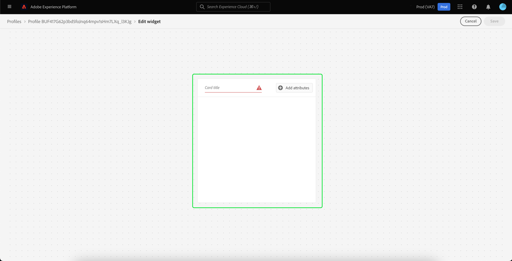
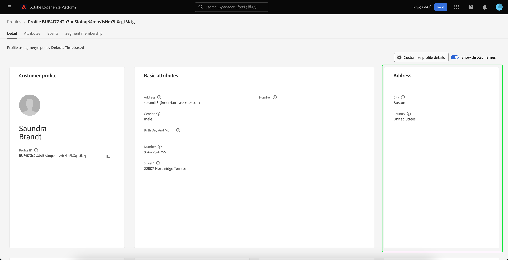

# Personalizzazione dettagli [!DNL Real-Time Customer Profile] {#profile-detail-customization}

Nell&#39;interfaccia utente di Adobe Experience Platform è possibile visualizzare e interagire con i dati di [!DNL Real-Time Customer Profile] sotto forma di profili cliente. Le informazioni di profilo visualizzate nell’interfaccia utente di sono state unite da più frammenti di profilo per formare un’unica vista per ogni singolo cliente. Ciò include dettagli quali attributi di base, identità collegate e preferenze di canale. I campi predefiniti visualizzati nei profili possono anche essere modificati a livello organizzativo per visualizzare gli attributi [!DNL Profile] preferiti. Questa guida fornisce istruzioni dettagliate per personalizzare la modalità di visualizzazione dei dati [!DNL Profile] nell&#39;interfaccia utente di Platform.

Per una guida completa all&#39;interfaccia utente dei profili, visita la [guida all&#39;interfaccia utente dei profili](user-guide.md).

## Riordinare e ridimensionare le schede {#reorder-and-resize-cards}

Dalla scheda **[!UICONTROL Dettagli]** del profilo cliente, puoi selezionare **[!UICONTROL Personalizza dettagli profilo]** per ridimensionare e riordinare le schede esistenti.

Dopo aver scelto di modificare il dashboard, puoi riordinare le schede selezionando il titolo e trascinandole e rilasciandole nell’ordine desiderato. È inoltre possibile ridimensionare una scheda selezionando il simbolo dell&#39;angolo nell&#39;angolo inferiore destro della scheda (`⌟`) e trascinando la scheda alle dimensioni desiderate. In questo esempio, la scheda **[!UICONTROL Attributi di base]** viene ridimensionata.

La scheda selezionata si adatta alle dimensioni desiderate e le schede circostanti vengono riposizionate in modo dinamico. Questo può causare lo spostamento di alcune schede in righe aggiuntive, che richiedono lo scorrimento verso il basso per visualizzare tutte le schede. Ad esempio, quando la scheda &quot;[!UICONTROL Attributi di base]&quot; viene ridimensionata, la scheda &quot;[!UICONTROL Identità collegate]&quot; non è più visibile nella riga superiore e ora viene visualizzata in una nuova seconda riga all&#39;interno del profilo (non visualizzata). Per restituire la scheda &quot;[!UICONTROL Identità collegate]&quot; alla riga superiore, puoi trascinarla nella posizione corrente della scheda &quot;[!UICONTROL Preferenze canale]&quot;.

## Modificare e rimuovere schede

Oltre a ridimensionare e riordinare le schede, puoi modificare il contenuto di alcune schede e rimuoverle completamente dal dashboard. Selezionare i puntini di sospensione (`...`) nell&#39;angolo superiore destro della scheda per modificarla o rimuoverla. Si apre un menu a discesa con le opzioni per modificare o rimuovere la scheda, a seconda delle proprietà della scheda selezionata.

>[!NOTE]
>
>Non tutte le schede possono essere modificate o rimosse. Questo perché alcune schede contengono informazioni di sola lettura o obbligatorie. Se nell&#39;angolo superiore destro di una scheda non è presente un&#39;ellisse, la scheda contiene le informazioni richieste AND di sola lettura e non può essere modificata né rimossa. Se una scheda presenta dei puntini di sospensione nell’angolo e se la selezioni, viene visualizzata solo un’opzione per rimuoverla, le informazioni sulla scheda sono di sola lettura e non possono essere modificate.

Seleziona **[!UICONTROL Modifica]** nel menu a discesa per aprire l&#39;area di lavoro **[!UICONTROL Modifica widget]**, in cui puoi aggiornare il titolo della scheda, riordinare o rimuovere gli attributi visibili o aggiungere attributi aggiuntivi utilizzando il pulsante **[!UICONTROL Aggiungi attributi]**.

## Aggiungi attributi {#add-attributes}

Dalla schermata **[!UICONTROL Modifica widget]**, seleziona **[!UICONTROL Aggiungi attributi]** nell&#39;angolo in alto a destra della scheda per iniziare ad aggiungere attributi alla scheda.

Quando si apre la finestra di dialogo **[!UICONTROL Seleziona campo schema di unione]**, sul lato sinistro viene visualizzato lo schema di unione [!UICONTROL XDM Individual Profile] completo, con i campi nidificati al di sotto. Per ulteriori informazioni sugli schemi di unione, consulta la sezione [schemi di unione nella [!DNL Profile] guida utente](user-guide.md#union-schema).

La sezione **[!UICONTROL Attributi selezionati]** sul lato destro della finestra di dialogo mostra gli attributi attualmente inclusi nella scheda che stai modificando. Puoi rimuovere e riordinare gli attributi anche qui. Vengono visualizzati il numero totale di attributi selezionati e il numero massimo di attributi (20) che è possibile aggiungere a una singola scheda.

Puoi selezionare uno qualsiasi dei campi schema di unione disponibili per personalizzare gli attributi della scheda che stai modificando. Quando selezioni i campi, puoi scegliere di visualizzare il nome del percorso del file o il nome visualizzato. Per passare da una visualizzazione all&#39;altra, selezionare l&#39;opzione **[!UICONTROL Mostra nomi visualizzati]**.

![L&#39;interruttore [!UICONTROL Mostra nomi visualizzati] è evidenziato nella pagina dei dettagli del profilo.](../images/profile-customization/show-display-names.png)

I campi selezionati vengono visualizzati con un segno di spunta accanto e vengono aggiunti automaticamente all&#39;elenco degli attributi selezionati. Dopo aver aggiunto tutti gli attributi che desideri visualizzare sulla scheda, scegli **[!UICONTROL Seleziona]** per tornare alla schermata **[!UICONTROL Modifica widget]**.

Quando ritorni alla schermata **[!UICONTROL Modifica widget]**, l&#39;elenco degli attributi sulla scheda deve essere aggiornato per riflettere le scelte effettuate. Puoi comunque rimuovere o riordinare gli attributi della scheda o modificarne il titolo in base alle esigenze. Al termine delle modifiche, seleziona **[!UICONTROL Salva]** per salvarle.

Dopo il salvataggio, si torna alla scheda **[!UICONTROL Dettagli]** in cui sono visibili la scheda e gli attributi aggiornati.

## Aggiungi una nuova scheda {#add-a-new-card}

Per personalizzare ulteriormente l’aspetto dei profili in Experience Platform, puoi scegliere di aggiungere nuove schede al dashboard e selezionare gli attributi che desideri visualizzare su tali schede. Per iniziare, selezionare **[!UICONTROL Modifica dashboard]** nella scheda **[!UICONTROL Dettagli]**.

Quindi, seleziona **[!UICONTROL Aggiungi widget]** nell&#39;angolo superiore sinistro del dashboard.

Scegliendo di aggiungere una nuova scheda si apre la schermata **[!UICONTROL Modifica widget]** in cui è possibile fornire un titolo per la nuova scheda e scegliere gli attributi che si desidera visualizzare nella scheda. Per iniziare ad aggiungere attributi alla scheda, seleziona **[!UICONTROL Aggiungi attributi]**.

All&#39;apertura della finestra di dialogo **[!UICONTROL Seleziona campo schema unione]**, sul lato sinistro viene visualizzato lo schema di unione completo del [!UICONTROL Profilo individuale XDM] e la sezione **[!UICONTROL Attributi selezionati]** sul lato destro della finestra di dialogo mostra gli attributi selezionati per la scheda. Per ulteriori informazioni sull&#39;aggiunta di attributi, vedere la sezione [sull&#39;aggiunta di attributi](#add-attributes) visualizzata in precedenza in questo documento.

Vengono visualizzati il numero totale di attributi selezionati e il numero massimo di attributi (20) che è possibile aggiungere a una singola scheda. Puoi anche rimuovere e riordinare gli attributi selezionati da questa schermata. Dopo aver aggiunto tutti gli attributi da visualizzare sulla scheda, scegli **[!UICONTROL Seleziona]** per tornare alla schermata **[!UICONTROL Modifica widget]**.

Quando ritorni alla schermata **[!UICONTROL Modifica widget]**, l&#39;elenco degli attributi sulla scheda deve riflettere le scelte effettuate nella schermata precedente. Puoi anche riordinare e rimuovere gli attributi della scheda in base alle esigenze.

Per salvare la nuova carta devi prima fornire un **[!UICONTROL titolo carta]**, quindi potrai selezionare **[!UICONTROL Salva]** e completare il processo di creazione della carta.

Dopo il salvataggio, si torna alla scheda **[!UICONTROL Dettagli]** in cui sono visibili la nuova scheda e gli attributi.

## Ripristina schede predefinite

Se in qualsiasi momento decidi di ripristinare le schede predefinite che sono state rimosse in seguito, puoi farlo in modo rapido e semplice. Selezionare **[!UICONTROL Modifica dashboard]**, quindi selezionare **[!UICONTROL Ripristina schede predefinite]**. Quando le schede predefinite sono visibili, puoi selezionare **[!UICONTROL Salva]** per salvare le modifiche oppure **[!UICONTROL Annulla]** se non desideri ripristinare le schede predefinite.

## Passaggi successivi

Seguendo questo documento, ora dovresti essere in grado di aggiornare la vista profilo per la tua organizzazione, aggiungendo e rimuovendo schede, modificando i dettagli e gli attributi della scheda e riordinando e ridimensionando le schede. Per ulteriori informazioni sull&#39;utilizzo dei dati di [!DNL Profile] nell&#39;interfaccia utente di Experience Platform, fare riferimento alla [[!DNL Profile] guida utente](user-guide.md).
