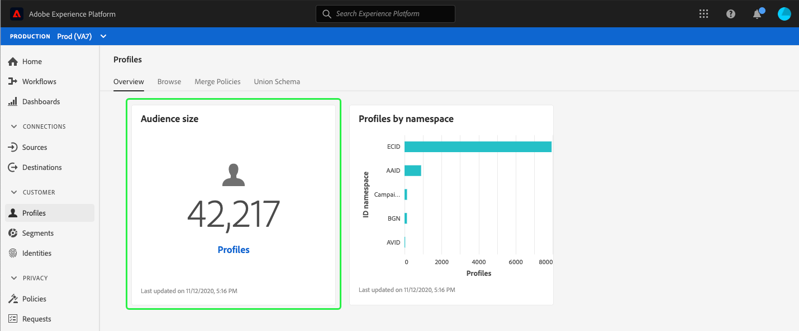

# (Alfa) [!DNL Real-time Customer Profile] dashboard {#profile-dashboard}

>[!IMPORTANT]
>
>La funzionalità del dashboard descritta in questo documento è attualmente in alfa e non è disponibile per tutti gli utenti. La documentazione e le funzionalità sono soggette a modifiche.

L&#39;interfaccia utente di Adobe Experience Platform (interfaccia utente) fornisce una dashboard attraverso la quale è possibile visualizzare informazioni importanti sui [!DNL Real-time Customer Profile] dati, come acquisito durante un&#39;istantanea giornaliera. Questa guida descrive come accedere e utilizzare il [!DNL Profile] dashboard nell&#39;interfaccia utente e fornisce ulteriori informazioni sulle metriche visualizzate nel dashboard.

Per una panoramica di tutte le funzioni Profilo dell&#39;interfaccia utente del Experience Platform , visita la guida [all&#39;interfaccia utente Profilo cliente in tempo](user-guide.md)reale.

## Dati dashboard profilo

Il dashboard Profilo visualizza un&#39;istantanea dei dati attributo (record) di cui dispone l&#39;organizzazione all&#39;interno dell&#39;archivio dei profili in  Experience Platform. Lo snapshot non include dati di eventi (serie temporali).

I dati attributo nello snapshot mostrano esattamente come appaiono nel momento specifico in cui è stata scattata l&#39;istantanea. In altre parole, l&#39;istantanea non è un&#39;approssimazione o un esempio dei dati e il dashboard Profilo non viene aggiornato in tempo reale.

>[!NOTE]
>
>Eventuali modifiche o aggiornamenti apportati ai dati dopo l&#39;acquisizione dell&#39;istantanea non verranno visualizzati nel dashboard fino all&#39;acquisizione dell&#39;istantanea successiva.

Le metriche visualizzate nel dashboard Profilo si basano sui criteri di unione predefiniti per la tua organizzazione. Per ulteriori informazioni sui criteri di unione e su come selezionare o modificare i criteri di unione predefiniti, consultare la guida [all&#39;interfaccia utente dei criteri di](merge-policies.md)unione.

## Esplorazione del dashboard Profilo

Per passare al dashboard Profilo nell&#39;interfaccia utente della piattaforma, seleziona **[!UICONTROL Profiles]** nella barra a sinistra, quindi seleziona la **[!UICONTROL Overview]** scheda per visualizzare il dashboard.

### Widget e metriche

Il dashboard è composto da widget, che sono metriche di sola lettura che forniscono informazioni importanti sui dati del profilo. La data e l’ora dell’&quot;ultimo aggiornamento&quot; del widget mostrano quando è stata scattata l’ultima istantanea dei dati.

## widget disponibili

 Experience Platform fornisce più widget che potete utilizzare per visualizzare diverse metriche correlate ai dati del profilo. Seleziona il nome di un widget qui sotto per saperne di più:

* [[!UICONTROL Audience size]](#audience-size)
* [[!UICONTROL Profiles by namespace]](#profiles-by-namespace)

### [!UICONTROL Audience size] {#audience-size}

Il **[!UICONTROL Audience size]** widget visualizza il numero totale di profili uniti nell&#39;archivio dati Profilo al momento dell&#39;acquisizione dello snapshot. Questo numero è il risultato dell&#39;applicazione del criterio di unione predefinito dell&#39;organizzazione ai dati del profilo per unire insieme i frammenti del profilo e creare un unico profilo per ciascun utente.

Per ulteriori informazioni sui frammenti e i profili uniti, consulta la sezione relativa ai frammenti di [profilo e ai profili](../home.md#profile-fragments-vs-merged-profiles) uniti della panoramica [del](../home.md)profilo.

### [!UICONTROL Profiles by namespace] {#profiles-by-namespace}

Il **[!UICONTROL Profiles by namespace]** widget visualizza la suddivisione degli spazi dei nomi in tutti i profili uniti nel tuo archivio profili. Il numero totale di profili per [!UICONTROL ID namespace] (in altre parole, aggiungendo insieme i valori mostrati per ogni spazio nomi) sarà sempre superiore al numero totale di profili unione, perché a un profilo potrebbero essere associati più spazi dei nomi. Ad esempio, se un cliente interagisce con il tuo marchio su più di un canale, a quel singolo cliente saranno associati più spazi dei nomi.

Per ulteriori informazioni sugli spazi dei nomi di identità, consulta la documentazione [del servizio](../../identity-service/home.md)Adobe Experience Platform Identity.

## Dashboard aggiuntivi

L&#39;interfaccia utente della piattaforma offre dashboard aggiuntivi per visualizzare istantanee dei dati all&#39;interno  Experience Platform. Tali dashboard includono segmentazione e utilizzo della licenza. Per ulteriori informazioni su queste dashboard aggiuntive, seleziona i seguenti collegamenti:

* [Pannello segmento](../../segmentation/ui/segment-dashboard.md)
* [Pannello Utilizzo licenza](../../landing/license-usage-dashboard.md)

## Passaggi successivi

Seguendo questo documento, ora dovresti essere in grado di individuare il dashboard Profilo e comprendere le metriche visualizzate nei widget disponibili. Per ulteriori informazioni sull’utilizzo [!DNL Profile] dei dati nell’interfaccia utente del Experience Platform , consulta la guida [[!DNL Profile] all’](user-guide.md)interfaccia utente.