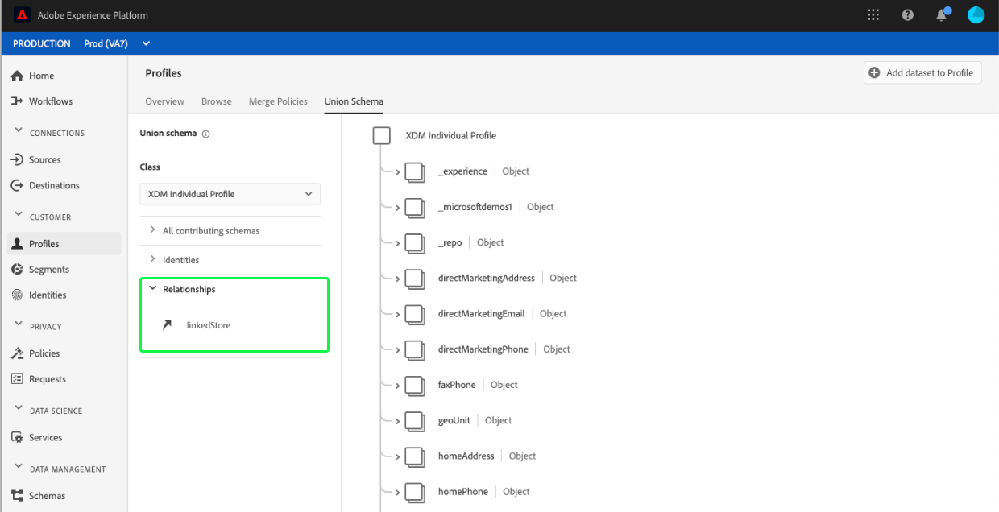

# [!UICONTROL Union schema] Guida all&#39;interfaccia

Nell&#39;interfaccia utente di Adobe Experience Platform è possibile visualizzare facilmente qualsiasi schema di unione all&#39;interno dell&#39;organizzazione e visualizzare in anteprima i campi, le identità, le relazioni e gli schemi che contribuiscono a una classe specifica. Questa guida fornisce informazioni dettagliate su come visualizzare ed esplorare gli schemi di unione utilizzando l&#39;interfaccia utente della piattaforma.

## Introduzione

Questa guida all&#39;interfaccia utente richiede una comprensione dei vari [!DNL Experience Platform] servizi coinvolti nella gestione dei dati del profilo cliente in tempo reale. Prima di leggere questa guida o di utilizzare l&#39;interfaccia utente, consulta la documentazione relativa ai seguenti servizi:

* [[!DNL Real-time Customer Profile]](../home.md): Fornisce un profilo di consumo unificato e in tempo reale basato su dati aggregati provenienti da più origini.
* [[!DNL Identity Service]](../../identity-service/home.md): Consente [!DNL Real-time Customer Profile] di collegare identità da origini dati diverse durante l&#39;assimilazione [!DNL Platform].
* [[!DNL Experience Data Model (XDM)]](../../xdm/home.md): Il framework standard con cui [!DNL Platform] organizzare i dati relativi all&#39;esperienza del cliente.

## Informazioni sugli schemi di unione

Il profilo cliente in tempo reale consente di creare profili solidi e centralizzati contenenti gli attributi del cliente e gli eventi con marca temporale per ogni interazione con i clienti tra sistemi integrati con Adobe Experience Platform. Il formato e la struttura di questi dati sono forniti dagli schemi Experience Data Model (XDM), con ogni schema basato su una classe XDM e contenente campi compatibili con tale classe.

Gli schemi possono essere creati per più casi di utilizzo, facendo riferimento alla stessa classe ma contenente campi specifici per il loro utilizzo. Quando uno schema è abilitato per il profilo, diventa parte di uno schema di unione. In altre parole, gli schemi unione sono composti da più schemi che condividono la stessa classe e sono stati abilitati per Profile. Lo schema di unione consente di visualizzare una combinazione di tutti i campi contenuti negli schemi che condividono la stessa classe. Profilo cliente in tempo reale utilizza lo schema unione per creare una visualizzazione olistica di ogni singolo cliente.

L&#39;utilizzo degli schemi di unione richiede una conoscenza approfondita degli schemi XDM. Per ulteriori informazioni, iniziare leggendo le [nozioni di base della composizione](../../xdm/schema/composition.md)dello schema.

## Visualizza schemi unione

Per passare agli schemi di unione nell&#39;interfaccia utente della piattaforma, selezionate **[!UICONTROL Profiles]** dal menu di navigazione a sinistra, quindi selezionate la **[!UICONTROL Union Schema]** scheda. Si apre la [!UICONTROL Union Schema] scheda per visualizzare lo schema di unione per la classe attualmente selezionata.

## Selezionare una classe

Per visualizzare lo schema di unione per una classe XDM specifica, selezionare la classe dal **[!UICONTROL Class]** menu a discesa. Poiché non tutte le classi dispongono di schemi di unione, nel menu a discesa sono disponibili solo le classi con schemi di unione (ovvero classi con schemi che sono stati abilitati per Profile).

Dopo aver selezionato una classe, lo schema visualizzato si aggiorna per riflettere lo schema di unione per la classe selezionata. Ad esempio, è possibile selezionare **[!UICONTROL XDM Individual Profile]** per visualizzare lo schema unione per la classe.

## Esplora schemi unione

È possibile esplorare lo schema unione scorrendo verso l&#39;alto o il basso per visualizzare la struttura dello schema completa e selezionando una parentesi angolare a destra (`>`) per espandere i campi nidificati.

Selezionare un campo per visualizzarne i dettagli, inclusi nome visualizzato, tipo di dati, descrizione, percorso, data di creazione e data dell&#39;ultima modifica. È inoltre possibile visualizzare un elenco degli schemi contributori contenenti il campo selezionato.

Se si seleziona il nome di uno schema contributivo, vengono visualizzati i nomi dei set di dati relativi a tale schema che stanno raccogliendo i dati nel campo selezionato. Ogni nome di set di dati viene visualizzato come collegamento. Selezionando un nome di set di dati si apre la scheda dell&#39;attività per tale set di dati in una nuova finestra.

Per ulteriori informazioni sui set di dati, tra cui la visualizzazione dell&#39;attività dei set di dati e l&#39;anteprima dei dati dei set di dati nell&#39;interfaccia utente, consultare la guida [all&#39;interfaccia utente](../../catalog/datasets/user-guide.md)per i set di dati.

## Visualizza schemi contributivi

È inoltre possibile visualizzare quali schemi specifici contribuiscono allo schema unione selezionando **[!UICONTROL All contributing schemas]** per espandere l&#39;elenco degli schemi. A seconda della classe selezionata e del numero di schemi creati dall&#39;organizzazione all&#39;interno della piattaforma, potrebbe trattarsi di un elenco breve contenente un singolo schema o un elenco lungo contenente molti schemi.

Selezionando il nome di uno schema specifico, vengono evidenziati i campi all&#39;interno dello schema unione che fanno parte dello schema selezionato. Dopo aver selezionato uno schema, lo schema di unione viene visualizzato in grigio con barre nere che indicano i campi che fanno parte dello schema partecipante.

## Visualizzare le identità

Tramite l&#39;interfaccia utente è possibile visualizzare un elenco di identità incluse nello schema di unione selezionando **[!UICONTROL Identities]** per espandere l&#39;elenco.

Selezionando una singola identità dall&#39;elenco, lo schema visualizzato si aggiorna automaticamente in base alle esigenze per visualizzare il campo identità. Ciò potrebbe includere l&#39;espansione di più campi se il campo identità è nidificato.

Il campo identità è evidenziato nello schema unione e i dettagli dell&#39;identità sono visualizzati sul lato destro dello schermo. I dettagli includono un elenco degli schemi contributori che contengono il campo identità ed è possibile approfondire la ricerca dei collegamenti ai set di dati relativi a tale schema che stanno raccogliendo i dati nel campo identità selezionato.

## Visualizzare le relazioni

L&#39;interfaccia utente dello schema unione consente inoltre di visualizzare le relazioni definite per gli schemi in base alla classe dello schema selezionata. La definizione di una relazione è un modo di collegare due schemi appartenenti a classi diverse per acquisire informazioni più complesse sui dati dei clienti.

Se sono state stabilite relazioni per la classe selezionata, la selezione **[!UICONTROL Relationships]** visualizza un elenco di campi utilizzati per creare relazioni. Poiché non tutti gli schemi utilizzano o necessitano di relazioni definite, è comune che la sezione delle relazioni non contenga campi.

Per ulteriori informazioni sulle relazioni con gli schemi, tra cui come definirle utilizzando l&#39;interfaccia utente, consultare [questo documento sulle relazioni](../../xdm/tutorials/relationship-ui.md)con gli schemi.

Selezionando un campo relazione dall&#39;elenco, lo schema visualizzato si aggiorna in base alle esigenze per visualizzare il campo relazione evidenziato. Questo potrebbe includere l&#39;espansione di più campi se il campo della relazione è nidificato.

## Passaggi successivi

Leggendo questa guida, ora puoi vedere e navigare negli schemi di unione utilizzando l&#39; [!DNL Experience Platform] interfaccia utente. Per ulteriori informazioni sugli schemi, compreso il modo in cui vengono utilizzati in tutta la piattaforma, si prega di iniziare leggendo la panoramica [di sistema](../../xdm/home.md)XDM.
