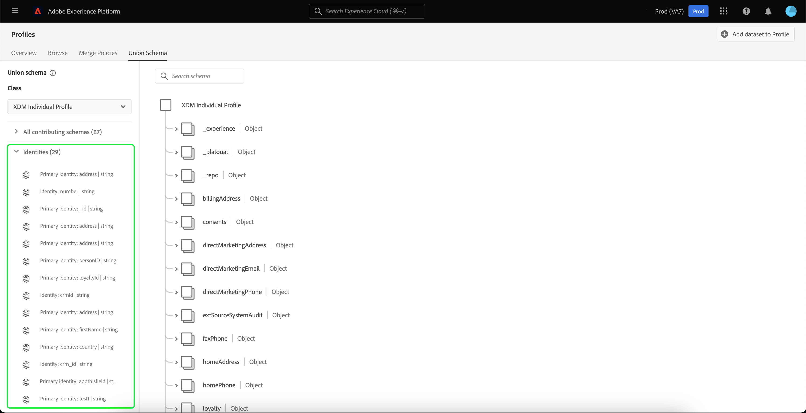

# [!UICONTROL Guida dell&#39;interfaccia utente dello schema di unione]

Nell’interfaccia utente di Adobe Experience Platform puoi visualizzare facilmente qualsiasi schema di unione all’interno della tua organizzazione e visualizzare in anteprima campi, identità, relazioni e schemi contributivi per una classe specifica. Questa guida fornisce informazioni dettagliate su come visualizzare ed esplorare gli schemi di unione tramite l’interfaccia utente di Platform.

## Introduzione

Questa guida dell&#39;interfaccia utente richiede una conoscenza dei vari servizi [!DNL Experience Platform] coinvolti nella gestione dei dati del profilo cliente in tempo reale. Prima di leggere questa guida o di lavorare nell’interfaccia utente, consulta la documentazione dei seguenti servizi:

* [[!DNL Real-Time Customer Profile]](../home.md): fornisce un profilo consumer unificato e in tempo reale basato su dati aggregati provenienti da più origini.
* [[!DNL Identity Service]](../../identity-service/home.md): abilita [!DNL Real-Time Customer Profile] collegando identità da origini dati diverse durante l&#39;acquisizione in [!DNL Platform].
* [[!DNL Experience Data Model (XDM)]](../../xdm/home.md): framework standardizzato tramite il quale [!DNL Platform] organizza i dati sull&#39;esperienza del cliente.

## Informazioni sugli schemi di unione

Real-Time Customer Profile consente di creare profili solidi e centralizzati contenenti gli attributi del cliente e gli eventi con marca temporale per ogni interazione con il cliente su sistemi integrati con Adobe Experience Platform. Il formato e la struttura di questi dati sono forniti dagli schemi Experience Data Model (XDM), con ogni schema basato su una classe XDM e contenente campi compatibili con tale classe.

Gli schemi possono essere creati per più casi d’uso, facendo riferimento alla stessa classe ma contenenti campi specifici per il loro utilizzo. Quando uno schema viene abilitato per Profilo, diventa parte di uno schema di unione. In altre parole, gli schemi di unione sono composti da più schemi che condividono la stessa classe e sono stati abilitati per Profilo. Lo schema di unione consente di visualizzare una combinazione di tutti i campi contenuti negli schemi che condividono la stessa classe. Real-Time Customer Profile utilizza lo schema di unione per creare una visualizzazione olistica di ogni singolo cliente.

L’utilizzo degli schemi di unione richiede una conoscenza approfondita degli schemi XDM. Per ulteriori informazioni, leggere le [nozioni di base sulla composizione dello schema](../../xdm/schema/composition.md).

## Visualizza schemi di unione

Per passare agli schemi unione nell&#39;interfaccia utente di Platform, seleziona **[!UICONTROL Profili]** nell&#39;area di navigazione a sinistra, quindi seleziona la scheda **[!UICONTROL Schema unione]**. Viene visualizzata la scheda [!UICONTROL Schema unione] per visualizzare lo schema di unione per la classe attualmente selezionata.

## Seleziona una classe

Per visualizzare lo schema di unione per una classe XDM specifica, seleziona la classe dal menu a discesa **[!UICONTROL Classe]**. Poiché non tutte le classi dispongono di schemi di unione, nel menu a discesa sono disponibili solo le classi con schemi di unione (ovvero le classi con schemi che sono stati abilitati per Profilo).

Dopo aver selezionato una classe, lo schema visualizzato viene aggiornato in modo da riflettere lo schema di unione per la classe selezionata. Ad esempio, puoi selezionare **[!UICONTROL Profilo individuale XDM]** per visualizzare lo schema di unione per quella classe.

## Esplora gli schemi unione

È possibile esplorare lo schema di unione scorrendo verso l&#39;alto o il basso per visualizzare la struttura completa dello schema e selezionando una parentesi angolare chiusa (`>`) per espandere i campi nidificati.

Seleziona un campo per visualizzarne i dettagli, tra cui nome visualizzato, tipo di dati, descrizione, percorso, data di creazione e data dell’ultima modifica. Puoi anche visualizzare un elenco di schemi contributivi contenenti il campo selezionato.

Selezionando il nome di uno schema contributivo, vengono visualizzati i nomi dei set di dati correlati a tale schema che acquisiscono dati nel campo selezionato. Ogni nome di set di dati viene visualizzato come collegamento. Selezionando un nome per un set di dati si apre la scheda dell’attività per quel set di dati in una nuova finestra.

Per ulteriori informazioni sui set di dati, tra cui la visualizzazione dell&#39;attività del set di dati e l&#39;anteprima dei dati nell&#39;interfaccia utente, visita la [guida all&#39;interfaccia utente dei set di dati](../../catalog/datasets/user-guide.md).

## Visualizzare gli schemi contributivi

Puoi anche visualizzare quali schemi specifici contribuiscono allo schema di unione selezionando **[!UICONTROL Tutti gli schemi che contribuiscono]** per espandere l&#39;elenco degli schemi. A seconda della classe selezionata e del numero di schemi creati dall’organizzazione all’interno di Platform, potrebbe trattarsi di un elenco breve contenente un singolo schema o di un elenco lungo contenente più schemi.

Selezionando il nome di uno schema specifico vengono evidenziati i campi all’interno dello schema di unione che fanno parte dello schema selezionato. Dopo aver selezionato uno schema, lo schema di unione viene visualizzato in grigio con barre nere che indicano i campi che fanno parte dello schema contributivo.

## Visualizza identità

Puoi visualizzare un elenco di identità incluse nello schema di unione tramite l&#39;interfaccia utente selezionando **[!UICONTROL Identità]** per espandere l&#39;elenco.

Selezionando una singola identità dall’elenco, lo schema visualizzato viene aggiornato automaticamente in base alle esigenze, in modo da visualizzare il campo di identità. Ciò potrebbe includere l’espansione di più campi se il campo di identità è nidificato.

Il campo di identità è evidenziato nello schema di unione e i dettagli dell’identità sono visualizzati sul lato destro dello schermo. I dettagli includono un elenco di schemi contributivi contenenti il campo di identità. Puoi eseguire un drill-down per trovare collegamenti ai set di dati correlati a tale schema che stanno acquisendo dati nel campo di identità selezionato.

## Visualizza relazioni

L’interfaccia utente dello schema di unione consente inoltre di visualizzare le relazioni definite per gli schemi in base alla classe di schema selezionata. La definizione di una relazione è un modo per collegare due schemi appartenenti a classi diverse al fine di ottenere informazioni più complesse sui dati dei clienti.

Se sono state stabilite relazioni per la classe selezionata, se si seleziona **[!UICONTROL Relazioni]** viene visualizzato un elenco di campi utilizzati per creare relazioni. Non tutti gli schemi utilizzano o necessitano di relazioni definite, pertanto è comune che la sezione relazioni non contenga campi.

Per ulteriori informazioni sulle relazioni tra schemi, incluso come definirle utilizzando l&#39;interfaccia utente, visita [questo documento sulle relazioni tra schemi](../../xdm/tutorials/relationship-ui.md).

Selezionando un campo di relazione dall’elenco, lo schema visualizzato viene aggiornato in base alle esigenze, in modo da visualizzare il campo di relazione evidenziato. Ciò potrebbe includere l’espansione di più campi se il campo relazione è nidificato.

## Passaggi successivi

Dopo aver letto questa guida, saprai come visualizzare e navigare tra gli schemi di unione utilizzando l&#39;interfaccia utente [!DNL Experience Platform]. Per ulteriori informazioni sugli schemi, compreso il modo in cui vengono utilizzati in Platform, leggere la [panoramica del sistema XDM](../../xdm/home.md).
