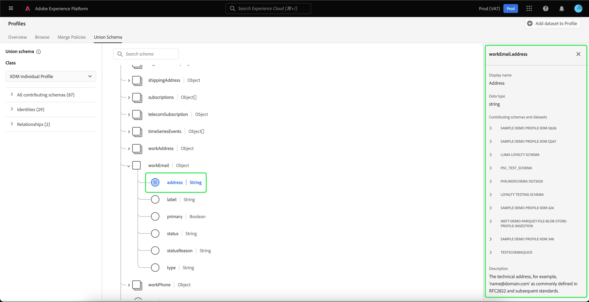

# [!UICONTROL Schema dell&#39;unione] Guida all’interfaccia utente

Nell’interfaccia utente di Adobe Experience Platform è possibile visualizzare facilmente qualsiasi schema di unione all’interno dell’organizzazione e visualizzare in anteprima i campi, le identità, le relazioni e gli schemi che contribuiscono a una classe specifica. Questa guida fornisce informazioni dettagliate su come visualizzare ed esplorare gli schemi di unione utilizzando l’interfaccia utente di Platform.

## Introduzione

Questa guida all’interfaccia utente richiede una comprensione dei vari [!DNL Experience Platform] servizi relativi alla gestione dei dati del profilo cliente in tempo reale. Prima di leggere questa guida o di lavorare nell’interfaccia utente, controlla la documentazione relativa ai seguenti servizi:

* [[!DNL Real-Time Customer Profile]](../home.md): Fornisce un profilo di consumatore unificato e in tempo reale basato su dati aggregati provenienti da più origini.
* [[!DNL Identity Service]](../../identity-service/home.md): Abilita [!DNL Real-Time Customer Profile] colmando le identità provenienti da fonti di dati diverse che vengono ingerite in [!DNL Platform].
* [[!DNL Experience Data Model (XDM)]](../../xdm/home.md): Il quadro standardizzato [!DNL Platform] organizza i dati sulla customer experience.

## Informazioni sugli schemi di unione

Il Profilo del cliente in tempo reale consente di creare profili solidi e centralizzati contenenti gli attributi del cliente e gli eventi con marca temporale per ciascuna interazione del cliente tra sistemi integrati con Adobe Experience Platform. Il formato e la struttura di questi dati vengono forniti dagli schemi Experience Data Model (XDM), in cui ogni schema è basato su una classe XDM e contiene campi compatibili con tale classe.

Gli schemi possono essere creati per più casi d’uso, facendo riferimento alla stessa classe ma contenendo campi specifici per il loro utilizzo. Quando uno schema è abilitato per Profilo, diventa parte di uno schema di unione. In altre parole, gli schemi di unione sono composti da più schemi che condividono la stessa classe e sono stati abilitati per Profilo. Lo schema di unione consente di visualizzare una combinazione di tutti i campi contenuti negli schemi che condividono la stessa classe. Profilo cliente in tempo reale utilizza lo schema unione per creare una visualizzazione olistica di ogni singolo cliente.

Per lavorare con gli schemi di unione è necessario comprendere a fondo gli schemi XDM. Per ulteriori informazioni, si prega di iniziare leggendo il [nozioni di base sulla composizione dello schema](../../xdm/schema/composition.md).

## Visualizzare gli schemi di unione

Per passare agli schemi di unione nell’interfaccia utente di Platform, seleziona **[!UICONTROL Profili]** nella navigazione a sinistra, seleziona il **[!UICONTROL Schema dell&#39;unione]** scheda . La [!UICONTROL Schema dell&#39;unione] viene visualizzata la scheda per visualizzare lo schema di unione per la classe attualmente selezionata.

## Selezionare una classe

Per visualizzare lo schema di unione per una specifica classe XDM, seleziona la classe dalla **[!UICONTROL Classe]** a discesa. Poiché non tutte le classi dispongono di schemi di unione, nel menu a discesa sono disponibili solo le classi con schemi di unione (ovvero le classi con schemi abilitati per Profilo).

Dopo aver selezionato una classe, lo schema visualizzato si aggiorna per riflettere lo schema di unione per la classe selezionata. Ad esempio, puoi selezionare **[!UICONTROL Profilo individuale XDM]** per visualizzare lo schema di unione per la classe.

## Esplorare gli schemi di unione

È possibile esplorare lo schema dell&#39;unione scorrendo verso l&#39;alto o il basso per visualizzare la struttura dello schema completa e selezionando una parentesi angolare destra (`>`) per espandere i campi nidificati.

Seleziona un campo qualsiasi per visualizzarne i dettagli, compresi nome visualizzato, tipo di dati, descrizione, percorso, data di creazione e data dell’ultima modifica. È inoltre possibile visualizzare un elenco degli schemi contributori contenenti il campo selezionato.

Quando si seleziona il nome di uno schema contributore, vengono visualizzati i nomi dei set di dati relativi a tale schema che acquisiscono dati nel campo selezionato. Ogni nome di set di dati viene visualizzato come collegamento. Selezionando un nome di set di dati, si apre la scheda attività per tale set di dati in una nuova finestra.

Per ulteriori informazioni sui set di dati, tra cui la visualizzazione dell’attività dei set di dati e l’anteprima dei dati dei set di dati nell’interfaccia utente, visita il [guida all’interfaccia utente dei set di dati](../../catalog/datasets/user-guide.md).

## Visualizza schemi contributori

Puoi anche visualizzare quali schemi specifici contribuiscono allo schema dell&#39;unione selezionando **[!UICONTROL Tutti gli schemi contributivi]** espandere l’elenco degli schemi. A seconda della classe selezionata e del numero di schemi creati dall’organizzazione in Platform, potrebbe trattarsi di un elenco breve contenente un singolo schema o un elenco lungo contenente più schemi.

Quando si seleziona il nome di uno schema specifico, vengono evidenziati i campi dello schema di unione che fanno parte dello schema selezionato. Dopo aver selezionato uno schema, lo schema di unione viene visualizzato in grigio con barre nere che indicano i campi che fanno parte dello schema che contribuisce.

## Visualizza identità

Tramite l&#39;interfaccia utente è possibile visualizzare un elenco di identità incluse nello schema di unione selezionando **[!UICONTROL Identità]** per espandere l’elenco.

Quando si seleziona una singola identità dall’elenco, lo schema visualizzato viene aggiornato automaticamente in base alle esigenze per visualizzare il campo di identità. Ciò potrebbe includere l’espansione di più campi se il campo di identità è nidificato.

Il campo identity viene evidenziato all’interno dello schema di unione e i dettagli dell’identità vengono visualizzati sul lato destro dello schermo. I dettagli includono un elenco di schemi che contribuiscono contenente il campo identity ed è possibile approfondire la ricerca di collegamenti ai set di dati relativi a tale schema che acquisiscono dati nel campo identity selezionato.

## Visualizzare le relazioni

L’interfaccia utente dello schema di unione consente inoltre di visualizzare le relazioni definite per gli schemi in base alla classe dello schema selezionata. La definizione di una relazione consente di collegare due schemi appartenenti a classi diverse per ottenere informazioni più complesse sui dati dei clienti.

Se sono state stabilite relazioni per la classe selezionata, selezionare **[!UICONTROL Relazioni]** visualizza un elenco di campi utilizzati per creare relazioni. Poiché non tutti gli schemi utilizzano o hanno bisogno di relazioni definite, è comune che la sezione relazioni non contenga campi.

Per ulteriori informazioni sulle relazioni tra schemi, tra cui come definirle utilizzando l’interfaccia utente, visita [questo documento sulle relazioni dello schema](../../xdm/tutorials/relationship-ui.md).

Quando si seleziona un campo di relazione dall&#39;elenco, lo schema visualizzato viene aggiornato in base alle esigenze per visualizzare il campo di relazione evidenziato. Ciò potrebbe includere l’espansione di più campi se il campo della relazione è nidificato.

## Passaggi successivi

Leggendo questa guida, ora sai come visualizzare e navigare tra gli schemi di unione utilizzando [!DNL Experience Platform] Interfaccia utente. Per ulteriori informazioni sugli schemi, compreso il modo in cui vengono utilizzati in Platform, si prega di iniziare leggendo il [Panoramica del sistema XDM](../../xdm/home.md).
