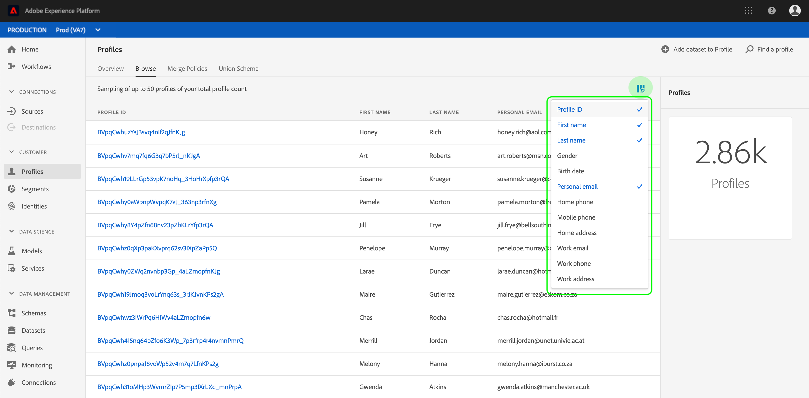
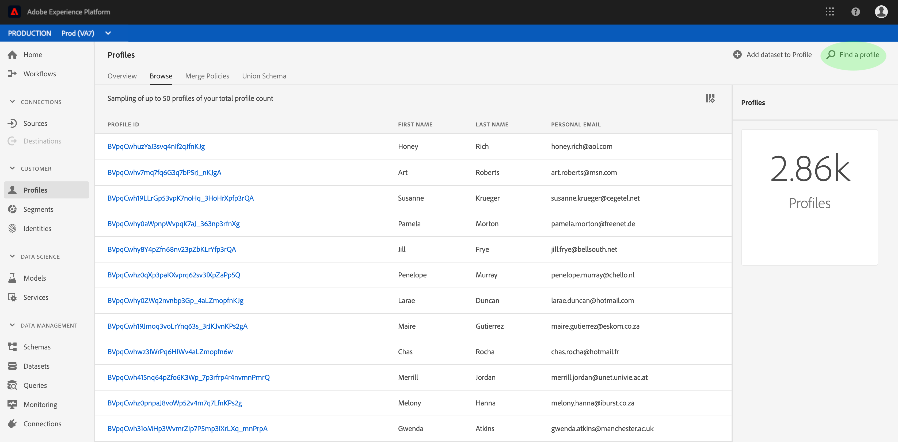
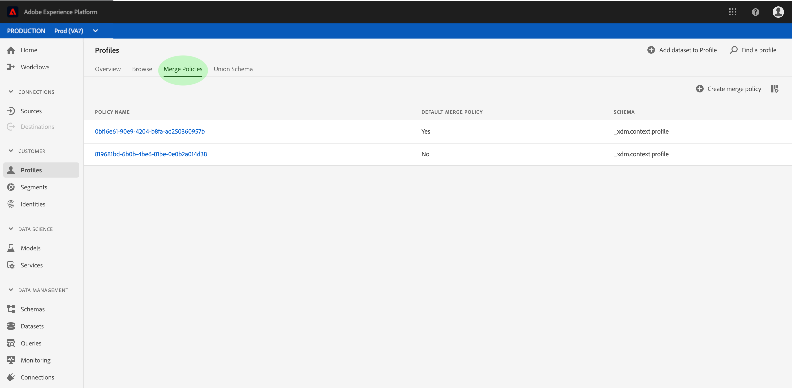

# Guida utente del profilo cliente in tempo reale

Profilo cliente in tempo reale crea una visualizzazione olistica di ciascuno dei tuoi clienti, combinando dati da più canali tra cui dati online, offline, CRM e di terze parti.

Questo documento funge da guida per l’interazione con il profilo cliente in tempo reale nell’interfaccia utente di Adobe Experience Platform.

## Introduzione

Questa guida utente richiede una comprensione dei diversi servizi della piattaforma Experience Manager (Piattaforma esperienza) relativi alla gestione del profilo cliente in tempo reale. Prima di leggere questa guida utente, consulta la documentazione relativa ai seguenti servizi:

* [Profilo](../home.md)cliente in tempo reale: Fornisce un profilo di consumo unificato e in tempo reale basato su dati aggregati provenienti da più origini.
* [Servizio](../../identity-service/home.md)identità: Abilita il profilo cliente in tempo reale collegando identità da origini dati diverse che vengono caricate nella piattaforma.
* [Experience Data Model (XDM)](../../xdm/home.md): Il framework standardizzato tramite il quale la piattaforma organizza i dati sull&#39;esperienza cliente.

## Panoramica del profilo

Nell’interfaccia utente [della piattaforma](http://platform.adobe.com)Experience, fai clic su **Profili** nella barra di navigazione a sinistra per aprire la scheda _Panoramica_ nell’area di lavoro _Profili_ . In questa scheda sono visualizzati diversi widget che forniscono informazioni di alto livello sull&#39;archivio dei profili, tra cui il pubblico indirizzabile totale, il numero di record dei profili acquisiti nell&#39;ultima settimana, nonché statistiche relative ai record riusciti e non riusciti per lo stesso periodo di tempo.

## Visualizzare gli esempi di profilo

Fate clic su **Sfoglia** per visualizzare un elenco di esempio dei profili disponibili. Questo esempio include fino a 50 profili dal conteggio [totale dei](#profile-count)profili. Gli esempi vengono aggiornati da un processo automatico che rileva i nuovi dati del profilo durante l’assimilazione. Ciascun profilo elencato visualizza il relativo ID, nome, cognome ed e-mail personale. Facendo clic sull’ID di un profilo elencato vengono visualizzati i relativi dettagli nel visualizzatore profilo.

Potete personalizzare gli attributi visualizzati nell’elenco facendo clic sull’icona del selettore delle colonne. Viene visualizzato un elenco a discesa contenente gli attributi di profilo comuni che è possibile aggiungere o rimuovere.

### Conteggio profili {#profile-count}

Il conteggio dei profili visualizza il numero totale di profili di cui dispone l&#39;organizzazione all&#39;interno di Experience Platform, dopo che il criterio di unione predefinito dell&#39;organizzazione ha unito i frammenti di profilo per formare un unico profilo per ciascun cliente. In altre parole, l&#39;organizzazione potrebbe avere più frammenti di profilo correlati a un singolo cliente che interagisce con il proprio marchio tra canali diversi, ma tali frammenti sarebbero uniti (in base al criterio di unione predefinito) e restituirebbero un conteggio di profilo pari a &quot;1&quot; perché tutti correlati allo stesso individuo.

Il conteggio dei profili include anche profili con attributi (dati di record) e profili contenenti solo dati di serie temporali (eventi), come i profili di Adobe Analytics. Il conteggio dei profili viene aggiornato regolarmente per fornire un numero totale aggiornato di profili all&#39;interno della piattaforma.

Quando l’inserimento di profili nell’archivio profili aumenta o diminuisce il conteggio di oltre il 5%, viene attivato un processo per aggiornare il conteggio. Per i flussi di lavoro dei dati in streaming, viene effettuato un controllo ogni ora per determinare se è stata raggiunta la soglia di incremento o riduzione del 5%. In caso affermativo, viene attivato automaticamente un processo per aggiornare il conteggio dei profili. Per l’assimilazione batch, entro 15 minuti dal corretto inserimento di un batch nell’archivio profili, se viene raggiunta la soglia di incremento o riduzione del 5%, viene eseguito un processo per aggiornare il conteggio dei profili.

### Ricerca profilo

Se si conosce un&#39;identità collegata per un particolare profilo (ad esempio l&#39;indirizzo e-mail), è possibile cercarlo facendo clic su **Trova un profilo**. Questo è il modo più affidabile per accedere a un profilo specifico, indipendentemente dal fatto che sia visualizzato o meno nell&#39;elenco dei campioni.

Nella finestra di dialogo visualizzata, selezionate uno spazio nomi ID appropriato dall&#39;elenco a discesa (&quot;E-mail&quot; in questo esempio) e immettete il valore ID di seguito prima di fare clic su **OK**. Se trovati, i dettagli del profilo di destinazione vengono visualizzati nel visualizzatore del profilo, come descritto nella sezione successiva.

### Visualizzatore profilo {#profile-viewer}

Dopo aver selezionato o cercato un profilo specifico, si apre la schermata _Dettagli_ del visualizzatore del profilo. In questa pagina vengono visualizzate informazioni sul profilo selezionato, ad esempio gli attributi di base del profilo, le identità collegate e i canali di contatto disponibili. Le informazioni di profilo visualizzate sono state unite da più frammenti di profilo per formare una singola vista del singolo cliente.

Il visualizzatore del profilo fornisce anche schede che consentono di visualizzare gli eventi e le appartenenze al segmento associati a questo profilo, se presenti.

## Unisci criteri

Fare clic su **Unisci criteri** per visualizzare un elenco di criteri di unione appartenenti alla propria organizzazione. Ogni criterio elencato visualizza il nome, indipendentemente dal fatto che si tratti del criterio di unione predefinito, e lo schema a cui si applica.

Per ulteriori informazioni sull&#39;utilizzo dei criteri di unione nell&#39;interfaccia utente, consulta la guida [utente](merge-policies.md)Unisci criteri.

## Schema unione

Fare clic su Schema **** unione per visualizzare gli schemi unione per l&#39;archivio dati del profilo. Uno schema di unione è un&#39;unione di tutti i campi Experience Data Model (XDM) della stessa classe, i cui schemi sono stati abilitati per l&#39;utilizzo in Real-time Customer Profile (Profilo cliente in tempo reale). Fare clic su una classe nell&#39;elenco a sinistra per visualizzare la struttura dello schema di unione nel quadro.

Per ulteriori informazioni sugli schemi di unione e sul loro ruolo nel profilo cliente in tempo reale, consulta la sezione sugli schemi di unione nella guida [alla composizione](../../xdm/schema/composition.md) dello schema.

## Passaggi successivi

Leggendo questa guida, ora sai come visualizzare e gestire i dati del tuo profilo utilizzando l’interfaccia utente della piattaforma Experience. Per informazioni su come sfruttare i dati del profilo cliente in tempo reale per generare segmenti di pubblico, consulta la documentazione [sulla](../../segmentation/home.md)segmentazione.