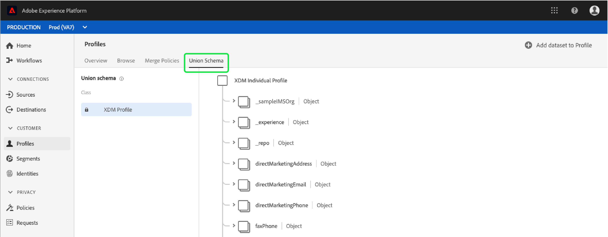

# [!DNL Real-time Customer Profile] guida utente

[!DNL Real-time Customer Profile] crea una visualizzazione olistica di ciascuno dei tuoi clienti, combinando dati provenienti da più canali tra cui dati online, offline, CRM e di terze parti.

Questo documento funge da guida per l’interazione con [!DNL Real-time Customer Profile] l’interfaccia utente di Adobe Experience Platform.

## Introduzione

Questa guida utente richiede una comprensione dei vari [!DNL Experience Platform] servizi di gestione [!DNL Real-time Customer Profiles]. Prima di leggere questa guida utente, consulta la documentazione relativa ai seguenti servizi:

* [!DNL Real-time Customer Profile](../home.md): Fornisce un profilo di consumo unificato e in tempo reale basato su dati aggregati provenienti da più origini.
* [!DNL Identity Service](../../identity-service/home.md): Consente [!DNL Real-time Customer Profile] di collegare identità da origini dati diverse durante l&#39;assimilazione [!DNL Platform].
* [!DNL Experience Data Model (XDM)](../../xdm/home.md): Il framework standard con cui [!DNL Platform] organizzare i dati relativi all&#39;esperienza del cliente.

## Panoramica

Nella [!DNL Experience Platform UI](http://platform.adobe.com), fare clic **[!UICONTROL Profiles]** nella barra di navigazione a sinistra per aprire la _[!UICONTROL Overview]_scheda. Questa scheda fornisce collegamenti alla documentazione e ai video per agevolare la comprensione e l&#39;utilizzo dei profili.

## Sfoglia

Selezionate la *[!UICONTROL Browse]* scheda per cercare i profili in base all&#39;identità.

### Metriche profilo {#profile-metrics}

Sul lato destro della *[!UICONTROL Browse]* scheda sono presenti diverse metriche importanti correlate ai dati del profilo, tra cui il conteggio [totale del](#profile-count) profilo e un elenco di [profili in base allo spazio dei nomi](#profiles-by-namespace).

Queste metriche del profilo vengono valutate utilizzando il criterio di unione predefinito dell&#39;organizzazione. Per ulteriori informazioni sull&#39;utilizzo dei criteri di unione, inclusa la modalità di definizione di un criterio di unione predefinito, vedere la guida [utente](merge-policies.md)Unisci criteri.

Oltre a queste metriche, la sezione delle metriche del profilo fornisce anche una data e un&#39;ora *dell&#39;ultimo aggiornamento* , che mostrano quando sono state valutate le metriche per l&#39;ultima volta.

### Conteggio profili {#profile-count}

Il conteggio dei profili visualizza il numero totale di profili di cui dispone l&#39;organizzazione [!DNL Experience Platform]dopo che il criterio di unione predefinito dell&#39;organizzazione ha unito i frammenti di profilo per formare un unico profilo per ciascun cliente. In altre parole, l&#39;organizzazione potrebbe avere più frammenti di profilo correlati a un singolo cliente che interagisce con il proprio marchio tra canali diversi, ma tali frammenti sarebbero uniti (in base al criterio di unione predefinito) e restituirebbero un conteggio di profilo pari a &quot;1&quot; perché tutti correlati allo stesso individuo.

Il conteggio dei profili include anche profili con attributi (dati di record) e profili contenenti solo dati di serie temporali (eventi), come  profili Adobe Analytics. Il conteggio dei profili viene aggiornato regolarmente per fornire un numero totale aggiornato di profili all&#39;interno della piattaforma.

Quando l&#39;inserimento di record nel [!DNL Profile Store] aumenta o diminuisce il conteggio di oltre il 5%, viene attivato un processo per aggiornare il conteggio. Per i flussi di lavoro dei dati in streaming, viene effettuato un controllo ogni ora per determinare se è stata raggiunta la soglia di incremento o riduzione del 5%. In caso affermativo, viene attivato automaticamente un processo per aggiornare il conteggio dei profili. Per l’assimilazione batch, entro 15 minuti dal corretto inserimento di un batch nell’archivio profili, se viene raggiunta la soglia di incremento o riduzione del 5%, viene eseguito un processo per aggiornare il conteggio dei profili.

### Profili per namespace {#profiles-by-namespace}

La *[!UICONTROL Profiles by namespace]* metrica visualizza il conteggio totale e la suddivisione degli spazi dei nomi in tutti i profili uniti nel tuo archivio profili. Il numero totale di profili per namespace (in altre parole, aggiungendo insieme i valori mostrati per ogni namespace) sarà sempre superiore alla metrica del conteggio dei profili, perché a un profilo potrebbero essere associati più spazi dei nomi. Ad esempio, se un cliente interagisce con il tuo marchio su più di un canale, a quel singolo cliente saranno associati più spazi dei nomi.

Simile alla metrica del conteggio [del](#profile-count) profilo, quando l&#39;inserimento di record nel [!DNL Profile Store] aumenta o diminuisce il conteggio di oltre il 5%, viene attivato un processo per aggiornare le metriche dello spazio nomi. Per i flussi di lavoro dei dati in streaming, viene effettuato un controllo ogni ora per determinare se è stata raggiunta la soglia di incremento o riduzione del 5%. In caso affermativo, viene attivato automaticamente un processo per aggiornare il conteggio dei profili. Per l&#39;inserimento batch, entro 15 minuti dal corretto inserimento di un batch nel [!DNL Profile Store], se viene raggiunta la soglia di incremento o riduzione del 5%, viene eseguito un processo per aggiornare le metriche.

### Unisci criterio

Il **[!UICONTROL Merge policy]** selettore seleziona automaticamente il criterio di unione predefinito per l&#39;organizzazione. Se non si desidera utilizzare tale criterio di unione, è possibile selezionare il criterio `X` accanto al criterio di unione predefinito per aprire una finestra di dialogo in cui *[!UICONTROL Select merge policy]* scegliere un altro criterio di unione. Per ulteriori informazioni sui criteri di unione, consultare la guida [utente](merge-policies.md)Unisci criteri.

### Spazio dei nomi identità

Il **[!UICONTROL Identity namespace]** selettore apre una finestra di dialogo in cui è possibile scegliere lo spazio dei nomi di identità per il quale eseguire la ricerca e personalizzare gli attributi visualizzati dalla ricerca selezionando l&#39;icona del filtro e scegliendo gli attributi che si desidera aggiungere o rimuovere.

Dalla *[!UICONTROL Select identity namespace]* finestra di dialogo, scegliete lo spazio dei nomi in base al quale eseguire la ricerca oppure utilizzate la **[!UICONTROL Search]** barra nella finestra di dialogo per iniziare a digitare il nome di uno spazio dei nomi. È possibile selezionare uno spazio dei nomi per visualizzare ulteriori dettagli e, una volta trovato lo spazio dei nomi da cercare, selezionare il pulsante di scelta e premere **[!UICONTROL Select]** per continuare.

### Valore identità

Dopo aver selezionato un **[!UICONTROL Identity namespace]**, tornate alla *[!UICONTROL Browse]* scheda in cui potete inserire un **[!UICONTROL Identity value]**. Questo valore è specifico di un profilo cliente singolo e deve essere una voce valida per lo spazio dei nomi fornito. Ad esempio, la selezione di **[!UICONTROL Identity namespace]** &quot;E-mail&quot; richiede un indirizzo e-mail **[!UICONTROL Identity value]** valido.

Una volta immesso il valore, selezionare **[!UICONTROL Show profile]** e viene restituito un profilo singolo corrispondente al valore. Selezionate l’icona **[!UICONTROL Profile ID]** per visualizzare i dettagli del profilo.

### Dettagli profilo {#profile-detail}

Dopo aver selezionato **[!UICONTROL Profile ID]**, si apre la _[!UICONTROL Detail]_scheda. In questa pagina vengono visualizzate informazioni sul profilo selezionato, inclusi gli attributi di base, le identità collegate e i canali di contatto disponibili. Le informazioni di profilo visualizzate sono state unite da più frammenti di profilo per formare una singola vista del singolo cliente.

Potete visualizzare informazioni aggiuntive relative al profilo, inclusi *[!UICONTROL Attributes]*, *[!UICONTROL Events]* e *[!UICONTROL Segments]* a cui il profilo è membro.

## Unisci criteri

Selezionare la *[!UICONTROL Merge Policies]* scheda per visualizzare un elenco di criteri di unione appartenenti alla propria organizzazione. Ogni criterio elencato visualizza il nome, indipendentemente dal fatto che si tratti del criterio di unione predefinito, e lo schema a cui si applica.

Per ulteriori informazioni sui criteri di unione, consultare la guida [utente](merge-policies.md)Unisci criteri.

## Schema unione

Selezionate la scheda Schema ** unione per visualizzare gli schemi di unione per [!DNL Profile Store]. Uno schema unione è un&#39;unione di tutti i campi [!DNL Experience Data Model] (XDM) della stessa classe, i cui schemi sono stati abilitati per l&#39;uso in [!DNL Real-time Customer Profile]. Selezionare una classe nell&#39;elenco a sinistra per visualizzare la struttura dello schema di unione nel quadro.

Ad esempio, selezionando &quot;[!DNL XDM Profile]&quot; viene visualizzato lo schema di unione per la [!DNL XDM Individual Profile] classe.

Per ulteriori informazioni sugli schemi unione e sul loro ruolo in [, vedere la sezione sugli schemi unione nella guida](../../xdm/schema/composition.md) alla composizione [!DNL Real-time Customer Profile]dello schema.

## Passaggi successivi

Leggendo questa guida, ora puoi vedere e gestire [!DNL Profile] i dati utilizzando l&#39; [!DNL Experience Platform] interfaccia utente. Per informazioni su come sfruttare [!DNL Real-time Customer Profile] i dati per generare segmenti di pubblico, consulta la documentazione [sulla](../../segmentation/home.md)segmentazione.