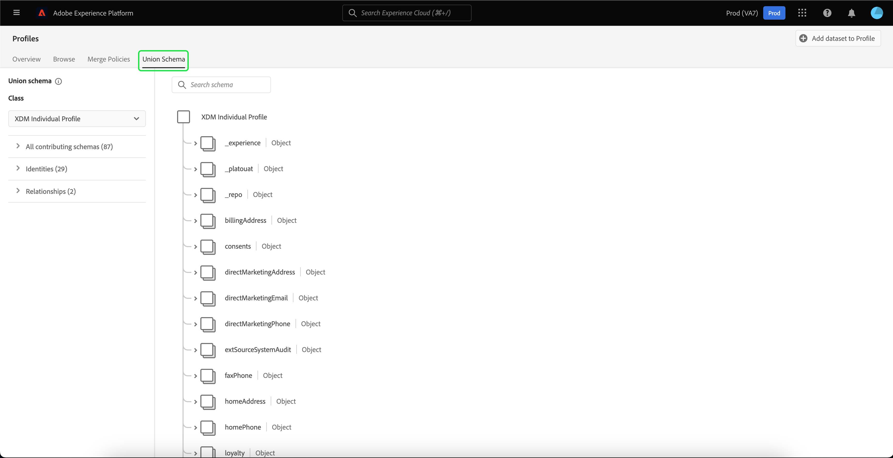

# Guida dell&#39;interfaccia utente di [!DNL Real-Time Customer Profile]

[!DNL Real-Time Customer Profile] crea una visualizzazione olistica di ciascuno dei singoli clienti, combinando dati provenienti da più canali tra cui dati online, offline, CRM e di terze parti. Questo documento funge da guida per l&#39;interazione con i dati [!DNL Real-Time Customer Profile] nell&#39;interfaccia utente di Adobe Experience Platform.

## Introduzione

Questa guida dell&#39;interfaccia utente richiede una conoscenza dei vari servizi [!DNL Experience Platform] coinvolti nella gestione di [!DNL Real-Time Customer Profiles]. Prima di leggere questa guida o di lavorare nell’interfaccia utente, consulta la documentazione dei seguenti servizi:

* [[!DNL Real-Time Customer Profile] panoramica](../home.md): fornisce un profilo consumer unificato e in tempo reale basato su dati aggregati provenienti da più origini.
* [[!DNL Identity Service]](../../identity-service/home.md): abilita [!DNL Real-Time Customer Profile] collegando identità da origini dati diverse durante l&#39;acquisizione in [!DNL Platform].
* [[!DNL Experience Data Model (XDM)]](../../xdm/home.md): framework standardizzato tramite il quale [!DNL Platform] organizza i dati sull&#39;esperienza del cliente.

## [!UICONTROL Panoramica]

Nell&#39;interfaccia utente di Experience Platform, seleziona **[!UICONTROL Profili]** nell&#39;area di navigazione a sinistra per aprire la scheda **[!UICONTROL Panoramica]** con la dashboard dei profili.

>[!NOTE]
>
>Se la tua organizzazione ha poca esperienza con Platform e non dispone ancora di set di dati di profilo attivi o criteri di unione creati, la dashboard [!UICONTROL Profili] non è visibile. Nella scheda [!UICONTROL Panoramica] sono invece visualizzati collegamenti e documentazione per aiutarti a iniziare a utilizzare Profilo cliente in tempo reale.

### Dashboard profili {#profile-dashboard}

La dashboard dei profili delinea le metriche chiave relative ai dati di profilo della tua organizzazione.

Per ulteriori informazioni, visita la [guida del dashboard dei profili](../../dashboards/guides/profiles.md).

## [!UICONTROL Sfoglia] metriche scheda

Seleziona la scheda **[!UICONTROL Sfoglia]** per visualizzare diverse metriche relative ai dati del profilo della tua organizzazione. È inoltre possibile utilizzare questa scheda per sfogliare l’archivio profili utilizzando un criterio di unione o un’identità, come descritto nella sezione successiva di questa guida.

Sul lato destro della scheda **[!UICONTROL Sfoglia]** si trova il [conteggio profili](#profile-count) e un elenco di [profili per spazio dei nomi](#profiles-by-namespace).

>[!NOTE]
>
>Queste metriche di profilo possono variare rispetto alle metriche visualizzate nel [dashboard del profilo](#profile-dashboard) perché vengono valutate utilizzando il criterio di unione predefinito della tua organizzazione. Per ulteriori informazioni sull&#39;utilizzo dei criteri di unione, tra cui la definizione di un criterio di unione predefinito, vedere la [panoramica dei criteri di unione](../merge-policies/overview.md).

Oltre a queste metriche, questa sezione fornisce una data e un’ora dell’ultimo aggiornamento, che mostrano quando le metriche sono state valutate l’ultima volta.

### Conteggio dei profili {#profile-count}

Nel conteggio dei profili viene visualizzato il numero totale di profili di cui dispone l’organizzazione in Experience Platform, dopo che il criterio di unione predefinito dell’organizzazione ha unito i frammenti di profilo per formare un singolo profilo per ogni singolo cliente. In altre parole, la tua organizzazione può avere più frammenti di profilo correlati a un singolo cliente che interagisce con il tuo marchio su canali diversi, ma questi frammenti verrebbero uniti (in base al criterio di unione predefinito) e restituirebbero un conteggio di &quot;1&quot; profilo perché sono tutti correlati alla stessa persona.

Il conteggio dei profili include anche profili con attributi (dati record) e profili contenenti solo dati di serie temporali (eventi), come i profili di Adobe Analytics. Il conteggio dei profili viene aggiornato regolarmente per fornire un numero totale aggiornato di profili all’interno di Platform.

#### Aggiornamento della metrica del conteggio dei profili

Quando l&#39;acquisizione dei record nell&#39;archivio [!DNL Profile] aumenta o diminuisce il conteggio di oltre il 5%, viene attivato un processo per aggiornare il conteggio. Per i flussi di lavoro di dati in streaming, viene eseguito un controllo su base oraria per determinare se la soglia di aumento o riduzione del 5% è stata raggiunta. In caso affermativo, viene attivato automaticamente un processo per aggiornare il conteggio dei profili. Per l’acquisizione batch, entro 15 minuti dalla corretta acquisizione di un batch nell’archivio profili, se viene raggiunta la soglia di aumento o di riduzione del 5%, viene eseguito un processo per aggiornare il conteggio dei profili.

### [!UICONTROL Profili per spazio dei nomi] {#profiles-by-namespace}

La metrica **[!UICONTROL Profili per spazio dei nomi]** visualizza il conteggio totale e il raggruppamento degli spazi dei nomi in tutti i profili uniti nell&#39;archivio profili. Il numero totale di profili per spazio dei nomi (in altre parole, la somma dei valori mostrati per ciascuno spazio dei nomi) sarà sempre superiore alla metrica del conteggio dei profili, perché a un profilo potrebbero essere associati più spazi dei nomi. Ad esempio, se un cliente interagisce con il tuo marchio su più di un canale, a quel singolo cliente verranno associati più spazi dei nomi.

#### Aggiornamento dei [!UICONTROL profili per spazio dei nomi]

Analogamente alla metrica [conteggio profili](#profile-count), quando l&#39;acquisizione dei record nell&#39;archivio [!DNL Profile] aumenta o diminuisce il conteggio di oltre il 5%, viene attivato un processo per aggiornare le metriche dello spazio dei nomi. Per i flussi di lavoro di dati in streaming, viene eseguito un controllo su base oraria per determinare se la soglia di aumento o riduzione del 5% è stata raggiunta. In caso affermativo, viene attivato automaticamente un processo per aggiornare il conteggio dei profili. Per l&#39;acquisizione batch, entro 15 minuti dalla corretta acquisizione di un batch nell&#39;archivio [!DNL Profile], se viene raggiunta la soglia di aumento o di diminuzione del 5%, viene eseguito un processo per aggiornare le metriche.

## Utilizza la scheda [!UICONTROL Sfoglia] per visualizzare i profili

Nella scheda **[!UICONTROL Sfoglia]** è possibile visualizzare i profili di esempio utilizzando un criterio di unione o cercare profili specifici utilizzando uno spazio dei nomi e un valore di identità.

### Sfoglia per [!UICONTROL criterio di unione]

Per impostazione predefinita, la scheda **[!UICONTROL Sfoglia]** è impostata sul criterio di unione predefinito per la tua organizzazione. Per scegliere un criterio di unione diverso, selezionare `X` accanto al nome del criterio di unione, quindi utilizzare il selettore per aprire la finestra di dialogo **[!UICONTROL Seleziona criterio di unione]**.

>[!NOTE]
>
>Se non è selezionato alcun criterio di unione, utilizzare il pulsante di selezione accanto al campo **[!UICONTROL Criterio di unione]** per aprire la finestra di dialogo di selezione.

Per scegliere un criterio di unione dalla finestra di dialogo **[!UICONTROL Seleziona criterio di unione]**, selezionare il pulsante di scelta accanto al nome del criterio, quindi utilizzare **[!UICONTROL Seleziona]** per tornare alla scheda [!UICONTROL Sfoglia]. È quindi possibile selezionare **[!UICONTROL Visualizza]** per aggiornare i profili di esempio e visualizzare un campione di profili con il nuovo criterio di unione applicato.

I profili visualizzati rappresentano un campione di un massimo di 20 profili dall’archivio profili della tua organizzazione, dopo l’applicazione del criterio di unione selezionato. I profili di esempio per il criterio di unione selezionato vengono aggiornati quando vengono aggiunti nuovi dati all’archivio profili della tua organizzazione.

Per visualizzare i dettagli di uno dei profili di esempio, selezionare **[!UICONTROL ID profilo]**. Per ulteriori informazioni, vedere la sezione più avanti in questa guida su [visualizzazione dei dettagli del profilo](#profile-detail).

Per ulteriori informazioni sui criteri di unione e sul loro ruolo in Platform, consulta la [panoramica dei criteri di unione](../merge-policies/overview.md).

### Sfoglia per [!UICONTROL Identità] {#browse-identity}

Nella scheda **[!UICONTROL Sfoglia]** puoi utilizzare uno spazio dei nomi delle identità per cercare un profilo specifico in base a un valore di identità. Per esplorare un’identità è necessario fornire un criterio di unione, uno spazio dei nomi dell’identità e un valore di identità.

Se necessario, utilizzare il selettore **[!UICONTROL Criterio di unione]** per aprire la finestra di dialogo **[!UICONTROL Seleziona criterio di unione]** e scegliere il criterio di unione da utilizzare.

Quindi utilizza il selettore **[!UICONTROL Spazio dei nomi identità]** per aprire la finestra di dialogo **[!UICONTROL Seleziona spazio dei nomi identità]** e scegliere lo spazio dei nomi in base al quale eseguire la ricerca. Se nell’organizzazione sono presenti molti spazi dei nomi, puoi utilizzare la barra di ricerca nella finestra di dialogo per iniziare a digitare il nome di uno spazio dei nomi.

Puoi selezionare uno spazio dei nomi per visualizzare ulteriori dettagli oppure il pulsante di opzione per scegliere uno spazio dei nomi. Puoi quindi utilizzare **[!UICONTROL Select]** per continuare.

Dopo aver selezionato uno spazio dei nomi [!UICONTROL Identity] e essere tornato alla scheda [!UICONTROL Sfoglia], puoi immettere un **[!UICONTROL Valore identità]** relativo allo spazio dei nomi selezionato.

>[!NOTE]
>
>Questo valore è specifico di un singolo profilo cliente e deve essere una voce valida per lo spazio dei nomi fornito. Ad esempio, la selezione dello spazio dei nomi dell’identità &quot;E-mail&quot; richiederebbe un valore di identità sotto forma di un indirizzo e-mail valido.

Una volta immesso il valore, selezionare **[!UICONTROL Visualizza]** e viene restituito un singolo profilo corrispondente al valore. Seleziona **[!UICONTROL ID profilo]** per visualizzare i dettagli del profilo.

## Visualizzare i dettagli del profilo {#profile-detail}

>[!CONTEXTUALHELP]
>id="platform_errors_uplib_201001_404"
>title="Entità non trovata"
>abstract="Ciò significa che Platform non è riuscito a trovare l’entità richiesta. Per risolvere l’errore, prova una delle soluzioni seguenti:<ul><li>Assicurati che l’ID profilo corretto sia elencato nell’URL dell’entità a cui stai tentando di accedere.</li><li>Assicurati di disporre della giusta combinazione di sandbox e organizzazione per l’entità a cui stai tentando di accedere.</li></ul>"

Dopo aver selezionato un **[!UICONTROL ID profilo]**, viene aperta la scheda **[!UICONTROL Dettagli]**. Le informazioni di profilo visualizzate nella scheda **[!UICONTROL Dettagli]** sono state unite da più frammenti di profilo per formare un&#39;unica vista del singolo cliente. Ciò include i dettagli del cliente come attributi di base, identità collegate e preferenze di canale.

I campi predefiniti visualizzati possono anche essere modificati a livello di organizzazione per visualizzare gli attributi di profilo preferiti. Per ulteriori informazioni sulla personalizzazione di questi campi, incluse le istruzioni dettagliate per l&#39;aggiunta e la rimozione degli attributi e il ridimensionamento dei pannelli del dashboard, leggere la [guida alla personalizzazione dei dettagli del profilo](profile-customization.md).

Puoi anche scegliere di visualizzare o meno i nomi degli attributi come nomi visualizzati e i relativi nomi dei percorsi dei campi. Per passare da una visualizzazione all&#39;altra, selezionare l&#39;opzione **[!UICONTROL Mostra nomi visualizzati]**.

Per visualizzare informazioni aggiuntive relative al singolo profilo cliente, seleziona una delle altre schede disponibili. Queste schede includono attributi, eventi e la scheda Appartenenza al pubblico che mostra i tipi di pubblico per i quali il profilo è attualmente qualificato.

### Scheda Attributi

La scheda **[!UICONTROL Attributi]** fornisce una vista a elenco che riepiloga tutti gli attributi correlati a un singolo profilo, dopo l&#39;applicazione del criterio di unione specificato.

Questi attributi possono anche essere visualizzati come oggetto JSON selezionando per **[!UICONTROL Visualizza JSON]**. È utile per tutti gli utenti che desiderano comprendere meglio come vengono acquisiti gli attributi del profilo in Platform.

Per visualizzare gli attributi disponibili in Edge, seleziona **[!UICONTROL Edge]** nel selettore del percorso dati.

Per ulteriori informazioni sui profili Edge, consulta la [documentazione sui profili Edge](../edge-profiles.md).

### Scheda Eventi

La scheda **[!UICONTROL Eventi]** contiene i dati dei 100 eventi ExperienceEvent più recenti associati al cliente. Questi dati possono includere aperture e-mail, attività del carrello e visualizzazioni di pagina. Se si seleziona **[!UICONTROL Visualizza tutto]** per un singolo evento, vengono acquisiti campi e valori aggiuntivi come parte dell&#39;evento.

È inoltre possibile visualizzare gli eventi come oggetto JSON selezionando per **[!UICONTROL Visualizza JSON]**. È utile per comprendere in che modo gli eventi vengono acquisiti in Platform.

### Scheda Appartenenza al pubblico

Nella scheda **[!UICONTROL Appartenenza al pubblico]** viene visualizzato un elenco con il nome e la descrizione dei tipi di pubblico a cui appartiene attualmente il singolo profilo cliente. Questo elenco viene aggiornato automaticamente quando il profilo si qualifica o scade dai tipi di pubblico. Il numero totale di tipi di pubblico per i quali il profilo è attualmente qualificato viene visualizzato sul lato destro della scheda.

Per ulteriori informazioni sulla segmentazione in Experience Platform, consulta la [documentazione del servizio di segmentazione di Experience Platform di Adobi](../../segmentation/home.md).

Per visualizzare l&#39;appartenenza al pubblico dei profili disponibili in Edge, seleziona **[!UICONTROL Edge]** nel selettore del percorso dati. Ulteriori informazioni sulla segmentazione Edge sono disponibili nella [guida alla segmentazione Edge](../../segmentation/ui/edge-segmentation.md).

## Criteri di unione

Dal menu principale **[!UICONTROL Profili]**, seleziona la scheda **[!UICONTROL Criteri di unione]** per visualizzare un elenco dei criteri di unione appartenenti alla tua organizzazione. Ogni criterio elencato visualizza il proprio nome, che si tratti o meno del criterio di unione predefinito, e la classe di schema a cui si applica.

Per ulteriori informazioni sui criteri di unione, vedere [panoramica dei criteri di unione](../merge-policies/overview.md).

## Schema di unione {#union-schema}

Dal menu principale **[!UICONTROL Profili]**, seleziona la scheda **[!UICONTROL Schema unione]** per visualizzare gli schemi di unione disponibili per i dati acquisiti. Uno schema di unione è una combinazione di tutti i campi [!DNL Experience Data Model] (XDM) della stessa classe, i cui schemi sono stati abilitati per l&#39;utilizzo in [!DNL Real-Time Customer Profile].

Per ulteriori informazioni sugli schemi di unione, visita la [guida dell&#39;interfaccia utente dello schema di unione](union-schema.md).

## Attributi calcolati {#computed-attributes}

Dal menu principale **[!UICONTROL Profili]**, seleziona la scheda **[!UICONTROL Attributi calcolati]** per visualizzare un elenco di attributi calcolati che appartengono alla tua organizzazione.

Per ulteriori informazioni sugli attributi calcolati, leggere la [panoramica sugli attributi calcolati](../computed-attributes/overview.md). Per ulteriori informazioni su come utilizzare gli attributi calcolati nell&#39;interfaccia utente di Platform, consulta la [guida dell&#39;interfaccia utente attributi calcolati](../computed-attributes/ui.md).

## Passaggi successivi

Leggendo questa guida, sai come visualizzare e gestire i dati del profilo della tua organizzazione utilizzando l’interfaccia utente di Experience Platform. Per informazioni su come utilizzare i dati del profilo utilizzando le API Experience Platform, consulta la [guida delle API del profilo cliente in tempo reale](../api/overview.md).
