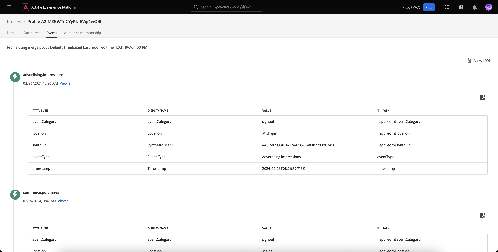

# [!DNL Real-Time Customer Profile] Guida all’interfaccia utente

[!DNL Real-Time Customer Profile] crea una visualizzazione olistica di ciascuno dei tuoi singoli clienti, combinando dati provenienti da più canali tra cui dati online, offline, CRM e di terze parti. Questo documento funge da guida per l’interazione con [!DNL Real-Time Customer Profile] nell’interfaccia utente di Adobe Experience Platform.

## Introduzione

Questa guida all’interfaccia utente richiede una comprensione dei vari [!DNL Experience Platform] servizi di gestione [!DNL Real-Time Customer Profiles]. Prima di leggere questa guida o di lavorare nell’interfaccia utente, controlla la documentazione relativa ai seguenti servizi:

* [[!DNL Real-Time Customer Profile] panoramica](../home.md): Fornisce un profilo di consumatore unificato e in tempo reale basato su dati aggregati provenienti da più origini.
* [[!DNL Identity Service]](../../identity-service/home.md): Abilita [!DNL Real-Time Customer Profile] colmando le identità provenienti da fonti di dati diverse che vengono ingerite in [!DNL Platform].
* [[!DNL Experience Data Model (XDM)]](../../xdm/home.md): Il quadro standardizzato [!DNL Platform] organizza i dati sulla customer experience.

## [!UICONTROL Panoramica]

Nell’interfaccia utente di Experience Platform, seleziona **[!UICONTROL Profili]** nel menu di navigazione a sinistra per aprire **[!UICONTROL Panoramica]** scheda che mostra il dashboard del profilo.

>[!NOTE]
>
>Se la tua organizzazione è nuova di Platform e non dispone ancora di set di dati di profilo attivi o di criteri di unione creati, la [!UICONTROL Profili] dashboard non è visibile. Invece, [!UICONTROL Panoramica] visualizza collegamenti e documentazione per iniziare a usare Profilo cliente in tempo reale.

### Dashboard dei profili {#profile-dashboard}

Il dashboard del profilo delinea le metriche chiave correlate ai dati di profilo della tua organizzazione.

Per ulteriori informazioni, visita il [guida al dashboard del profilo](../../dashboards/guides/profiles.md).

## [!UICONTROL Sfoglia] metriche di scheda

Seleziona la **[!UICONTROL Sfoglia]** per visualizzare diverse metriche correlate ai dati di profilo della tua organizzazione. È inoltre possibile utilizzare questa scheda per sfogliare l’archivio dei profili utilizzando un criterio di unione o un’identità, come descritto nella sezione successiva di questa guida.

Sul lato destro del **[!UICONTROL Sfoglia]** è [conteggio profilo](#profile-count) nonché un elenco [profili per namespace](#profiles-by-namespace).

>[!NOTE]
>
>Queste metriche di profilo possono variare dalle metriche visualizzate nel [dashboard del profilo](#profile-dashboard) perché vengono valutati utilizzando il criterio di unione predefinito dell&#39;organizzazione. Per ulteriori informazioni sull&#39;utilizzo dei criteri di unione, inclusa la modalità di definizione di un criterio di unione predefinito, vedere la [panoramica dei criteri di unione](../merge-policies/overview.md).

Oltre a queste metriche, questa sezione fornisce una data e un’ora dell’ultimo aggiornamento, indicando quando sono state valutate le metriche.

### Numero di profili {#profile-count}

Il conteggio dei profili visualizza il numero totale di profili di cui dispone l’organizzazione all’interno dell’Experience Platform, dopo che il criterio di unione predefinito dell’organizzazione ha unito i frammenti di profilo per formare un singolo profilo per ogni singolo cliente. In altre parole, l’organizzazione può disporre di più frammenti di profilo relativi a un singolo cliente che interagisce con il tuo marchio su diversi canali, ma questi frammenti verranno uniti (in base al criterio di unione predefinito) e restituiranno un conteggio di &quot;1&quot; profilo perché sono tutti correlati allo stesso individuo.

Il conteggio dei profili include anche profili con attributi (dati record) e profili contenenti solo dati di serie temporali (eventi), ad esempio profili Adobe Analytics. Il conteggio dei profili viene aggiornato regolarmente per fornire un numero totale aggiornato di profili all’interno di Platform.

#### Aggiornamento della metrica del conteggio dei profili

Quando l&#39;acquisizione di documenti nel [!DNL Profile] lo store aumenta o diminuisce il conteggio di oltre il 5%, viene attivato un processo per aggiornare il conteggio. Per i flussi di lavoro con dati in streaming, viene eseguito un controllo su base oraria per determinare se la soglia di aumento o diminuzione del 5% è stata soddisfatta. In caso affermativo, viene attivato automaticamente un processo per aggiornare il conteggio del profilo. Per l’acquisizione batch, entro 15 minuti dal corretto inserimento di un batch nell’archivio profili, se viene soddisfatta la soglia di aumento o riduzione del 5%, viene eseguito un processo per aggiornare il conteggio dei profili.

### [!UICONTROL Profili per namespace] {#profiles-by-namespace}

La **[!UICONTROL Profili per namespace]** visualizza il conteggio totale e la suddivisione degli spazi dei nomi in tutti i profili uniti nel tuo archivio profili. Il numero totale di profili per namespace (in altre parole, l’aggiunta insieme dei valori mostrati per ogni namespace) sarà sempre superiore alla metrica di conteggio dei profili, perché a un profilo potrebbero essere associati più namespace. Ad esempio, se un cliente interagisce con il tuo marchio su più di un canale, a quel singolo cliente saranno associati più namespace.

#### Aggiornamento della [!UICONTROL Profili per namespace] metrica

Simile al [conteggio profilo](#profile-count) , quando l’acquisizione di record nel [!DNL Profile] l&#39;archivio aumenta o diminuisce il conteggio di oltre il 5%, viene attivato un processo per aggiornare le metriche dello spazio dei nomi. Per i flussi di lavoro con dati in streaming, viene eseguito un controllo su base oraria per determinare se la soglia di aumento o diminuzione del 5% è stata soddisfatta. In caso affermativo, viene attivato automaticamente un processo per aggiornare il conteggio del profilo. Per l’acquisizione batch, entro 15 minuti dal corretto inserimento di un batch nel [!DNL Profile] Se viene soddisfatta la soglia di aumento o diminuzione del 5%, viene eseguito un processo per aggiornare le metriche.

## Utilizzo [!UICONTROL Sfoglia] scheda per visualizzare i profili

Sulla **[!UICONTROL Sfoglia]** è possibile visualizzare profili di esempio utilizzando un criterio di unione o cercare profili specifici utilizzando uno spazio dei nomi e un valore di identità.

### Sfoglia per [!UICONTROL Criteri di unione]

La **[!UICONTROL Sfoglia]** per impostazione predefinita, la scheda è impostata sul criterio di unione predefinito per l&#39;organizzazione. Per scegliere un criterio di unione diverso, selezionare la `X` accanto al nome del criterio di unione, quindi utilizzare il selettore per aprire il **[!UICONTROL Seleziona criterio di unione]** finestra di dialogo.

>[!NOTE]
>
>Se non è stato selezionato alcun criterio di unione, utilizzare il pulsante di selezione accanto al **[!UICONTROL Criteri di unione]** per aprire la finestra di dialogo di selezione.

Per scegliere un criterio di unione dal **[!UICONTROL Seleziona criterio di unione]** , seleziona il pulsante di scelta accanto al nome del criterio e utilizza **[!UICONTROL Seleziona]** per tornare al [!UICONTROL Sfoglia] scheda . Puoi quindi selezionare **[!UICONTROL Visualizza]** per aggiornare i profili di esempio e visualizzare un esempio di profili con il nuovo criterio di unione applicato.

I profili visualizzati rappresentano un esempio di fino a 20 profili dall’archivio profili della tua organizzazione, dopo l’applicazione del criterio di unione selezionato. I profili di esempio per il criterio di unione selezionato vengono aggiornati quando vengono aggiunti nuovi dati all’archivio profili dell’organizzazione.

Per visualizzare i dettagli di uno dei profili di esempio, seleziona la **[!UICONTROL ID profilo]**. Per ulteriori informazioni, consulta la sezione più avanti in questa guida su [visualizzazione dei dettagli del profilo](#profile-detail).

Per ulteriori informazioni sui criteri di unione e sul loro ruolo all’interno di Platform, consulta [panoramica dei criteri di unione](../merge-policies/overview.md).

### Sfoglia per [!UICONTROL Identità] {#browse-identity}

Sulla **[!UICONTROL Sfoglia]** è possibile utilizzare uno spazio dei nomi di identità per cercare un profilo specifico in base a un valore di identità. Per effettuare la ricerca in base a un&#39;identità è necessario specificare un criterio di unione, uno spazio dei nomi di identità e un valore di identità.

Se necessario, utilizza il **[!UICONTROL Criteri di unione]** selettore per aprire **[!UICONTROL Seleziona criterio di unione]** e scegliere il criterio di unione che si desidera utilizzare.

Quindi utilizza il **[!UICONTROL Spazio dei nomi identità]** selettore per aprire **[!UICONTROL Seleziona spazio dei nomi identità]** e scegli lo spazio dei nomi in base al quale desideri eseguire la ricerca. Se l’organizzazione dispone di più spazi dei nomi, è possibile utilizzare la barra di ricerca nella finestra di dialogo per iniziare a digitare il nome di uno spazio dei nomi.

Puoi selezionare uno spazio dei nomi per visualizzare ulteriori dettagli oppure il pulsante di scelta per scegliere uno spazio dei nomi. È quindi possibile utilizzare **[!UICONTROL Seleziona]** per continuare.

Dopo aver selezionato una [!UICONTROL Spazio dei nomi identità] e ritornando al [!UICONTROL Sfoglia] è possibile immettere un **[!UICONTROL Valore identità]** relativo allo spazio dei nomi selezionato.

>[!NOTE]
>
>Questo valore è specifico per un profilo cliente individuale e deve essere una voce valida per lo spazio dei nomi fornito. Ad esempio, la selezione dello spazio dei nomi di identità &quot;E-mail&quot; richiede un valore di identità sotto forma di un indirizzo e-mail valido.

Una volta immesso un valore, seleziona **[!UICONTROL Visualizza]** e viene restituito un singolo profilo che corrisponde al valore . Seleziona la **[!UICONTROL ID profilo]** per visualizzare i dettagli del profilo.

## Visualizzare i dettagli del profilo {#profile-detail}

Dopo aver selezionato una **[!UICONTROL ID profilo]**, **[!UICONTROL Dettaglio]** viene visualizzata la scheda . Le informazioni di profilo visualizzate nel **[!UICONTROL Dettaglio]** è stata unita una scheda da più frammenti di profilo per formare una singola vista del singolo cliente. Ciò include dettagli del cliente quali attributi di base, identità collegate e preferenze del canale.

I campi predefiniti visualizzati possono essere modificati anche a livello organizzativo per visualizzare gli attributi di profilo preferiti. Per ulteriori informazioni sulla personalizzazione di questi campi, incluse istruzioni dettagliate per l’aggiunta e la rimozione degli attributi e il ridimensionamento dei pannelli della dashboard, consulta la sezione [guida alla personalizzazione dei dettagli del profilo](profile-customization.md).

Puoi visualizzare ulteriori informazioni relative al singolo profilo cliente selezionando un’altra delle schede disponibili. Queste schede includono attributi, eventi e la scheda di appartenenza del segmento che mostra i segmenti per i quali il profilo è attualmente qualificato.

### Scheda Attributi

La **[!UICONTROL Attributi]** La scheda fornisce una vista a elenco che riepiloga tutti gli attributi relativi a un singolo profilo, dopo l’applicazione del criterio di unione specificato.

Questi attributi possono anche essere visualizzati come un oggetto JSON selezionando **[!UICONTROL Visualizzare JSON]**. È utile per gli utenti che desiderano comprendere meglio in che modo gli attributi del profilo vengono acquisiti in Platform.

### Scheda Eventi

La **[!UICONTROL Eventi]** contiene i dati dei 100 ExperienceEvents più recenti associati al cliente. Questi dati possono includere aperture e-mail, attività carrello e visualizzazioni di pagina. Selezione **[!UICONTROL Visualizza tutto]** per ogni singolo evento fornisce campi e valori aggiuntivi acquisiti come parte dell’evento.

Gli eventi possono anche essere visualizzati come un oggetto JSON selezionando **[!UICONTROL Visualizzare JSON]**. È utile per comprendere come vengono acquisiti gli eventi in Platform.

### Scheda Iscrizione al segmento

La **[!UICONTROL Iscrizione al segmento]** visualizza un elenco con il nome e la descrizione dei segmenti a cui appartiene attualmente il singolo profilo cliente. Questo elenco viene aggiornato automaticamente quando il profilo si qualifica o scade dai segmenti. Il conteggio totale dei segmenti per i quali il profilo è attualmente qualificato viene visualizzato sul lato destro della scheda .

Per ulteriori informazioni sulla segmentazione, consulta l’ [Documentazione di Adobe Experience Platform Segmentation Service](../../segmentation/home.md).

## Unisci criteri

Dal principale **[!UICONTROL Profili]** seleziona il menu **[!UICONTROL Unisci criteri]** per visualizzare un elenco dei criteri di unione appartenenti all&#39;organizzazione. Ogni criterio elencato visualizza il nome, indipendentemente dal fatto che si tratti del criterio di unione predefinito, e la classe dello schema a cui si applica.

Per ulteriori informazioni sui criteri di unione, vedere [panoramica dei criteri di unione](../merge-policies/overview.md).

## Schema dell&#39;unione {#union-schema}

Dal principale **[!UICONTROL Profili]** seleziona il menu **[!UICONTROL Schema dell&#39;unione]** per visualizzare gli schemi di unione disponibili per i dati acquisiti. Uno schema di unione è un&#39;unione di tutti [!DNL Experience Data Model] (XDM) campi sotto la stessa classe, i cui schemi sono stati abilitati per l’utilizzo in [!DNL Real-Time Customer Profile].

Per ulteriori informazioni sugli schemi di unione, visita il [guida all’interfaccia utente per schema unione](union-schema.md).

## Passaggi successivi

Leggendo questa guida, sarai in grado di visualizzare e gestire i dati del profilo della tua organizzazione tramite l’interfaccia utente di Experience Platform. Per informazioni su come lavorare con i dati di profilo utilizzando le API di Experience Platform, consulta la [Guida all’API del profilo cliente in tempo reale](../api/overview.md).
