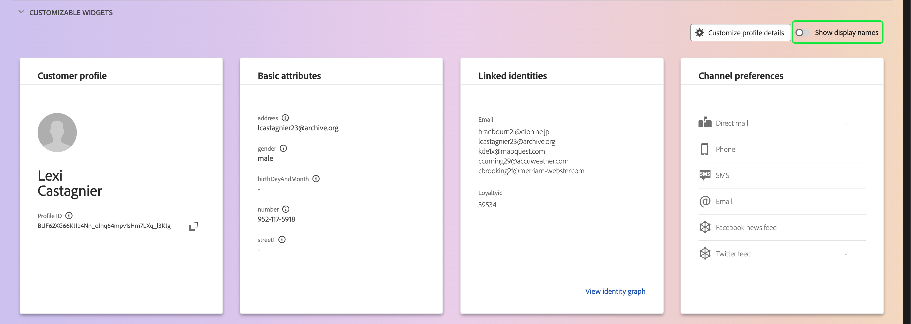
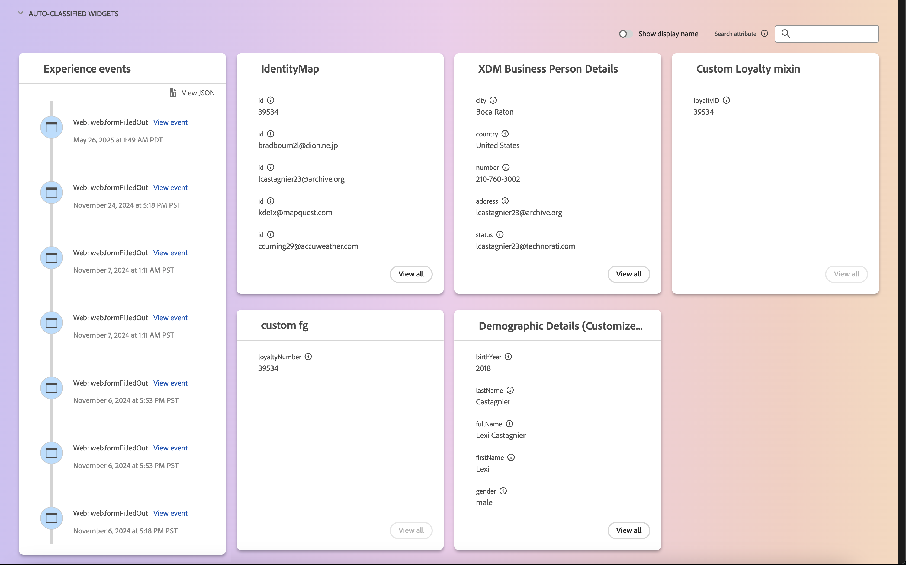

# Guida dell&#39;interfaccia utente della [!DNL Real-Time Customer Profile]

[!DNL Real-Time Customer Profile] crea una visualizzazione olistica di ciascuno dei singoli clienti, combinando dati provenienti da più canali tra cui dati online, offline, CRM e di terze parti. Questo documento funge da guida per l&#39;interazione con i dati [!DNL Real-Time Customer Profile] nell&#39;interfaccia utente di Adobe Experience Platform.

## Guida introduttiva

Questa guida dell&#39;interfaccia utente richiede una conoscenza dei vari servizi [!DNL Experience Platform] coinvolti nella gestione di [!DNL Real-Time Customer Profiles]. Prima di leggere questa guida o di lavorare nell’interfaccia utente, consulta la documentazione dei seguenti servizi:

* [[!DNL Real-Time Customer Profile] panoramica](../home.md): fornisce un profilo consumer unificato e in tempo reale basato su dati aggregati provenienti da più origini.
* [[!DNL Identity Service]](../../identity-service/home.md): abilita [!DNL Real-Time Customer Profile] collegando identità da origini dati diverse durante l&#39;acquisizione in [!DNL Experience Platform].
* [[!DNL Experience Data Model (XDM)]](../../xdm/home.md): framework standardizzato tramite il quale [!DNL Experience Platform] organizza i dati sull&#39;esperienza del cliente.

## [!UICONTROL Overview]

Nell&#39;interfaccia utente di Experience Platform, seleziona **[!UICONTROL Profiles]** nel menu di navigazione a sinistra per aprire la scheda **[!UICONTROL Overview]** con la dashboard del profilo.

>[!NOTE]
>
>Se la tua organizzazione ha poca esperienza con Experience Platform e non dispone ancora di set di dati di profilo attivi o criteri di unione creati, il dashboard [!UICONTROL Profiles] non è visibile. Nella scheda [!UICONTROL Overview] vengono invece visualizzati collegamenti e documentazione per aiutarti a iniziare a utilizzare Profilo cliente in tempo reale.

### Dashboard profili {#profile-dashboard}

La dashboard dei profili delinea le metriche chiave relative ai dati di profilo della tua organizzazione.

Per ulteriori informazioni, visita la [guida del dashboard dei profili](../../dashboards/guides/profiles.md).

## Scheda [!UICONTROL Browse]

Nella scheda **[!UICONTROL Browse]** puoi visualizzare i profili in una visualizzazione **scheda** o **grafico** selezionando l&#39;opzione.

Inoltre, puoi sfogliare i profili utilizzando un criterio di unione o cercare profili specifici utilizzando uno spazio dei nomi e un valore di identità.

### Sfoglia per [!UICONTROL Merge policy]

Per impostazione predefinita, la scheda **[!UICONTROL Browse]** è impostata sul criterio di unione predefinito per l&#39;organizzazione. Per scegliere un criterio di unione diverso, selezionare `X` accanto al nome del criterio di unione, quindi utilizzare il selettore per aprire la finestra di dialogo **[!UICONTROL Select merge policy]**.

>[!NOTE]
>
>Se non è selezionato alcun criterio di unione, utilizzare il pulsante di selezione accanto al campo **[!UICONTROL Merge policy]** per aprire la finestra di dialogo di selezione.

Per scegliere un criterio di unione dalla finestra di dialogo **[!UICONTROL Select merge policy]**, selezionare il pulsante di scelta accanto al nome del criterio, quindi utilizzare **[!UICONTROL Select]** per tornare alla scheda [!UICONTROL Browse]. È quindi possibile selezionare **[!UICONTROL View]** per aggiornare i profili di esempio e visualizzare un campionamento dei profili con il nuovo criterio di unione applicato.

I profili visualizzati rappresentano un campione di un massimo di 20 profili dall’archivio profili della tua organizzazione, dopo l’applicazione del criterio di unione selezionato. I profili di esempio per il criterio di unione selezionato vengono aggiornati quando vengono aggiunti nuovi dati all’archivio profili della tua organizzazione.

Per visualizzare i dettagli di uno dei profili di esempio, selezionare **[!UICONTROL Profile ID]**. Per ulteriori informazioni, vedere la sezione più avanti in questa guida su [visualizzazione dei dettagli del profilo](#profile-detail).

Per ulteriori informazioni sui criteri di unione e sul loro ruolo in Experience Platform, consulta la [panoramica dei criteri di unione](../merge-policies/overview.md).

### Sfoglia per [!UICONTROL Identity] {#browse-identity}

Nella scheda **[!UICONTROL Browse]** è possibile utilizzare uno spazio dei nomi delle identità per cercare un profilo specifico in base a un valore di identità. Per esplorare un’identità è necessario fornire un criterio di unione, uno spazio dei nomi dell’identità e un valore di identità.

Se necessario, utilizzare il selettore **[!UICONTROL Merge policy]** per aprire la finestra di dialogo **[!UICONTROL Select merge policy]** e scegliere il criterio di unione che si desidera utilizzare.

Quindi utilizzare il selettore **[!UICONTROL Identity namespace]** per aprire la finestra di dialogo **[!UICONTROL Select identity namespace]** e scegliere lo spazio dei nomi in base al quale eseguire la ricerca. Se nell’organizzazione sono presenti molti spazi dei nomi, puoi utilizzare la barra di ricerca nella finestra di dialogo per iniziare a digitare il nome di uno spazio dei nomi.

Puoi selezionare uno spazio dei nomi per visualizzare ulteriori dettagli oppure il pulsante di opzione per scegliere uno spazio dei nomi. È quindi possibile utilizzare **[!UICONTROL Select]** per continuare.

Dopo aver selezionato un [!UICONTROL Identity namespace] e aver ripristinato la scheda [!UICONTROL Browse], puoi immettere un **[!UICONTROL Identity value]** relativo allo spazio dei nomi selezionato.

>[!NOTE]
>
>Questo valore è specifico di un singolo profilo cliente e deve essere una voce valida per lo spazio dei nomi fornito. Ad esempio, la selezione dello spazio dei nomi dell’identità &quot;E-mail&quot; richiederebbe un valore di identità sotto forma di un indirizzo e-mail valido.

Una volta immesso il valore, selezionare **[!UICONTROL View]** e viene restituito un singolo profilo corrispondente al valore. Selezionare **[!UICONTROL Profile ID]** per visualizzare un profilo.

## Visualizza profilo {#view-profile}

>[!CONTEXTUALHELP]
>id="platform_errors_uplib_201001_404"
>title="Entità non trovata"
>abstract="Questo significa che Experience Platform non ha trovato l’entità richiesta. Per risolvere l’errore, prova una delle soluzioni seguenti:<ul><li>Assicurati che l’ID profilo corretto sia elencato nell’URL dell’entità a cui stai tentando di accedere.</li><li>Assicurati di disporre della giusta combinazione di sandbox e organizzazione per l’entità a cui stai tentando di accedere.</li></ul>"

Dopo aver selezionato **[!UICONTROL Profile ID]**, viene aperta la scheda **[!UICONTROL Detail]**. Le informazioni di profilo visualizzate nella scheda **[!UICONTROL Detail]** sono state unite da più frammenti di profilo per formare un&#39;unica vista del singolo cliente. Ciò include i dettagli del cliente come attributi di base, identità collegate e preferenze di canale.

Inoltre, puoi visualizzare altri dettagli sui profili come i suoi [attributi](#attributes), [eventi](#events) e [appartenenza a un pubblico](#audience-membership).

### Scheda Dettagli {#profile-detail}

La scheda **[!UICONTROL Details]** fornisce informazioni più dettagliate sul profilo selezionato ed è suddivisa in quattro sezioni: Approfondimenti profilo cliente, widget insight di IA, widget personalizzabili e widget classificati automaticamente.

Inoltre, puoi scegliere se visualizzare o meno le informazioni generate dall’intelligenza artificiale, mostrare i dettagli dell’hub rispetto a Edge, nonché visualizzare i dettagli in visualizzazione grafico.

#### Informazioni del profilo cliente {#customer-profile-insights}

Nella sezione **[!UICONTROL Customer profile insights]** viene visualizzata una breve introduzione agli attributi del profilo. Ciò include l’ID profilo, l’e-mail, il numero di telefono, il genere, la data di nascita, nonché le identità e le appartenenze al pubblico del profilo.

#### Widget per insight da IA {#ai-insight-widgets}

>[!IMPORTANT]
>
>Se sei cliente Healthcare Shield, **non** potrai utilizzare widget AI insight.

Nella sezione **[!UICONTROL AI insight widgets]** sono visualizzati i widget generati dall&#39;intelligenza artificiale. Questi widget forniscono informazioni rapide sul profilo, in base ai dati del profilo, tra cui dati demografici (come età, genere o posizione), comportamenti degli utenti (come cronologia acquisti, attività sul sito web o coinvolgimento con i social media) nonché dati psicografici (come interessi, preferenze o scelte di stile di vita). Tutti i widget di intelligenza artificiale utilizzano dati **già** presenti nel profilo.

#### Widget personalizzabili {#customizable-widgets}

Nella sezione **[!UICONTROL Customizable widgets]** sono visualizzati i widget che è possibile personalizzare in base alle proprie esigenze aziendali. È possibile raggruppare gli attributi in widget separati, rimuovere widget indesiderati o modificare il layout dei widget.

I campi predefiniti visualizzati possono anche essere modificati a livello di organizzazione per visualizzare gli attributi di profilo preferiti. Per ulteriori informazioni sulla personalizzazione di questi campi, incluse le istruzioni dettagliate per l&#39;aggiunta e la rimozione degli attributi e il ridimensionamento dei pannelli del dashboard, leggere la [guida alla personalizzazione dei dettagli del profilo](profile-customization.md).

Puoi anche scegliere di visualizzare o meno i nomi degli attributi come nomi visualizzati e i relativi nomi dei percorsi dei campi. Per passare da una visualizzazione all&#39;altra, selezionare l&#39;opzione **[!UICONTROL Show display names]**.

#### Widget con classificazione automatica {#auto-classified-widgets}

La sezione **[!UICONTROL Auto-classified widgets]** visualizza widget che sfruttano lo schema di unione per determinare i gruppi di campi di origine a cui appartiene un attributo, fornendo un contesto più chiaro da dove provengono i dati. È possibile utilizzare la barra di ricerca per cercare più facilmente le parole chiave all&#39;interno dei widget.

Questi widget combinano sia dati evento (con il widget Eventi di esperienza) che dati attributo, consentendo di avere una visualizzazione unificata del profilo. Puoi utilizzare questi widget per esplorare la struttura dei dati del tuo profilo per strutturare meglio i [widget personalizzabili](#customizable-widgets).

>[!NOTE]
>
>Se sono presenti più gruppi di campi di origine, i widget utilizzeranno solo **una** delle opzioni disponibili.

### Scheda Attributi {#attributes}

La scheda **[!UICONTROL Attributes]** fornisce una vista a elenco che riepiloga tutti gli attributi correlati a un singolo profilo, dopo l&#39;applicazione del criterio di unione specificato.

Questi attributi possono essere visualizzati anche come oggetto JSON selezionando a **[!UICONTROL View JSON]**. Questa funzione è utile per tutti gli utenti che desiderano comprendere meglio come gli attributi del profilo vengono acquisiti in Experience Platform.

Per visualizzare gli attributi disponibili in Edge, selezionare **[!UICONTROL Edge]** nel selettore del percorso dati.

Per ulteriori informazioni sui profili Edge, consulta la [documentazione sui profili Edge](../edge-profiles.md).

### Scheda Eventi {#events}

La scheda **[!UICONTROL Events]** contiene i dati dei 100 eventi di esperienza più recenti associati al cliente. Questi dati possono includere aperture e-mail, attività del carrello e visualizzazioni di pagina. La selezione di **[!UICONTROL View all]** per un singolo evento fornisce ulteriori acquisizioni di campi e valori come parte dell&#39;evento.

È inoltre possibile visualizzare gli eventi come oggetto JSON selezionando a **[!UICONTROL View JSON]**. È utile per comprendere come vengono acquisiti gli eventi in Experience Platform.

### Scheda Appartenenza al pubblico {#audience-membership}

Nella scheda **[!UICONTROL Audience membership]** viene visualizzato un elenco con il nome e la descrizione dei tipi di pubblico a cui appartiene attualmente il singolo profilo cliente. Questo elenco viene aggiornato automaticamente quando il profilo si qualifica o scade dai tipi di pubblico. Il numero totale di tipi di pubblico per i quali il profilo è attualmente qualificato viene visualizzato sul lato destro della scheda.

Per ulteriori informazioni sulla segmentazione in Experience Platform, consulta la [documentazione del servizio di segmentazione di Adobe Experience Platform](../../segmentation/home.md).

Per visualizzare l&#39;appartenenza al pubblico dei profili disponibili in Edge, seleziona **[!UICONTROL Edge]** nel selettore del percorso dati. Ulteriori informazioni sulla segmentazione Edge sono disponibili nella [guida alla segmentazione Edge](../../segmentation/methods/edge-segmentation.md).

## Criteri di unione

Dal menu principale di **[!UICONTROL Profiles]**, seleziona la scheda **[!UICONTROL Merge Policies]** per visualizzare un elenco dei criteri di unione appartenenti alla tua organizzazione. Ogni criterio elencato visualizza il proprio nome, che si tratti o meno del criterio di unione predefinito, e la classe di schema a cui si applica.

Per ulteriori informazioni sui criteri di unione, vedere [panoramica dei criteri di unione](../merge-policies/overview.md).

## Schema di unione {#union-schema}

Dal menu principale di **[!UICONTROL Profiles]**, seleziona la scheda **[!UICONTROL Union Schema]** per visualizzare gli schemi di unione disponibili per i dati acquisiti. Uno schema di unione è una combinazione di tutti i campi [!DNL Experience Data Model] (XDM) della stessa classe, i cui schemi sono stati abilitati per l&#39;utilizzo in [!DNL Real-Time Customer Profile].

Per ulteriori informazioni sugli schemi di unione, visita la [guida dell&#39;interfaccia utente dello schema di unione](union-schema.md).

## Attributi calcolati {#computed-attributes}

Dal menu principale di **[!UICONTROL Profiles]**, selezionare la scheda **[!UICONTROL Computed attributes]** per visualizzare un elenco degli attributi calcolati che appartengono alla propria organizzazione.

Per ulteriori informazioni sugli attributi calcolati, leggere la [panoramica sugli attributi calcolati](../computed-attributes/overview.md). Per ulteriori informazioni su come utilizzare gli attributi calcolati nell&#39;interfaccia utente di Experience Platform, consulta la [guida dell&#39;interfaccia utente attributi calcolati](../computed-attributes/ui.md).

## Passaggi successivi

Leggendo questa guida, sai come visualizzare e gestire i dati del profilo della tua organizzazione utilizzando l’interfaccia utente di Experience Platform. Per informazioni su come utilizzare i dati del profilo utilizzando le API di Experience Platform, consulta la [guida delle API del profilo cliente in tempo reale](../api/overview.md).
