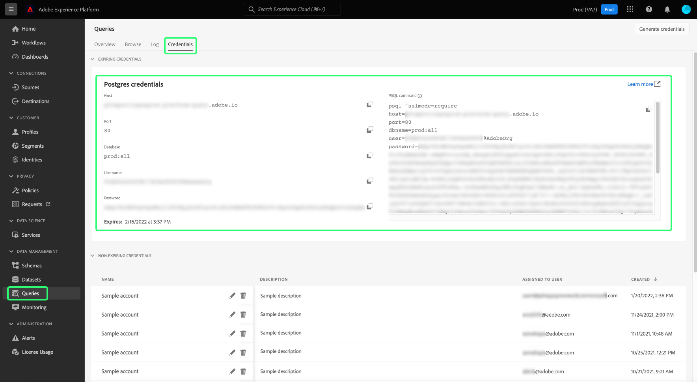

# Connetti [!DNL DbVisualizer] a [!DNL Query Service] {#connect-dbvisualizer}

Il presente documento descrive i passaggi necessari per la connessione [!DNL DbVisualizer] strumento di database con Adobe Experience Platform [!DNL Query Service].

## Introduzione

Questa guida richiede l’accesso a [!DNL DbVisualizer] app desktop e scopri come navigare nella relativa interfaccia. Per scaricare i [!DNL DbVisualizer] app desktop o per ulteriori informazioni, consulta [ufficiale [!DNL DbVisualizer] documentazione](https://www.dbvis.com/download/).

>[!NOTE]
>
>Ci sono [!DNL Windows], [!DNL macOS]e [!DNL Linux] versioni di [!DNL DbVisualizer]. Le schermate di questa guida sono state scattate utilizzando [!DNL macOS] app desktop. Possono esserci lievi discrepanze nell’interfaccia utente tra le versioni.

Acquisizione delle credenziali necessarie per la connessione [!DNL  DbVisualizer] ad Experience Platform, devi disporre dell’accesso all’area di lavoro Query nell’interfaccia utente di Platform. Se al momento non disponi dell’accesso all’area di lavoro Query, contatta il tuo amministratore dell’organizzazione IMS.

## Creazione di una connessione al database {#connect-database}

Dopo aver installato l’app desktop sul computer locale, avvia l’app e seleziona **[!DNL Create a Database Connection]** dal [!DNL DbVisualizer] menu. Quindi seleziona **[!DNL Create a Connection]** nel pannello a destra.

![La [!DNL DbVisualizer] menu principale con &quot;Crea una connessione al database&quot; evidenziato.](../images/clients/dbvisualizer/create-db-connection.png)

Usa la barra di ricerca o seleziona [!DNL PostgreSQL] dall&#39;elenco a discesa del nome del driver. Viene visualizzata l&#39;area di lavoro Connessione database.

![Menu a discesa del nome del driver con [!DNL PostgreSQL] evidenziato.](../images/clients/dbvisualizer/driver-name.png)

### Imposta le proprietà della connessione {#properties}

Dall&#39;area di lavoro Connessione database, selezionare la **[!DNL Properties]** , seguita dalla scheda **[!DNL Driver Properties]** dalla barra laterale di navigazione.

Quindi, immettere le proprietà del driver descritte nella tabella seguente.

>[!IMPORTANT]
>
>Per collegare DBVisualizer a Adobe Experience Platform, devi abilitare l’utilizzo di SSL. Consulta la sezione [Documentazione sulle modalità SSL](./ssl-modes.md) per informazioni sul supporto SSL per le connessioni di terze parti a Adobe Experience Platform Query Service e su come connettersi utilizzando `verify-full` Modalità SSL.

| Proprietà | Descrizione |
| ------ | ------ |
| `PGHOST` | Nome host per [!DNL PostgreSQL] server. Questo valore è il tuo Experience Platform **[!UICONTROL Host] credenziale**. |
| `ssl` | Definire il valore SSL `1` per abilitare l’utilizzo di SSL. |
| `sslmode` | Questo controlla il livello di protezione SSL. Si consiglia di utilizzare il `require` Modalità SSL per la connessione di client di terze parti a Adobe Experience Platform. La `require` In questa modalità, la crittografia è necessaria su tutte le comunicazioni e la rete è affidabile per connettersi al server corretto. La convalida del certificato SSL del server non è necessaria. |
| `user` | Il nome utente connesso al database è l&#39;ID organizzazione. È una stringa alfanumerica che termina in `@Adobe.Org`. Questo valore è il tuo Experience Platform **[!UICONTROL Nome utente] credenziale**. |

Utilizza la barra di ricerca per trovare ogni proprietà, quindi seleziona la cella corrispondente al valore del parametro. La cella verrà evidenziata in blu. Immetti le credenziali della piattaforma nel campo del valore e seleziona **[!DNL Apply]** per aggiungere la proprietà driver.

>[!NOTE]
>
>Per aggiungere un secondo `user` profilo, seleziona `user` dalla colonna del parametro , seleziona l’icona blu + (più) per aggiungere le credenziali per ogni utente. Seleziona **[!DNL Apply]** per aggiungere la proprietà driver.

La [!DNL Edited] mostra un segno di spunta per indicare che il valore del parametro è stato aggiornato.

### Ingresso[!DNL Query Service] credenziali

Per trovare le credenziali necessarie per la connessione di BBVisualizer con Query Service, accedi all’interfaccia utente di Platform e seleziona **[!UICONTROL Query]** dalla navigazione a sinistra, seguita da **[!UICONTROL Credenziali]**. Per ulteriori informazioni su come trovare le **host**, **porta**, **database**, **username** e **password** credenziali, leggere [guida alle credenziali](../ui/credentials.md).

>[!IMPORTANT]
>
>[!DNL Query Service] offre inoltre credenziali non in scadenza per consentire una configurazione unica con client di terze parti. Consulta la documentazione per [istruzioni complete su come generare e utilizzare le credenziali non in scadenza](../ui/credentials.md#non-expiring-credentials). È necessario completare questo processo se si desidera collegare BDVisualizer come configurazione una tantum. La `credential` e `technicalAccountId` i valori acquisiti comprendono il valore per il DBVisualizer `password` parametro .

## Autenticazione

Per richiedere un ID utente e un&#39;autenticazione basata su password ogni volta che viene stabilita una connessione, seleziona **[!DNL Authentication]** dalla barra laterale di navigazione sotto [!DNL PostgreSQL].

Nel pannello Autenticazione connessione, controlla entrambi i parametri **[!DNL Require Userid]** e **[!DNL Require Password]** caselle di controllo e seleziona **[!DNL Apply]**.

![Pannello di autenticazione per [!DNL PostgreSQL] Connessione al database con le caselle di controllo Richiedi ID utente e Password evidenziate.](../images/clients/dbvisualizer/connection-authentication.png)

## Connetti a Platform

È possibile effettuare una connessione utilizzando credenziali in scadenza o non in scadenza. Per effettuare una connessione, seleziona la **[!DNL Connection]** dall&#39;area di lavoro Connessione database e immettere le credenziali Experienci Platform per le seguenti impostazioni.

>[!NOTE]
>
>Tutte le credenziali richieste da BDVisualizer nella tabella seguente sono uguali per le credenziali in scadenza e non in scadenza, a meno che non sia specificato nella descrizione del parametro.

| Parametro di connessione | Descrizione |
|---|---|
| **[!UICONTROL Nome]** | Crea un nome per la connessione. Si consiglia di fornire un nome descrittivo per riconoscere la connessione. |
| **[!UICONTROL Server database]** | Questo è il tuo Experience Platform **[!UICONTROL Host]** credenziale. |
| **[!UICONTROL Porta database]** | La porta [!DNL Query Service]. È necessario utilizzare la porta **80** per connettersi con [!DNL Query Service]. |
| **[!UICONTROL Database]** | Utilizza il tuo Experience Platform **[!UICONTROL Database]** valore credenziale: `prod:all`. |
| **[!UICONTROL Userid database]** | Questo è l’ID organizzazione della piattaforma. Utilizza il tuo Experience Platform **[!UICONTROL Nome utente]** valore credenziale. L&#39;ID sarà nel formato di `ORG_ID@AdobeOrg`. |
| **[!UICONTROL Password database]** | Questa stringa alfanumerica è il tuo Experience Platform **[!UICONTROL Password]** creential.Se desideri utilizzare credenziali non in scadenza, questo valore è costituito dagli argomenti concatenati della variabile `technicalAccountID` e `credential` scaricato nel file JSON di configurazione. Il valore della password assume la forma di: {technicalAccountId}:{credential}. Il file JSON di configurazione per le credenziali non in scadenza è un download una tantum durante l&#39;inizializzazione di cui l&#39;Adobe non conserva una copia. |

Dopo aver immesso tutte le credenziali rilevanti, seleziona **[!DNL Connect]**.

![La [!DNL PostgreSQL] Area di lavoro Connessione database con la scheda Connessione e il pulsante di connessione evidenziati.](../images/clients/dbvisualizer/connect.png)

La [!DNL Connect] nella prima occasione della sessione viene visualizzata la finestra di dialogo.

![Connetti: [!DNL PostgreSQL] finestra di dialogo con i campi di testo Database Userid e Database Password evidenziati.](../images/clients/dbvisualizer/connect-dialog.png)

Immetti il tuo ID utente e la tua password e seleziona **[!DNL Connect]**. Nel registro viene visualizzato un messaggio per confermare la riuscita della connessione.

## Passaggi successivi

Ora che ti sei connesso [!DNL DbVisualizer] con [!DNL Query Service], puoi utilizzare [!DNL DbVisualizer] per scrivere query. Per ulteriori informazioni su come scrivere ed eseguire le query, leggere il [guida all’esecuzione delle query](../best-practices/writing-queries.md).
