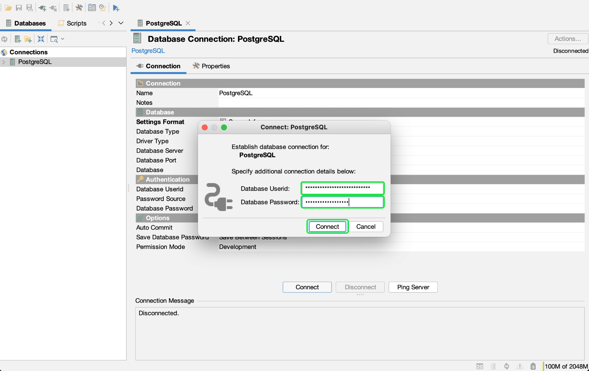

# Connetti [!DNL DbVisualizer] a [!DNL Query Service] {#connect-dbvisualizer}

Il presente documento descrive i passaggi necessari per la connessione [!DNL DbVisualizer] strumento di database con Adobe Experience Platform [!DNL Query Service].

## Introduzione

Questa guida richiede l’accesso a [!DNL DbVisualizer] app desktop e scopri come navigare nella relativa interfaccia. Per scaricare i [!DNL DbVisualizer] app desktop o per ulteriori informazioni, consulta [ufficiale [!DNL DbVisualizer] documentazione](https://www.dbvis.com/download/).

>[!NOTE]
>
>Ci sono [!DNL Windows], [!DNL macOS]e [!DNL Linux] versioni di [!DNL DbVisualizer]. Le schermate di questa guida sono state scattate utilizzando [!DNL macOS] app desktop. Possono esserci lievi discrepanze nell’interfaccia utente tra le versioni.

Acquisizione delle credenziali necessarie per la connessione [!DNL  DbVisualizer] ad Experience Platform, devi disporre dell’accesso all’area di lavoro Query nell’interfaccia utente di Platform. Se al momento non disponi dell’accesso all’area di lavoro Query, contatta il tuo amministratore dell’organizzazione IMS.

## Creazione di una connessione al database {#connect-database}

Dopo aver installato l’app desktop sul computer locale, avvia l’app e seleziona **[!DNL Create a Database Connection]** dal [!DNL DbVisualizer] menu. Quindi seleziona **[!DNL Create a Connection]** nel pannello a destra.

![La [!DNL DbVisualizer] menu principale con &quot;Crea una connessione al database&quot; evidenziato.](../images/clients/dbvisualizer/create-db-connection.png)

Usa la barra di ricerca o seleziona [!DNL PostgreSQL] dall&#39;elenco a discesa del nome del driver. Viene visualizzata l&#39;area di lavoro Connessione database.

![Menu a discesa del nome del driver con [!DNL PostgreSQL] evidenziato.](../images/clients/dbvisualizer/driver-name.png)

Dall&#39;area di lavoro Connessione database, selezionare la **[!DNL Properties]** , seguita dalla scheda **[!DNL Driver Properties]** dalla barra laterale di navigazione.

Le tre proprietà necessarie del driver sono riportate nella tabella seguente.

| Proprietà | Descrizione |
| ------ | ------ |
| `PGHOST` | Nome host per [!DNL PostgreSQL] server. Questo valore è il tuo Experience Platform [!UICONTROL Host] credenziale. |
| `SSL` | Questo controlla l’utilizzo dei requisiti SSL. You **deve** utilizza il valore &quot;1&quot; per abilitare questo requisito. |
| `user` | Il nome utente connesso al database è il tuo ID organizzazione. È una stringa alfanumerica che termina in `@adobe.org` |

>[!IMPORTANT]
>
>Consulta la sezione [[!DNL Query Service] Documentazione SSL](./ssl-modes.md) per informazioni sul supporto SSL per le connessioni di terze parti a Adobe Experience Platform Query Service e su come connettersi utilizzando `verify-full` Modalità SSL.

### [!DNL Query Service] credenziali

La `PGHOST` e `user` i valori sono tratti dalle credenziali Adobe Experience Platform. Per trovare le tue credenziali, accedi all’interfaccia utente di Platform e seleziona **[!UICONTROL Query]** dalla navigazione a sinistra, seguita da **[!UICONTROL Credenziali]**. Per ulteriori informazioni su come trovare il nome del database, l&#39;host, la porta e le credenziali di accesso, leggere il [guida alle credenziali](../ui/credentials.md).

[!DNL Query Service] offre inoltre credenziali non in scadenza per consentire una configurazione unica con client di terze parti. Consulta la documentazione per [istruzioni complete su come generare e utilizzare le credenziali non in scadenza](../ui/credentials.md#non-expiring-credentials).

Utilizza la barra di ricerca per trovare ogni proprietà, quindi seleziona la cella corrispondente al valore del parametro. La cella verrà evidenziata in blu. Immetti le credenziali della piattaforma nel campo del valore e seleziona **[!DNL Apply]** per aggiungere la proprietà driver.

>[!NOTE]
>
>Per aggiungere un secondo `user` profilo, seleziona `user` dalla colonna del parametro , seleziona l’icona blu + (più) per aggiungere le credenziali per ogni utente. Seleziona **[!DNL Apply]** per aggiungere la proprietà driver.

La [!DNL Edited] mostra un segno di spunta per indicare che il valore del parametro è stato aggiornato.

## Autenticazione

Per richiedere un ID utente e un&#39;autenticazione basata su password ogni volta che viene stabilita una connessione, seleziona **[!DNL Authentication]** dalla barra laterale di navigazione sotto [!DNL PostgreSQL].

Nel pannello Autenticazione connessione, controlla entrambi i parametri **[!DNL Require Userid]** e **[!DNL Require Password]** caselle di controllo e seleziona **[!DNL Apply]**.

## Connetti a Platform

Per effettuare una connessione, seleziona la **[!DNL Connection]** dall&#39;area di lavoro Connessione database e immettere le credenziali Experienci Platform per le seguenti impostazioni.

- **Nome**: Si consiglia di fornire un nome descrittivo per riconoscere la connessione.
- **Server database**: Questo è il tuo Experience Platform [!UICONTROL Host] credenziale.
- **Porta database**: La porta [!DNL Query Service]. Per connettersi a è necessario utilizzare la porta 80 [!DNL Query Service].
- **Database**: Utilizzare le credenziali `dbname` value `prod:all`.
- **Userid database**: Questo è il tuo ID organizzazione della piattaforma. L&#39;ID utente sarà nel formato di `ORG_ID@AdobeOrg`.
- **Password database**: Questa è una stringa alfanumerica trovata nel [!DNL Query Service] dashboard delle credenziali.

Dopo aver immesso tutte le credenziali rilevanti, seleziona **[!DNL Connect]**.

La [!DNL Connect] nella prima occasione della sessione viene visualizzata la finestra di dialogo.

Immetti il tuo ID utente e la tua password e seleziona **[!DNL Connect]**. Nel registro viene visualizzato un messaggio per confermare la riuscita della connessione.

## Passaggi successivi

Ora che ti sei connesso [!DNL DbVisualizer] con [!DNL Query Service], puoi utilizzare [!DNL DbVisualizer] per scrivere query. Per ulteriori informazioni su come scrivere ed eseguire le query, leggere il [guida all’esecuzione delle query](../best-practices/writing-queries.md).
